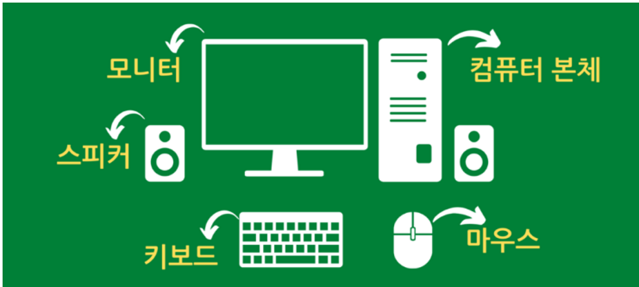
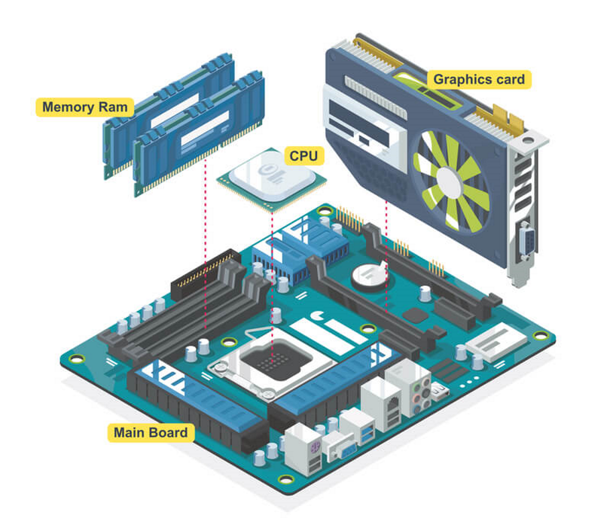
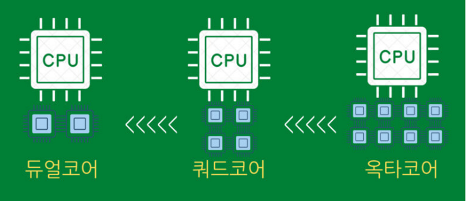
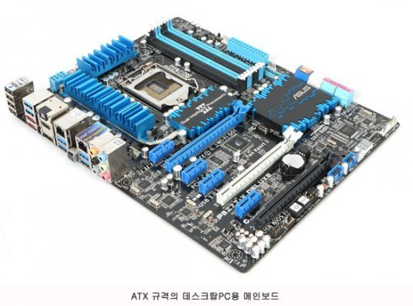
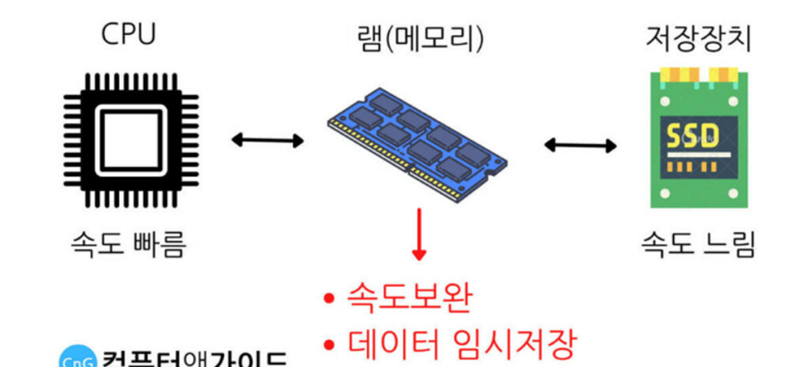
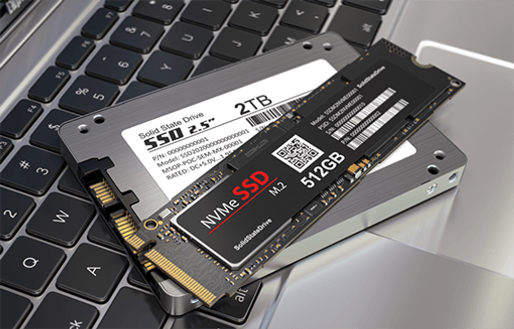
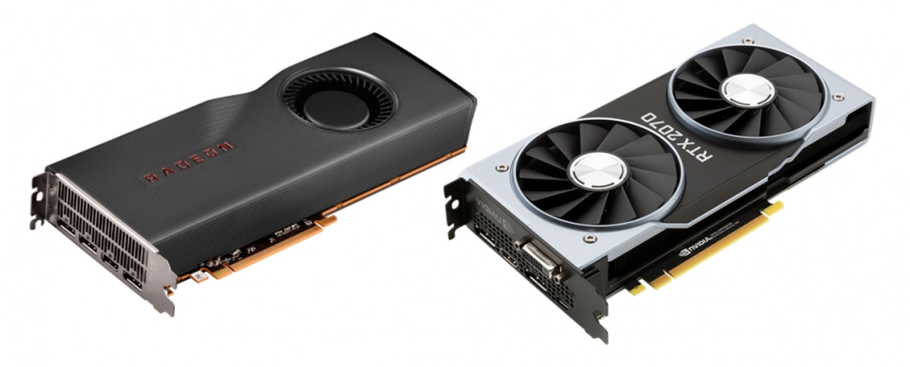
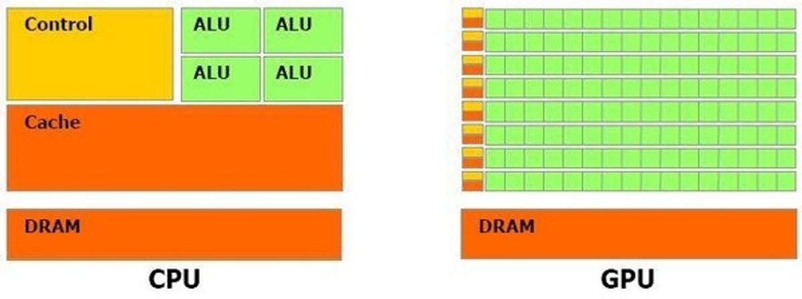

# 하드웨어와 컴파일

모니터 : 영상 출력

스피커 : 소리 출력

키보드 : 문자를 입력

마우스 : GUI 입력

## 컴퓨터 본체

### CPU

`CPU`는 Central Processing Unit의 약자이고, 영어를 해석하면 '중앙 처리 장치' 라는 부품이다.

컴퓨터에서 CPU가 모든 작업들을 관장하고 처리하는 장치이다.

화면에 출력부터 키보드 입력, 마우스 입력, 사운드 출력, 사칙연산, 복잡한 계산등 많은 작업들을 해야하는데 중앙에서 딱 버티고 서서 이 모든 일을 처리해주는 부품이 필요한데 바로 그 역할을 CPU가 하게 된다.

실제로 CPU는 모든 컴퓨터 부품 중 가장 속도가 빠르다.

CPU의 성능을 알아보기 위해서는 제조공정, 코어, 쓰레드, 동작클럭라는 항목을 주로 참고해서 보게 된다.

일반적으로 먼저 확인하게 되는 코어에 대해 알아보자.

CPU라는 일꾼이 혼자 일하지 않고 수하에 다른 일꾼을 더 두는 개념으로 생각하면 된다. 코어가 2개라면 동시에 두가지의 일을 처리하는데 수월하다. 4명을 데리고 있으면 쿼드코어, 8명이면 옥타코어 이런식으로 코어의 개수를 늘릴 수 있다.

단순하게 코어의 개수는 성능에 비례하여 증가한다. 실제로 고사양 CPU가 될수록 코어개수가 점점 많아진다는 걸 볼 수 있다.

### 메인보드

메인 보드는 컴퓨터 내부에서 지지대 역할을 하는 동시에 다양한 부품을 장착시키는 부품이다. (= 컴퓨터의 뼈대와 같다.)

### 램 (메모리)

컴퓨터를 사용하면서 자료를 실제로 저장하게 되는 부품은 저장장치(SSD, HDD)이다.

이렇게보면 램이 필요가 있나 생각이 들 수 있지만 컴퓨터 본체 내부 부품들 간에 속도차이가 존재하기 때문에 CPU와 빠르게 데이터를 주고받을 수 있는 램이 필요했다.

다만 램은 컴퓨터가 꺼지면 내용이 모두 삭제 되는 `휘발성`을 가진 메모리이기 때문에, 마지막으로는 SSD, HDD에 데이터를 저장해 둬야 한다.

### SSD, HDD

### GPU (그래픽카드)

그래픽카드는 픽셀 처리를 맡아서 연산해주는 부품이다.

작고 단순한 연산을 동시에 처리하는데 특화 되어있는게 GPU다.

