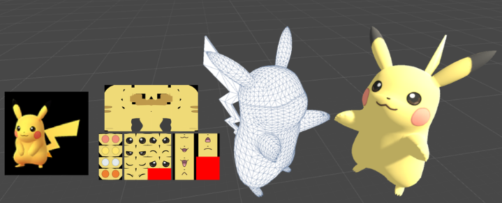

# Texture Mapping

## 텍스처 매핑?

텍스처 매핑(Texture Mapping)은 3D 그래픽스에서 3D 모델의 표면에 이미지나 패턴을 입히는 기술이다. 이를 통해 모델의 외형을 더 자세하게 표현하고, 현실감 있게 렌더링할 수 있다. 기본적으로 텍스처는 이미지의 형태로 정의되며, 이러한 이미지를 3D 모델의 표면에 매핑함으로써 물체에 색상, 질감, 모양 등을 부여할 수 있다.

## 텍스처 매핑은 다양한 종류가 있다.

1. **컬러 맵(Color Map) 또는 알베도 맵(Albedo Map)**:
   - 표면의 기본 색상을 정의하는 데 사용됩니다. 컬러 맵은 일반적으로 모델의 표면에 어떤 색상이나 패턴이 있는지를 나타낸다.
2. **노멀 맵(Normal Map)**:
   - 표면의 입체적인 느낌을 시뮬레이션하기 위해 사용된다. 노멀 맵은 각 픽셀의 노멀 벡터 정보를 담고 있어, 빛의 반사 방향과 입체적인 효과를 시뮬레이션할 수 있다.
3. **스펙큘러 맵(Specular Map)**:
   - 표면의 광택이나 반사 특성을 정의하는 데 사용된다. 스펙큘러 맵은 표면이 어떻게 빛에 의해 반사되는지를 제어한다.
4. **디스플레이스먼트 맵(Displacement Map)**:
   - 표면의 높낮이를 조절하여 입체적인 효과를 만들어낸다. 디스플레이스먼트 맵을 사용하면 평평한 표면에 입체적인 디테일을 추가할 수 있다.
5. **앰비언트 오클루전 맵(Ambient Occlusion Map)**:
   - 환경 광선 추적 또는 다른 방법을 사용하여 표면에 존재하는 빛의 양을 나타내는 데 사용된다. 주로 그림자와 같은 어두운 영역을 강조하는 데 활용된다.

텍스처 매핑은 다양한 애플리케이션에서 사용되며, 게임 개발, 가상 현실(VR), 영화 제작 등의 분야에서 현실적이고 다양한 시각적 경험을 제공하기 위해 활발하게 활용된다. 3D 모델의 외형을 결정짓는 데 중요한 역할을 하는 기술 중 하나이다.

## UV 매핑과 관련해서 면접에서 잘나온다.

UV 매핑은 3D 모델의 표면에 2D 이미지(텍스처)를 매핑하여 텍스처를 적용하는 기술이다. UV 매핑은 모델의 각 정점(Vertex)에 대해 2D 텍스처 좌표를 지정하고, 이를 이용하여 3D 표면에 2D 이미지를 투영하는 방법이다. UV 좌표는 대개 텍스처의 좌표 시스템에서 (0,0)에서 (1,1) 사이의 값으로 표현된다.

UV 매핑의 핵심은 모델의 각 정점에 대해 텍스처의 특정 부분을 매핑하고, 그 사이의 부분은 보간을 통해 텍스처를 표면에 효과적으로 펼침으로써 텍스처를 입히는 것이다. UV 좌표를 이용하여 텍스처를 매핑하면, 표면에 자세한 색상, 질감, 패턴 등을 입혀 모델을 더 생동감 있게 나타낼 수 있다.

## UV 매핑 과정

1. **UV 좌표 생성**: 각 정점에 대해 UV 좌표를 생성한다. 이는 3D 모델을 텍스처 공간에 투영하여 2D 텍스처 좌표를 할당하는 과정을 의미한다.
2. **UV Unwrapping**: 모델의 표면을 UV 공간에 펼치는 과정을 UV 언래핑(UV Unwrapping)이라고 합니다. 이는 모델의 표면에 텍스처를 효과적으로 놓을 수 있도록 3D 공간을 2D로 펼치는 작업이다.
3. **텍스처 매핑**: UV 좌표를 사용하여 텍스처를 3D 모델에 매핑한다. 각 정점의 UV 좌표에 따라 텍스처의 특정 부분이 정점에 투영되며, 이를 보간하여 텍스처를 표면에 입힌다.

UV 매핑을 통해 모델의 표면에 다양한 디테일을 추가하고, 현실적인 외형을 제공할 수 있다.

