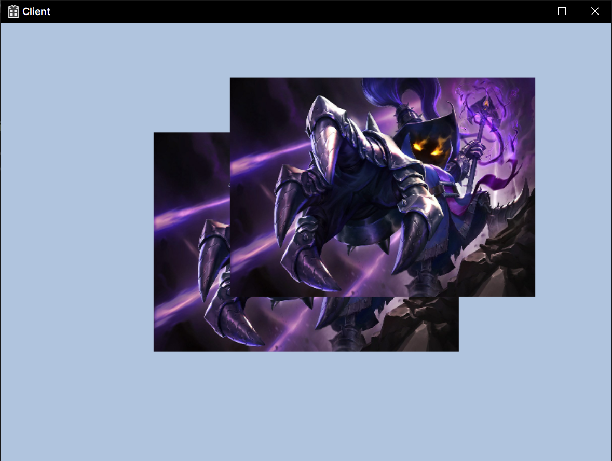

# Depth Stencil View



## DSV

Depth Stencil View (DSV)는 그래픽 프로그래밍에서 깊이(depth)와 스텐실(stencil) 정보를 담고 있는 텍스처를 나타내는 개체이다.

주로 3D 그래픽스에서 깊이 버퍼 (depth buffer)를 사용하여 깊이 정보를 저장하고, 스텐실 버퍼 (stencil buffer)를 사용하여 렌더링 동작을 제어한다. DSV는 이러한 깊이와 스텐실 정보를 GPU에서 사용할 수 있도록 만들어주는 중요한 개념이다.

## 스텐실?

스텐실이란 그래픽스 및 이미지 프로세싱에서 사용되는 기술 중 하나로, 특정한 영역의 픽셀을 제어하고 수정하는 데 사용된다. 이 스텐실은 깊이 버퍼와 함께 사용되어 복잡한 렌더링 및 영상처리 기술을 구현하는 데 도움이 된다. 예를 들어, 스텐실을 사용하여 반투명한 물체를 렌더링하거나, 특정 부분에 대한 그림자 효과를 추가하는 등의 작업이 가능하다.

## 스텐실의 주요역할은 다음과 같다.

1. 영역 제어 : 특정한 조건을 만족하는 픽셀들만을 선택하여 처리할 수 있다. 이를 통해 특정한 부분에 대한 처리를 제한하거나 강조할 수 있다.
2. 렌더링 명령의 조건부 실행 : 스텐실 값을 기반으로 렌더링 명령을 조건부로 수행하거나 건너뛸 수 있다.
3. 마스킹 및 클리핑 : 특정 영역을 마스크 (mask)하여 해당 영역만을 보존하고 나머지를 무시할 수 있다. 또한, 스텐실을 사용하여 특정 영역을 클리핑하여 화면에 그려지지  않도록 할 수 있다.

## 다시 돌아와서 DSV의 역할과 사용 방법에 대해

1. **깊이 스텐실 텍스쳐 생성 및 설정** : 먼저, 깊이와 스텐실 정보를 담을 텍스처를 생성하고 설정한다. 이 텍스처는 주로 깊이 버퍼와 스텐실 버퍼의 역할을 수행한다.

   ```c++
   D3D12_DESCRIPTOR_HEAP_DESC dsvHeapDesc = {};
   dsvHeapDesc.NumDescriptors = 1;
   dsvHeapDesc.Type = D3D12_DESCRIPTOR_HEAP_TYPE_DSV;
   dsvHeapDesc.Flags = D3D12_DESCRIPTOR_HEAP_FLAG_NONE;
   
   ID3D12DescriptorHeap* dsvHeap;
   device->CreateDescriptorHeap(&dsvHeapDesc, IID_PPV_ARGS(&dsvHeap));
   
   D3D12_DEPTH_STENCIL_VIEW_DESC dsvDesc = {};
   dsvDesc.Format = DXGI_FORMAT_D32_FLOAT; // 깊이 형식
   dsvDesc.ViewDimension = D3D12_DSV_DIMENSION_TEXTURE2D; // 2D 텍스처
   
   device->CreateDepthStencilView(depthStencilBuffer, &dsvDesc, dsvHeap->GetCPUDescriptorHandleForHeapStart());xxxxxxxxxx D3D12_DESCRD3D12_DESCRIPTOR_HEAP_DESC dsvHeapDesc = {};dsvHeapDesc.NumDescriptors = 1;dsvHeapDesc.Type = D3D12_DESCRIPTOR_HEAP_TYPE_DSV;dsvHeapDesc.Flags = D3D12_DESCRIPTOR_HEAP_FLAG_NONE;ID3D12DescriptorHeap* dsvHeap;device->CreateDescriptorHeap(&dsvHeapDesc, IID_PPV_ARGS(&dsvHeap));D3D12_DEPTH_STENCIL_VIEW_DESC dsvDesc = {};dsvDesc.Format = DXGI_FORMAT_D32_FLOAT; // 깊이 형식dsvDesc.ViewDimension = D3D12_DSV_DIMENSION_TEXTURE2D; // 2D 텍스처device->CreateDepthStencilView(depthStencilBuffer, &dsvDesc, dsvHeap->GetCPUDescriptorHandleForHeapStart());
   ```

   깊이 형식과 텍스처의 차원 등을 지정하여 DSV를 생성한다.

2. **렌더링 파이프라인에서 DSV 설정** : 렌더링 파이프라인 설정 중에 DSV를 사용할 수  있도록 설정해야한다. 이는 주로 렌더 타겟 뷰 (RTV)와 함께 렌더링 명령 리스트에 설정 된다.

   ```c++
   commandList->OMSetRenderTargets(1, &rtvDescriptor, true, &dsvDescriptor);
   ```

   RTV는 색상 정보를, DSV는 깊이와 스텐실 정보를 나타낸다. 이 정보들은 렌더 타겟으로 사용되어 화면에 렌더링되는 씬의 모습을 결정한다.

3. **깊이 테스트와 스텐실 테스트** : DSV는 렌더링 중에 깊이 테스트와 스텐실 테스트와 함께 사용된다. 깊이 테스트는 픽셀의 깊이 값을 기준으로 픽셀을 그릴지 말지를 결정하고, 스텐실 테스트는 스텐실 값을 기준으로 픽셀을 그릴지를 결정한다.

   ```c++
   // 깊이 테스트와 스텐실 테스트 설정
   D3D12_DEPTH_STENCIL_DESC depthStencilDesc = {};
   depthStencilDesc.DepthEnable = TRUE;
   depthStencilDesc.DepthWriteMask = D3D12_DEPTH_WRITE_MASK_ALL;
   depthStencilDesc.DetphFunc = D3D12_COMPARISON_FUNC_LESS;
   depthStencilDesc.StencilEnable = FALSE; // 스텐실 테스트를 사용할지 여부
   
   device->CreateDepthStencilState(&depthStencilDesc, &depthStencilState);
   commandList->OMSetDepthStencilState(depthStencilState, 0);
   ```

​	깊이 테스트와 스텐실 테스트를 설정하기 위해 `D3D12_DEPTH_STENCIL_DESC`구조체를 사용한다.

Depth Stencil View는 3D 그래픽 애플리케이션에서 깊이와 스텐실 처리에 필수적인 요소 중 하나이며, 올바르게 설정되어야 올바른 렌더링 동작을 보장할 수 있다.