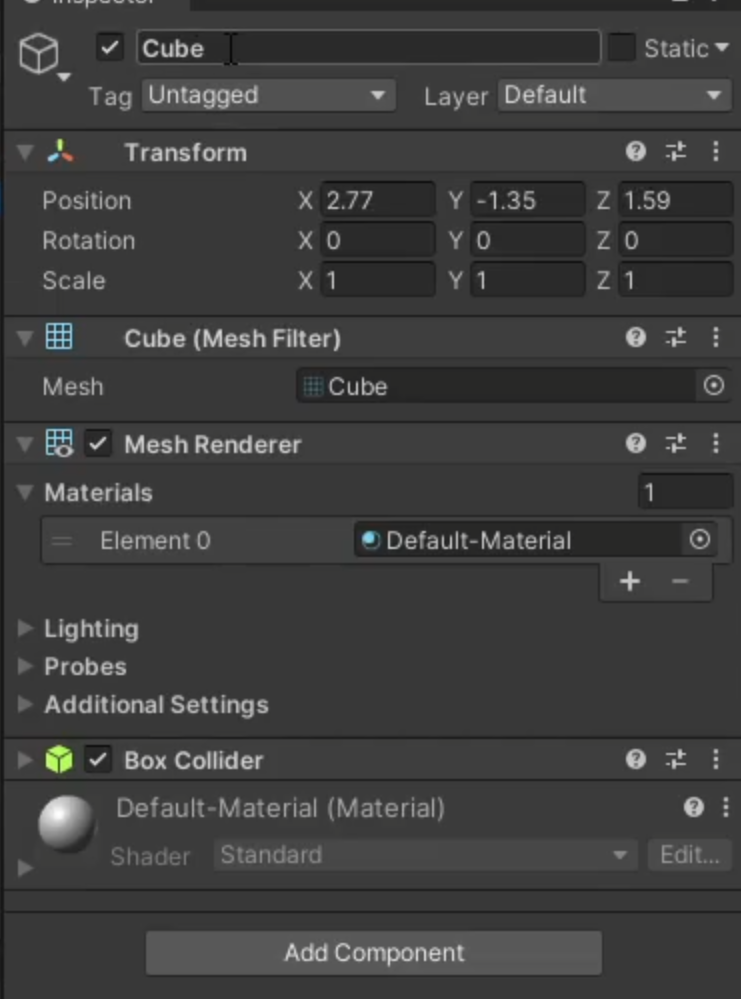
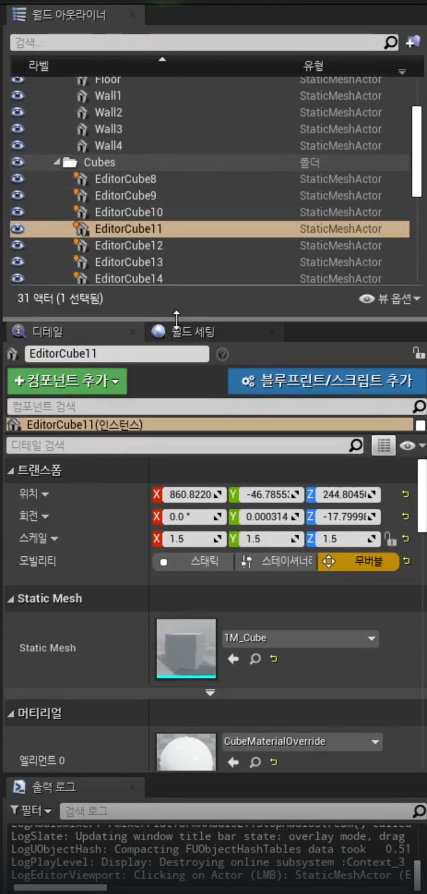

# Component

위는 유니티의 예시

Transform

Mesh filter

Mesh Renderer

Box Collider

C++ 스크립트

등등

빈 깡통에 필요한 부품들을 하나하나씩 조립해가지고 물체를 완성시킨다 -> **컴포넌트 패턴의 핵심**.

위는 언리얼의 예시

언리얼은 빈 깡통으로 시작하지 않는다. **상속 구조**가 중요함

뭘 만들고 싶은지 지정부터 한다는 것 (C++ 부모 클래스 선택)

상속 구조가 가장 중요하고 그에 따라서 태생은 정해지지만, 이런 저런 부품들은 따로 붙여주게 된다.

유니티도 꼭 해봐야겠다.