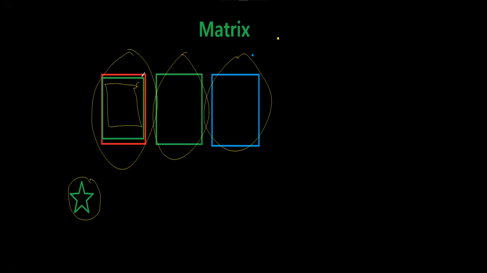
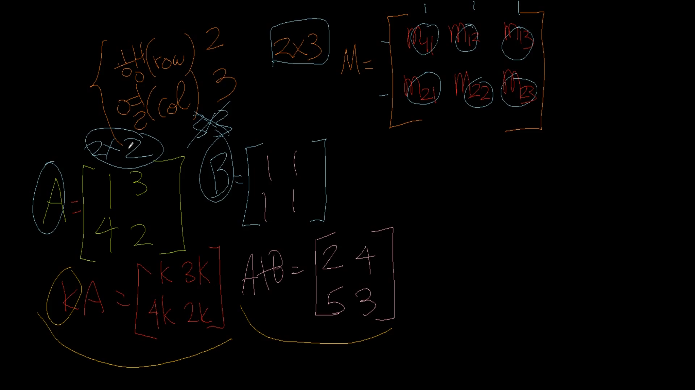
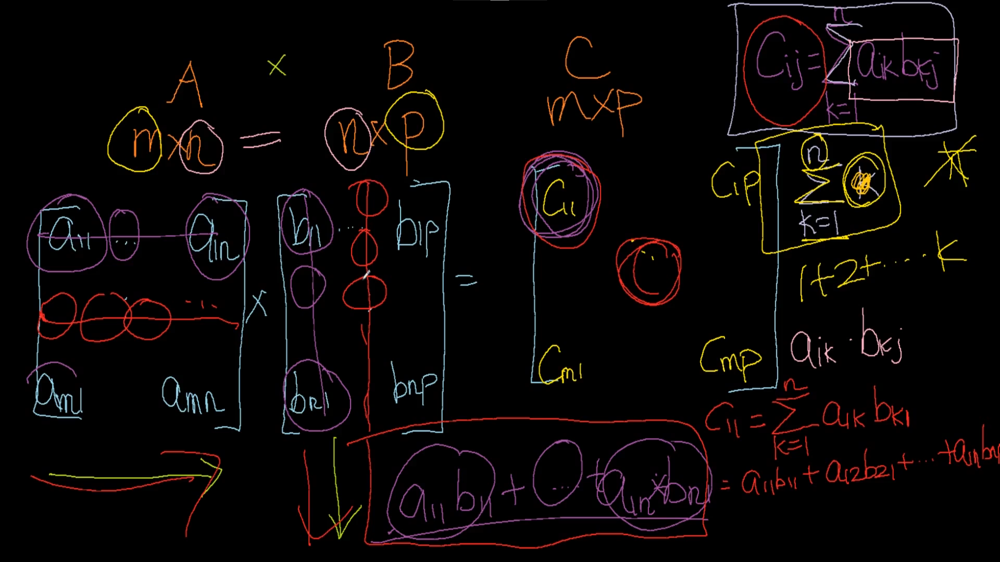
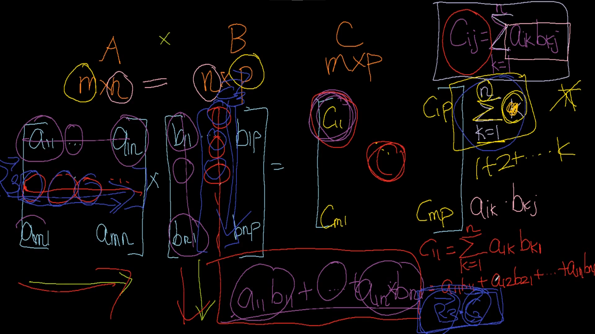
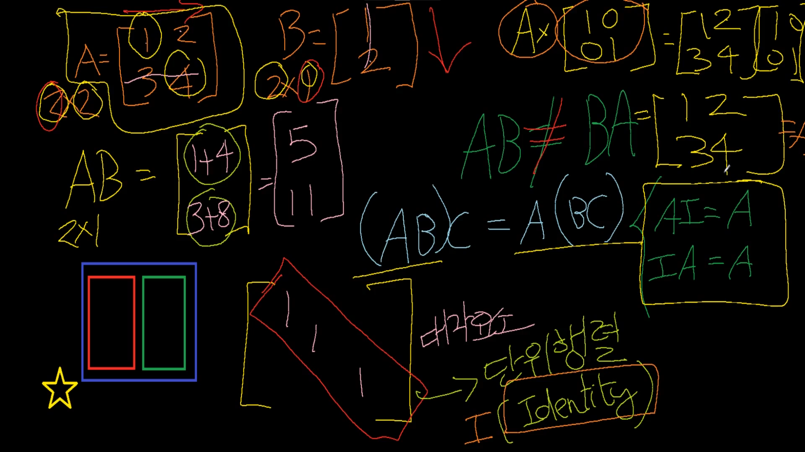
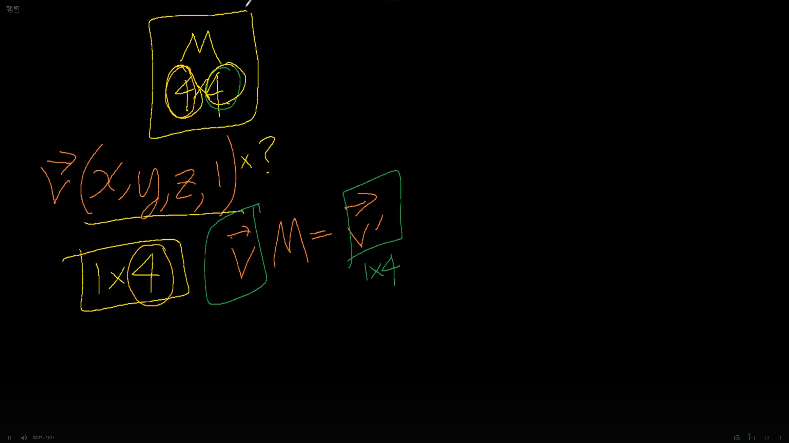
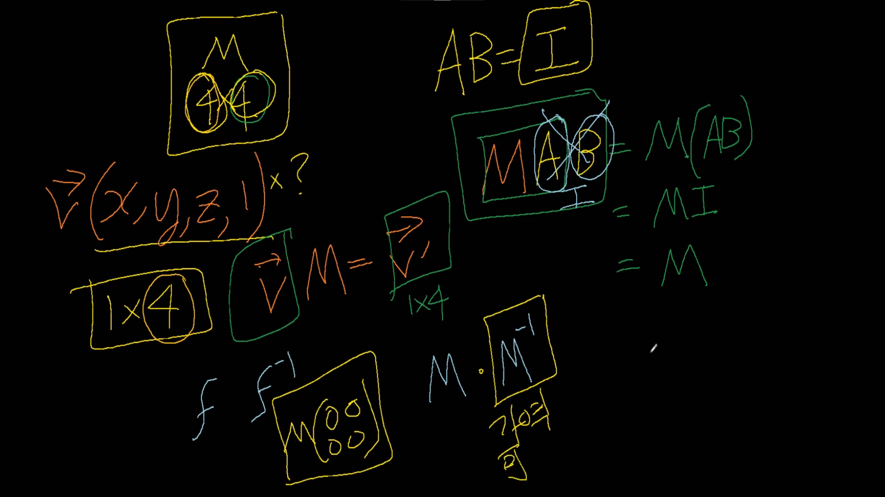
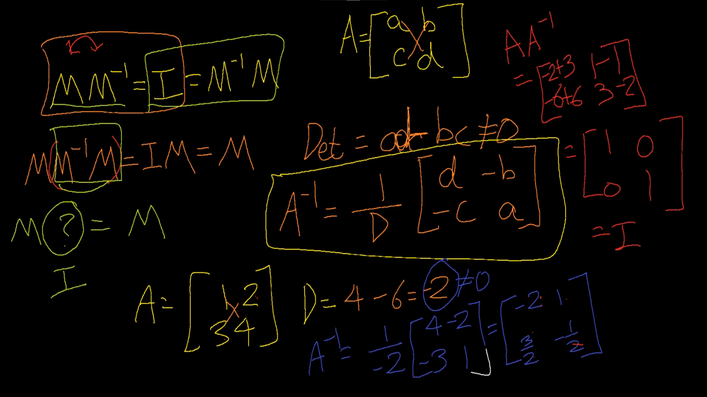
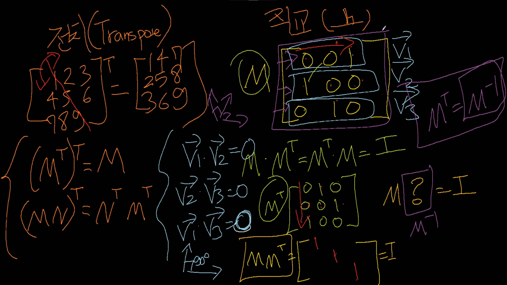

# 행렬 (Matrix)

## 행렬이란

## 행렬의 곱

## 행렬의 곱 실습 ( 대각요소, 대각행렬, 결합법칙, 단위행렬 (Identity) )

## 게임쪽에서 사용하는 행렬은 동일한 크기를 사용할 것임. ( 대부분 4x4 )

## Identity 가 중요한 이유 ( 단위행렬 ), 역행렬

## 역행렬이 존재한다는 것, 행렬식

## 전치(Transpse)행렬 : 행과 열을 뒤집은 것, 직교(90도)행렬

