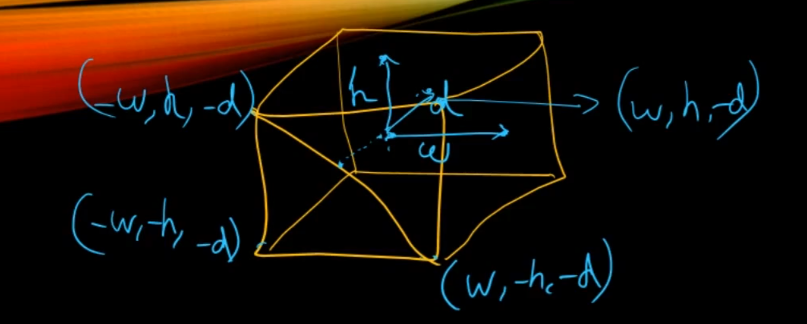
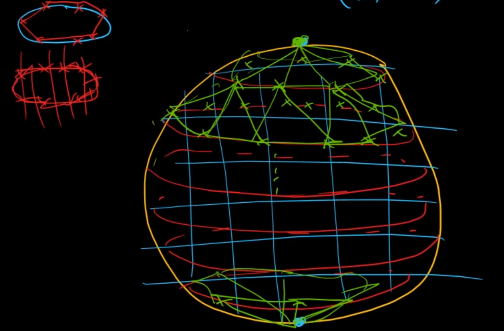
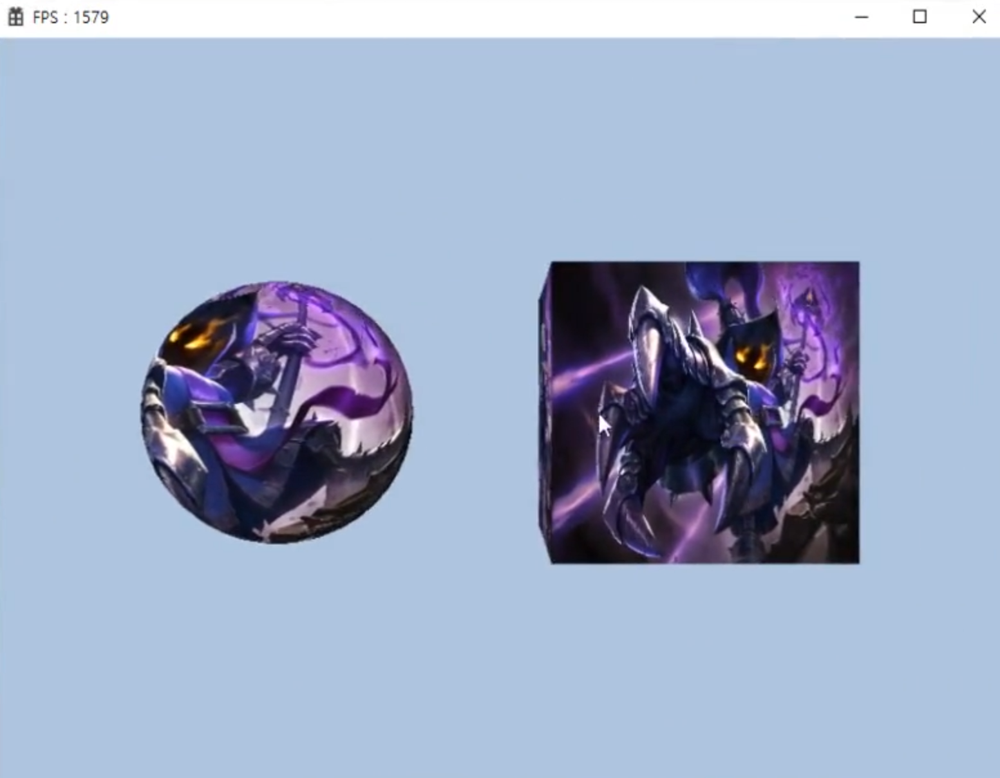

# Resources (Cube & Sphere)

## 큐브와 구를 만들려면?

 

1. 정점 데이터 정의 : 큐브와 구를 그리기 위해서는 먼저 각각의 정점 데이터를 정의해야 합니다. 정점 데이터는 3D 공간에서 각 정점의 위치를 나타내며, 이 데이터는 GPU에 전달되어 렌더링에 사용되야한다.
2. 버퍼 생성 및 데이터 복사 : 정의된 정점 데이터를 GPU가 접근할 수 있는 메모리인 버퍼에 복사해야 하낟. DirectX12 에서는 `ID3D12Resource` 인터페이스를 사용하여 버퍼를 생성하고 관리해야한다.
3. 렌더링 파이프라인 설정 : 렌더링 파이프라인은 3D 렌더링 과정을 구성하는 일련의 단계를 나타낸다. 이 단계에서는 입력조립, 래스터화, 픽셀 셰이딩 등이 포함된다. 렌더링 파이프라인을 설정하기 위해 `ID3D12GraphicsCommandList ` 인터페이스를 사용한다.
4. 드로 콜 실행 : `ID3D12GraphicsCommandList::DrawIndexedInstanced` 또는 `DrawInstanced` 메서드를 호출하여 큐브나 구를 그려준다.

