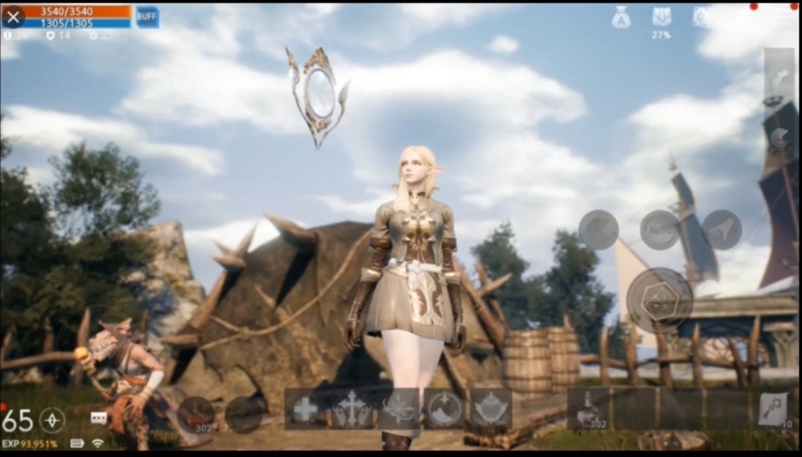
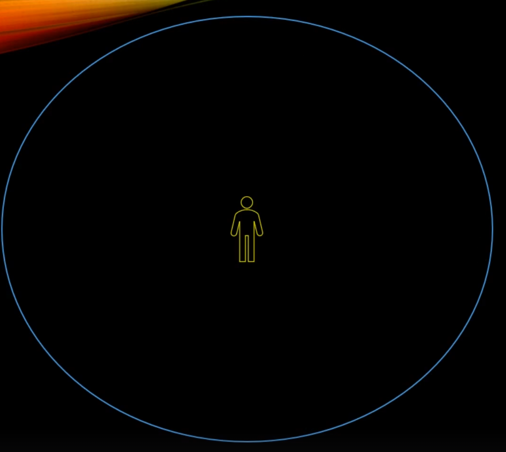
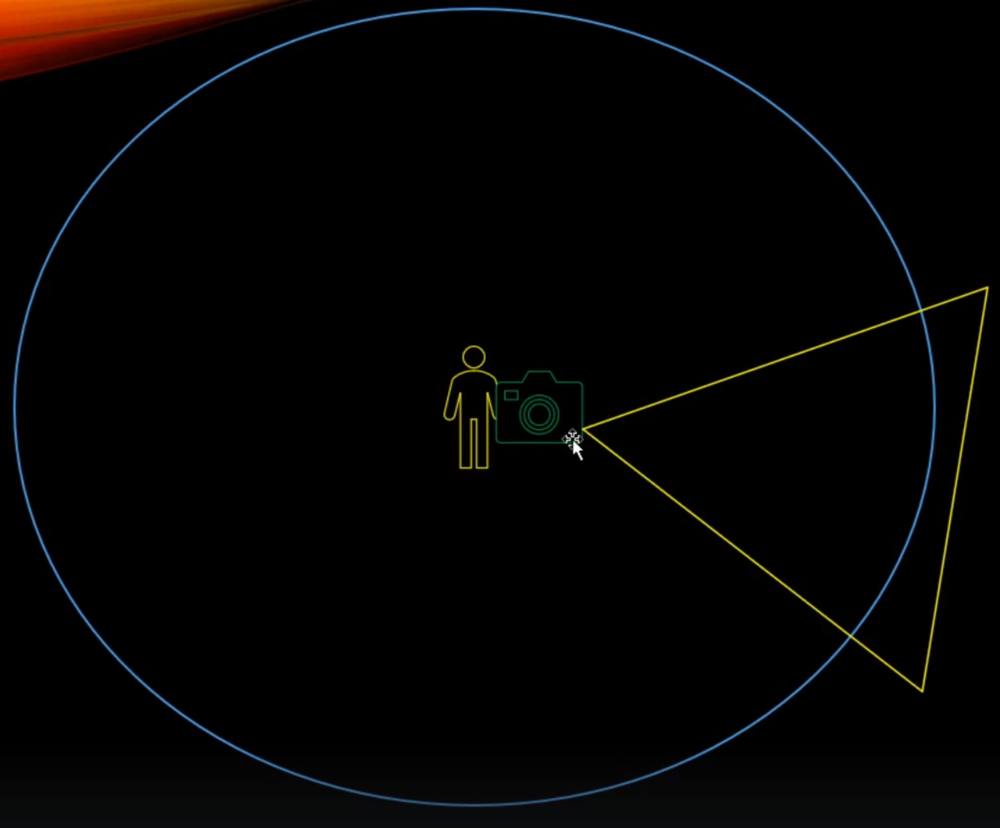
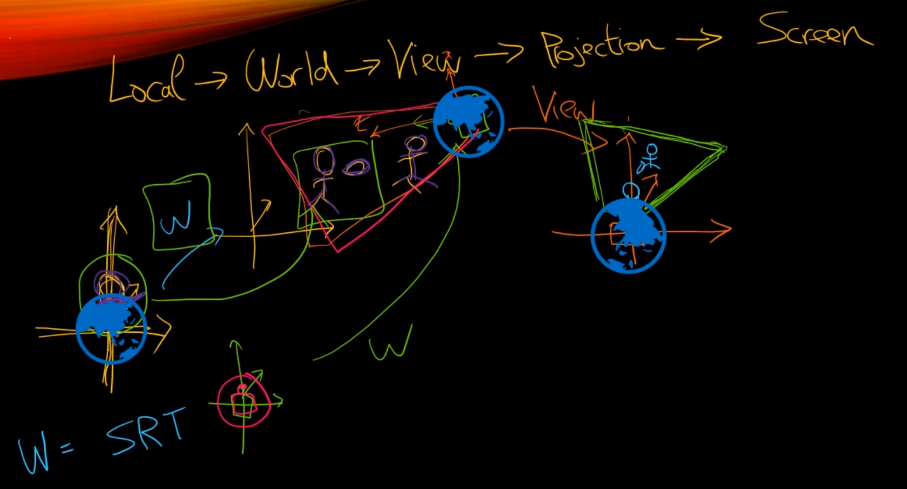
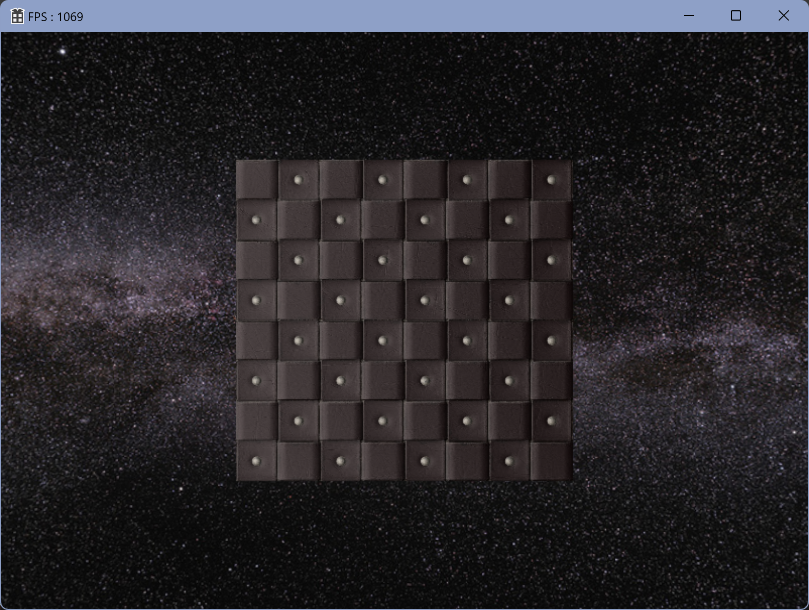
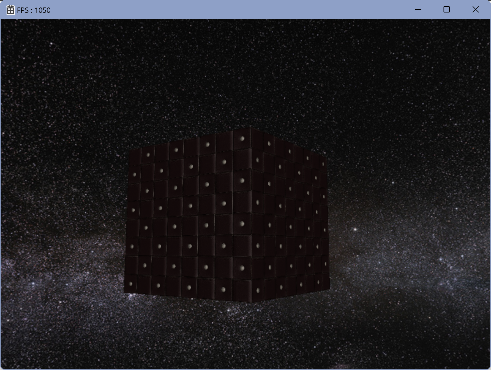
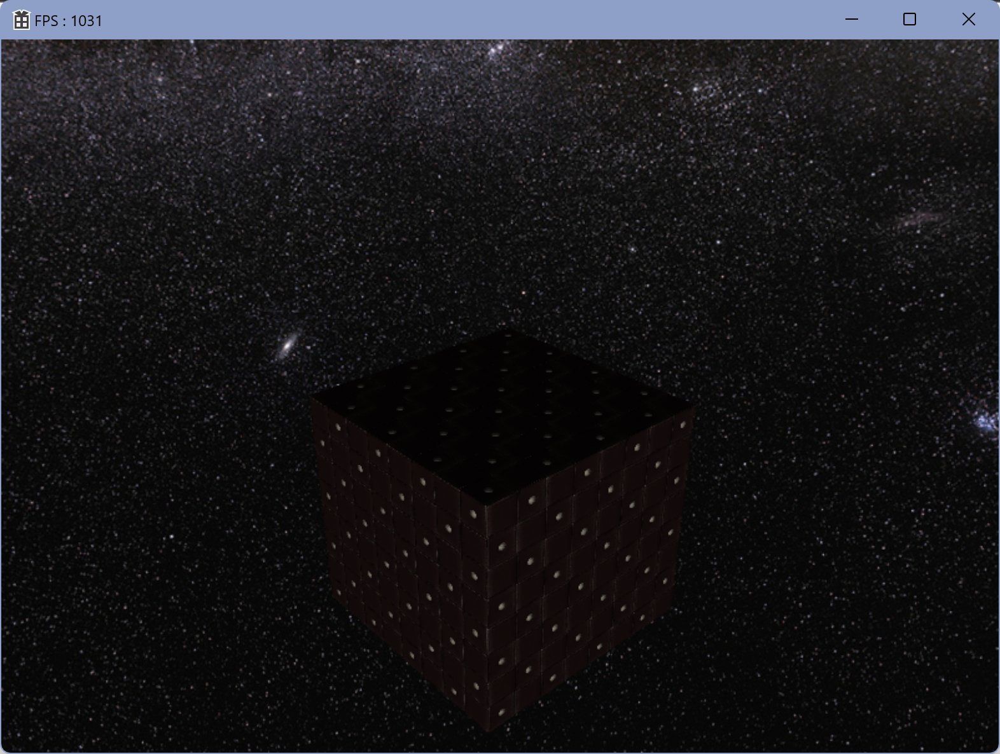
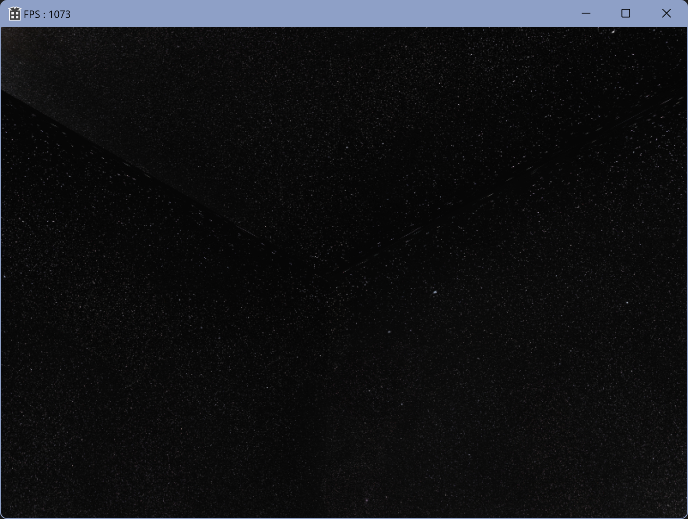
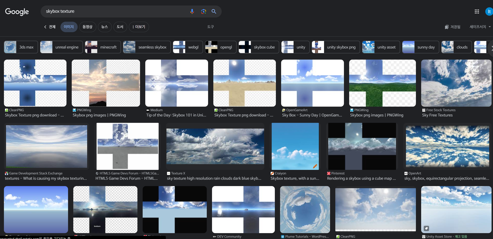

# SKYBOX

현재는 `LoadSphereMesh();` 로 구에다가 해줬는데, 원래는 `LoadCubeMesh();`로 해주는 편이다.

이 사진을 억지로 `LoadCubeMesh();` 해준다면

짤려서 나오는걸 위로 올려다보면 볼 수 있다.

그래서 `LoadCubeMesh();`를 해주고싶다면 대체로 이런 이미지 들을 사용한다.

