# Quaternion (사원수)

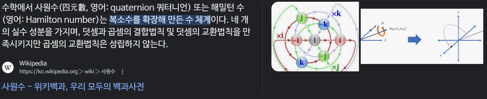

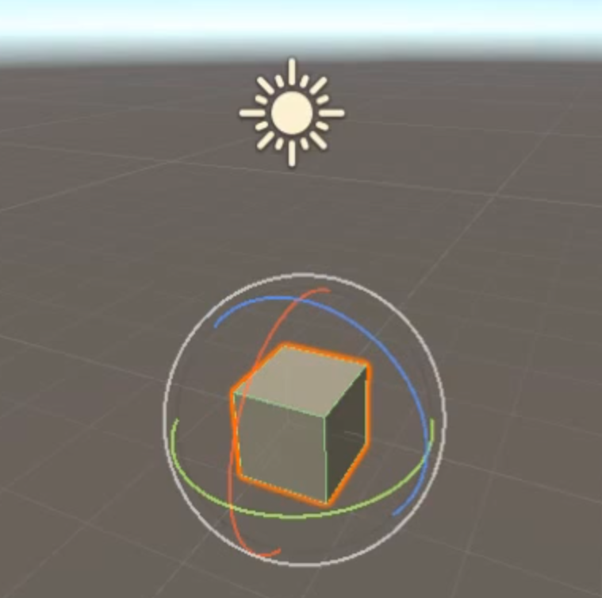

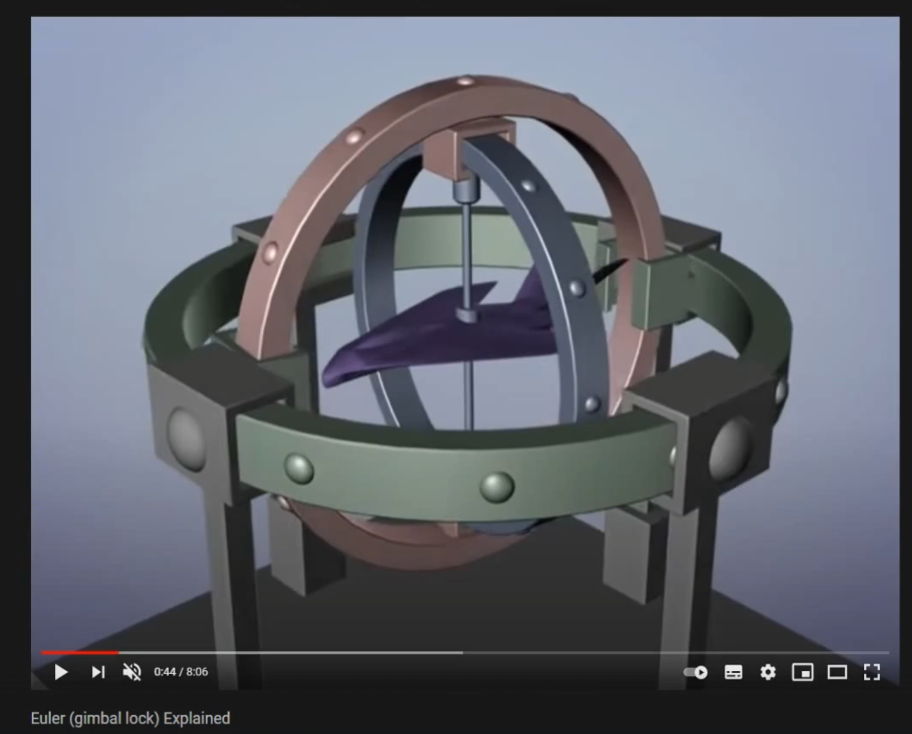

## 짐벌럭

먼저 최외각에 있는 초록색 고리가 먼저 돌아야되고, 나머지는 그 영향을 받아 같이 회전이 된다. (초록색 -> 갈색 -> 회색 = X -> Y -> Z)

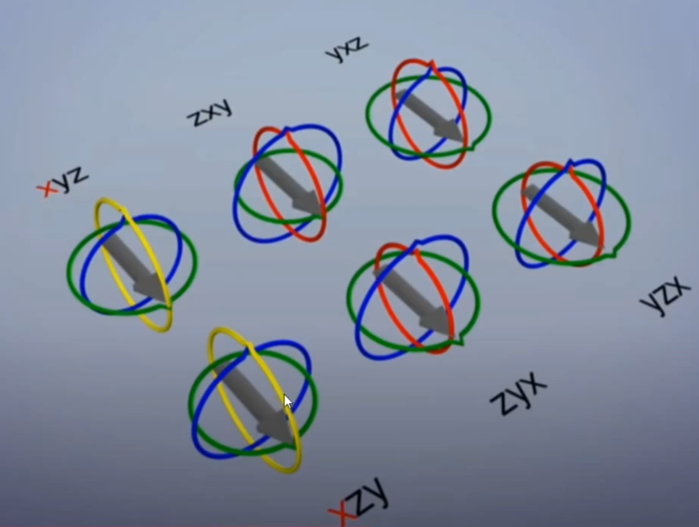

## 복소수에 대해 먼저 알고가자.

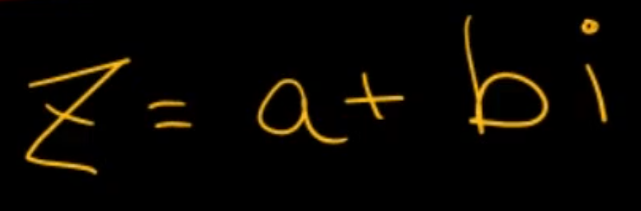

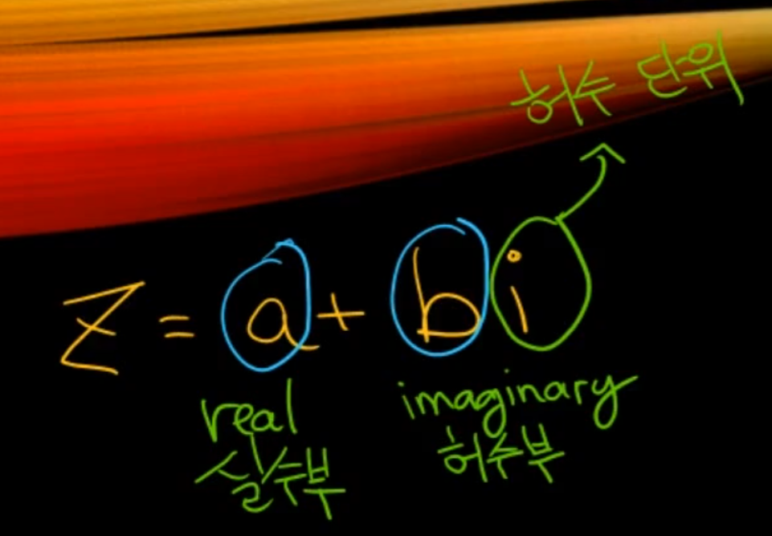

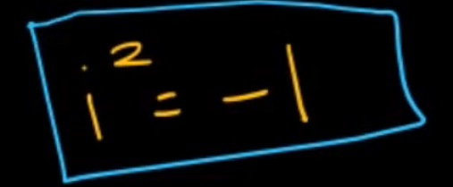

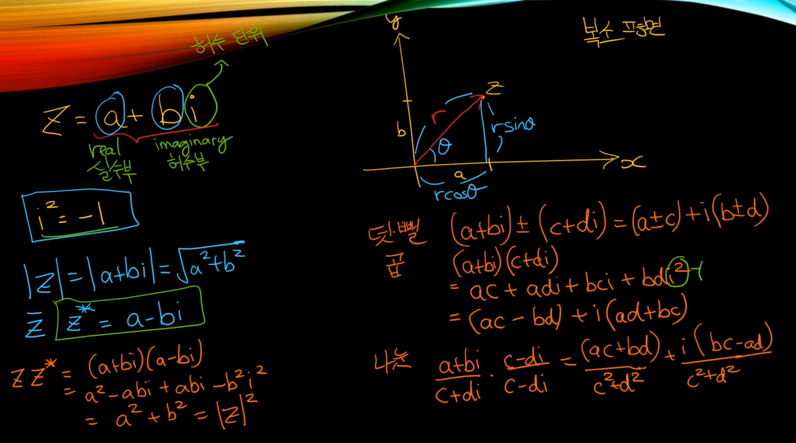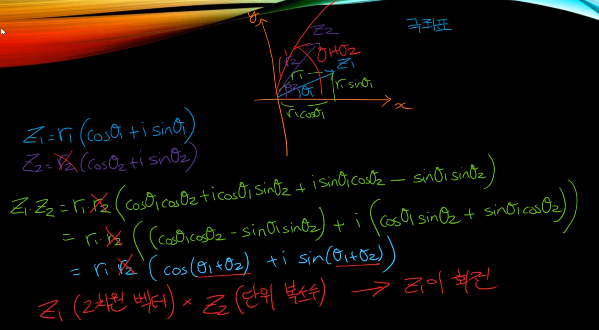

행렬로도 표현이 가능

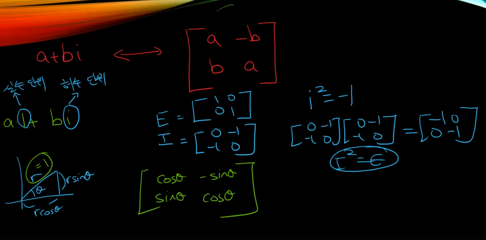

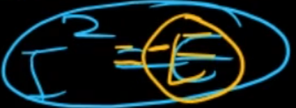

결론은 복소수를 이용해서 2D 회전을 표현할 수 있다.

그러면 3D 회전은 어떻게 표현해야할까? -> 2D 회전은 `a + bi`로 해결이 되서 3D 회전은 `a + bi + cj`로 해결하면 되는거 아닐까 하고 생각이 들 수 있지만 아쉽게도 그건 아니였다. 19세기 말에 해밍턴이 결국 해답을 찾았는데 그건 바로 `a + bi + cj + dk` 로 표현하면 3D 회전을 표현할 수 있다는 것을 알아냈다.

즉 숫자 4개를 활용한다. (실수 1개 + 허수 3개)

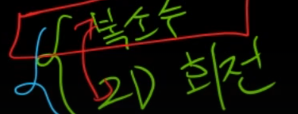

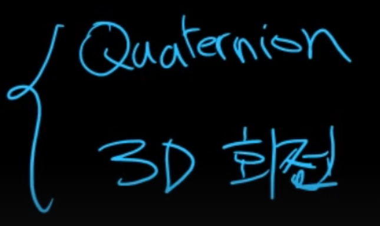

## 일반적인 회전 공식

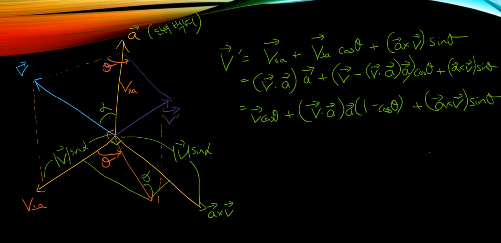
