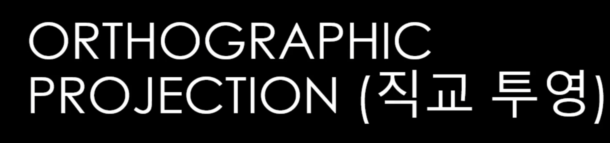
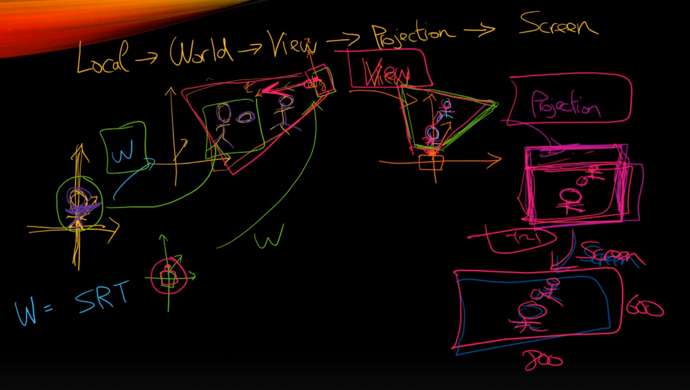
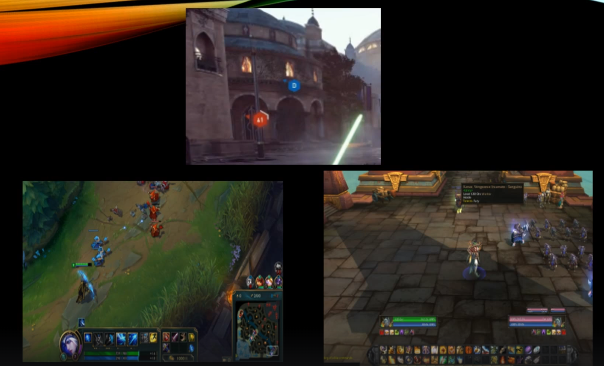
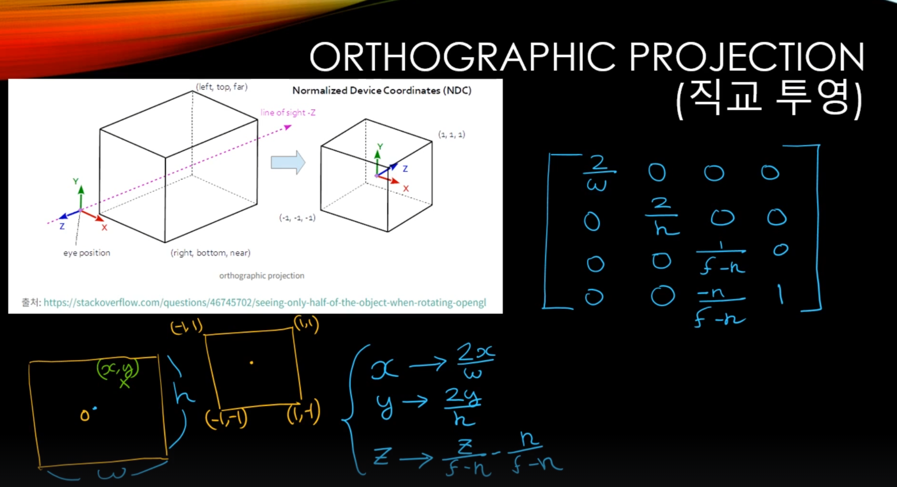
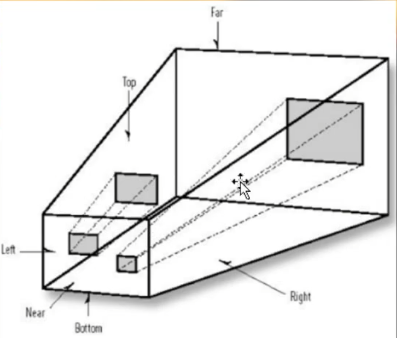
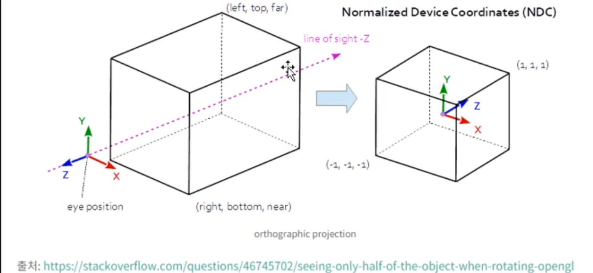
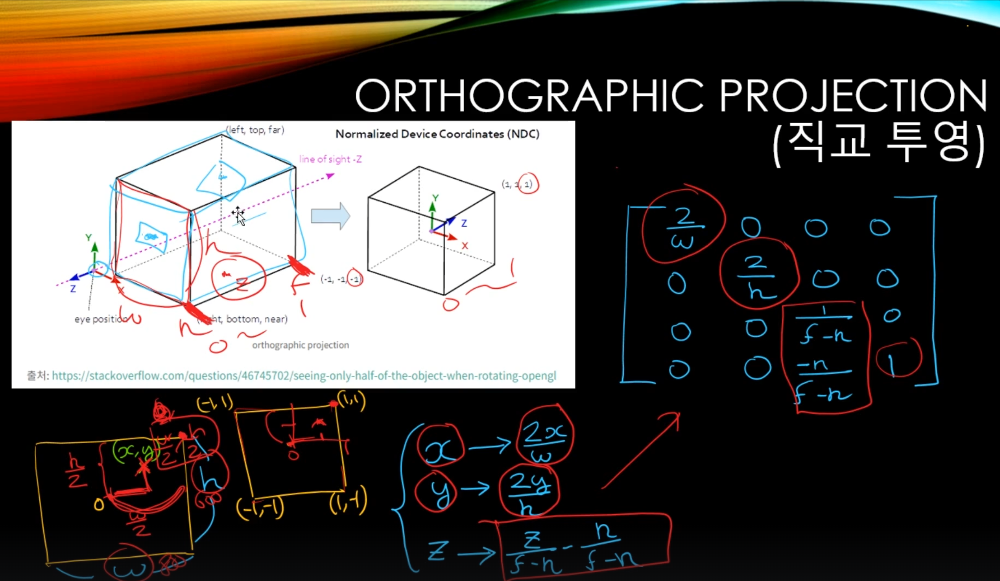
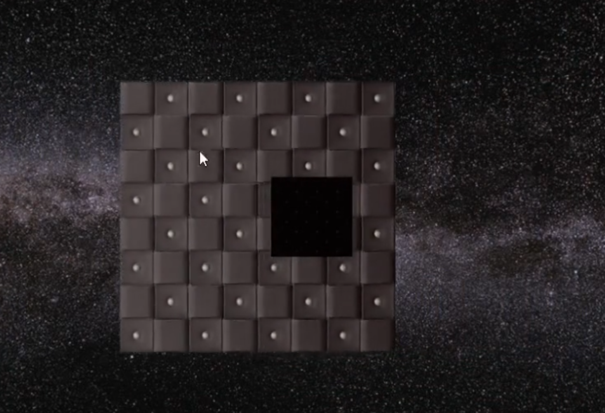

# 직교 투영 (Orthographic Projection)

## 모든 것을 다 원근 투영으로 만들 수는 없다.

대표적으로 UI를 만들때 직교 투영을 활용하게 된다.

## 왜 필요한데?

`3D UI`랑 `2D UI`로 구분할 수가 있다. 

`3D UI`는 쉽게 말해서 지금까지 3D 게임 세상에서 배치하던 다른 물체들과 마찬가지로 메쉬 같은 걸로 만들어가지고 게임 에다가 배치를 하고 카메라가 바라보는 각도에 따라 커질 수도 작아질 수도 있다.

첫번째 사진을 봐서 기획상 UI들이 카메라가 멀어지면 멀어질수록 UI도 점점 작아지고 카메라가 다가가면 UI가 커져야 한다고 상황을 준 경우이다.

이 같은 경우에는 기존에 만들던 방식대로 원근 투영 방식으로 찍어주면 알아서 사이즈가 커졌다 작아졌다를 한다.

`2D UI`는 롤 같은 게임에서 아래에 있는 부분이 고정된 형태로 바뀌질 않는다. 마찬가지로 일반적인 MMORPG인 와우 같은 예로 들어도 이런 스킬창 들은 다 고정적인 크기를 가지고 있게 된다.

카메라를 조작한다고 해도 영향이 없다는 얘기가 된다.

UI 크기에 대해 고정 크기를 맞추도록 유도를 해줘야 되는데, 이때 활용하게 되는 게 직교 투영이다.

## 직교 투영에 대해

원근 투영은 가두리 양식장 같이 처음에는 작았다가 점점 커지는 형태로 일어나 있는 반면에

직교 투영 그냥 뭔가 큐브를 조금 더 늘린 모양으로 특징은 결국 어떤 물체건 간에 이 깊이값은 딱히 상관이 없다라는 것이다. 즉 어떤 깊이값에 있건 간에 그냥 그 사이즈 그대로가 화면에 딱 나타난다는 특징을 가진다. (카메라 회전도 영향 X)

좌우상하로 움직여도 직교투영시켜놓은 Texture는 움직이지 않는다.
