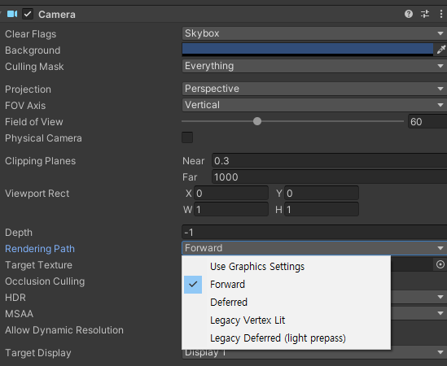
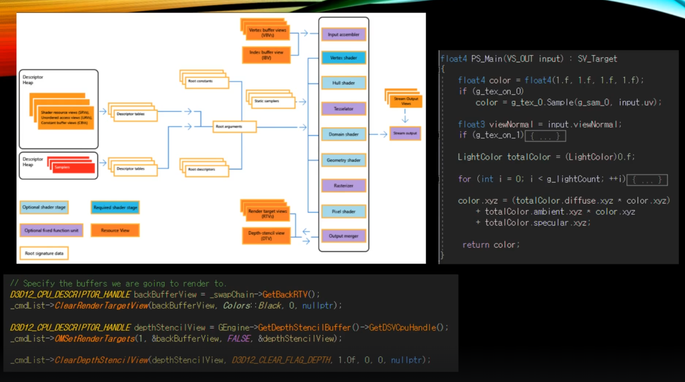
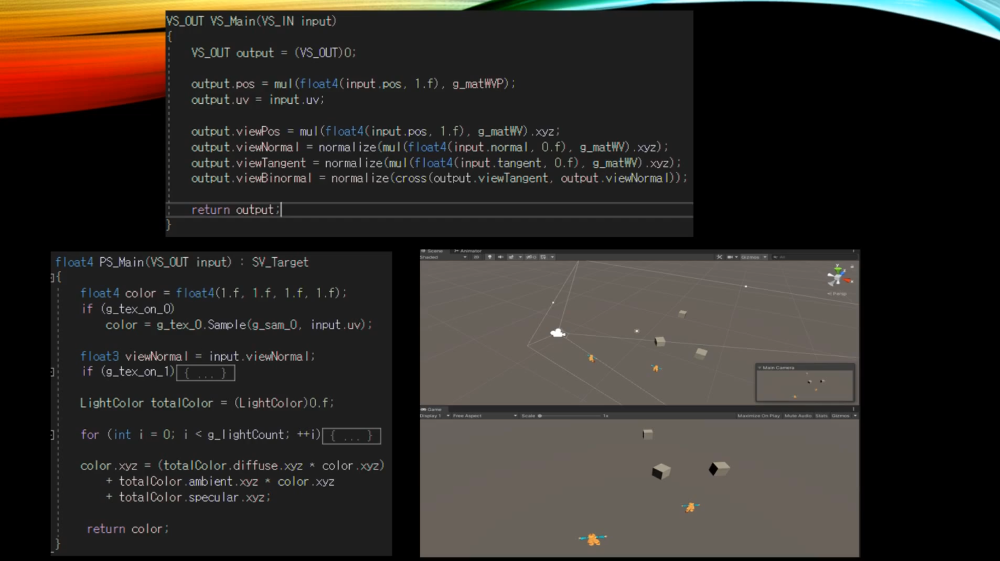
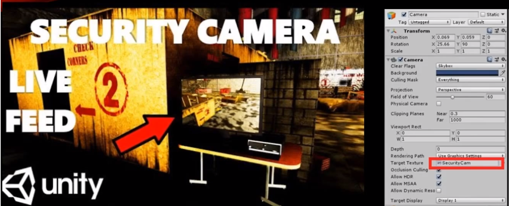
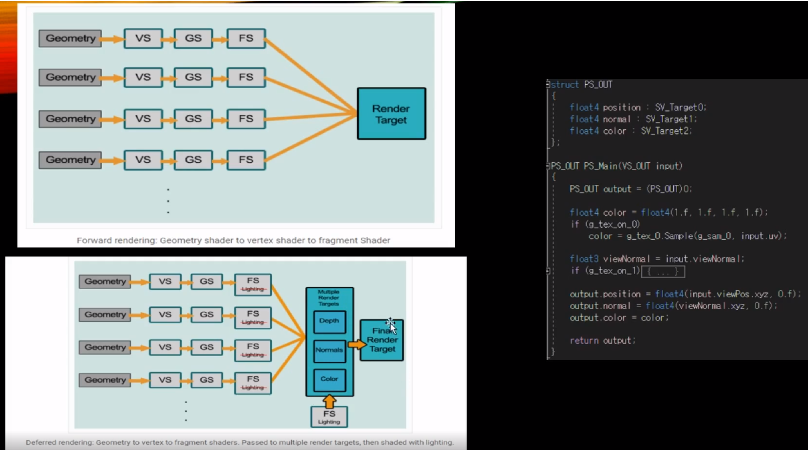
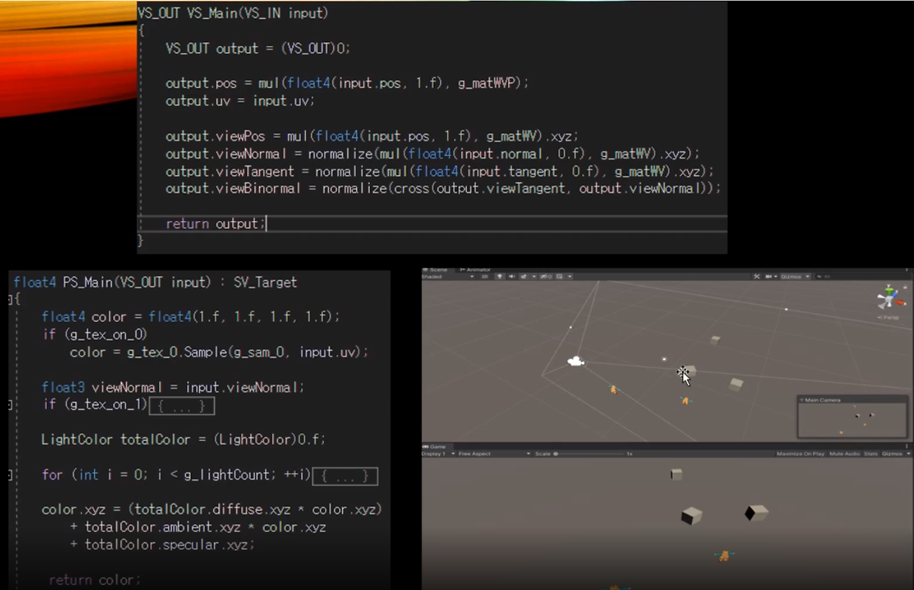
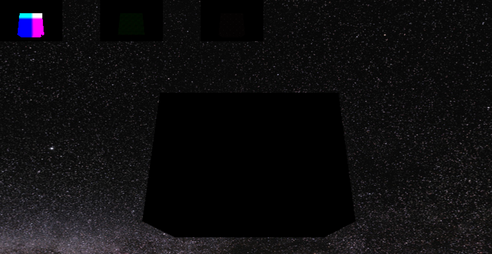

# Render Target ( == Render Texture )

언리얼이나 유니티같은 상용 엔진은 기본적으로 **포워드(Forward) 렌더링**과 **디퍼드 (Deferred) 렌더링** 방식을 지원한다. 뭔 차이일까?

### 지금까지 계속 사용된 Shader는 Forward Shader.

렌더링 파이프라인 지도

어떤 물체를 그릴 때, 그 물체에 관련된 Vertex와 Index 정보 그리고 Topology 정보를 IA 단계에서 넣어주고 이후엔 Shader를 통해가지고 어떤 일을 해줘야하는지를 기술해준 다음에 Vetex Shader, 최종적으로 Pixel Shader 를 거쳐가지고 연산된 결과물을 출력을 해주고 있었다.

유심히 보면 Output Merge 단게에서 끄집어내가지고 결과물을 Rander Target View (RTV) 한테 그려주고 있었다. 요약하자면 최종 결과물을 받을 결과, 즉 도면이라고 보면 된다.

##  Forward Shader.

이 방식은 **모바일 환경에서 주로 쓰인다**. 오브젝트와 동적 라이팅이 적으면 성능 부하도 그만큼 적어진다. 그러나 동적 라이트의 갯수나 **동적 라이트에 영향받는** **오브젝트가 많아지면 성능 저하**가 기하급수적으로 커진다.

포워드 렌더링은 포워드 라이팅, 포워드 쉐이딩이라고도 부르는데, 사실 디퍼드 이전에 사용되던 전통적인 오브젝트 렌더링 기법이다. 

포워드 렌더링은 오브젝트들을 픽셀화 하여 각 픽셀마다 쉐이딩과 라이팅 연산을 더하는 방식으로 렌더링이 진행된다.

그리고 일반적으로 디퍼드 렌더링보다 **더 나은 퍼포먼스**를 보일 수 있으며 디퍼드 렌더링보다 **더 나은 안티에일리어싱**을 기대할 수 있다. 

## Deferred Shader

디퍼드 랜더링은 **많은 수의 동적 라이트를 괜찮은 성능**으로 처리할 수 있다. 따라서 PC 및 콘솔 게임에서 널리 쓰인다. 

그러나 **기기의 성능**이 어느 정도 받쳐주어야 하며, 한 번에 여러 개의 버퍼에 한꺼번에 렌더링 하는 멀티 렌더 타겟 기능이 필요하다. 

멀티 렌더 타겟을 이용해서 여러 개의 **지오메트리 버퍼(G버퍼)**에 불투명(Opaque)한 오브젝트들의 정보를 렌더링한다. 이때 버퍼에는 다양한 정보가 기록되고, 모든 오브젝트들을 버퍼에 렌더링 한 후 이 정보들을 토대로 라이팅을 처리한다. 최종적으로 프레임 버퍼에 이를 출력하여 씬의 렌더링이 완성된다. 이를 위해 디퍼드 렌더링은 G버퍼에 오브젝트들을 렌더링하는 지오메트리 패스와 라잉을 처리하는 라이트 패스가 분리되어 있다. 

이렇게 픽셀정보를 메모리에 저장하기 때문에 **유연성이 높고 다양한 렌더링 기능(특수효과)를 쓸 수 있다는 장점**이 있다.

그러나, 투명 오브젝트를 처리할 수 없고 후처리가 어렵기 때문에 이를 위해 포워드 패스와 포스트 프로세싱 패스 등이 더 존재한다. (어쨋든 이것저것 섞어서 처리할 수는 있다는 말)

반면 비싼 쉐이딩 연산으로 화면에 보이는 픽셀만 처리하기 때문에 불필요한 쉐이딩 연산을 줄일 수 있고, 여러 실시간 라이트들로 인한 드로우콜에 대한 부담을 줄일 수 있다는 장점이 있다. (어쨋든 빠르다는 말)

이렇게 씬이 바로 렌더링 되는 것이 아니라 여러 과정을 거치면서 지연되기 때문에 Deffered(지연된)라는 이름이 붙었다.

그러나 이런 방식은 메모리 대역폭이 뒷받침 되어야 하는데 모바일 디바이스에서는 아직 좀 그렇다. 그래서 모바일 디바이스에서는 포워드 렌더링을 주로 사용한다.

## Render Target

Render Target이란, 최종으로 쉐이더 그려준 결과물을 어디에 그릴것인가를 얘기하는 것이다. 즉 "어떤 대상한테 그릴것이냐"

화면에다 그릴 뿐만 아니라, 별도의 텍스처를 하나 더 만들어서 그 버퍼에다 그려다주는 경우가 많다.

보여주고 있는 카메라 안에 CCTV 같은 컨텐츠를 보여준다고 했을 때를 생각하면 좋다.

카메라가 찍고있는 그 화면 자체를 우리는 전체 화면에다 보여주고 있었지만, 그게 아닌 중간 단계를 거쳐서 어떤 텍스처라는 버퍼에다가 그 화면 결과를 보여준 다음에, 실질적으로 TV에 우리가 그려준 텍스처 자체를 그려주면 된다.

Forward Shader는 낭비가 심한 문제가 있다. 빛에 대한 정보, 뷰 등등 그런 정보를 연산 후에 최종 결과물 color를 제외한 나머지를 다 버린다. 또한, Forward Shader에서의 빛 연산의 속도는 느리다는 단점까지 있다. 하나하나 순차적으로 연산해주는 경우이기에 느리다고 할 수 있다.

Directinal List는 모든 공간의 한 방향이라 다 Pixel을 연산해줘야 겠지만 Point랑 Spot은 특정 범위를 제외한 곳은 연산을 안해줘도 되는데, 멀리 떨어진 곳에도 굳이 빛 연산을 해야한다는 게 연산 낭비가 된다 할 수 있다.

하지만, Forward Shader에선 딱히 그게 영향을 받을지 안받을지 알 길이 없기 때문에 그렇게 할 수 밖에 없었다.

## 그래서 결국엔

Deferred Rendering 이 2010년대부터 유행하기 시작했고, Foward는 제한적인 사항으로 예를 들면 UI 출력할때나 사용하고, 왠만해서는 Deferred를 사용한다.

Deferred를 사용함으로서 Foward 처럼 모든 정보(Normal, 좌표 등등)들을 연산해서 한번의 색상만을 내뱉어주는게 아니라, 중간에 필요한 정보들을 다 저장한다는 특징이 있다. (재사용성 가능) 즉 데이터가 유실되지 않고, 보존된다는 것이다.

Foward Shader는 VS -> GS -> PS -> 최종으로 RenderTarget

Deferred Shader는 VS-> GS-> PS -> Multiple RenderTarget [Depth, Normals, Color] -> Final Render Target

Deferred는 Pixel Shader에서 빛과 관련된 연산들을 당장하지않고, 보류를 해주게 된다. (RenderTarget 이라는게 결국 텍스처)

Pixel Shader에서는 중간에 보존할만한 가치가 있는 데이터들을 RenderTarget에다 그려주게 되고, 그게 [Depth, Normals, Color] 라는 각각의 렌더타겟의 텍스쳐를 의미한다. (이를 MRT)

최종적으로는 모든 정보를 합쳐서 Final RenderTarget의 최종 결과물을 만든다.

이 방식의 가장 큰 장점은 중간에 계산된 결과물에서 어떤 물체에 대한 정보를 또 텍스처에다 기입하게 되면 해당 Pixel에 대해서 물체가 있는지 없는지 판별할 수 있게 된다. 그걸 이용해 빛 연산을 한다는 식으로 수정할 수도 있고, 다양한 방법에서 응용할 수도 있다.

라이팅 기법이 Normal 정보를 필요하게 되면 Normal 텍스처랑 라이팅 연산을 해서 Final RenderTarget에 적용할 수도 있다.

이렇게 중간에 필요한 부품들을 조립해서 편하게 만들어주게 된다는 장점이 있다. 이렇게 하지않고, Foward 같았으면 중간에 있던 계산 과정들이 손실되다보니까 새로운 기법으로 특수 이펙트를 만들고 싶어도 하필 Normal 정보를 필요하기에 처음부터 다시 돌려야된다는 점이 있을 수 있다는 것이다.

요약하자면 다중으로 텍스처를 준비한 다음에, 각각의 해당하는 결과물을 GPU에 그려달라는 요청을 하는 것이다. 당장 출력된 화면을 만드는게 아닌, RenderTarget 에다 텍스처 중간 정보를 저장하고, 최종 결과물을 그려내는 것이다.

## 알아가는 용어

### SwapChain

back_buffer 와 front_buffer를 얘기한다. 후면 버퍼에 항상 그려주면서 교체해준다.

### Geometry Buffer

Positon, Normal, Color를 의미하는데, 위에 여태 얘기한 Final RenderTarget을 만들기 위한 각각의 텍스처를 저장하는 과정이다. 기하학적인 정보를 텍스처에다가 기입한 다음에, 나중에 최종적으로 조립해서 렌더링하는게 Deferred Rendering이다. 그걸 준비하기 위한 정보가 Geometry Buffer.

## 결과물

