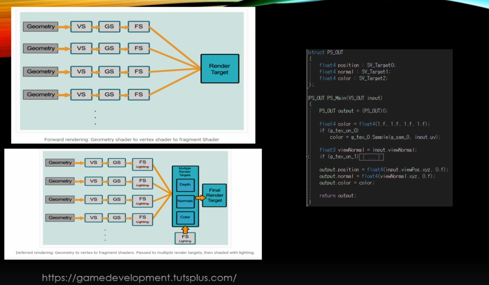
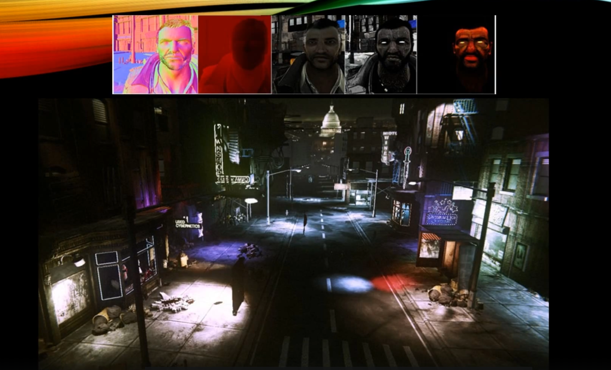
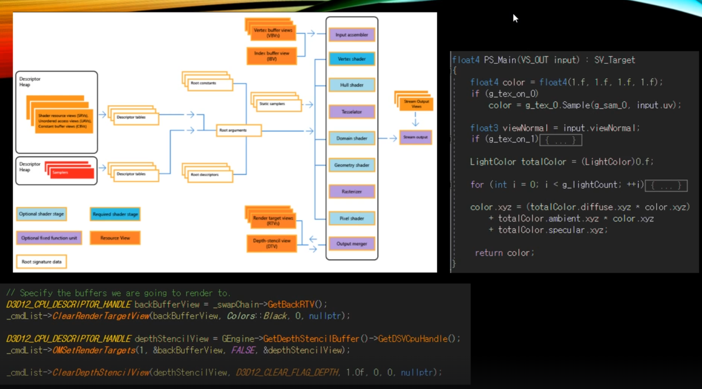
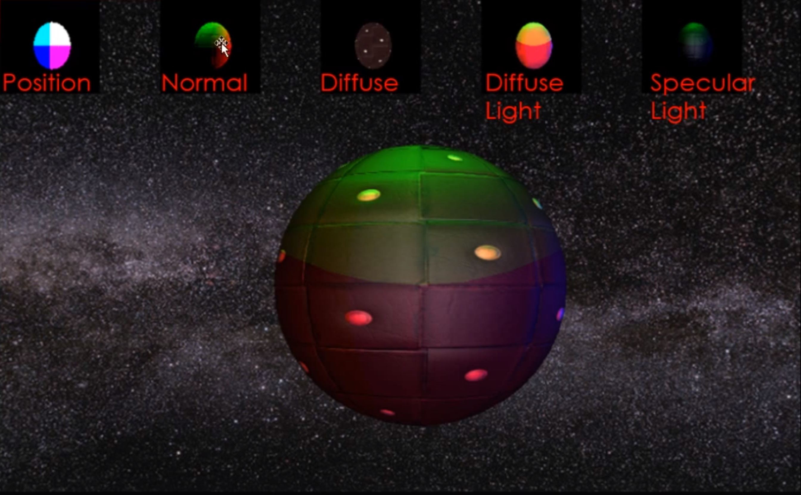
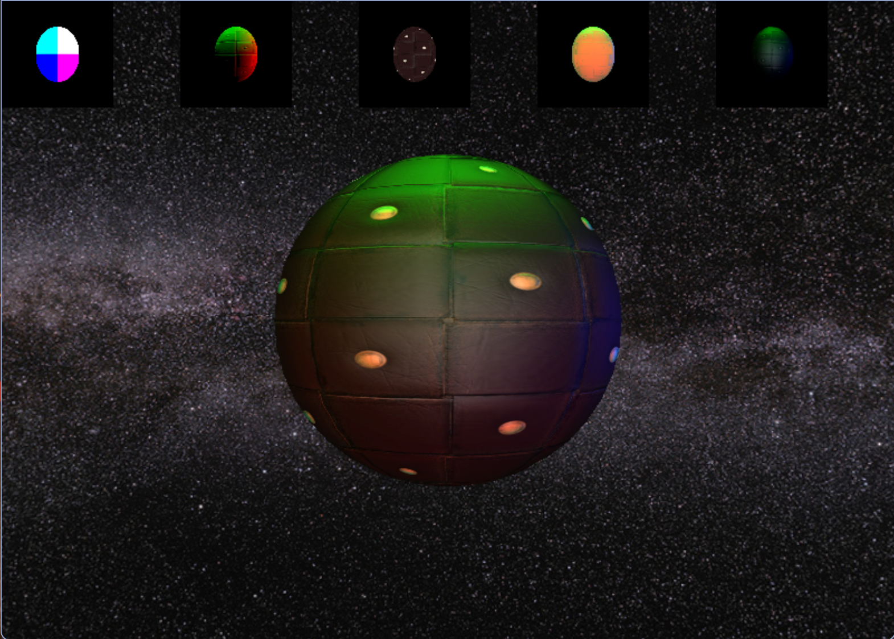

# Deferred Rendering

지난 Render Target 파트에서 어느정도 Deferred Rendering을 구현하기 위한 준비과정은 다 끝났다고 볼 수가 있다.

한 번에 그리는 게 아니라 중간 과정을 따로 조립해서 만들겠다가 Deferred Rendering의 개념인데, Render Target 을 하다 보니까 Deferred Rendering을 만들기 위한 중간 단계가 됐다.

## Deferred Rendering

Foward Rendering 과 Deferred Rendering 차이 중 가장 큰 특징이자 단점은 Foward Rendering은 모든 물체가 그 Pointlight에 영향을 주는지 안주는지 조차 모른 상태에서 모두다 연산해야된다는 단점이 있었다.

결론적으로 보면 Deferred Rendering은 물체를 그릴 때, 빛을 찾아서 연산을 하는게 아니라 거꾸로 빛을 그릴 때, 빛이 물체를 찾아서 그리게 된다.

빛의 영역안에 들어온 Pixel들만 Pixel Shader가 실행된다는 점이다.

빛의 영역안에 들어온 Pixel들을 또 연산과정에서의 2차 필터링을 할수가 있다.

이는 각 RenderTarget으로 나눠놨었는데, 임의의 Pixel 좌표에 대해서 체크를 했더니 Position RenderTarget에서 그 지점에 실체가 있다고 판별이 되면 Pixel 라이팅 연산을 해준다.

물체가 없었다고 하면 애당초 할 필요가 없다는 얘기인데, 계속 그런 연산에 대해 필터링을 해서 거를 수가 있게 되니 모든 Pixel을 연산하지 않고, 최대한 불필요한 연산량을 줄일 수가 있게 된다.

1차 : 빛의 영역 체크 -> 2차 : Pixel 좌표에 대해 Position에 있는지 체크

결론적으로는 빛이 물체를 찾아간다. 

## 오늘 만들 결과물

Diffuse Light 와 Specular Light를 만들어주고, 5개를 합해서 결과물을 만들어보자.

## 결과물

