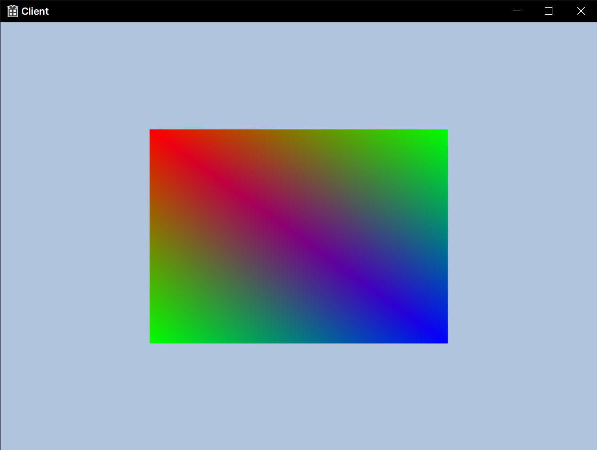

# Index Buffer

정점 버퍼와 인덱스 버퍼의 차이는?

모든것을 정점으로 때려 박아서 넘겨주다보면 너무 복사하는 비용이 크고 중복되는 데이터가 많기 때문에

이걸 최대한 효율적으로 하기위해서 정점들의 정보와 인덱스의 정보들을 분리해서 따로따로 만들어준다음에 같이 넘겨주는 것이다.

정수의 벡터로 만들어지기 떄문에 모든것을 정점으로 표현한것보다 용량을 적게 차지하니까 당연히 성능적으로 이점이 있을 수 밖에 없다.