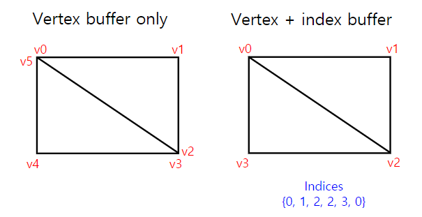

# Vertex Buffer (정점 버퍼), Index Buffer (인덱스 버퍼)




## 정점 버퍼

정점 버퍼(Vertex Buffer)는 그래픽스 프로그래밍에서 3D 모델의 정점 데이터를 저장하는 버퍼이다. 3D 모델은 일련의 정점들의 집합으로 구성되어 있으며, 각 정점은 3D 공간 상의 좌표와 추가적인 속성 (예: 색상, 텍스처 좌표 등)을 가지고 있다. 이러한 정점 데이터는 GPU에서 그래픽스 파이프라인을 통해 렌더링되는 데 사용된다.

정점 버퍼는 이러한 정점 데이터를 메모리에 저장하는데 사용되며, GPU에서 이 데이터를 읽어들여 그래픽스 파이프라인을 통해 화면에 그림을 그린다. 정점 버퍼는 주로 3D 모델의 형상을 정의하는데 사용되며, 모델의 위치, 회전, 크기 및 표면 특성과 같은 정보를 제공한다.

## 정점 버퍼를 생성하고 초기화 하는 과정

1. **정점 구조체 정의** : 정점의 구조체를 정의한다. 이 구조체는 최소한 3D 좌표를 포함하고 추가 속성을 필요에 따라 정의할 수 있다.

   ```c++
   struct Vertex
   {
       float x, y, z; // 3D 좌표
       float r, g, b; // 색상 정보 (예시)
       //  추가적인 속성 정의 가능
   }
   ```

2. 정점 데이터 생성: 정점 데이터를 생성하고 메모리에 저장한다. 이는 일반적으로 배열이나 동적으로 할당된 메모리를 사용하여 수행된다.

   ```c++
   Vertex vertices[] = 
   {
       { -1.0f, -1.0f, 0.0f, 1.0f, 0.0f, 0.0f }, // 정점 1
       {  0.0f,  1.0f, 0.0f, 0.0f, 1.0f, 0.0f }, // 정점 2
       {  1.0f, -1.0f, 0.0f, 0.0f, 0.0f, 1.0f }  // 정점 3
   };
   
   ```

3. **정점 버퍼 생성** : 정점 데이터를 담는 정점 버퍼를 생성하고 초기화 한다.

   ```c++
   D3D12_HEAP_PROPERTIES heapProp = {}; // 힙 속성 설정
   D3D12_RESOURCE_DESC bufferDesc = {}; // 리소스 설명 설정
   
   device->CreateCommittedResource(&heapProp, D3D12_HEAP_FLAG_NONE, &bufferDesc, D3D12_RESOURCE_STATE_COPY_DEST, nullptr, IID_PPV_ARGS(&vertexBuffer));
   
   // 정점 데이터를 정점 버퍼로 복사
   void* pMappedData;
   vertexBuffer->Map(0, nullptr, &pMappedData);
   memcpy(pMappedData, vertices, sizeof(vertices));
   vertexBuffer->Unmap(0, nullptr);
   ```

4. 그래픽 파이프라인에 정점 버퍼 설정 : 정점 버퍼를 그래픽 파이프라인에 설정하여 GPU에게 사용할 데이터를 알려준다.

   ```c++
   D3D12_VERTEX_BUFFER_VIEW vertexBufferView = {};
   vertexBufferView.BufferLocation = vertexBuffer->GetGPUVirtualAddress();
   vertexBufferView.StrideInBytes = sizeof(Vertex);
   vertexBufferView.SizeInBytes = sizeof(vertices);
   
   commandList->IASetVertexBuffers(0, 1, &vertexBufferView);
   ```

   위의 코드들은 Direct3D 12 API를 기준으로 한 예시지만, 다른 그래픽 API에서도 비슷한 개념을 사용한다.

정점 버퍼는 3D 그래픽 애플리케이션에서 기하학적 모델의 형상을 정의하는 데 필수적이며, 이를 통해 GPU는 정점 데이터를 화면에 렌더링할 수 있다.

## 인덱스 버퍼

인덱스 버퍼(Index Buffer)는 그래픽스 프로그래밍에서 정점 데이터를 효율적으로 관리하고 처리하기 위해 사용되는 메모리 버퍼이다. 인덱스 버퍼는 정점 데이터의 순서를 정의하며, 정점의 중복을 피하고 메모리를 절약하는 데 도움이 된다.

일반적으로 3D 모델은 정점 데이터와 인덱스 데이터로 구성된다. 각 정점은 3D 공간에서의 위치와 추가 속성을 나타내며, 이러한 정점들은 정점 버퍼에 저장된다. 그런 다음, 이 정점들을 연결하는 삼각형이나 다각형 등의 기하학적 형상을 정의하기 위해 인덱스가 사용된다.

## 인덱스 버퍼의 주요 특징과 사용방법

1. 중복 정점 제거 : 정점 데이터에 중복된 정점이 많은 경우, 인덱스를 사용하여 중복을 제거할 수 있다. 즉, 하나의 정점을 여러 번 사용하는 대신 해당 정점의 인덱스를 사용하여 정점의 위치 및 속성을 참조할 수 있다.
2. 메모리 효율 : 중복 정점을 제거함으로써 메모리 사용량을 줄일 수 있다. 특히, 대규모의 3D 모델에서는 인덱스를 사용함으로써 효율적인 메모리 관리가 가능하다.
3. 삼각형 스트립 및 패치 등의 특수 형상 지원 : 인덱스를 사용하면 삼각형 스트립(Triangle Strip)이나 패치(Patch)와 같은 특수한 기하학적 형상을 표현하는 데 용이하다.
4. 그래픽스 파이프라인 성능 향상 : 인덱스를 사용하면 GPU에서 그래픽스 파이프라인을 더 효율적으로 처리할 수 있다. 정점 데이터를 읽어오는 데 필요한 대역폭을 줄일 수 있어 렌더링 성능이 향상된다.

## 인덱스 버퍼의 사용방법

```c++
// 정점 데이터
Vertex vertices[] = 
{
    { -1.0f, -1.0f, 0.0f, 1.0f, 0.0f, 0.0f }, // 정점 1
    {  0.0f,  1.0f, 0.0f, 0.0f, 1.0f, 0.0f }, // 정점 2
    {  1.0f, -1.0f, 0.0f, 0.0f, 0.0f, 1.0f }  // 정점 3
};

// 인덱스 데이터
UINT indices[] = 
{
	0, 1, 2 // 정점 1, 2, 3을 연결하는 삼각형을 형성
}
```

위의 예시는 세 개의 정점을 가진 삼각형이 하나 정의되어 있다. 인덱스를 사용하면 정점 데이터를 효율적으로 관리할 수 있으며, 복잡한 모델의 정의 및 렌더링에서 인덱스 버퍼는  중요한 역할을 한다.

## 다시한번, 정점 버퍼와 인덱스 버퍼의 차이는?

모든것을 정점으로 때려 박아서 넘겨주다보면 너무 복사하는 비용이 크고 중복되는 데이터가 많기 때문에

이걸 최대한 효율적으로 하기위해서 정점들의 정보와 인덱스의 정보들을 분리해서 따로따로 만들어준다음에 같이 넘겨주는 것이다.

정수의 벡터로 만들어지기 떄문에 모든것을 정점으로 표현한것보다 용량을 적게 차지하니까 당연히 성능적으로 이점이 있을 수 밖에 없다.