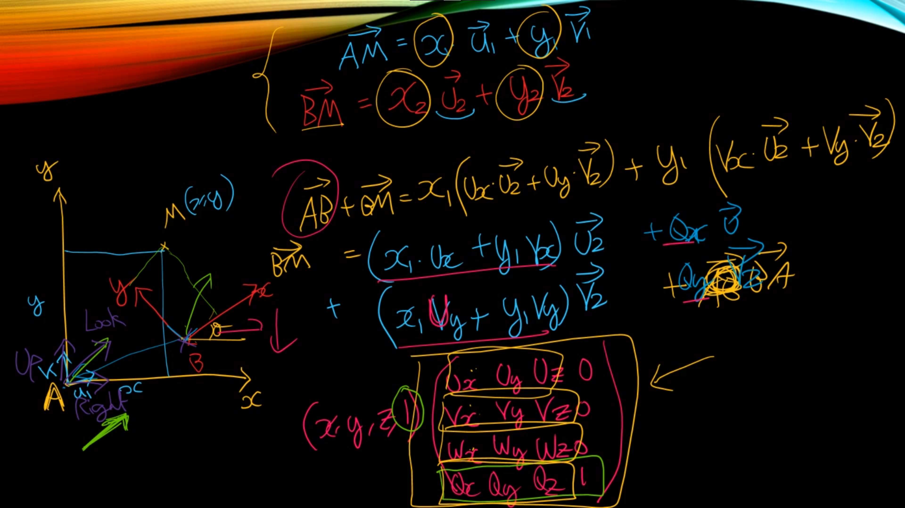

# World, View 변환 행렬

## 행렬의 순서

**Local -> World -> View -> Projection -> Screen**

행렬은 3D 그래픽스에서 변환(이동, 회전, 크기 조절 등)을 수행하는 데에 사용되며, 주로 다음과 같은 행렬들이 사용된다.

1. **Local 행렬 (Local Transformation Matrix)**:
   - 개체의 로컬 좌표계(Local Coordinate System)에서의 변환을 표현하는 행렬이다. 이 행렬은 개체 자체의 이동, 회전, 크기 조절과 같은 변환을 정의한다. 로컬 행렬은 개체가 자신의 로컬 좌표계에서 어떻게 변하는지를 나타낸다.
2. **World 행렬 (World Transformation Matrix)**:
   - 월드 좌표계(World Coordinate System)에서의 변환을 표현하는 행렬이다. 로컬 행렬로부터 생성되며, 개체가 월드 좌표계에서 어떻게 변하는지를 정의한다. 월드 행렬은 다른 개체들과의 상대적 위치 및 방향을 결정하는 데 사용된다.
3. **View 행렬 (View Transformation Matrix)**:
   - 카메라의 위치와 방향에 따라 세계를 어떻게 바라보는지를 나타내는 행렬이다. 뷰 행렬은 월드 좌표계에서 카메라 좌표계로 변환을 수행하며, 뷰 프러스텀(View Frustum)을 정의하는 데 사용된다.
4. **Projection 행렬 (Projection Transformation Matrix)**:
   - 뷰 좌표계에서 정규화 장치 좌표계(Normalized Device Coordinates)로의 변환을 나타내는 행렬이다. 주로 원근 투영(Perspective Projection) 또는 직교 투영(Orthographic Projection)을 정의하는 데 사용된다.
5. **Screen 행렬 (Screen Transformation Matrix)**:
   - 최종적으로 정규화 장치 좌표계에서 화면 좌표계로의 변환을 수행하는 행렬이다. 이 행렬을 사용하여 최종 화면에 렌더링될 좌표를 얻는다.

더 자세하게는 이러한 행렬들은 일반적으로 다음과 같은 순서로 변환을 수행한다.

**Local Matrix→World Matrix→View Matrix→Projection Matrix→Screen MatrixWorld Matrix→View Matrix→Projection Matrix→Screen Matrix**

또는 그 반대 방향으로 역순으로 적용할 수 있다. 각 행렬은 이전 단계의 변환을 고려하여 새로운 좌표계로 변환한다. 이러한 변환은 그래픽스 파이프라인에서 사용되며, 최종적으로 2D 화면에 3D 장면을 렌더링하는 데에 활용된다.

### Local Space (Model Space)

### World Space / 월드 변환 행렬 ( 모델 변환 행렬 )

### View Space  / 뷰 변환 행렬

