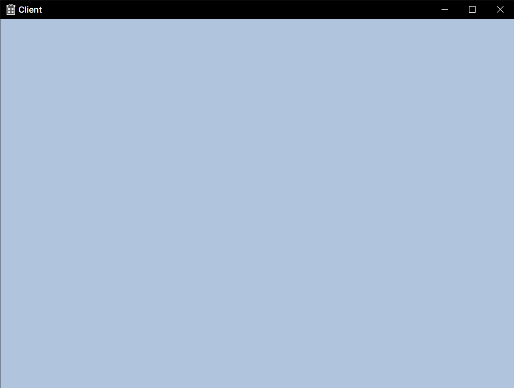

# Client

## Game

Game.cpp

```c++
#include "pch.h"
#include "Game.h"
#include "Engine.h"

void Game::Init(const WindowInfo& info)
{
	GEngine->Init(info);
}

void Game::Update()
{
	GEngine->Render();
}
```

Game.h

```C++
#pragma once

class Game
{
public:
	void Init(const WindowInfo& info);
	void Update();
};
```

## Utils

Client.cpp

```c++
// Client.cpp : 애플리케이션에 대한 진입점을 정의합니다.
//
#include "pch.h"
#include "framework.h"
#include "Client.h"
#include "Game.h"

#define MAX_LOADSTRING 100

// 전역 변수:
WindowInfo GWindowInfo;                        
HINSTANCE hInst;                                // 현재 인스턴스입니다.
WCHAR szTitle[MAX_LOADSTRING];                  // 제목 표시줄 텍스트입니다.
WCHAR szWindowClass[MAX_LOADSTRING];            // 기본 창 클래스 이름입니다.

// 이 코드 모듈에 포함된 함수의 선언을 전달합니다:
ATOM                MyRegisterClass(HINSTANCE hInstance);
BOOL                InitInstance(HINSTANCE, int);
LRESULT CALLBACK    WndProc(HWND, UINT, WPARAM, LPARAM);
INT_PTR CALLBACK    About(HWND, UINT, WPARAM, LPARAM);

int APIENTRY wWinMain(_In_ HINSTANCE hInstance,
                     _In_opt_ HINSTANCE hPrevInstance,
                     _In_ LPWSTR    lpCmdLine,
                     _In_ int       nCmdShow)
{
    UNREFERENCED_PARAMETER(hPrevInstance);
    UNREFERENCED_PARAMETER(lpCmdLine);

    // TODO: 여기에 코드를 입력합니다.

    // 전역 문자열을 초기화합니다.
    LoadStringW(hInstance, IDS_APP_TITLE, szTitle, MAX_LOADSTRING);
    LoadStringW(hInstance, IDC_CLIENT, szWindowClass, MAX_LOADSTRING);
    MyRegisterClass(hInstance);

    // 애플리케이션 초기화를 수행합니다:
    if (!InitInstance (hInstance, nCmdShow))
    {
        return FALSE;
    }

    HACCEL hAccelTable = LoadAccelerators(hInstance, MAKEINTRESOURCE(IDC_CLIENT));

    MSG msg;

    GWindowInfo.width = 800;
    GWindowInfo.height = 600;
    GWindowInfo.windowed = true;

    unique_ptr<Game> game = make_unique<Game>(); // 아래에서 delete를 하지 않아도 됨 스마트포인터의 장점
    game->Init(GWindowInfo);

    // 기본 메시지 루프입니다:
    while (true)
    {
        if (PeekMessage(&msg, nullptr, 0, 0, PM_REMOVE))
        {
			if(msg.message == WM_QUIT)
				break;

            if (!TranslateAccelerator(msg.hwnd, hAccelTable, &msg))
            {
                TranslateMessage(&msg);
                DispatchMessage(&msg);
            }
		}

        // TODO
        game->Update();
    }

    return (int) msg.wParam;
}


//
//  함수: MyRegisterClass()
//
//  용도: 창 클래스를 등록합니다.
//
ATOM MyRegisterClass(HINSTANCE hInstance)
{
    WNDCLASSEXW wcex;

    wcex.cbSize = sizeof(WNDCLASSEX);

    wcex.style          = CS_HREDRAW | CS_VREDRAW;
    wcex.lpfnWndProc    = WndProc;
    wcex.cbClsExtra     = 0;
    wcex.cbWndExtra     = 0;
    wcex.hInstance      = hInstance;
    wcex.hIcon          = LoadIcon(hInstance, MAKEINTRESOURCE(IDI_CLIENT));
    wcex.hCursor        = LoadCursor(nullptr, IDC_ARROW);
    wcex.hbrBackground  = (HBRUSH)(COLOR_WINDOW+1);
    wcex.lpszMenuName = nullptr; 
    wcex.lpszClassName  = szWindowClass;
    wcex.hIconSm        = LoadIcon(wcex.hInstance, MAKEINTRESOURCE(IDI_SMALL));

    return RegisterClassExW(&wcex);
}

//
//   함수: InitInstance(HINSTANCE, int)
//
//   용도: 인스턴스 핸들을 저장하고 주 창을 만듭니다.
//
//   주석:
//
//        이 함수를 통해 인스턴스 핸들을 전역 변수에 저장하고
//        주 프로그램 창을 만든 다음 표시합니다.
//
BOOL InitInstance(HINSTANCE hInstance, int nCmdShow)
{
   hInst = hInstance; // 인스턴스 핸들을 전역 변수에 저장합니다.

   HWND hWnd = CreateWindowW(szWindowClass, szTitle, WS_OVERLAPPEDWINDOW,
      CW_USEDEFAULT, 0, CW_USEDEFAULT, 0, nullptr, nullptr, hInstance, nullptr);

   if (!hWnd)
   {
      return FALSE;
   }

   ShowWindow(hWnd, nCmdShow);
   UpdateWindow(hWnd);

   GWindowInfo.hwnd = hWnd;

   return TRUE;
}

//
//  함수: WndProc(HWND, UINT, WPARAM, LPARAM)
//
//  용도: 주 창의 메시지를 처리합니다.
//
//  WM_COMMAND  - 애플리케이션 메뉴를 처리합니다.
//  WM_PAINT    - 주 창을 그립니다.
//  WM_DESTROY  - 종료 메시지를 게시하고 반환합니다.
//
//
LRESULT CALLBACK WndProc(HWND hWnd, UINT message, WPARAM wParam, LPARAM lParam)
{
    switch (message)
    {
    case WM_COMMAND:
        {
            int wmId = LOWORD(wParam);
            // 메뉴 선택을 구문 분석합니다:
            switch (wmId)
            {
            case IDM_ABOUT:
                DialogBox(hInst, MAKEINTRESOURCE(IDD_ABOUTBOX), hWnd, About);
                break;
            case IDM_EXIT:
                DestroyWindow(hWnd);
                break;
            default:
                return DefWindowProc(hWnd, message, wParam, lParam);
            }
        }
        break;
    case WM_PAINT:
        {
            PAINTSTRUCT ps;
            HDC hdc = BeginPaint(hWnd, &ps);
            // TODO: 여기에 hdc를 사용하는 그리기 코드를 추가합니다...
            EndPaint(hWnd, &ps);
        }
        break;
    case WM_DESTROY:
        PostQuitMessage(0);
        break;
    default:
        return DefWindowProc(hWnd, message, wParam, lParam);
    }
    return 0;
}

// 정보 대화 상자의 메시지 처리기입니다.
INT_PTR CALLBACK About(HWND hDlg, UINT message, WPARAM wParam, LPARAM lParam)
{
    UNREFERENCED_PARAMETER(lParam);
    switch (message)
    {
    case WM_INITDIALOG:
        return (INT_PTR)TRUE;

    case WM_COMMAND:
        if (LOWORD(wParam) == IDOK || LOWORD(wParam) == IDCANCEL)
        {
            EndDialog(hDlg, LOWORD(wParam));
            return (INT_PTR)TRUE;
        }
        break;
    }
    return (INT_PTR)FALSE;
}
```

Client.h

```c++
#pragma once

#include "resource.h"
```
framework.h

```c++
// header.h: 표준 시스템 포함 파일
// 또는 프로젝트 특정 포함 파일이 들어 있는 포함 파일입니다.
//

#pragma once

#include "targetver.h"
#define WIN32_LEAN_AND_MEAN             // 거의 사용되지 않는 내용을 Windows 헤더에서 제외합니다.
// Windows 헤더 파일
#include <windows.h>
// C 런타임 헤더 파일입니다.
#include <stdlib.h>
#include <malloc.h>
#include <memory.h>
#include <tchar.h>
```

pch.cpp

```c++
#include "pch.h"
```

pch.h

```c++
#pragma once

#pragma comment(lib, "Engine.lib")

#include "EnginePch.h"

#include <vector>
#include <memory>

using namespace std;
```

Resource.h

```c++
//{{NO_DEPENDENCIES}}
// Microsoft Visual C++에서 생성한 포함 파일입니다.
// 다음에서 사용 Client.rc

#define IDS_APP_TITLE			103

#define IDR_MAINFRAME			128
#define IDD_CLIENT_DIALOG	102
#define IDD_ABOUTBOX			103
#define IDM_ABOUT				104
#define IDM_EXIT				105
#define IDI_CLIENT			107
#define IDI_SMALL				108
#define IDC_CLIENT			109
#define IDC_MYICON				2
#ifndef IDC_STATIC
#define IDC_STATIC				-1
#endif
// 다음은 새 개체에 사용할 기본값입니다.
//
#ifdef APSTUDIO_INVOKED
#ifndef APSTUDIO_READONLY_SYMBOLS

#define _APS_NO_MFC					130
#define _APS_NEXT_RESOURCE_VALUE	129
#define _APS_NEXT_COMMAND_VALUE		32771
#define _APS_NEXT_CONTROL_VALUE		1000
#define _APS_NEXT_SYMED_VALUE		110
#endif
#endif
```

tragetver.h

```c++
#pragma once

// // SDKDDKVer.h를 포함하면 최고 수준의 가용성을 가진 Windows 플랫폼이 정의됩니다.
// 이전 Windows 플랫폼용 애플리케이션을 빌드하려는 경우에는 SDKDDKVer.h를 포함하기 전에
// WinSDKVer.h를 포함하고 _WIN32_WINNT를 지원하려는 플랫폼으로 설정합니다.
#include <SDKDDKVer.h>

```

# Engine

## Engine

CommandQueue.cpp

```c++
#include "pch.h"
#include "CommandQueue.h"
#include "SwapChain.h"
#include "DescriptorHeap.h"

CommandQueue::~CommandQueue()
{
	::CloseHandle(_fenceEvent);
}

void CommandQueue::Init(ComPtr<ID3D12Device> device, shared_ptr<SwapChain> swapChain, shared_ptr<DescriptorHeap> descHeap)
{
	_swapChain = swapChain;
	_descHeap = descHeap;

	D3D12_COMMAND_QUEUE_DESC queueDesc = {};
	queueDesc.Type = D3D12_COMMAND_LIST_TYPE_DIRECT;
	queueDesc.Flags = D3D12_COMMAND_QUEUE_FLAG_NONE;

	device->CreateCommandQueue(&queueDesc, IID_PPV_ARGS(&_cmdQueue));

	// - D3D12_COMMAND_LIST_TYPE_DIRECT : GPU가 직접 실행하는 명령 목록
	device->CreateCommandAllocator(D3D12_COMMAND_LIST_TYPE_DIRECT, IID_PPV_ARGS(&_cmdAlloc));

	// GPU가 하나인 시스템에서는 0으로
	// DIRECT or BUNDLE
	// Allocator
	// 초기 상태 (그리기 명령은 nullptr 지정)
	device->CreateCommandList(0, D3D12_COMMAND_LIST_TYPE_DIRECT, _cmdAlloc.Get(), nullptr, IID_PPV_ARGS(&_cmdList));

	// CommandList는 Close / Open 상태가 있는데
	// Open 상태에서 Command를 넣다가 Close한 다음 제출하는 개념
	_cmdList->Close();

	// CreateFence
	// - CPU와 GPU의 동기화 수단으로 쓰인다
	device->CreateFence(0, D3D12_FENCE_FLAG_NONE, IID_PPV_ARGS(&_fence));
	_fenceEvent = ::CreateEvent(nullptr, FALSE, FALSE, nullptr);
}

void CommandQueue::WaitSync()
{
	// Advance the fence value to mark commands up to this fence point.
	_fenceValue++;

	// Add an instruction to the command queue to set a new fence point.  Because we 
	// are on the GPU timeline, the new fence point won't be set until the GPU finishes
	// processing all the commands prior to this Signal().
	_cmdQueue->Signal(_fence.Get(), _fenceValue);

	// Wait until the GPU has completed commands up to this fence point.
	if (_fence->GetCompletedValue() < _fenceValue)
	{
		// Fire event when GPU hits current fence.  
		_fence->SetEventOnCompletion(_fenceValue, _fenceEvent);

		// Wait until the GPU hits current fence event is fired.
		::WaitForSingleObject(_fenceEvent, INFINITE);
	}
}


void CommandQueue::RenderBegin(const D3D12_VIEWPORT* vp, const D3D12_RECT* rect)
{
	_cmdAlloc->Reset();
	_cmdList->Reset(_cmdAlloc.Get(), nullptr);

	D3D12_RESOURCE_BARRIER barrier = CD3DX12_RESOURCE_BARRIER::Transition(
		_swapChain->GetCurrentBackBufferResource().Get(),
		D3D12_RESOURCE_STATE_PRESENT, // 화면 출력
		D3D12_RESOURCE_STATE_RENDER_TARGET); // 외주 결과물

	_cmdList->ResourceBarrier(1, &barrier);

	// Set the viewport and scissor rect.  This needs to be reset whenever the command list is reset.
	_cmdList->RSSetViewports(1, vp);
	_cmdList->RSSetScissorRects(1, rect);

	// Specify the buffers we are going to render to.
	D3D12_CPU_DESCRIPTOR_HANDLE backBufferView = _descHeap->GetBackBufferView();
	_cmdList->ClearRenderTargetView(backBufferView, Colors::LightSteelBlue, 0, nullptr);
	_cmdList->OMSetRenderTargets(1, &backBufferView, FALSE, nullptr);
}

void CommandQueue::RenderEnd()
{
	D3D12_RESOURCE_BARRIER barrier = CD3DX12_RESOURCE_BARRIER::Transition(
		_swapChain->GetCurrentBackBufferResource().Get(),
		D3D12_RESOURCE_STATE_RENDER_TARGET, // 외주 결과물
		D3D12_RESOURCE_STATE_PRESENT); // 화면 출력

	_cmdList->ResourceBarrier(1, &barrier);
	_cmdList->Close();

	// 커맨드 리스트 수행
	ID3D12CommandList* cmdListArr[] = { _cmdList.Get() };
	_cmdQueue->ExecuteCommandLists(_countof(cmdListArr), cmdListArr);

	_swapChain->Present();

	// Wait until frame commands are complete.  This waiting is inefficient and is
	// done for simplicity.  Later we will show how to organize our rendering code
	// so we do not have to wait per frame.
	WaitSync();

	_swapChain->SwapIndex();
}

```

CommandQueue.h

```c++
#pragma once

class SwapChain;
class DescriptorHeap;

class CommandQueue
{
public:
	~CommandQueue();

	void Init(ComPtr<ID3D12Device> device, shared_ptr<SwapChain> swapChain, shared_ptr<DescriptorHeap> descHeap);
	void WaitSync();

	void RenderBegin(const D3D12_VIEWPORT* vp, const D3D12_RECT* rect);
	void RenderEnd();

	ComPtr<ID3D12CommandQueue> GetCmdQueue() { return _cmdQueue; }


private:
	// CommandQueue : DX12에 등장
	// 외주를 요청할 때, 하나씩 요청하면 비효율적
	// [외주 목록]에 일감을 차곡차곡 기록했다가 한 방에 요청하는 것
	ComPtr<ID3D12CommandQueue>			_cmdQueue;
	ComPtr<ID3D12CommandAllocator>		_cmdAlloc;
	ComPtr<ID3D12GraphicsCommandList>	_cmdList;

	// Fence : 울타리(?)
	// CPU / GPU 동기화를 위한 간단한 도구
	ComPtr<ID3D12Fence>					_fence;
	uint32								_fenceValue = 0;
	HANDLE								_fenceEvent = INVALID_HANDLE_VALUE;

	shared_ptr<SwapChain>		_swapChain;
	shared_ptr<DescriptorHeap>	_descHeap;
};


```

DescriptiorHeap.cpp

```c++
#include "pch.h"
#include "DescriptorHeap.h"
#include "SwapChain.h"

void DescriptorHeap::Init(ComPtr<ID3D12Device> device, shared_ptr<SwapChain> swapChain)
{
	_swapChain = swapChain;

	// Descriptor (DX12) = View (~DX11)
	// [서술자 힙]으로 RTV 생성
	// DX11의 RTV(RenderTargetView), DSV(DepthStencilView), 
	// CBV(ConstantBufferView), SRV(ShaderResourceView), UAV(UnorderedAccessView)를 전부!

	_rtvHeapSize = device->GetDescriptorHandleIncrementSize(D3D12_DESCRIPTOR_HEAP_TYPE_RTV);

	D3D12_DESCRIPTOR_HEAP_DESC rtvDesc;
	rtvDesc.Type = D3D12_DESCRIPTOR_HEAP_TYPE_RTV;
	rtvDesc.NumDescriptors = SWAP_CHAIN_BUFFER_COUNT;
	rtvDesc.Flags = D3D12_DESCRIPTOR_HEAP_FLAG_NONE;
	rtvDesc.NodeMask = 0;

	// 같은 종류의 데이터끼리 배열로 관리
	// RTV 목록 : [ ] [ ]
	device->CreateDescriptorHeap(&rtvDesc, IID_PPV_ARGS(&_rtvHeap));

	D3D12_CPU_DESCRIPTOR_HANDLE rtvHeapBegin = _rtvHeap->GetCPUDescriptorHandleForHeapStart();

	for (int i = 0; i < SWAP_CHAIN_BUFFER_COUNT; i++)
	{
		_rtvHandle[i] = CD3DX12_CPU_DESCRIPTOR_HANDLE(rtvHeapBegin, i * _rtvHeapSize);
		device->CreateRenderTargetView(swapChain->GetRenderTarget(i).Get(), nullptr, _rtvHandle[i]);
	}
}

D3D12_CPU_DESCRIPTOR_HANDLE DescriptorHeap::GetBackBufferView()
{
	return GetRTV(_swapChain->GetCurrentBackBufferIndex());
}
```

DescriptiorHeap.h

```c++
#pragma once


// [기안서]
// 외주를 맡길 때 이런 저런 정보들을 같이 넘겨줘야 하는데,
// 아무 형태로나 요청하면 못 알아먹는다
// - 각종 리소스를 어떤 용도로 사용하는지 꼼꼼하게 적어서 넘겨주는 용도
class DescriptorHeap // View
{
public:
	void Init(ComPtr<ID3D12Device> device, shared_ptr<class SwapChain> swapChain);

	D3D12_CPU_DESCRIPTOR_HANDLE		GetRTV(int32 idx) { return _rtvHandle[idx]; }

	D3D12_CPU_DESCRIPTOR_HANDLE		GetBackBufferView();

private:
	ComPtr<ID3D12DescriptorHeap>	_rtvHeap;
	uint32							_rtvHeapSize = 0;
	D3D12_CPU_DESCRIPTOR_HANDLE		_rtvHandle[SWAP_CHAIN_BUFFER_COUNT];

	shared_ptr<class SwapChain>		_swapChain;
};
```

Device.cpp

```c++
#include "pch.h"
#include "Device.h"

void Device::Init()
{
	// D3D12 디버그층 활성화
	// - VC++ 출력창에 상세한 디버깅 메시지 출력
	// - riid : 디바이스의 COM ID
	// - ppDevice : 생성된 장치가 매개변수에 설정
#ifdef _DEBUG
	::D3D12GetDebugInterface(IID_PPV_ARGS(&_debugController));
	_debugController->EnableDebugLayer();
#endif

	// DXGI(DirectX Graphics Infrastructure)
	// Direct3D와 함께 쓰이는 API
	// - 전체 화면 모드 전환
	// - 지원되는 디스플레이 모드 열거 등
	// CreateDXGIFactory
	// - riid : 디바이스의 COM ID
	// - ppDevice : 생성된 장치가 매개변수에 설정
	::CreateDXGIFactory(IID_PPV_ARGS(&_dxgi));

	// CreateDevice
	// - 디스플레이 어댑터(그래픽 카드)를 나타내는 객체
	// - pAdapter : nullptr 지정하면 시스템 기본 디스플레이 어댑터
	// - MinimumFeatureLevel : 응용 프로그램이 요구하는 최소 기능 수준 (구닥다리 걸러낸다)
	// - riid : 디바이스의 COM ID
	// - ppDevice : 생성된 장치가 매개변수에 설정
	::D3D12CreateDevice(nullptr, D3D_FEATURE_LEVEL_11_0, IID_PPV_ARGS(&_device));
}

```

Device.h

```c++
#pragma once

// 인력 사무소
class Device
{
public:
	void Init();

	ComPtr<IDXGIFactory> GetDXGI() { return _dxgi; }
	ComPtr<ID3D12Device> GetDevice() { return _device; }
	
private:
	// COM (Component Object Model)
	// - DX의 프로그래밍 언어 독립성과 하위 호환성을 가능하게 하는 기술
	// - COM 객체(COM 인터페이스)를 사용. 세부사항은 우리한테 숨겨짐
	// - ComPtr 일종의 스마트 포인터
	ComPtr<ID3D12Debug>			_debugController;
	ComPtr<IDXGIFactory>		_dxgi; // 화면 관련 기능들
	ComPtr<ID3D12Device>		_device; // 각종 객체 생성
};
```

Engine.cpp

```c++
#include "pch.h"
#include "Engine.h"
#include "Device.h"
#include "CommandQueue.h"
#include "SwapChain.h"
#include "DescriptorHeap.h"

void Engine::Init(const WindowInfo& info)
{
	_window = info;
	ResizeWindow(info.width, info.height);

	// 그려질 화면 크기를 설정
	_viewport = { 0, 0, static_cast<FLOAT>(info.width), static_cast<FLOAT>(info.height), 0.0f, 1.0f };
	_scissorRect = CD3DX12_RECT(0, 0, info.width, info.height);

	_device = make_shared<Device>();
	_cmdQueue = make_shared<CommandQueue>();
	_swapChain = make_shared<SwapChain>();
	_descHeap = make_shared<DescriptorHeap>();

	_device->Init();
	_cmdQueue->Init(_device->GetDevice(), _swapChain, _descHeap);
	_swapChain->Init(info, _device->GetDXGI(), _cmdQueue->GetCmdQueue());
	_descHeap->Init(_device->GetDevice(), _swapChain);

}

void Engine::Render()
{
	RenderBegin();
	
	// TODO: 나머지 물체들 그려준다.

	RenderEnd();
}

void Engine::RenderBegin()
{
	_cmdQueue->RenderBegin(&_viewport, &_scissorRect);
}

void Engine::RenderEnd()
{
	_cmdQueue->RenderEnd();
}

void Engine::ResizeWindow(int32 width, int32 height)
{
	_window.width = width;
	_window.height = height;

	RECT rect = { 0, 0, width, height };
	::AdjustWindowRect(&rect, WS_OVERLAPPEDWINDOW, false);
	::SetWindowPos(_window.hwnd, 0, 100, 100, width, height, 0);
}

```

Engine.h

```c++
#pragma once


class Engine
{
public:
	void Init(const WindowInfo& info);
	void Render();
public:
	void RenderBegin();
	void RenderEnd();


	void ResizeWindow(int32 width, int32 height);
private:
	// 그려질 화면 크기 관련
	WindowInfo		_window;
	D3D12_VIEWPORT	_viewport = {};
	D3D12_RECT		_scissorRect = {};

	shared_ptr<class Device> _device;
	shared_ptr<class CommandQueue> _cmdQueue;
	shared_ptr<class SwapChain> _swapChain;
	shared_ptr<class DescriptorHeap> _descHeap;
};


```

SwapChain.cpp

```c++
#include "pch.h"
#include "SwapChain.h"


void SwapChain::Init(const WindowInfo& info, ComPtr<IDXGIFactory> dxgi, ComPtr<ID3D12CommandQueue> cmdQueue)
{
	// 이전에 만든 정보 날린다
	_swapChain.Reset();

	DXGI_SWAP_CHAIN_DESC sd;
	sd.BufferDesc.Width = static_cast<uint32>(info.width); // 버퍼의 해상도 너비
	sd.BufferDesc.Height = static_cast<uint32>(info.height); // 버퍼의 해상도 높이
	sd.BufferDesc.RefreshRate.Numerator = 60; // 화면 갱신 비율
	sd.BufferDesc.RefreshRate.Denominator = 1; // 화면 갱신 비율
	sd.BufferDesc.Format = DXGI_FORMAT_R8G8B8A8_UNORM; // 버퍼의 디스플레이 형식
	sd.BufferDesc.ScanlineOrdering = DXGI_MODE_SCANLINE_ORDER_UNSPECIFIED;
	sd.BufferDesc.Scaling = DXGI_MODE_SCALING_UNSPECIFIED;
	sd.SampleDesc.Count = 1; // 멀티 샘플링 OFF
	sd.SampleDesc.Quality = 0;
	sd.BufferUsage = DXGI_USAGE_RENDER_TARGET_OUTPUT; // 후면 버퍼에 렌더링할 것 
	sd.BufferCount = SWAP_CHAIN_BUFFER_COUNT; // 전면+후면 버퍼
	sd.OutputWindow = info.hwnd;
	sd.Windowed = info.windowed;
	sd.SwapEffect = DXGI_SWAP_EFFECT_FLIP_DISCARD; // 전면 후면 버퍼 교체 시 이전 프레임 정보 버림
	sd.Flags = DXGI_SWAP_CHAIN_FLAG_ALLOW_MODE_SWITCH;

	dxgi->CreateSwapChain(cmdQueue.Get(), &sd, &_swapChain);

	for (int32 i = 0; i < SWAP_CHAIN_BUFFER_COUNT; i++)
		_swapChain->GetBuffer(i, IID_PPV_ARGS(&_renderTargets[i]));
}

void SwapChain::Present()
{
	// Present the frame.
	_swapChain->Present(0, 0);
}

void SwapChain::SwapIndex()
{
	_backBufferIndex = (_backBufferIndex + 1) % SWAP_CHAIN_BUFFER_COUNT;
}
```

SwapChain.h

```c++
#pragma once


// 교환 사슬
// [외주 과정]
// - 현재 게임 세상에 있는 상황을 묘사
// - 어떤 공식으로 어떻게 계산할지 던져줌
// - GPU가 열심히 계산 (외주)
// - 결과물 받아서 화면에 그려준다

// [외주 결과물]을 어디에 받지?
// - 어떤 종이(Buffer)에 그려서 건내달라고 부탁해보자
// - 특수 종이를 만들어서 -> 처음에 건내주고 -> 결과물을 해당 종이에 받는다 OK
// - 우리 화면에 특수 종이(외주 결과물) 출력해준다

// [?]
// - 그런데 화면에 현재 결과물 출력하는 와중에, 다음 화면도 외주를 맡겨야 함
// - 현재 화면 결과물은 이미 화면 출력에 사용중
// - 특수 종이를 2개 만들어서, 하나는 현재 화면을 그려주고, 하나는 외주 맡기고...
// - Double Buffering!

// - [0] [1]
// 현재 화면 [1]  <-> GPU 작업중 [1] BackBuffer

class SwapChain
{
public:
	void Init(const WindowInfo& info, ComPtr<IDXGIFactory> dxgi, ComPtr<ID3D12CommandQueue> cmdQueue);
	void Present();
	void SwapIndex();

	ComPtr<IDXGISwapChain> GetSwapChain() { return _swapChain; }
	ComPtr<ID3D12Resource> GetRenderTarget(int32 index) { return _renderTargets[index]; }

	uint32 GetCurrentBackBufferIndex() { return _backBufferIndex; }
	ComPtr<ID3D12Resource> GetCurrentBackBufferResource() { return _renderTargets[_backBufferIndex]; }

private:
	ComPtr<IDXGISwapChain>	_swapChain;
	ComPtr<ID3D12Resource>	_renderTargets[SWAP_CHAIN_BUFFER_COUNT];
	uint32					_backBufferIndex = 0;
};


```

## Utils

d3dx12.h 생략

EnginePch.cpp

```c++
#include "pch.h"
#include "EnginePch.h"
#include "Engine.h"

unique_ptr<Engine> GEngine = make_unique<Engine>();

```

EnginePch.h

```c++
#pragma once

// 각종 include
#include <windows.h>
#include <tchar.h>
#include <memory>
#include <string>
#include <vector>
#include <array>
#include <list>
#include <map>
using namespace std;

#include "d3dx12.h"
#include <d3d12.h>
#include <wrl.h>
#include <d3dcompiler.h>
#include <dxgi.h>
#include <DirectXMath.h>
#include <DirectXPackedVector.h>
#include <DirectXColors.h>
using namespace DirectX;
using namespace DirectX::PackedVector;
using namespace Microsoft::WRL;

// 각종 lib
#pragma comment(lib, "d3d12")
#pragma comment(lib, "dxgi")
#pragma comment(lib, "dxguid")
#pragma comment(lib, "d3dcompiler")

// 각종 typedef
using int8		= __int8;
using int16		= __int16;
using int32		= __int32;
using int64		= __int64;
using uint8		= unsigned __int8;
using uint16	= unsigned __int16;
using uint32	= unsigned __int32;
using uint64	= unsigned __int64;
using Vec2		= XMFLOAT2;
using Vec3		= XMFLOAT3;
using Vec4		= XMFLOAT4;
using Matrix	= XMMATRIX;

enum
{
	SWAP_CHAIN_BUFFER_COUNT = 2,
};

struct WindowInfo
{
	HWND	hwnd; // 출력 윈도우
	int32	width; // 윈도우 가로 크기 (너비)
	int32	height; // 윈도우 세로 크기 (높이)
	bool	windowed; // 창모드 or 전체화면 여부
};

// extern이란?
// extern은 외부에 선언된 전역변수를 사용할 때 사용하는 키워드입니다.
extern unique_ptr<class Engine> GEngine;

```

pch.cpp

```c++
// pch.cpp: 미리 컴파일된 헤더에 해당하는 소스 파일

#include "pch.h"

// 미리 컴파일된 헤더를 사용하는 경우 컴파일이 성공하려면 이 소스 파일이 필요합니다.

```

pch.h

```c++
// pch.h: 미리 컴파일된 헤더 파일입니다.
// 아래 나열된 파일은 한 번만 컴파일되었으며, 향후 빌드에 대한 빌드 성능을 향상합니다.
// 코드 컴파일 및 여러 코드 검색 기능을 포함하여 IntelliSense 성능에도 영향을 미칩니다.
// 그러나 여기에 나열된 파일은 빌드 간 업데이트되는 경우 모두 다시 컴파일됩니다.
// 여기에 자주 업데이트할 파일을 추가하지 마세요. 그러면 성능이 저하됩니다.

#ifndef PCH_H
#define PCH_H

// 여기에 미리 컴파일하려는 헤더 추가
#define WIN32_LEAN_AND_MEAN             // 거의 사용되지 않는 내용을 Windows 헤더에서 제외합니다.

#include "EnginePch.h"

#endif //PCH_H

```

