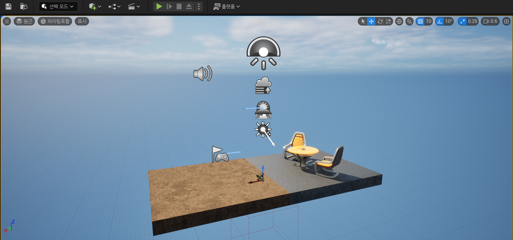
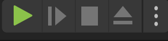
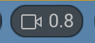

# Level Editor Viewport

언리얼 엔진에는 다양한 유형의 에디터가 포함되어 있다.

오늘은 레벨 에디터에서 뷰포트에 대해서만 알아볼 것이다.

이 뷰포트 안에는 오른쪽 상단과 왼쪽 상단을 포함해서 꽤 많은 아이콘들이 보인다.

상단에 있는 아이콘을 살펴보기 전에, 레벨 에디터 뷰포트에서 우리는 어떻게 움직여야 할까? 어떻게 다양한 사물을 볼 수 있을까?

## 레벨 플레이에서

시작 버튼을 눌러 테스트를 진행해보자.

- 마우스 : 보는 방향 지정
- W : 앞으로
- A : 왼쪽으로
- S : 뒤로
- D : 오른쪽으로
- E, SpaceBar : 위로
- Q, Ctrl : 아래로
- ESC : 나가기

이 정도는 뭘 하지 않아도 기본적으로 적용 되어 있는 조작키다.

하지만 이건 게임을 테스트할 때만 작동한다.

## 레벨 에디터에서는?

### 마우스 왼쪽 버튼을 누른 상태로

고정된 위치에서 지형을 타고 움직이는 느낌이 난다.

즉 지면과 평행을 이뤄 고도 변경없이 움직인다.

- 앞으로 드래그 : 앞으로 나아가기
- 뒤로 드래그 : 뒤로 나아가기
- 좌 우 드래그 : 보는 방향 지정
- W, A, S, D, Q, E : 테스트와 동일

### 마우스 오른쪽 버튼을 누른 상태로

좀 더 자유롭게 움직이는 것으로 관점을 바꾸고 어떤 방향이든 볼 수 있게 해준다. (하늘과 땅으로 시선이 간다는게 특징)

- 마우스 : 보는 방향 지정
- W, A, S, D, Q, E : 테스트와 동일

### 마우스 양쪽 버튼을 누른 상태로

보는 시야를 고정하고 고도를 변경한다

위, 아래, 왼쪽, 오른쪽 전부 움직일 수는 있지만 앞으로나 뒤로는 움직일 수 없다.

- 앞으로 드래그 : 위로 올라간다
- 뒤로 드래그 : 아래로 내려간다
- 좌 우 드래그 : 시선 고정으로 좌우 이동

### 확대 & 축소 기능 (마우스 놓으면 제자리로)

마우스 어떤 버튼이든 누른 상태에서 C를 하면 확대가 된다. 

마우스 어떤 버튼이든 누른 상테에서 Z를 하면 축소가 된다.

## 카메라 속도

이 녀석으로 컨트롤 할 수 있으며 속도가 높아질수록 이동속도가 빠르다고 보면 된다.

세밀하게 컨트롤하려면 낮은 값으로 하면 좋을 것 같다.

이동하려고 하는 (마우스 양쪽, 왼쪽, 오른쪽) 버튼을 누르고 마우스 휠로 수치조절을 할 수 있다.