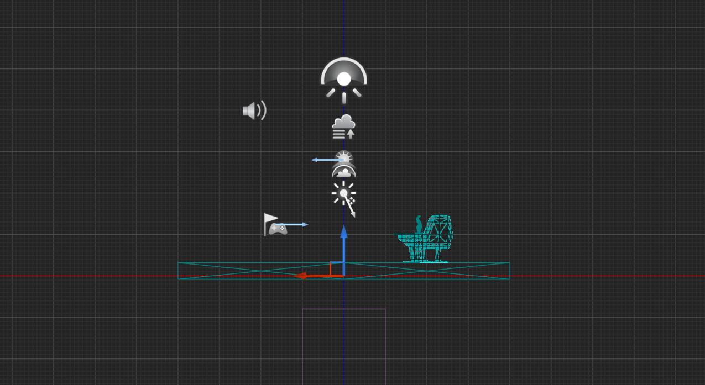
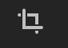

# ViewMode

이제는 세상을 바라볼 수 있는 다양한 방법과 변화를 위한 옵션에 대해 알아보자.

먼저 좌측 상단부터 알아볼 것이다.

## 표시 (Show)

먼저 `표시`에 주목해보자.

이는 플래그라고도 알려전 설정으로, 공통 표시에서 각 플래그 또는 옵션 옆에 체크박스가 있는 플래그를 볼 수 있다. 하나하나 정말 많은 내용이 있는데, 지금 검토하기엔 너무 방대해서 이해하기 쉬운 몇 가지 항목만 먼저 알아볼 것이다.

### 스태틱 메쉬 (정적 메쉬)

정적 메쉬를 선택 취소하면 갑자기 소품이 사라진다.

바닥도 없고, 테이블 의자나 동상도 없다. 따라서 이는 정적 메쉬를 선택 해제했기 때문에 해당 객체가 정적 메쉬라는 것을 의미한다.

### 콜리전 (충돌)

정적 메쉬를 자세히 살펴보면 주위에 윤곽선이 있고 그 윤곽선은 충돌을 보여주는 역할을 한다.

콜리전을 통해 엔진은 훨씬 더 효율적인 방식으로 물리 계산을 수행할 수 있다. 

보다시피, 엔진은 내부적으로 물리 및 충돌과 같은 많은 것들을 처리한다.

두 개체가 서로 충돌하려면 엔진은 몇 가지 계산을 수행해야하는데, 서로 충돌하는 충돌 볼륨의 데이터를 고려한다. 충돌량이 훨씬 간단하다면 계산을 더욱 빠르게 수행할 수 있으며 좀 더 효율적인 게임을 할 수 있다.

그러한 이유가 이런 정적 메쉬를 둘러싼 보다 원시적인 모양을 보는 이유가 된다.

따라서 이와 같은 충돌 볼륨이 있는 메쉬는 다른 개체와 보다 효율적으로 상호 작용할 수 있다.

요약하자면 물리학의 관점에서 본 세상이다.

### 포스트 프로세싱

포스트 프로세싱으로 다양한 조명 및 후처리 효과를 포함하여 다양한 항목을 표시하거나 숨길 수 있다. (따로 다루진 않을거고, 하나씩 눌러서 확인만 해보자)

## 라이팅 포함 (Lit)

다양한 보기 모드가 제공된다.

이것은 실제 게임의 조명 관점에서 이 월드가 어떻게 보일지를 보여준다.

몇개만 다뤄보고 이외에는 툴팁을 읽으면서 어떻게 보이는지만 한번씩 확인해보자.

### 언릿 (조명없음)

언릿으로 변경하면 갑자기 그림자가 없는 것을 볼 수 있다.

이는 광원이 많지 않은 어두운 공간에서 작업하는 데 유용할 수 있어 보인다.

### 와이어프레임

월드의 기하학을 와이어프레임으로 보여주며, 자세히 살펴보면 개별적인 모습을 볼 수 있다. 즉 씬에 있는 폴리곤의 모서리를 전부 보여준다.

각 메쉬의 다각형에 대한 가장자리.

위를 올려다 보면 내가 있는 레벨의 와이어 프레임이 거대한 구체처럼 보이는 것을 알 수 있다. 이것은 하늘 구로 실제 구체이고 꽤나 거대하다.

### 디테일 라이팅

전체 씬의 머터리얼을 원래 머터리얼의 노멀 맵을 사용해서 무채색으로 보여준다. 이는 베이스 컬러가 너무 어둡거나 노이즈가 많아 라이팅을 차단하는지 구분할 때 유용하다.

### 라이팅만

라이팅의 영향만 받는 무채색 머터리얼을 보여준다. 노멀 맵이 보이지 않는다는 점에서 디테일 라이팅모드와는 다르다.

### 리플렉션

노멀이 평평하고 러프니스가 0인 모든 머터리얼 (즉 거울 머터리얼)을 오버라이드 해서 보여준다. 이는 리플렉션 디테일을 진단할 때 유용하고, 이를 활용하여 더 많은 디테일이 필요한 곳에 리플렉션 캡처 액터를 더할 수 있다.

당장은 이정도로만 알고 넘어가자.

## 원근 (Perspective)

원근은 더 멀리 있는 물체가 실제 생활에서 처럼 마찬가지로 더 작게 보인다.

다양한 모드들이 존재하는데, 예를 들어 `상단`을 보자면.

위처럼 볼 수 있게 된다. 직교 모드에서의 상단의 소품이다. 따라서 멀리 있든 객체는 작게 표시되지 않으며 2D 공간에 있음을 알 수 있다.

### 움직이는 법

- 마우스 오른쪽 버튼을 클릭해서 드래그하며 움직일 수 있다.

- 마우스 휠로 확대하거나 축소할 수 있다.

`하단`도 봐보자.

또, `측면`도!

`정면`까지도 봐보자.

이를 통해 그리드에 따라 사물의 위치를 정확하게 지정할 수 있으며 특정 상황에서 유용할 수 있다.

## 우측 상단에 네모네모네모네모 (restores)

얘를 클릭하면

뷰포트가 4개의 개별 뷰포트로 분할된다.

보면 알겠지만 좌측 아래는 `원근`이고, 나머지는 왼쪽기준으로 `후면 ` `오른쪽` `상단`

다른 직교 뷰를 볼 수 있고, 각 개별 뷰포트에는 다음을 포함한 고유한 아이콘 세트가 있다는 점에 유의하자.

가장 오른쪽 상단 아이콘인데 얘를 누르면 하나를 최대화 할 수 있다.

## 뷰 포트 옵션

다른 옵션들이 들어있는데, 그 수가 상당하다.

### FPS 표시

초당 프레임을 보여준다. Ctrl + Shift + H 로 껐다 켰다 할 수 있다.

앱의 초당 프레임 수가 게임에 미치는 중요성은 다음에 알아보자.

### 북마크

세 가지 옵션이 보이는데, 북마크 1, 2, 3 에 이동하는 것. 단축키로는 1, 2, 3

1을 눌러보자.

지정된 위치에 맞춰졌다.

2를 눌러보자

이번에도 역시 지정된 위치로 시야가 맞춰졌다.

보면 북마크를 설정하는 옵션이 있고 0부터 9까지의 북마크를 지정할 수 있음을 알 수있다. 카메라를 원하는 위치에 배치하고 빠르게 그 시점으로 이동할 때 상당히 유용하게 사용할 수 있어 보인다.

깔끔하게 마음에 들지 않는 북마크도 지울 수 있다.

### 게임 뷰

게임 뷰를 키지않았을 때의 모습이고

게임 뷰를 켰을 때의 모습이다.

이 떠다니던 많은 물체가 사라졌다. 일반적으로 보이지 않는 다른 개체가 모두 게임의 모습이라고 볼 수 있다.

### 몰입형 (전체화면 F11)

G 버튼을 눌러 게임 뷰로 들어가서 몰입해서 테스트할 때는 F11을 눌러서 전체화면 만들어 놓고 하면 좋을 것 같다.

### 고해상도 스크린샷

얘를 누르면 캡처 직사각형을 지정할 수 있다.

