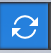
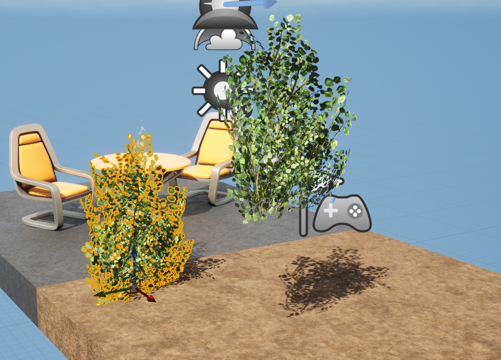

# Object Manipulation

간단히 마우스 왼쪽 버튼으로 월드의 개체를 선택할 수 있다. (아웃라인이 그려짐)

아래 세개의 화살표가 보이는데, 이 화살표는 방향에 해당한다. 이걸 축이라고 부른다.

공간에서는 축이 월드 좌표계와 정렬된다.

- 파란색 : 위 아래로 움직이는 깊이감 Z축
- 녹색 : Y축
- 빨간색 : X축

에디터 좌측아래에 보면 기즈모를 발견할 수 있다. 뷰를 회전시키면 얘도 같이 회전이 되는걸 확인할 수 있다.

기즈모는 월드 좌표에 맞춰 정렬되어 있다.

어느 방향이 X, Y, Z 인지 알려주는 역할로 어떤 면에서는 X와 Y를 일종의 북쪽과 남쪽으로 생각할 수도 있을 것 같다. (Z는 하늘을 향하고 있다.)

## 변환 모드 선택

우측 상단에 위치한다.

객체를 선택할 때 나타나는 기즈모는 변환 모드에 있음을 알려준다.

왼쪽에 있는 네 개의 아이콘을 사용하면 객체를 조작하는 다양한 방법을 전환하며 사용할 수 있다.

### 오브젝트 선택

객체 선택을 나타내며 단축키는 Q 이다. 단순 클릭으로 동작하므로 원하는 개체를 선택하면 된다.

### 선택과 이동 (Select and Translate Object)

단축키는 W, 기즈모가 나타난다. 기즈모의 화살표 중 하나를 클릭하면 해당 세계의 개체를 끌어서 이동 시킬 수 있다.

기즈모에 잘 보면 사각형이 보이는데, 거기에 마우스를 올리면 두 화살표를 모두 선택할 수 있다. Y축과 Z축을 동시에 사용할 수 있다는 것.

### 회전 (Rotation)

단축키는 E, 기즈모가 회전 기즈모로 바뀌고 회전축이 생긴다.

- 파란색 호 : Z축을 기준으로 회전
- 빨간색 호 : X축을 기준으로 회전
- 녹색 호 : Y축을 기준으로 회전

### 스케일 조작

이제 각 핸들 끝에 상자가 있는 또 다른 버전의 기즈모가 나온다.

해당이 되는 방향으로 메시의 크기를 조절할 수 있다.

## 스냅

그런데 왜 물체가 부드럽게 움직이지 않고, 조금씩 움직이는 걸까?

이는 개체에 스냅이 활성화되어 있기 때문이다.

### 그리드 스냅

### 회전 스냅

각도를 정해서 변경시킬 수 있다.

### 스케일 스냅

비활성화 할 시에 더 이상 증분 단위로 스냅 하지 않게 되며 뚝뚝 끊기게 보이지 않는다. 스냅을 할 시에 지정된 단위씩 더해지거나 빼지는 형식이다.

스냅을 비활성화하면 부드럽게 크기를 조정할 수는 있지만, 특정 상황에 맞춰서 사용하도록 하자.

### 로컬 / 월드 좌표계 전환

회전만 이동만인 경우, 로컬 / 월드 좌표계 전환이다.

월드 모드에 있을 때, 트랜스폼 툴은 알아서 월드 그리드에 정렬된다.

로컬 모드에 있을 때는, 트랜스폼 툴은 선택된 액터의 방향에 정렬된다.

따라서 월드 기준으로 옮길때랑 로컬 기준으로 옮길때랑은 잘 구분해서 사용하면 좋다.

### 표면 스냅 (스냅 방식 제어)

개체가 표면에 스냅 되는 방식을 제어한다.

표면 스냅을 활성화 하면 새로운 정적 메시를 월드에 드래그하여 어떻게 작동하는지 확인할 수 있다. 

표면 스냅을 활성화하면 표면에 촥! 하고 달라붙는 느낌이라고 알면 된다.

`표면 오프셋`이 100인 경우는

지면과 100 떨어진다.

여기서 언리얼 엔진 100이 의미하는건 100센티미터에 해당한다. 따라서 1의 언리얼 엔진 단위는 1 센티미터라고 보면 된다.

## 개체 복사

Alt 키를 누른 상태에서 기즈모의 핸들 중 하나를 클릭하고 드래그 하며 복제할 수 있다.

Shfit를 누르고 개체를 여러개 선택해서 Alt 키로 다중 복제도 가능하다.

방향 기즈모 말고 회전 기즈모 상태에서도 당연히 복제 가능하다.

번외로 Shfit를 누르고 개체를 여러개 선택해서 한번에 이동도 가능하다.