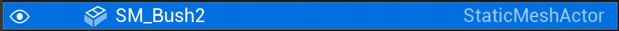

# Panels

## 아웃라이너

월드에 있는 모든 오브젝트들을 볼 수 있다.

드롭다운을 사용하여 축소하거나 확장도 할 수 있다.

덤불 정적 메시와 같이 방금 추가한 개체는 자체 폴더에 있지 않음을 볼 수 있다.

왜냐하면 월드로 끌어들였을 뿐이기 때문이다. 이제 월드 패널에서 이들 중 하나를 선택할 수 있다.

자세히 보면 눈 아이콘이 보이는데, 이를 비활성화 할시에 그 오브젝트를 가려준다. (Delete해줘서 없애버릴 수도 있다.)

정말 쉽게 레벨을 정리할 수 있음을 알 수 있는 부분이다.

이번에 추가했던 모든 덤불을 제거하고 싶다고 가정해보자.

필터링을 걸어서 뜬 Bush 들을 삭제해주면 월드에서 삭제가 된다.

월드가 엄청 커지면 개체를 찾기가 어려울 수 있는데, 이럴 때 아웃라이너에서 필터링을 걸어서 찾아주면 편하게 찾을 수 있을 것이다. 

### 포커싱

의자를 필터링 걸고 클릭 후 F 키를 누르기

그러면 해당 오브젝트로 시점이 이동된다.

### 엠비언트 사운드

스피커 아이콘을 눌러보면

각 오브젝트에 고유한 타입이 있음을 알 수 있다.

스피커 아이콘은 주변 소리인 엠비언트 사운드 유형을 가지고 있어서 플레이를 눌렀을 때 레벨의 소리가 들리게 된다.

또한 아이콘 주위에서 소리가 나는 것을 알아주면 좋다.

아이콘을 삭제하거나 아웃라이너에서 삭제하면 소리 자체도 없어지는 걸 볼 수 있다.

### 스카이 라이트

유형은 SkyLight로 채광창이다.

끄면 어두워짐을 알 수 있다.

이는 월드에 일종의 기본 조명 수준으로 태양이 비치는 실내 영역에도 영향을 미친다.

## 라이트 소스

그냥 말그대로 태양.

광원을 회전시키면서 그림자가 땅 위에서 움직이고 있다는 것을 보자.

라이트 소스는 태양처럼 행동하는 광원 유형이고 방향성이 있다.

## 플레이어 스타트

여기서 부터 플레이가 시작되는 것.

## 아웃라이너는 요약하면

아웃라이너를 사용하면 월드의 개체를 정리하고 자체 폴더에 지정해서 보관할 수 있다.

-----

## 디테일

세부 정보 패널이다.

특정 개체에 대한 정보를 제공한다.

위치, 회전, 스케일에 대한 월드 좌표 정보를 포함해서 스태틱 메시 설정 등등 많은걸 앞으로 다룰 예정이다.

`피직스`

물리학이다. 다양하게 건드려 볼 수 있음을 알 수 있다.

떨어지면 자연스럽게 떨어지게 한다던지, 중력 활성을 비활성화를 해서 중력이 없게 한다든지 등등 가능하다.

디테일 패널은 선택한 개체의 속성에 접근하는 데 매우 편리하다.