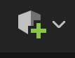
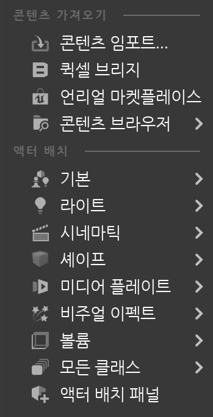
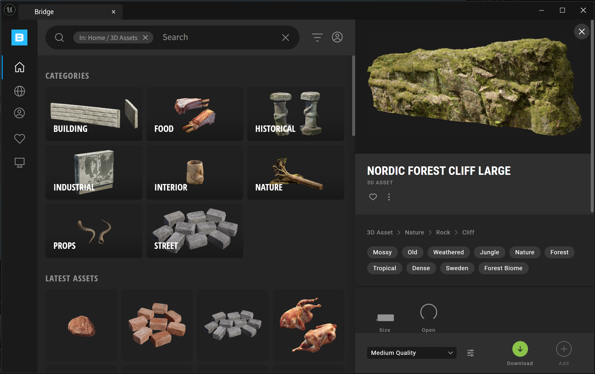
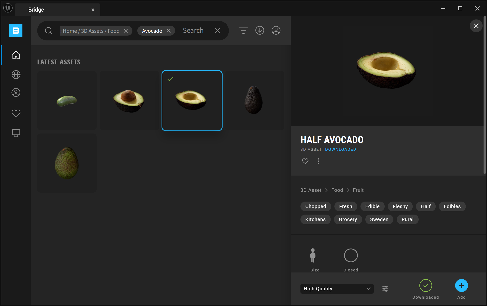
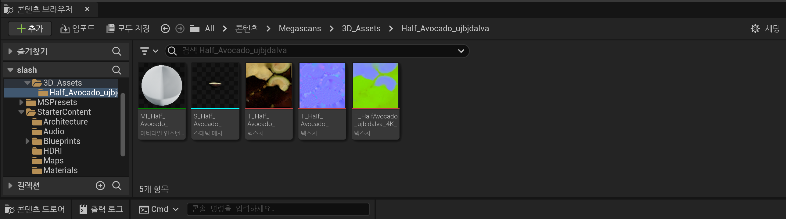
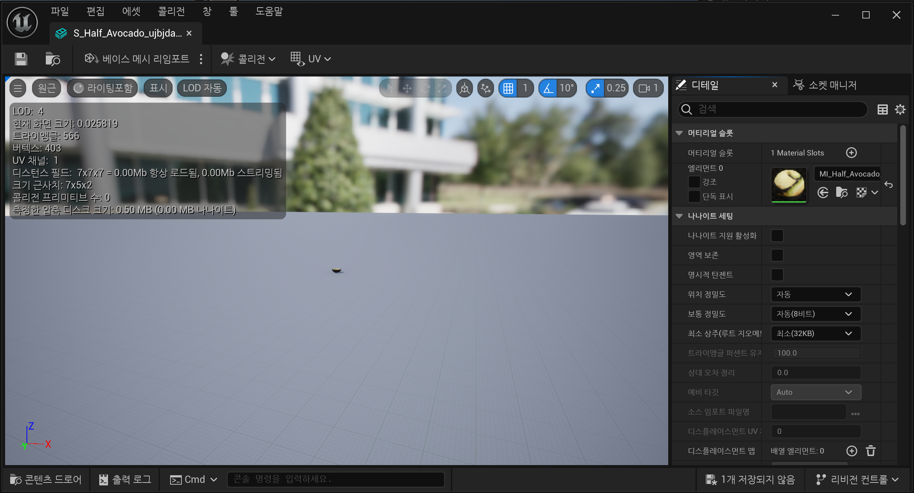
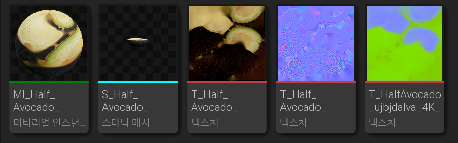
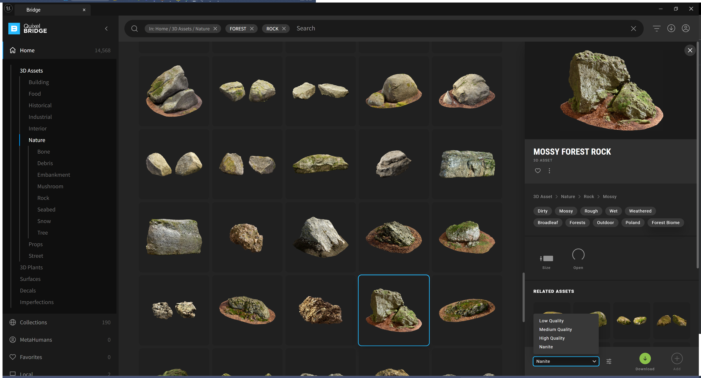

# Quixel Bridge

프로젝트에 무언가를 추가할 때 사용한다.

## 퀵셀 브릿지

실제 물체를 스캔하고 메쉬로 만드는 MEGA 스캔이라는 최첨단 기술을 사용한 메쉬들을 얻을 수 있다.

`3D Asset` 다양한 카테고리를 가지고 있으며 아보카도를 검색해보자.

낮은품질 / 중간품질 / 고품질 을 선택해서 다운로드할 수 있다.

`Add`가 생기고 그걸 누르면

콘텐츠 브라우저에 추가된 걸 볼수가 있다.

두번째 파일인 스태틱 메쉬를 클릭해보자.

이제 메쉬 편집기에 들어가게 되는데, 언리얼 엔진에는 다양한 편집기가 있다는 걸 알 수 있다.

잘보면 색이 보일텐데 메쉬는 `청록색`임을 알 수있다.

메쉬는 머티리얼을 재료로 사용하는데, 머티리얼(물질)은 `녹색`이다.

이제 이 머티리얼은 텍스처를 사용하고, 색은 `빨간색`이다.

세가지의 텍스처를 사용하는데 색상 정보와 추가 정보들이다.

`나나이트` 품질도 존재한다.

