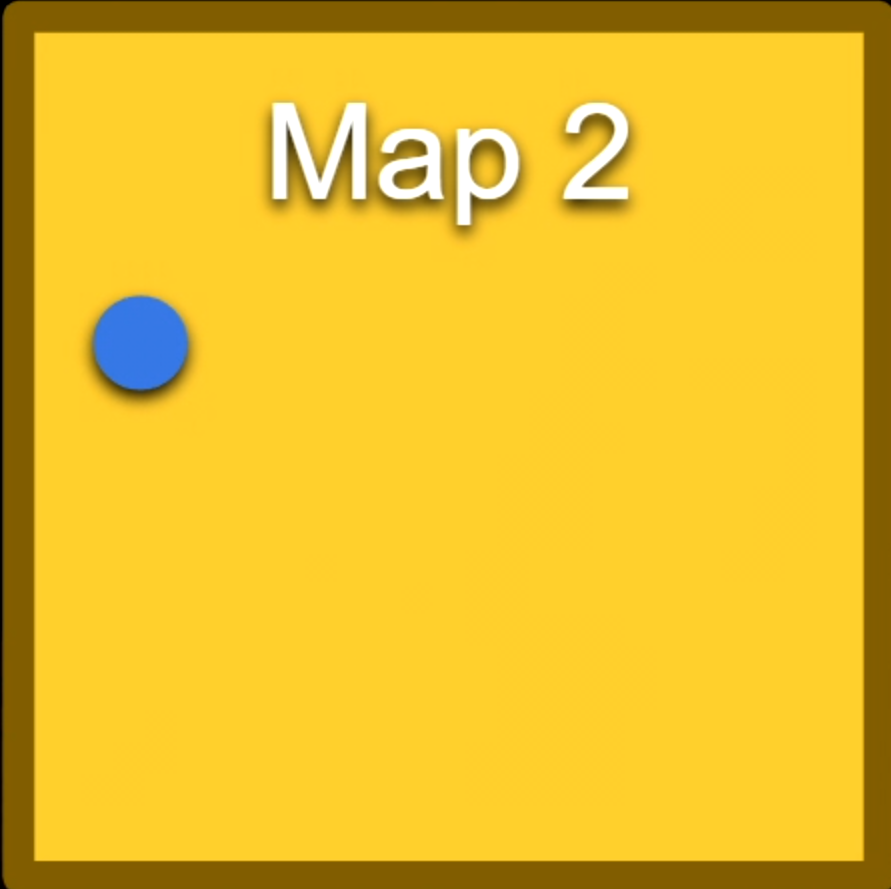

# Open World

언리얼 엔진의 기능 중 하나는 오픈 월드 지원이다.

전통적으로 비디오 게임의 넓은 월드는 구현하기가 어려웠다. 일반적으로 큰 월드는 여러 레벨로 분할되므로 단일 레벨이 로드된다.

맵 1 이라고 가정하자. 캐릭터는 이 레벨에서 뛰어다니고 있다.

그리고 다음 레벨에서 로드하는 레벨의 가장자리에 도달하면 이 맵을 2라고 부르고 언로드 한다.

플레이어가 맵 2를 통과하기 시작하고 맵 2의 가장자리에 도달하면 로드가 된다.

이렇게 설정하고 관리하는 데 많은 작업이 필요하지만 언리얼 에서는 워크플로를 도입했다.

## 언리얼 오픈월드 시스템

 오픈월드 시스템을 사용하면 여러 개의 맵이 아닌 하나의 맵을 가질 수 있게 된다.

따라서 여러 개의 작은 맵 대신에 하나의 큰 맵이 있고 언리얼이 분할을 담당해준다.

월드를 여러 섹션으로 나누고 플레이어가 속한 섹션만 로드한다.

이것을 월드 파티셔닝(World Partitioning) 이라고 하며 여러 맵을 설정하고 수동으로 로드 및 언로드할 필요가 없다.

콘텐츠 브라우저에서 Maps 폴더를 만들자.

파일 > 새 레벨로 이동해서 `빈 오픈 월드` 생성

월드가 커지면 이 미니맵을 통해 어디에 있는 지 볼 수 있게 된다.

`SlashOpenWorld`로 Maps에 저장하기