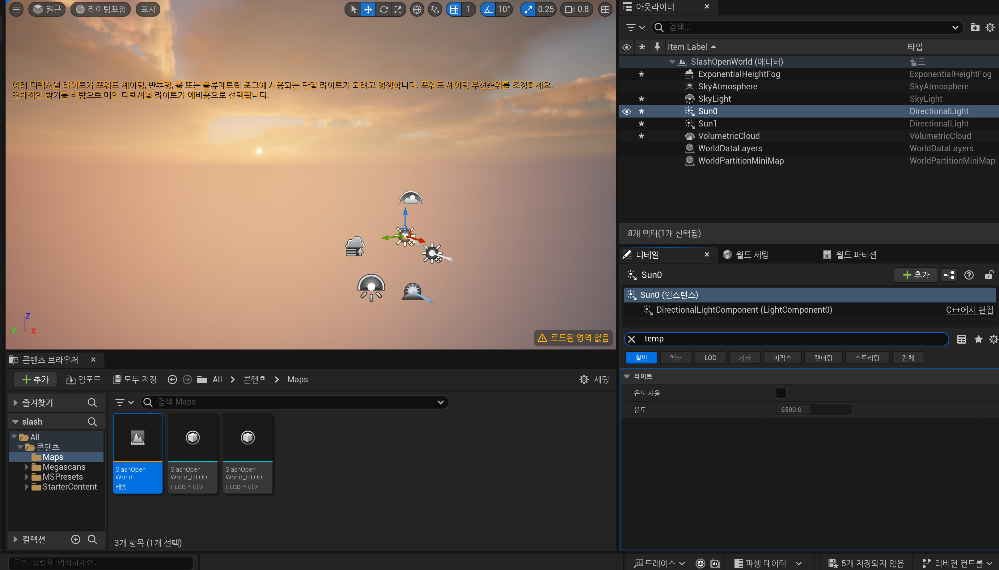

# Lighting And Atmosphere

새로운 레벨에 하늘을 만들어보자.

하늘 대기, 방향성 조명, 채광창, 지수 높이, 안개, 일부 체적 구름이 필요하다.

이들 각각이 함께 모여 하늘을 만들고, 모양을 만드는 데 각각 다른 역할이 있다.

## 하늘 대기 (Sky Atmosphere)

언리얼에는 하늘 대기 (Sky Atmosphere)가 있다.

하늘 대기는 실제처럼 빛을 산란시키는 지구와 같은 대기를 만들기 위해 설계되었다.

따라서 광원이 있으면 그 빛을 분산시켜 온갖 종류의 아름다운 하늘을 만들 수 있다.

예로 일몰과 일출에서 볼 수 있는 것과 같은 효과.

또한 최대 2개의 대기 조명을 가질 수 있다. 그것은 태양을 위한 광원과 달을 위한 광원이다.

## 방향성 조명 (Directional Light)

무한히 멀리 있는 광원을 표현한다. 이는 월드의 모든 물체에 드리워진 그림자가 서로 평행하다는 것을 의미한다.

태양을 표현하는데 방향성 광원이 사용될 것이다.

이 둘이 어떻게 함께 작동하는지 살펴보자.

`액터 배치 패널` 열기

일반적으로 레벨에 배치되는 다양한 유형의 액터를 볼 수 있다.

스카이를 검색해보니 관련된 항목이 보인다. `스카이 애트머스피어`부터 추가.

이제 하늘 대기에는 광원이 필요하다. 이를 위해 필요한게 방향성 조명이다.

추가해주자.

이렇게 하니까 하늘이 있게 되고 올려다 보면 빛인 태양이 있다는 것을 볼 수 있다.

빛이 생겼고, 하늘은 그 빛을 산란시키는 하늘 대기 덕분에 파랗게 됐다.

앞서 언급한 것처럼 최대 2개의 광원을 사용할 수 있다는 것을 기억해서 하나를 더 꺼내보자.

Ctrl을 누른 상태에서 L 키를 누르면 이동 시킬 수 있다. 이때 마우스를 움직일 때 

Ctrl 키를 누르고 있어야 태양을 움직일 수 있다.

두번째로 만든 항목에다 인덱스를 1로 주면

두개의 태양이 있다는 것을 알 수 있다. 그렇지만 Ctrl을 누르고 태양을 움직이려고 해도 움직이지 않는다. 이는 언리얼이 해결 하지 못한 문제인 짐벌락 현상 때문인데, 디렉셔널 라이트에서 회전 값을 0 0 0으로 줘야한다.

디테일 패널에서 회전의 세 가지 값을 모두 0으로 설정해서 보내주기.

태양을 0회전으로 보냈다.

이제 Ctrl을 누른상태에서도 조명을 이동 시킬 수 있게 되었다.

디테일 패널에 `모빌리티`에 대해서도 알아보자

## 모빌리티

라이트의 모빌리티 설정에 따라 게임에서 라이트가 작동하는 방식과 무엇을 할 수 있는지가 결정된다.

- 스태틱 
  - 라이트의 이동성이 정적으로, 게임에서 조명을 변경할 수 없다는 뜻
  - 빛의 위치나 방향을 바꿀 수 없으며, 빛의 강도나 색상도 바꿀 수 없다.
  - 가장 빠르게 계산된다.
  - 일부 정적 개체에서 그림자가 드리워진다는 것을 알고 있을 때 조명을 베이크하게 (구울 수 있게) 해준다.
- 스테이셔너리 (고정)
  - 게임에서 색상과 강도를 변경할 수 있지만 위치나 강도는 변경할 수 없다.
  - 부분적으로 구운 조명을 허용하므로 움직이지 않는 정적 개체에 빛을 투사할 수 있다.
- 무버블
  - 가장 계산 비용이 많이 드는 유형
  - 게임 내에서 움직이고 변할 수 있다. (움직이는 태양과 같은 동적 캐스트 동적 그림자와 같다)
  - 다이나믹 섀도우 (광원이 잠재적으로 움직일 수 있는 경우 그림자를 구울 필요가 없다)
  - 가장 비싸고, 가장 드물게 사용되지만, 또한 가장 역동적이고 게임 플레이에 유연하다.

디렉셔널 라이트 -> 선0,1로 변경 후 무버블로 지정했다.

## 스카이 라이트 (Sky Light)

애트머스피와 두 개의 디렉셔널 라이트가 있으므로 스카이라이트 (채광창)에 대해 알아보자.

- 레벨의 먼 부분을 캡쳐한다.
- 장면에 라이트(반사)로 적용된다.
- 전역 라이트를 얻는다.
- 이동성에 따라 특정 조건에서만 캡쳐한다.
  - 정적 라이트의 경우 라이트를 구축할 때 업데이트되며 이는 수동으로 수행할 수 있다.
  - 고정식 및 이동식 라이트의 경우 로드 및 "캡처"에서 한 번 업데이트한다.
  - 실시간 캡처(옵션)가 활성화된 경우 지속적으로 실행한다.

해가 뜨고 지는 등 장면이 변하면서 따라서 라이트도 변한다.

이제 할 일은 `무버블`로 설정한 뒤 디테일에서 Real Time을 검색 해보자.

이제 태양이 움직이도록 할 수 있고 낮과 밤의 주기를 가질 수 있게 됐다.

라이트는 하늘의 방향성 광원이 변화함에 따라 수용하고 조정된다.

## 안개와 구름 (Fog and Clouds)

언리얼에는 기하급수적인 높이 안개가 있어 그 말대로 적용된다.

- 안개를 시뮬레이션하고 지면으로 부터의 높이에 따라 안개가 변한다.
- 아래로 갈수록 두꺼워지면 압력을 적용한다.
- 두 가지 색상을 지원한다. 
  - 지구를 향한 반구에 대한 것 
  - 태양과 반대쪽을 향한 반구에 대한 것

비현실적인 엔진이다. 구름을 수행하는 새로운 방법인데, 과거에는 구름이 단순히 하늘 구체 메시의 재질로 인해 발생했었다.

하지만 이제는 3차원적이고 역동적인 구름인 체적 구름을 가질 수 있게 됐다.

따라서 재료를 변경하면 구름이 변경된다.

그리고 대기와 마찬가지로 빛도 산란시켜 멋진 효과를 얻을 수 있다.

- 다이나믹 구름
- 3차원적
- 소재 구
- 빛의 산란

먼저 안개부터 가져오겠다.

이제 내려다보면 그 안개가 아래로 닿기 때문에 빛이 사방으로 흩어지는 것을 알 수 있다.

안개에는 변경할 수 있는 매개변수가 있다.

다음은 볼류메트릭 클라우드

구름이 생긴걸 볼 수 있다.

태양의 위치에 따라 구름이 가리고 안가리고도 보이고 빛의 세기 또한 영향이 가는게 보인다.

선 0로 온도 사용을 체크해보려고 한다. 

온도가 높을수록 태양이 뜨거워지기에 더 파랗게 변함을 알 수 있다.

낮을수록 더 노란색이 많이 나타난다.

이런식으로 온도를 조절하면 두 개의 태양을 가지고 몽환적인 분위기의 빛을 낸다거나, 공포스러운 분위기를 더 낸다거나 할 수 있을것 같다.