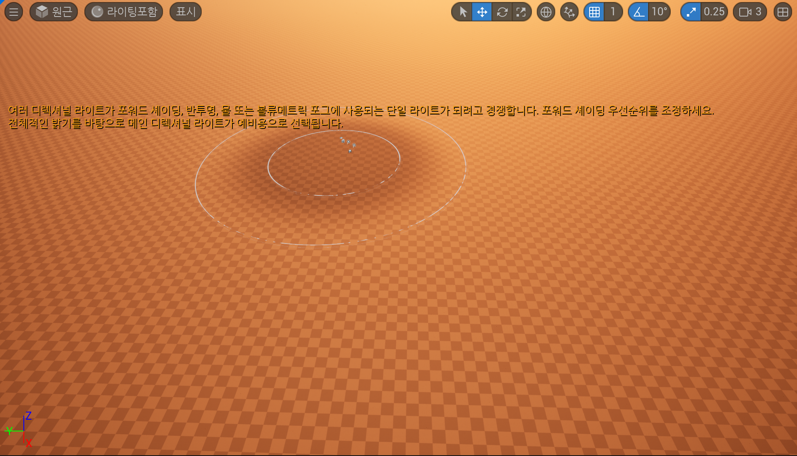
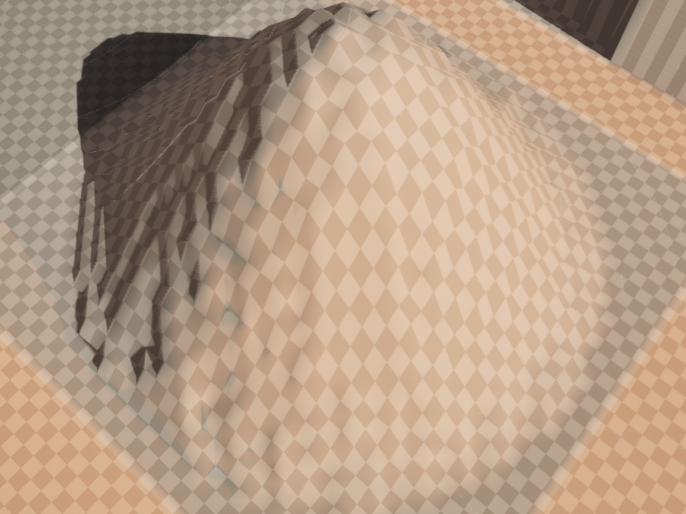
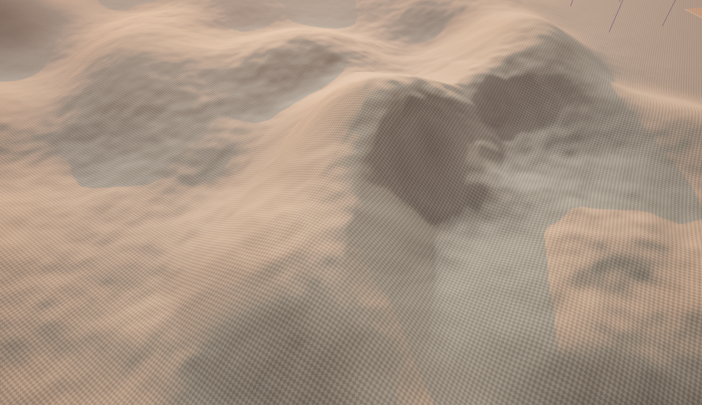

# Landscape

지형을 형성하기

하늘은 만들었지만, 땅이 아직 없다.

선택 모드를 누르고 

랜드스케이프를 클릭해주자.

## 랜드스케이프

녹색을 띠는 것들이 나오는데, 이건 풍경을 만들면 얼마나 커질지 보여준다.

랜드스케이프는 메시이다. 실제로는 그리드에 여러 개의 메시가 배치되어 있고 위와 같이 배치되어 있다.

메시를 형성하고, 조각하고, 울퉁불퉁하게 만들고, 구불구불한 언덕을 만들 수 있다. ( = 원하는 모양을 만들 수 있다)

오픈 월드 수준으로 넓기에, 얼마나 크게 만들 수 있는지 확인해보고싶어졌다.

생성을 눌러보기전에, 더 크게 만들어보자. 그러기 위해선 컴포넌트 수를 조절 해줘야 한다. (이는 X 및 Y 방향의 구성 요소 수를 나타냄)

잘 보면 사각형이 보이는데 이게 개별 컴포넌트를 의미한다. 

이 사각형을 위에서 보면 8x8이 있다는 것을 알 수 있다.

나는 32x32로 만들 것이다.

바닥이 생겼고, 이제는 모드에 집중해보자.

## 스컬프팅

랜드스케이프를 조각할 수 있다는 뜻이다.

### 원형 브러시

내부반경와 외부반경을 가진 큰원과 작은원의 브러시 형태이다.

툴 강도를 낮출수록 섬세해져서 낮은 언덕을 더 쉽게 만들 수 있다.

세팅에서 감쇠를 내릴수록 가장자리가 단단한 형태를 유지한다. (0)

감쇠가 0보다 클 수록 내부 반경이 커지고 가장자리가 더 뭉뚱해진다. (1.0)

### 알파 브러시

둥글게가 아닌 체크무늬가 나타난다.

### 패턴 브러시

이리저리 움직이면 패턴이 나타나는 것을 알 수 있다.

### 전체 랜드스케이프 컴포넌트 브러시

그리드 형태를 올린다.

### 그래도

대부분 주로 둥근 브러시 유형을 사용할 것이다. (언덕이나 산 등에 사용)

### 번외로

Shift키를 누르고 하면 땅을 아래로 밀어 넣을 수 있다.

## 스무드

구불구불한 언덕은 이미 매끄러우므로 별로 효과가 없지만 스무드를 통해 매끄럽게 만들어 줄 수 있다.

스무드 하기 전

스무드 하고 난 후 (자연스러워짐)

## 플래튼

위에서 눌러줘서 펴주는 느낌이다.

플래튼 하기 전

플래튼 하고 난 후

## 용기

경사로를 설정한다. (계단을 만들때 적합하다)

스무드를 준 모습이다.

## 침식

어떤 요소로 인한 침식을 시뮬레이션 해준다.

일종의 모래처럼 보이기 시작한다.

언덕의 꼭대기를 만드는 데 사용될 수 있다.

## 수성 침식

강우로 인한 침식, 일반적인 침식과 유사하다.

## 노이즈

산을 시뮬레이션할 수 있다. 생각보다 끔찍하다.

강도를 낮추면 그나마 산처럼 보이는 것을 얻을 수 있다.

섬세하게 쓰면 괜찮을지도 모르겠다.

--------------

최종 목표는 중앙 주변에 숲이 있고, 그 다음에는 주변에 바위 협곡을 만들어보자.

가장자리에는 거대하고 거대한 고원으로, 멀리 떨어져 잇는 산 크기의 구조물로 올라가게끔.