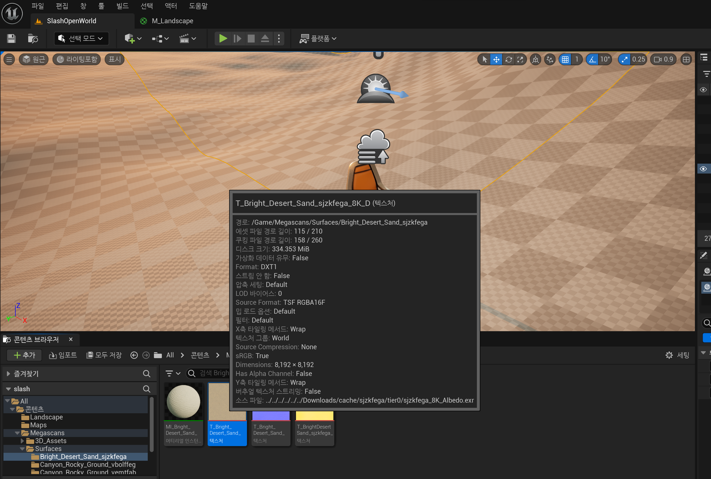
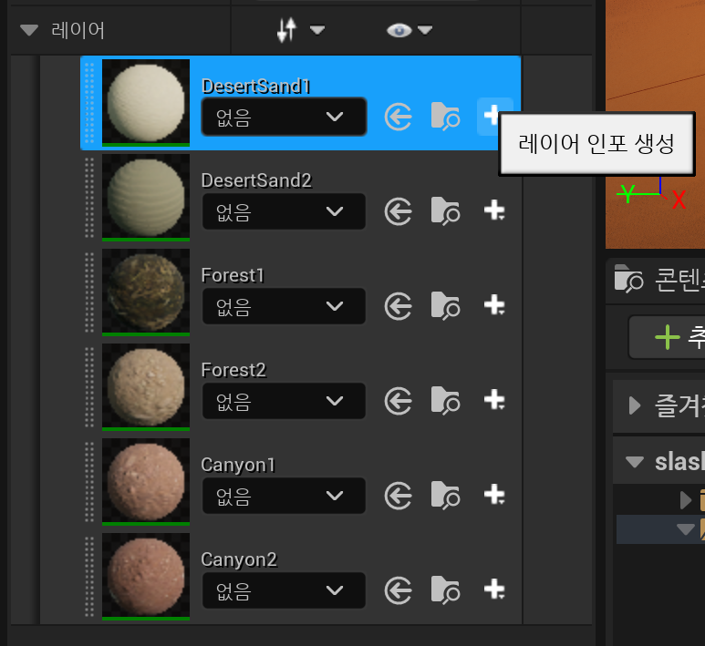

# Landscape Material

환경에 재료 추가

머터리얼을 확인할 수 있다.

더블클릭해서 들어가보자.

머터리얼에는 여러 속성들이 메인 머터리얼 노드로 들어간다.

머터리얼 노드에 의해 구현된 로직을 기반으로 하여 특정 부분을 설정할 수 있다.

## 노멀맵

노멀맵이란 **폴리곤의 법선 벡터(Normal Vector)의 값을 사용하여 로우 폴리곤의 그래픽 환경에서 하이 폴리곤의 입체감 및 질감을 구현하는 기법**

노멀맵의 각 픽셀은 주어진 색상 값이며 해당 색상 값은 방향에 해당한다. 이를 통해 로우 폴리 메시를 가질 수 있다. 그리고 많은 다각형이 하이 폴리 메쉬처럼 보인다.

법선맵 (3차원 컴퓨터 그래픽스에서 튀어나온 곳과 움푹 틀어간 곳의 빛을 왜곡시키는 기법)을 사용하면 표면에서 빛을 반사할 수 있기 때문에 다각형이 더 많은 것처럼 보인다.

Alt 키를 누르고 `RGB`부분을 클릭해서 `Normal`과의 연결을 끊어보자.

`노멀맵이 있을때`

`노멀맵이 없을때`

법선맵이 없어져서 재질이 평평하게 보인다.

노멀맵이 있어야 더욱 3D처럼 보이게 할 수 있다는 것.

## 내 지형에 머터리얼을 적용시켜보자.

Pixel Bridge 클릭 > Surfaces (표면)

출렁거리는 모래 추가

밝은 모래도 추가해주자

숲을 형성하기위해 돌밭 추가

마른 풀을 이끼 위에 올려놓을 예정이므로 추가

바위산을 위한 협곡 바위 추가

추가된걸 확인할 수 있다.

`랜드스케이프` 폴더를 만들기

`M_Landscape`로 이름 지정하기

당장은 `베이스 컬러` `노멀`만 세팅해보자.

광택이 있는지 없는 체크하기 위해 `디테일`에서 러프 검색후 완전러프를 걸어주자.

`랜드스케이프 블렌드`검색 및 추가

디테일 패널에서 

레이어에서 배열을 + 해준후에 `DesertSand1` 라고 이름을 지어줬다. (절대 이름에 공백 & 특수문자를 주지말자 나중에 문제가 생김)

이제 블랜드 타입을 정할건데

3가지가 존재하는데 나는 Weight Blend를 사용할 것이다. (이를 통해 이 머티리얼 레이어를 다른 레리어와 블렌딩할 수 있게 된다.)

이제 6가지 (숲을 위한 2, 사막을 위한 2, 바위산을 위한 2) 머티리얼 받은걸로 각각 레이어를 추가할 것이다.

머티리얼 텍스처를 끌어다가 가져오기

다이렉트로 베이스 컬러로 주면 만들 수야 있겠지만 레이어를 사용해서 할 것이다.

이제는 레이어를 거쳐서 서로 다른 레이어 사이를 전환하는 방법을 찾으면 된다. 

이는 다양한 텍스처 샘플 간에 쉽게 전환할 수 있으므로 좋다.

각각 머티리얼 매치시켜서 연결해주고, 같은 방법으로 노멀맵도 매치시켜주자

이제는 아웃라이너에서 랜드스케이프를 지정후

지정 후에 `랜드스케이프 모드`로 진입해주고 `페인트`를 누르면

레이어에 지정해둔 머터리얼들을 볼 수 있다.

이걸 눌러서 그림을 그리고 싶겠지만, 하나만 선택하고 바로 그려지지는 않는다.

`+`를 눌러준다.

가중치 혼합 레이어와 가중치가 없는 혼합 레이어를 선택할 수 있다.

`웨이트 블렌딩된 레이어` -> 한 레이어를 다른 레이어 위에 칠할 때 서로 혼합 된다.

`웨이트 블렌딩되지 않은 레이어` -> 서로 혼합되지 않는다.

웨이트 블렌딩된 레이어는 흙 레이어 위에 눈 레이어를 혼합시켜 쌓게 만들 수 있지만

웨이트 블렌딩되지 않은 레이어는 흙 레이어 위에 눈 레이어를 혼합시킬 수 없어 쌓이게 할 수 없다.

새로운 랜드스케이프 레이어 정보 개체를 생성해보자. (일반적으로 웨이트 블렌딩 레이어를 사용함)

나머지들도 다 `+`해주자

여기까지 했으면 이제는 페인팅 작업이 가능해진다..!

