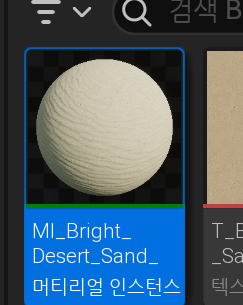
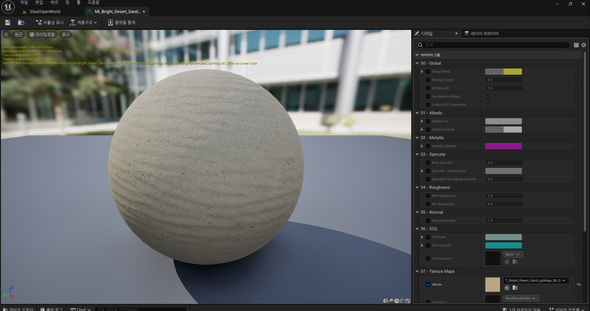
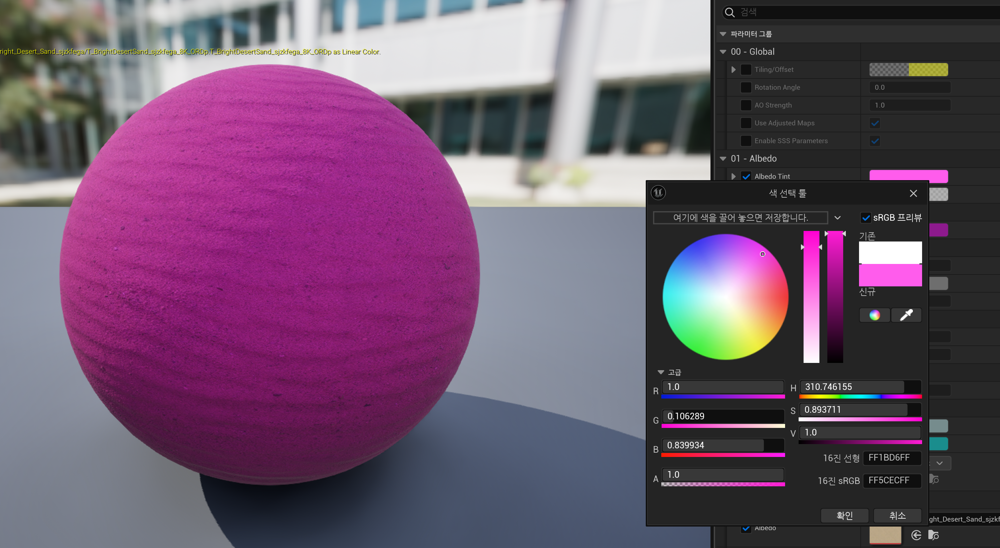
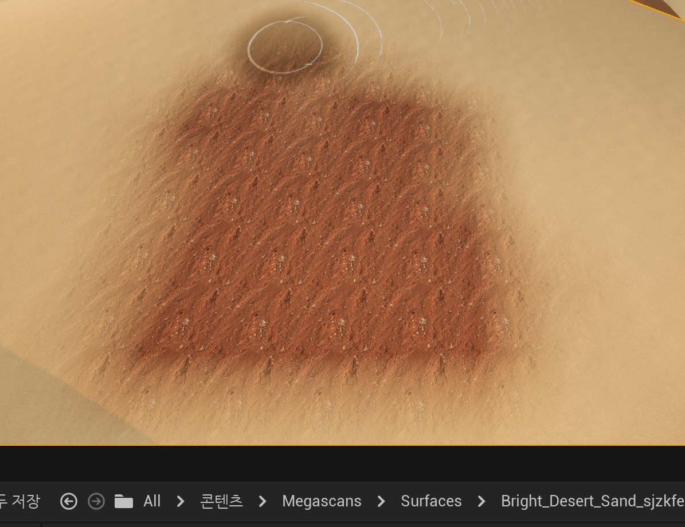
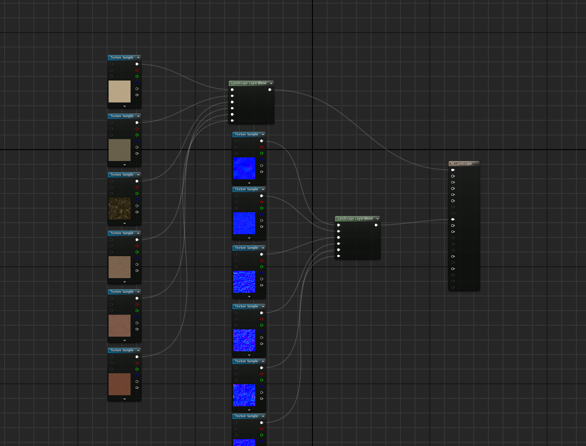
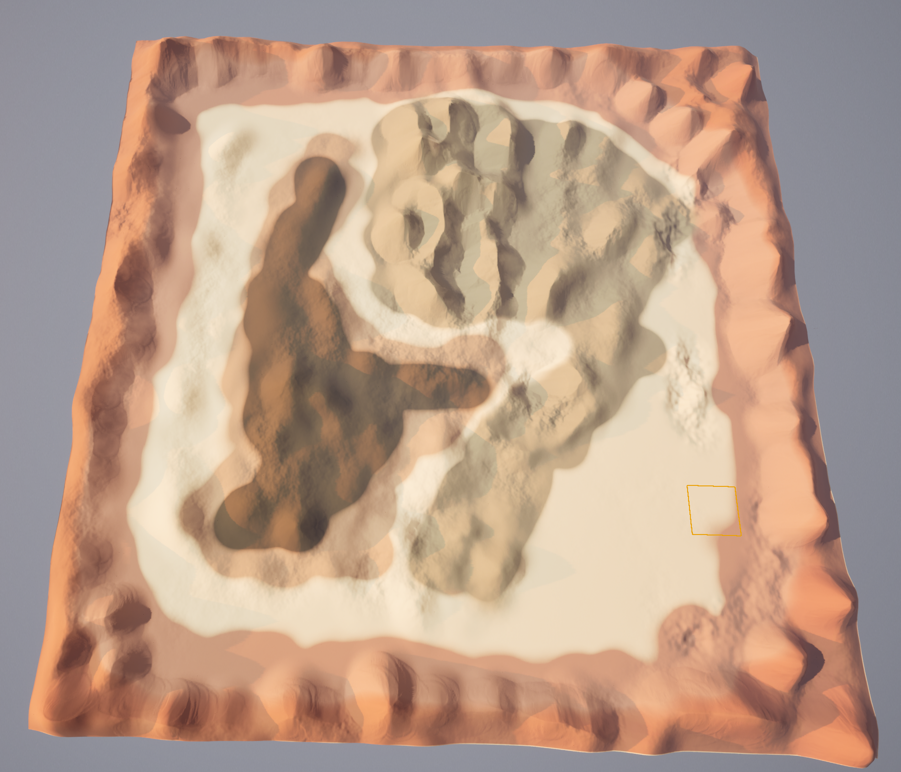

# Landscape Painting

머터리얼 레이어로 페인팅하기

더블클릭으로 진입하자.

머터리얼 인스턴스이므로, 매개변수를 변경할 수 있다는 것을 알 수 있다.

`알베도` 옵션으로 이런식으로 색을 바꿀 수 있다.****

바위산을 만들때 어떤식으로 될지 페인팅하는 와중에 패턴이 너무 일정한게 걸렸다. 

Quixel Bridge에 가서 다른 재료를 구해오자. (반복적인 질감이 없는 바위)

바꿔준다.

이전꺼는 지워주고 노멀맵과 텍스쳐를 바꿔주면 된다.

바위지역, 숲지역, 모래지역을 천천히 그려나가자.

도구 강도를 낮추고 브러싱하면 보기 좋게 레이어끼리 혼합 시킬수 있다.