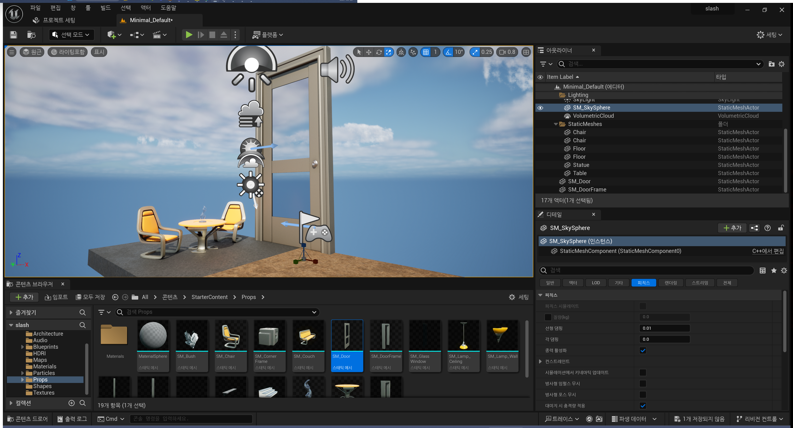

# Challenge_01

0~3 Section Challenge

1. 시작 콘텐츠 (Start Content) 를 열고 메시로 이동하여 몇 가지 소품을 레벨로 가져오기
2. 해당 개체를 조정해보기
   - 방향, 회전, 크기
   - 복제 및 이동
   - 스냅 키기 / 끄기
3. 카메라를 보기 좋은 위치에 두고 북마크를 추가하고 작동하기
4. 북마크가 됐다면 게임 뷰 (G) 및 몰입형 모드 (F11) 진입하기
5. 게임 뷰로 들어가면 고해상도 스크린샷을 찍어보기

## 1번

문이랑 문틀

## 2번

### 방향 및 회전

### 크기 및 스냅

## 3번 + 4번 + 5번

 1번 북마크 고해상도 스크린샷

2번 북마크 고해상도 스크린샷

3번 북마크 고해상도 스크린샷

4번 북마크 고해상도 스크린샷

## 배운점

- 레벨 에디터 뷰포트에 대하여 
- 뷰포트를 변경 시 월드를 조작하는 방법 
- 뷰포트에서 모드를 보고 뷰포트에서 개체를 조작하는 법
- 레벨 편집기의 일부 패널과 이를 수정하며 사용하는 법

