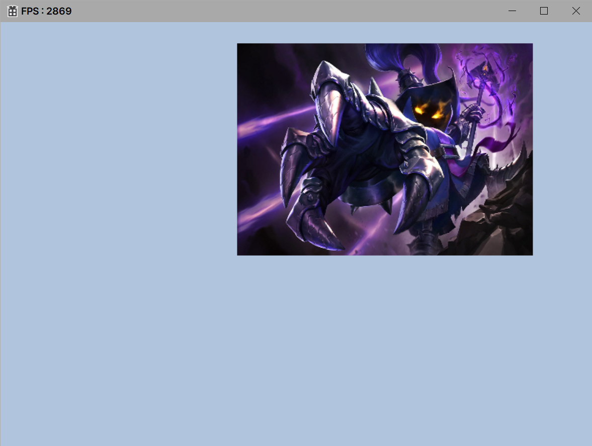

# Material

유니티 Material 탭 처럼 자체엔진은 코드로 컨트롤하게 작성

## Material

머티리얼(Material)은 그래픽스에서 표면의 외관, 색상, 반사, 광택 등을 정의하는 데 사용되는 속성들의 집합이다. 머티리얼은 3D 모델의 시각적인 특성을 결정하며, 그림자, 조명, 환경 매핑 등과 같은 다양한 시각적 효과를 구현하는 데 중요한 역할을 한다.

## Material 주요 속성

1. **알베도(Albedo) 또는 베이스 컬러(Base Color)**:
   - 표면의 기본 색상을 나타낸다. 알베도 맵을 사용하여 특정 지점에서의 색상을 지정할 수 있다.
2. **금속도(Metallic) 및 광택(Reflectance) 속성**:
   - 금속성 머티리얼은 금속적인 특성을 가지며, 광택은 표면의 반사 정도를 나타낸다. 금속성 머티리얼은 주로 금속 물체의 외형을 시뮬레이션하는 데 사용된다.
3. **조명 모델(Lighting Model) 및 반사 모델(Reflection Model)**:
   - 조명 모델은 빛의 효과를 모사하기 위한 것으로, 표면의 입사광, 투과광 등을 정의한다. 반사 모델은 표면에서의 빛 반사를 설명하며, 플레이 단말 모델(Phong Shading), 블링-포ン(Blinn-Phong) 모델 등이 사용된다.
4. **노멀 맵(Normal Map) 및 디스플레이스먼트 맵(Displacement Map)**:
   - 노멀 맵은 표면의 디테일한 높낮이를 정의하며, 디스플레이스먼트 맵은 표면을 변형하여 입체적인 효과를 내기 위해 사용된다.
5. **로퍼니스(Roughness) 또는 스펙큘러(Specular) 속성**:
   - 로퍼니스는 표면의 거칠기를 나타내며, 스펙큘러는 표면에서의 광택을 나타낸다. 로퍼니스 맵이나 스펙큘러 맵을 사용하여 지역별로 조절할 수 있다.
6. **투명도(Opacity) 및 알파 맵(Alpha Map)**:
   - 투명도는 표면의 투명도를 나타내며, 알파 맵은 특정 지점에서의 투명도를 지정할 수 있다.

이러한 머티리얼 속성들을 정의하고 적용함으로써 3D 모델의 시각적인 외관을 결정하게 된다. 다양한 머티리얼 속성을 결합하여 사용하면 더욱 현실적이고 다양한 시각적 효과를 얻을 수 있다. 머티리얼은 주로 쉐이더 프로그래밍을 통해 정의되고 적용되며, 다양한 3D 그래픽스 엔진 및 프레임워크에서 사용자가 머티리얼을 조작할 수 있는 API를 제공한다.

