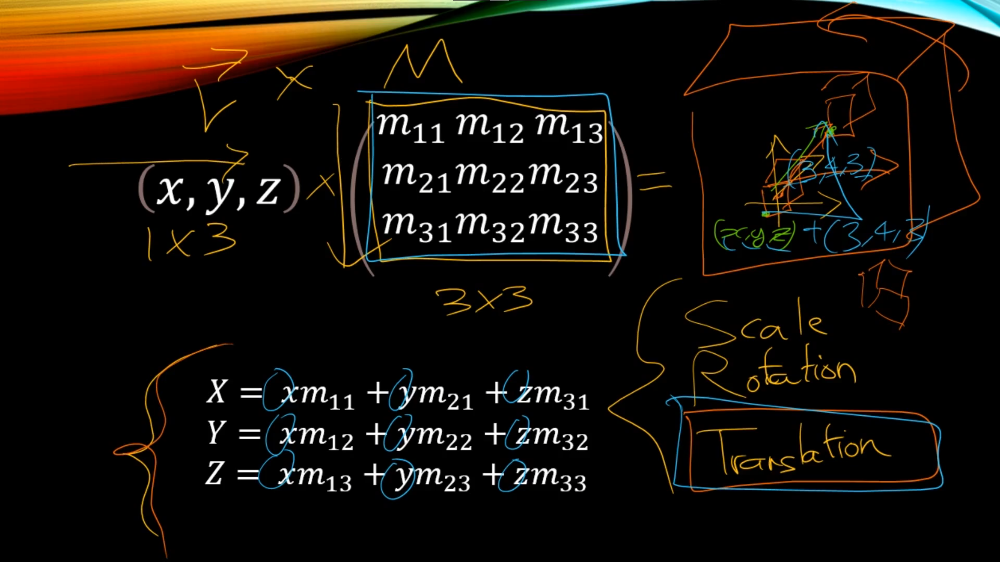
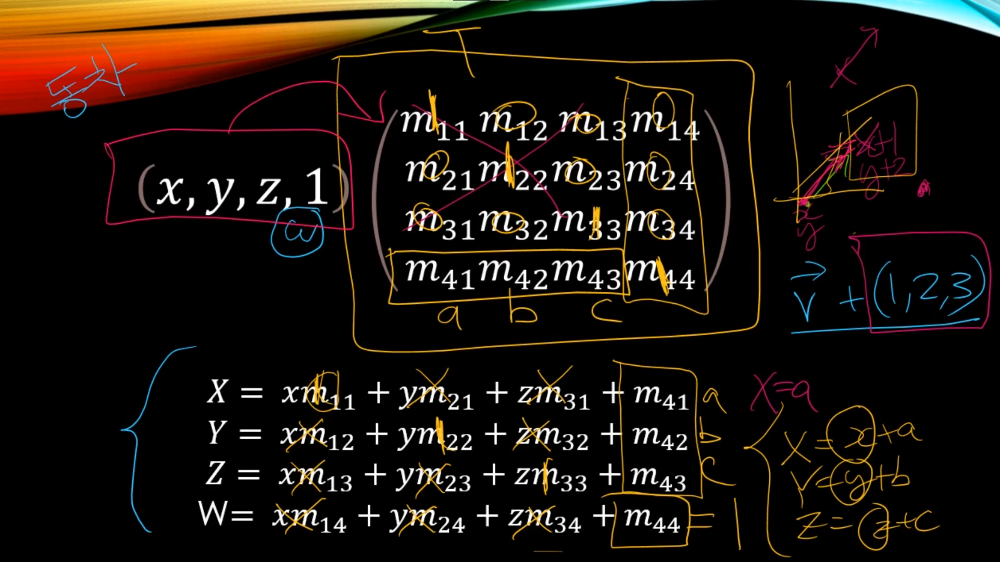
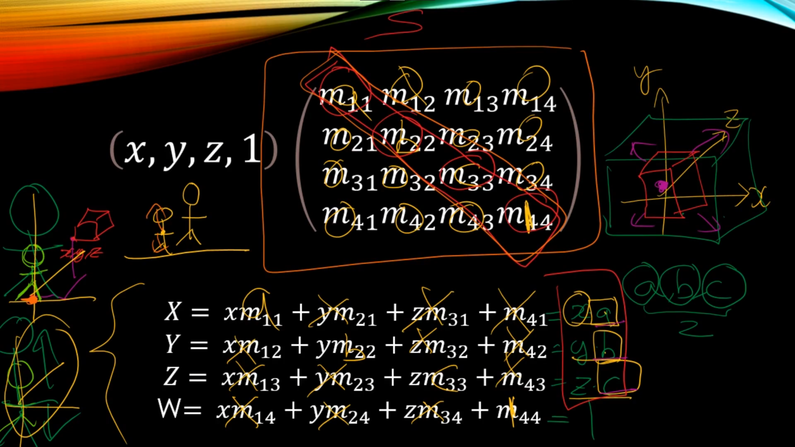
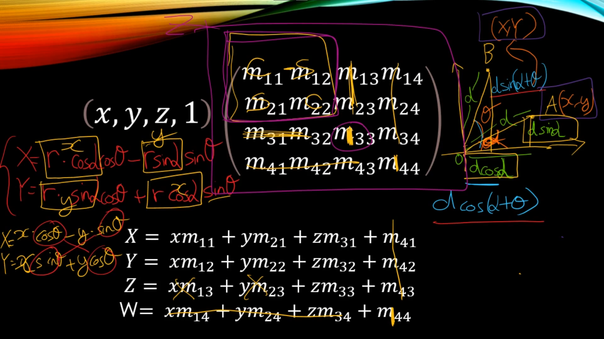
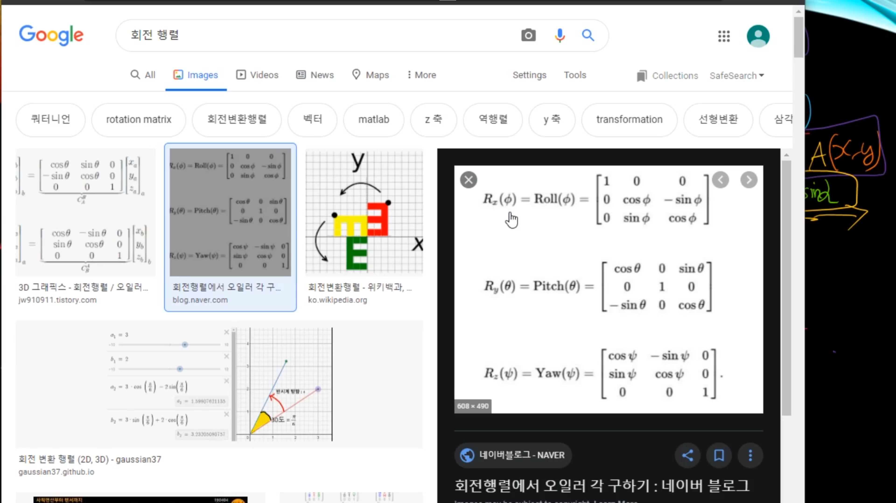
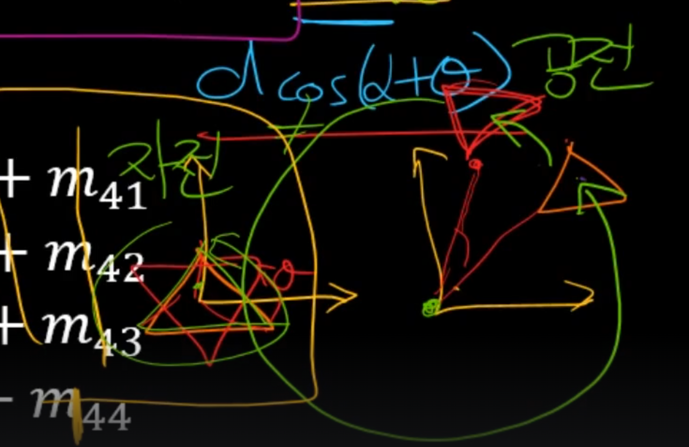
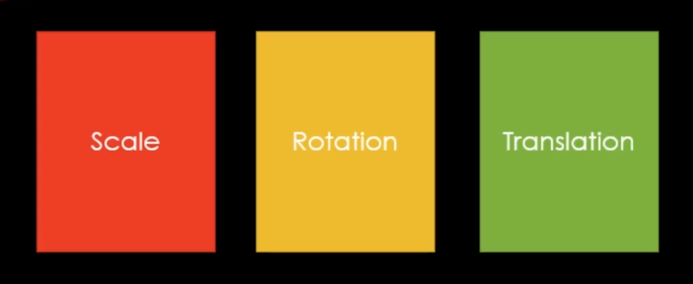

# Scale,Rotation, Translation 변환 행렬

## 벡터와 행렬의 곱

## Translation (이동) , 그리고 동차 좌표계

## Scale (크기 배율)

## Rotation (회전)

 ### Z 축 회전 기준

### x,y,z 회전 기준은 아래와 같다

### 자전, 공전

게임은 대부분 자전을 기준으로 만들어진다.

### S R T 라고 외우고, 결합법칙은 성립하지만, 교환법칙은 안된다는걸 잊지말자.

순서는 항상 Scale -> Rotation -> Translation

Scale이 빠지고 Rotation -> Translation 둘로도 작동은 가능하다. 다만 순서는 꼭 지켜야한다는 것을 의미한다.

SRT를 하나로 만들어서 매쉬에 적용하게 될것임.

# 그 이유가 정말 중요하다.

이 순서를 꼭 지켜야 하는 이유는 각각의 변환 연산이 다른 순서로 적용될 때 결과가 달라질 수 있기 때문이다.

1. **순서에 따른 영향**
   - Scale -> Rotate -> Translate : 먼저 크기를 조절한 후에 회전을 적용하고 마지막에 이동을 적용해야한다. 이 순서를 따를 경우, 이동은 회전된 크기에 대해 발생하게 된다.

2. **결과의 상이성**
   - 순서를 변경하면 결과적으로 물체의 최종 변환 상태가 달라진다. 특히 회전 후에 크기를 조절할 때와 크기를 조절한 후에 회전할 때의 결과가 서로 다를 수 있다.

3. **회전 중심의 영향**
   - 회전의 중심은 이동된 좌표계에 대해 정의된다. 따라서 이동을 먼저 수행하면 회전 중심이 변경된다.

4. **행렬 곱셈의 결합 법칙**
   - 변환 행렬을 사용하여 여러 변환을 조합할 때, 행렬의 결합 순서에 주의해야 한다. 행렬 곱셈은 순서가 중요하며, 각 변환을 행렬로 표현한 뒤 이들을 곱해 최종 변환 행렬을 얻게 되는것이다.