# Lighting

# Directional Light

태양과 같다.

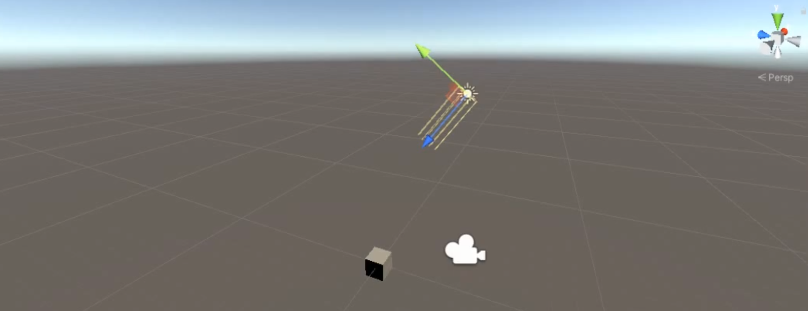

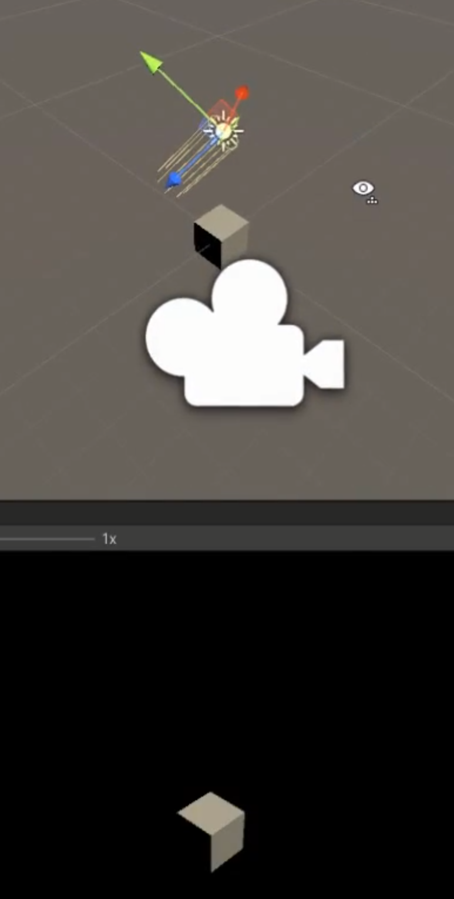

## Point Light 

횃불과도 비슷하다.

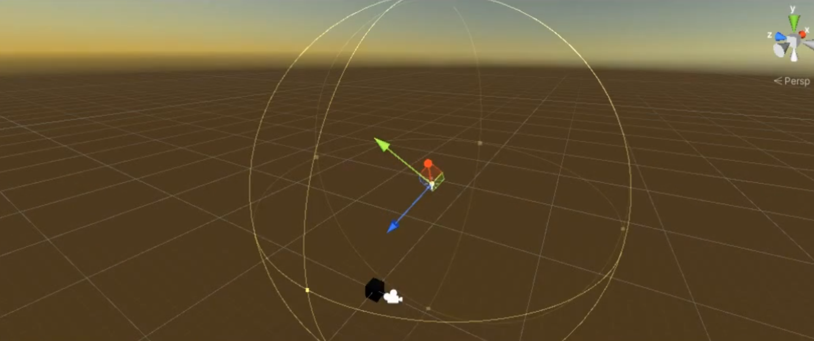

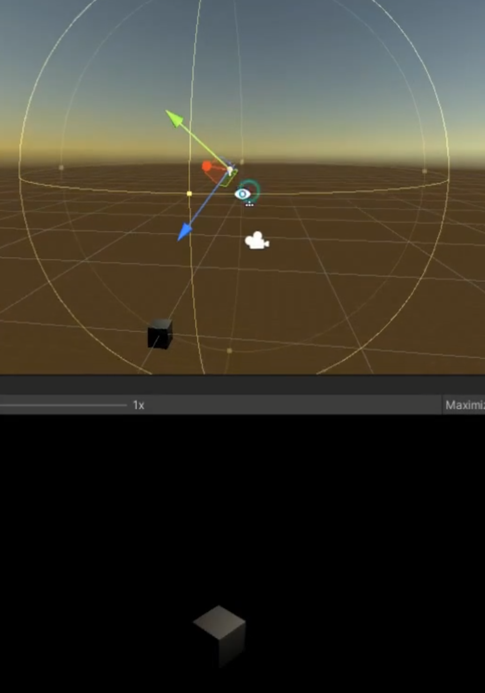

## Spot Light

손전등이라고 생각하면 좋다.

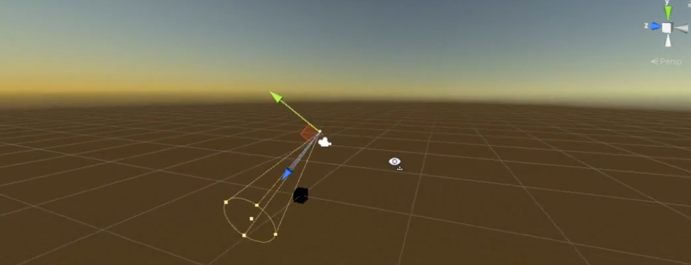

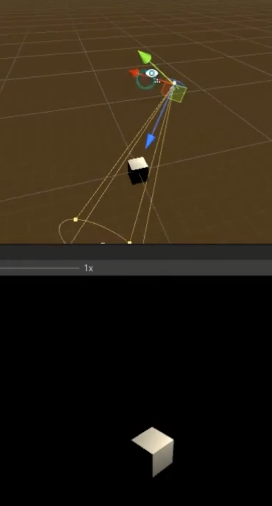

## Diffuse (디퓨즈) - 난반사광

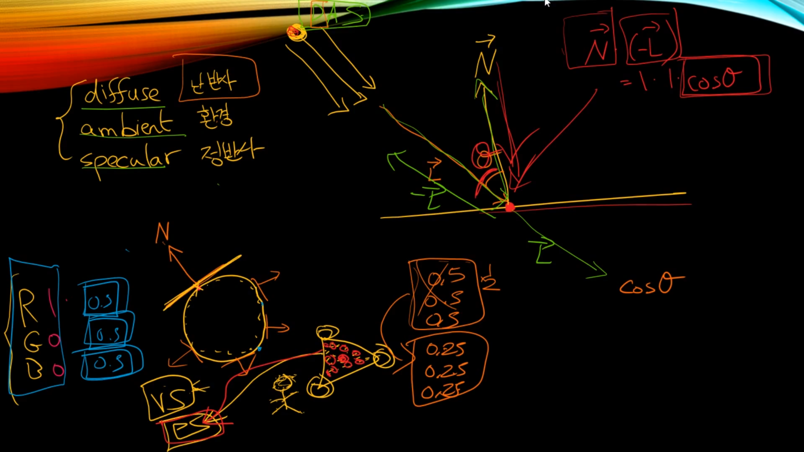

## Ambient (앰비언트) - 환경광

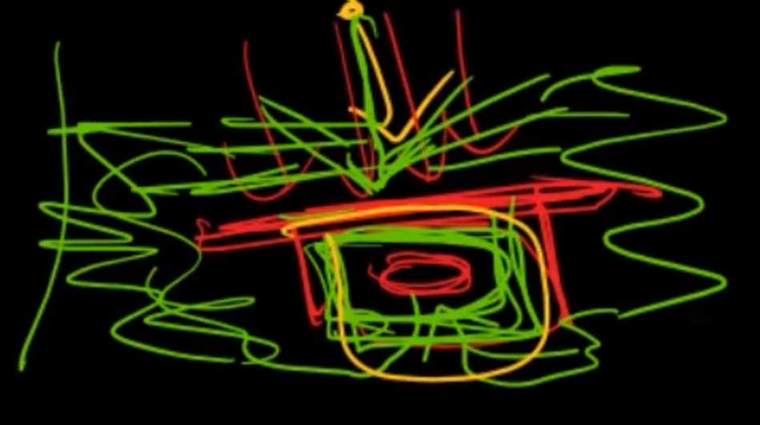

## Specular (스페큘러) - 정반사광

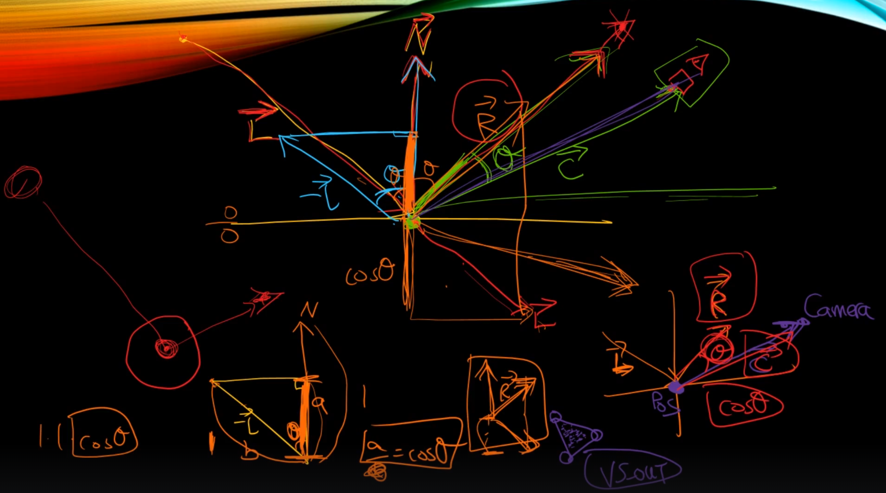

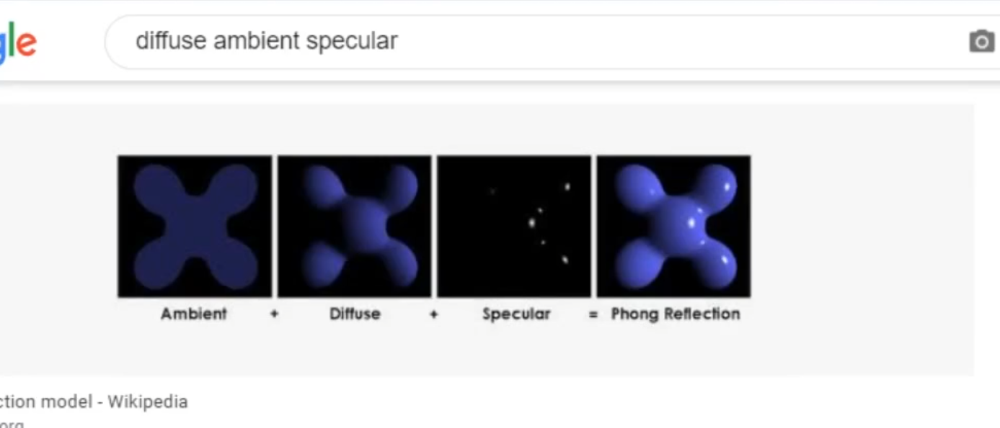

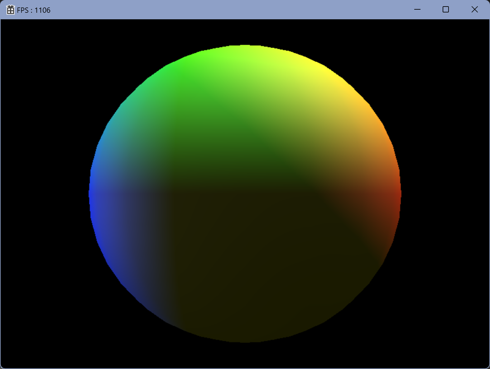
