# Normal Mapping (Bump Mapping)

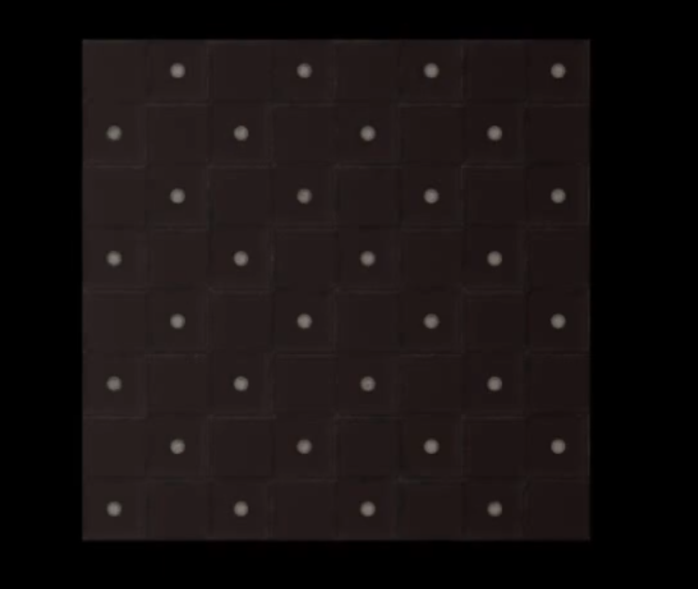

밋밋하다.

정점개수를 늘리면 밋밋한 맛을 없앨 수 있지만, 그런식으로 쭉 다른 텍스쳐에도 똑같이 작업을하면 연산이 너무나도 많아지는 나비효과로 인해 프로그램이 실행되는 속도가 현저히 떨어지게 된다. 

정점을 늘린다는건 그만큼 연산이 기하급수적으로 늘어나게 된다는것이다.

이때 필요한게 바로 `Normal Mapping`

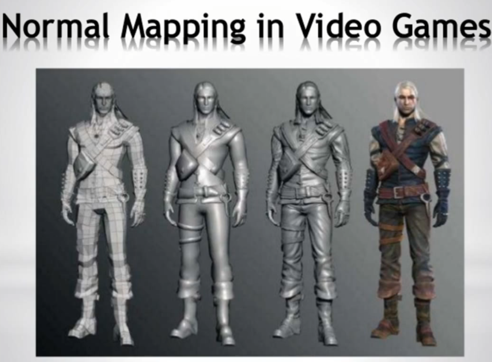

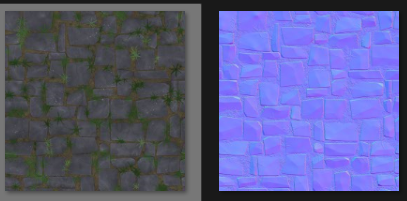

왼쪽은 텍스쳐 매핑, 오른쪽은 노멀매핑이다.

별도의 이미지 파일 (Normal Map)을 만들어가지고 UV 좌표에 해당하는 각각 픽셀에다가 Normal 정보를 전달해준다.

이렇게 하면 정점을 늘리지않고 Normal Vector의 값만 따로 주는것이 된다.

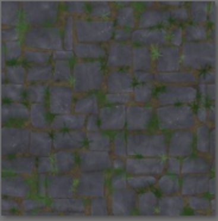

얘를 입힐때 쓰는 코드들을 보자.

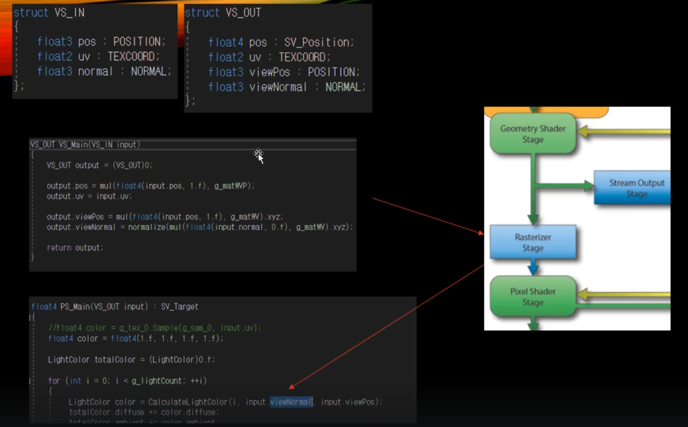

## 근데 Normal Texture 는 왜 다 파란색을 띄고 있을까?

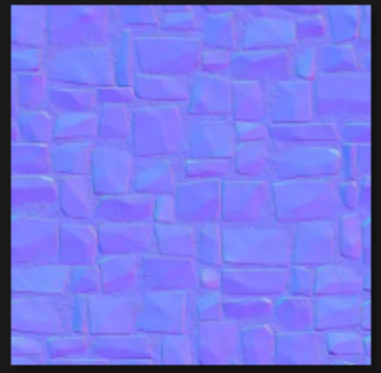

이미지 파일이고 기본적으로 포맷자체가 RGB (Red Green Blue)로 이루어져있다.

x y z 중에서 z가 항상 켜져있는 상태라고 보면 된다.

Normal Texture는 Object 기준의 local 좌표계를 사용하지 않는다.

나중에 Texture에 Animation을 적용해주게 되면 Mesh 자체가 일관적으로 유지가 되는게 아니라 local 기준으로 계속 변하게 된다.

그때 처음에 세팅한 Normal 방향이 틀리게 될 수 있으니 별도의 좌표계를 가지고있다.

## 그건 바로 Tangent Space (접선 공간)이다.

Texture 위에서의 좌표계. 

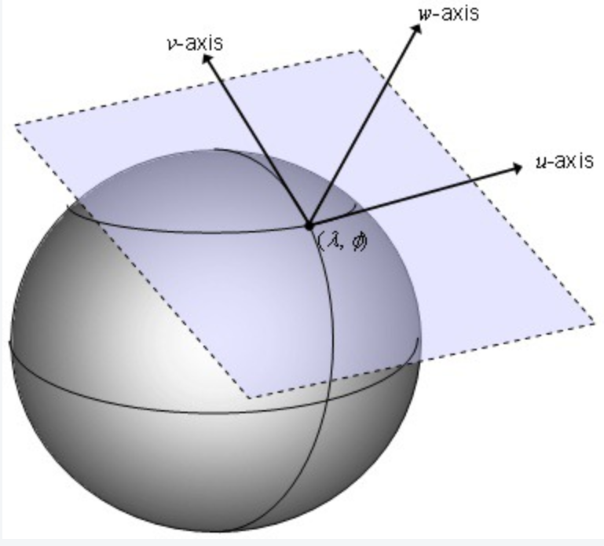

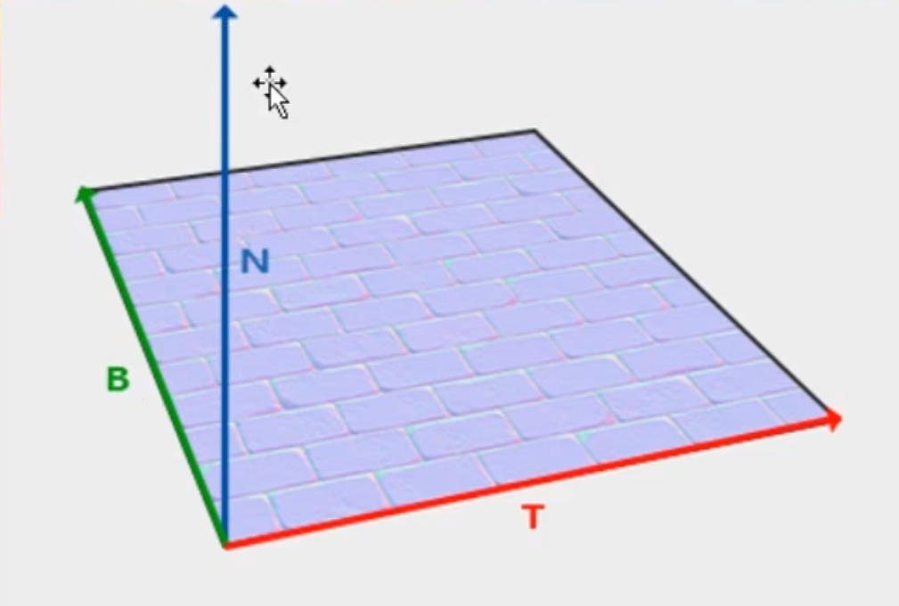

순서는 XYZ 로 TBN이다.

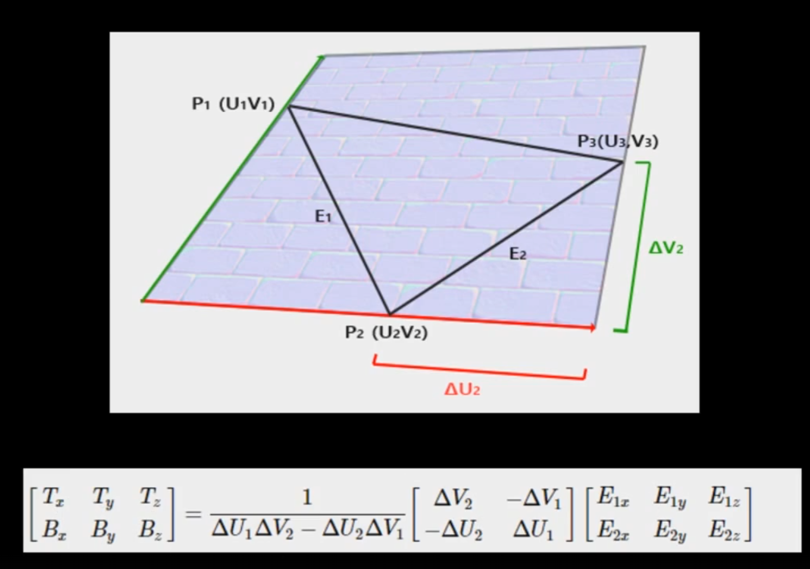

T와 B를 구하는 공식이다. (몰라도 됨)

## Tangent Space -> View Space 

코드를 View Space 기준으로 작성해놓았기에 Tangent Space를 view Space로 좌표변환이 필요하다.

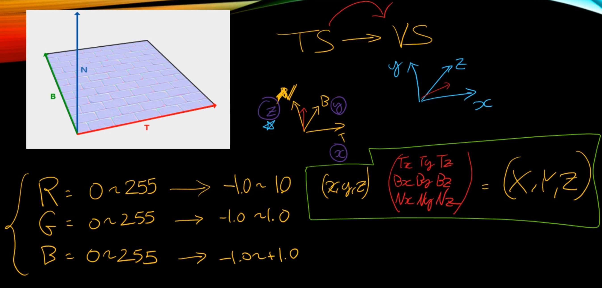

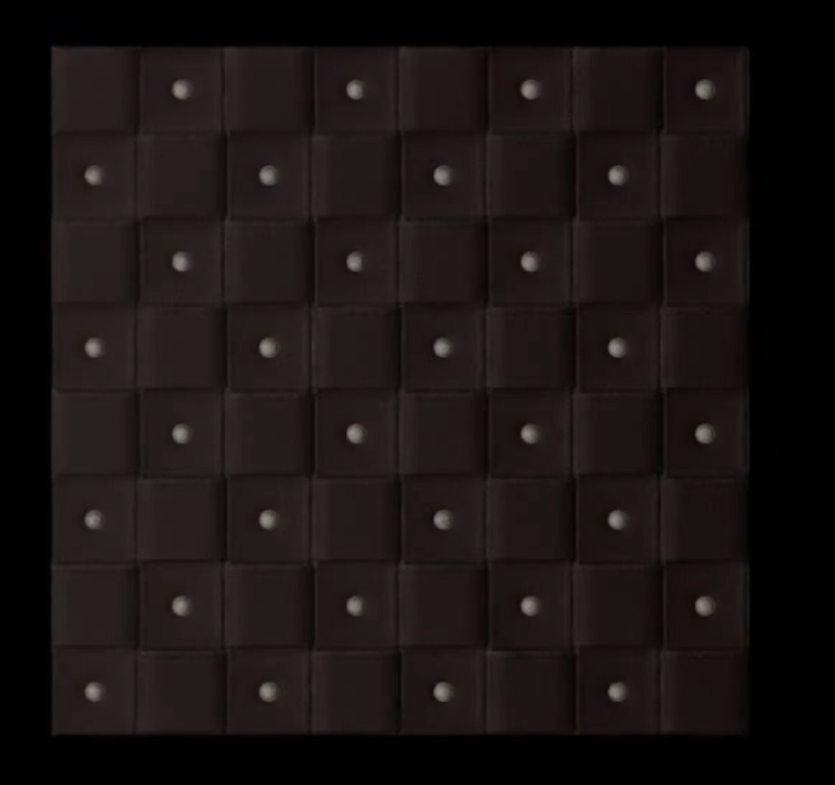