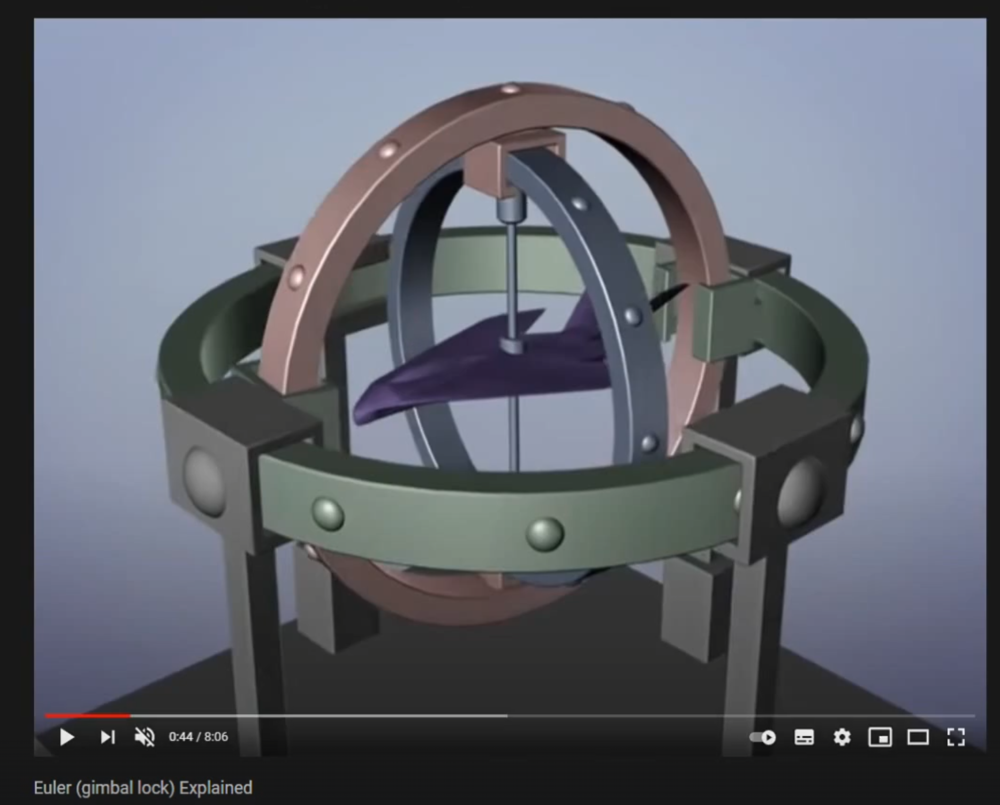
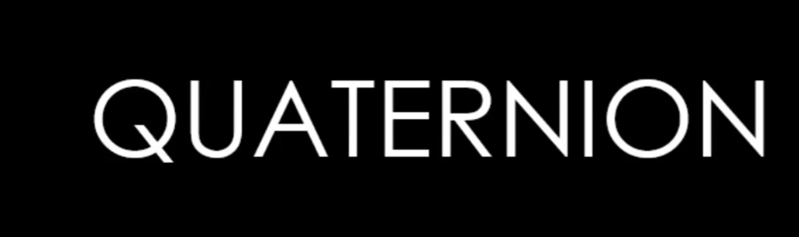
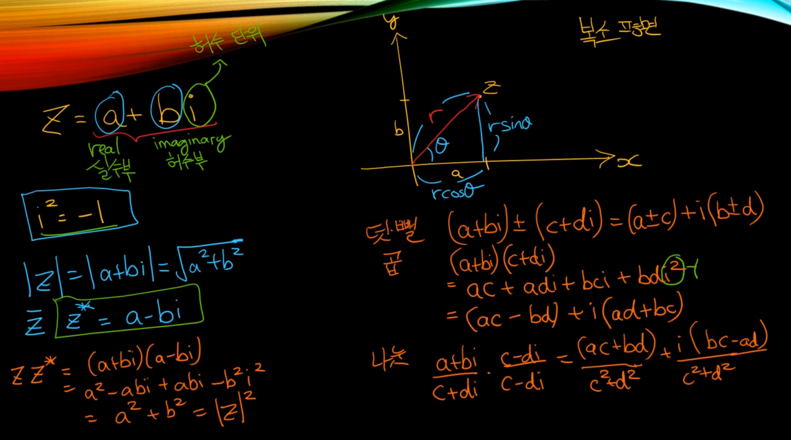
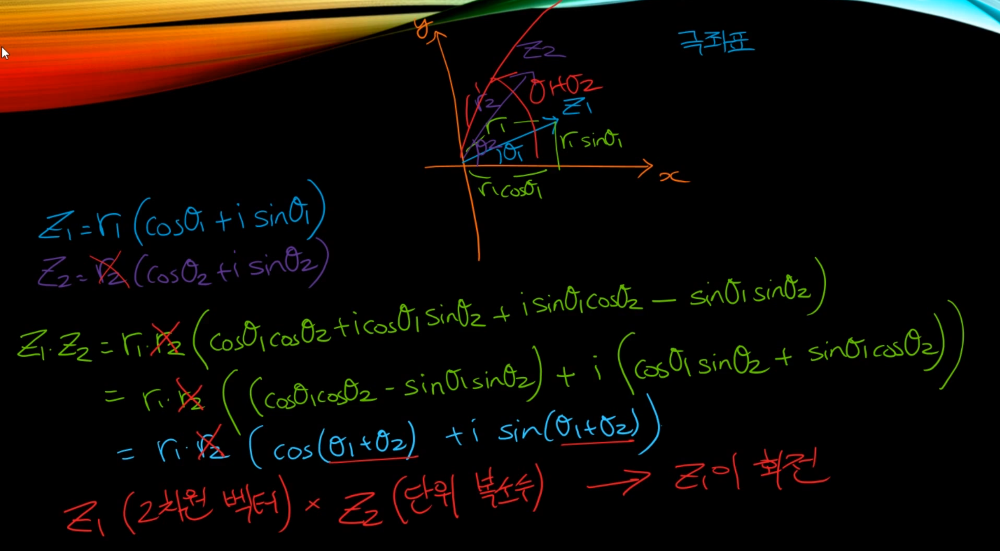
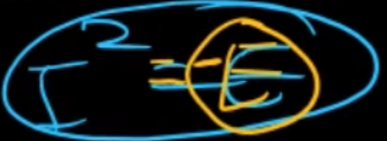
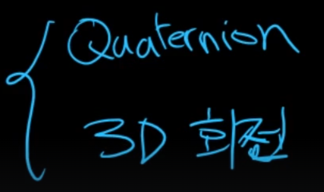
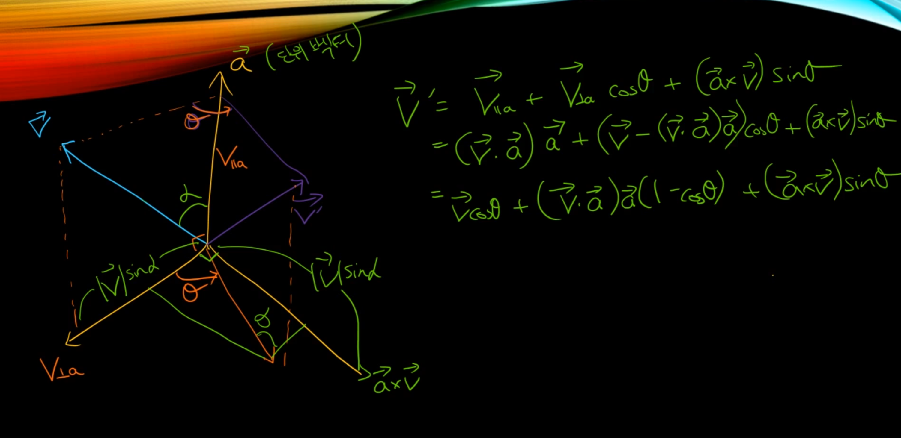
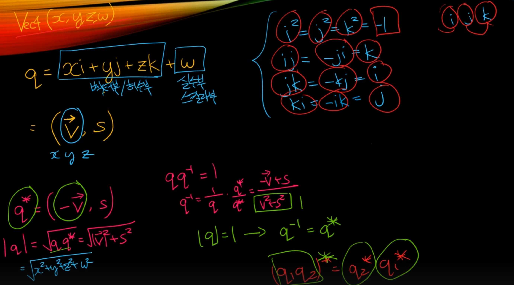

# Quaternion (사원수)

## 짐벌럭

먼저 최외각에 있는 초록색 고리가 먼저 돌아야되고, 나머지는 그 영향을 받아 같이 회전이 된다. (초록색 -> 갈색 -> 회색 = X -> Y -> Z)

## 복소수에 대해 먼저 알고가자.

행렬로도 표현이 가능

결론은 복소수를 이용해서 2D 회전을 표현할 수 있다.

그러면 3D 회전은 어떻게 표현해야할까? -> 2D 회전은 `a + bi`로 해결이 되서 3D 회전은 `a + bi + cj`로 해결하면 되는거 아닐까 하고 생각이 들 수 있지만 아쉽게도 그건 아니였다. 19세기 말에 해밍턴이 결국 해답을 찾았는데 그건 바로 `a + bi + cj + dk` 로 표현하면 3D 회전을 표현할 수 있다는 것을 알아냈다.

즉 숫자 4개를 활용한다. (실수 1개 + 허수 3개)

## 일반적인 회전 공식

## 쿼터니언 공식

## 쿼터니언 곱

## 벡터 삼중곱

## 쿼터니언이랑 벡터랑 무슨 연관일까

## 쿼터니언을 활용하게 된다면

많은 장점이 있지만, 예를 들어 짐벌럭 현상도 없을 수 있을 뿐더러, 실질적으로 쿼터니언으로 연산을 하면 행렬을 이용해 가지고 연산한 것보다도 속도가 빨라진다.

그리고 당연한 얘기지만, 행렬 같은 경우에는 3x3 이거나 아니면 4x4를 이용하게 되면 float이 16개가 필요한 반면에 쿼터니언 같은 경우에는 float가 4개만 필요하니까 메모리 측면에서도 아주 조금이나마 이득이 있다.

## 그러면 장점이 이렇게 많은데, 행렬을 놓아줘도 되는가?

결론적으로는 놓아주면 안된다.

쉐이더 코드로 넘겨준다거나 할 때는 다시 쿼터니언에서 행렬 상태로 변환해야된다.

## 행렬과 쿼터니언 사이의 변환

이거는 쿼터니언을 아는 상태에서 행렬을 뱉어주는 경우

## 반대로 행렬을 아는 상태에서 쿼터니언을 만들어주고 싶은 상황에는?

행렬 공식에서 패턴을 찾아가지고 x,y,z,w를 찾는 것, 오차를 최대한 줄이기 위해 가장 안전한 쪽으로 x,y,z,w 중에서 가장 큰 L을 먼저 찾은 다음 그 L을 기반으로 나눗셈이 되게끔 유도를 해줘 가지고 나머지 공식을 구한다고 보면 된다.

## 쿼터니언은

어려운 개념은 아니고 그냥 사차원으로 뭔가를 만들어 준 다음에 이리저리 식을 이용해가지고 어떤 벡터에다가 양옆으로 샌드위치 프로덕트를 이용해 가지고 곱해준다.

그게 회전이 되는거고, 쿼터니언에서 행렬 그리고 행렬에서 쿼터니언 얼마든지 변환할 수 있다는 것.

