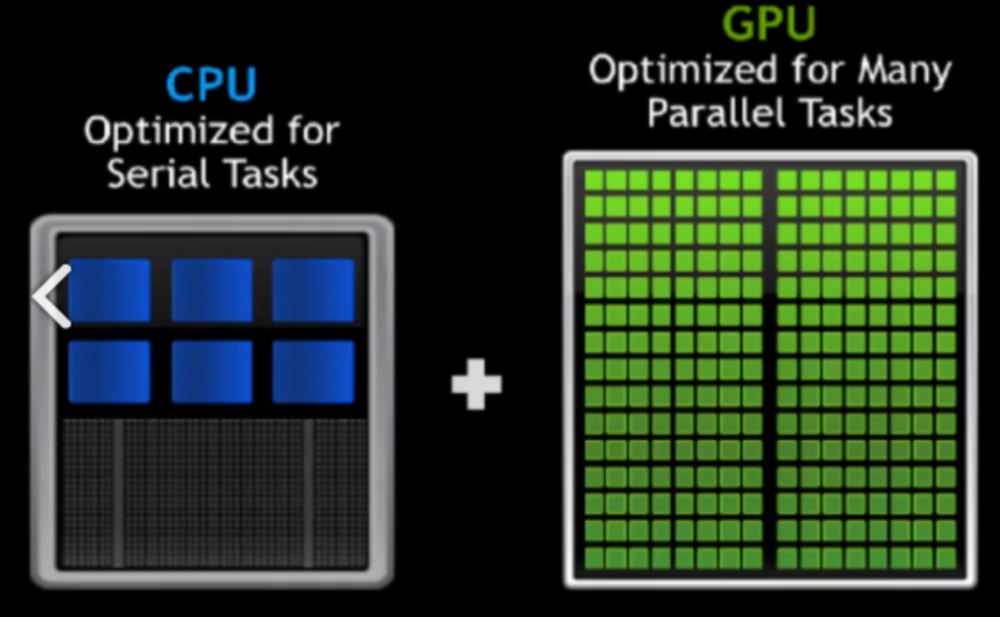
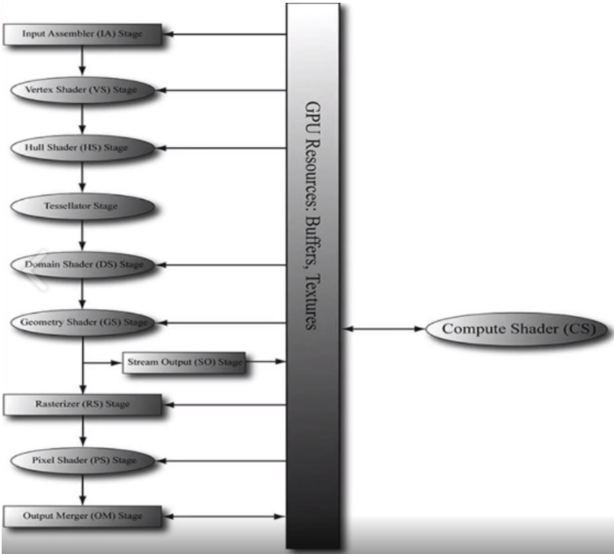
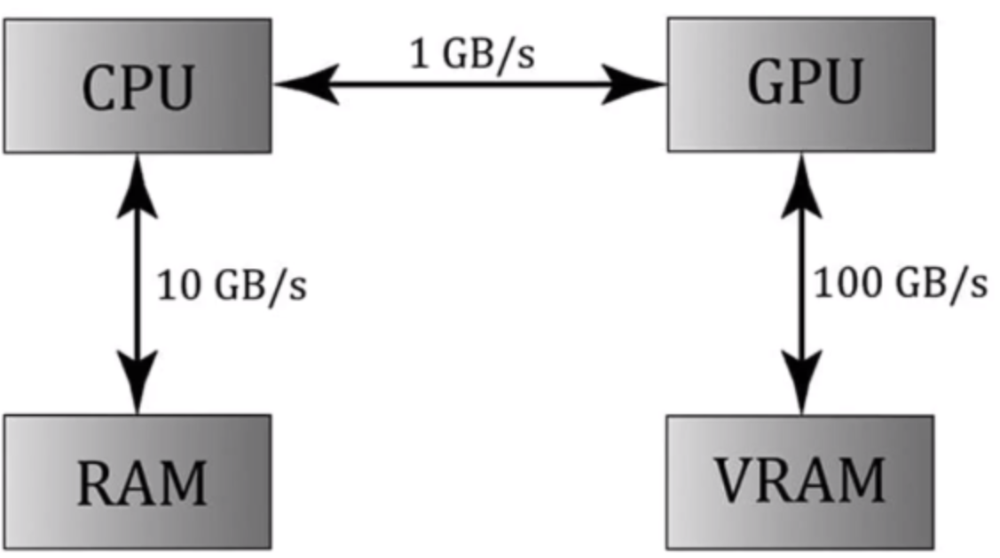
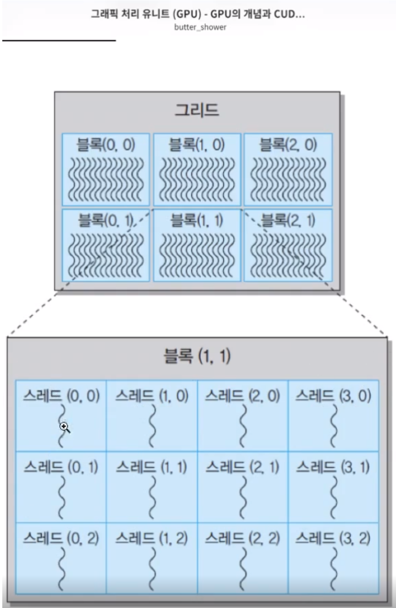
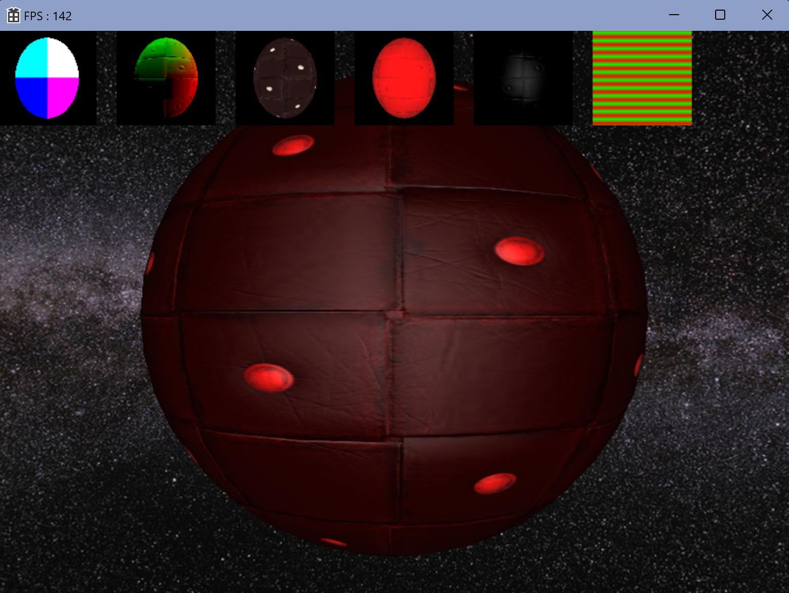

# Compute Shader

DirectX를 사용한다는 것은 GPU한테 렌더링과 관련된 부분을 외주시키는 개념이다.

렌더링 파이프라인을 이용해 다양한 물체를 띄웠었다.

CPU와 GPU의 가장 큰 차이는 코어의 수인데, 인간으로 치면 두뇌에 해당하는 ALU 부분이 CPU는 많지 않은 반면에 GPU는 몇 천개까지 있을 정도로 어마어마하게 생성되어있다.

말 그대로 GPU는 단순한 계산에 최적화되어 있는 아이라고 볼 수 있다.

근데 CORE 자체 하나의 성능만 놓도 따지면 CPU가 더 뛰어나다고 볼 수 있다.

CPU의 코어는 일당백이 가능한 뛰어난 아이지만, 범용적으로 사용하기엔 자체의 개수가 많지 않다는 점이고, GPU는 성능이 떨어지지만 개수로 밀어붙이는 아이라고 보면 된다.

지금 다룰 `Compute Shader`란게, GPU한테 범용적인 일을 떠맡기는 작업을 하는 것이다. 이걸 `GPGPU (General Purpose GPU)`라고 한다.

'GPU의 범용 연산', CPU가 맡았던 연산을 GPU에도 사용해서 연산 속도를 향상시키는 기술이다. 

CPU는 운영체제 등 항상 실행할 일이 많지만, GPU를 게임 자체에만 사용하면 놀고있는 인력이 많기 때문에 `Compute Shader`가 생겨났다.

가장 유용하게 활용될 경우는 일감이 굉장히 많은데, 그 일감들이 서로 병렬처리가 가능할 때, GPU가 처리할 수 있는 경우이다.

서로 병렬처리가 될 수 있다는 건 어떤 뜻이냐면, 예를 들어 어떤 일감을 최종 연산해서 결과물에 또 다음 작업을 하고, 또 연산한 다음 결과물에 다음 작업을 하고, 이렇게 기존에 연산했던 결과물에 계속 연산을 하는 상태라고 하면 모든 연산들이 서로 연관성이 있게 되니 병렬 처리가 힘들게 된다.

반면에, 소수를 찾는 프로그램이라고 하면 1억이란 수에 대해 소수를 찾는다고 가정해보자.

각 수의 소수를 찾는 건 당연히 독립적으로 일어나도 되는 일이다. 2의 소수가 3의 소수가 될 수도 안 될수도 있기 때문이다. 그래서 0 ~ 99 까지는 어떤 애가 담당하고, 또 다른 부분은 다른 애가 담당하고 이렇게 병렬적으로 GPU를 이용할 수 있다.

지금까지의 챕터에서 GPU한테도 일감은 떠넘기고 있었다. 

여태 로직은 사진의 왼쪽 부분과 같이 정형화된 환경이 실행되고 있었던 것.

오른쪽의 Compute Shader (CS)를 보면 깨끗한데, 말 그대로 독립적으로 연산 하나 당 결과물을 받을 수 있는 상태가 된다.

또 CPU를 사용안하고 GPU한테 떠넘기는 이유 중 하나는 그림과 같이 CPU에서 계산한다고 해도 데이터양이 커지면 그 데이터를 GPU한테 복사해서 떠넘기는 부분도 굉장히 많은 부하가 걸리기 때문이다.

RAM과 CPU, 그리고 GPU와 VRAM은 빠른편이지만, CPU와 GPU는 멀리 떨어져있어서 매우 느리다.

그리고 그 복사 과정이 너무 부담이 되기 때문에, 아예 GPU한테 연산을 맡겨서 사용한다고 하면 은근히 많은 성능향상을 기대할 수 있다.

`스레드`를 프로그램을 실행하는 그 주체 자체를 `스레드`라고 하는데, GPU에서는 하나의 일감을 `스레드`로 표현한다.

## 결과물

