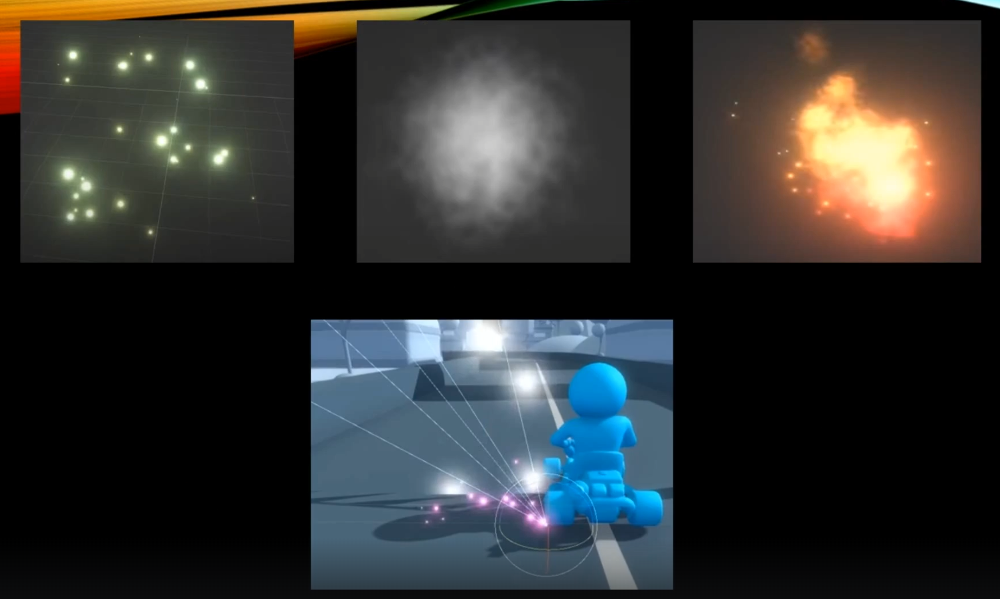
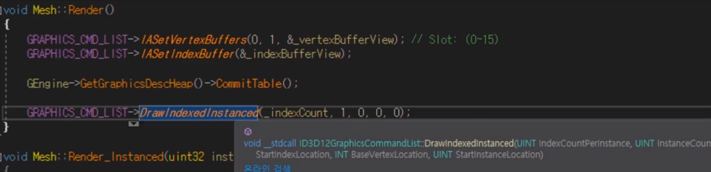
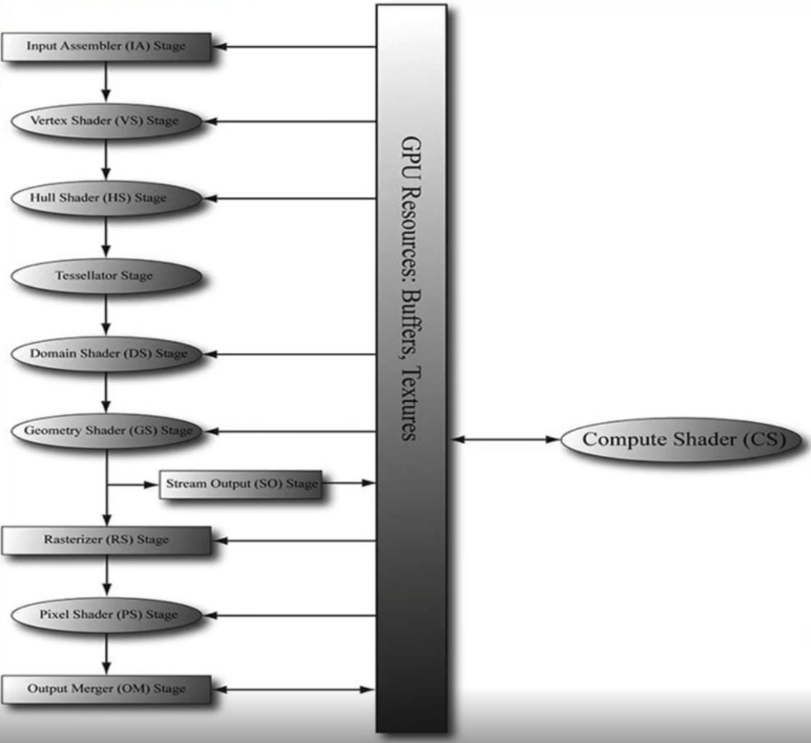
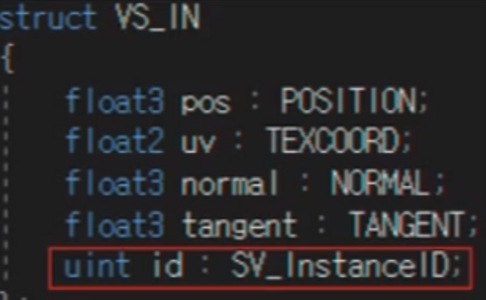
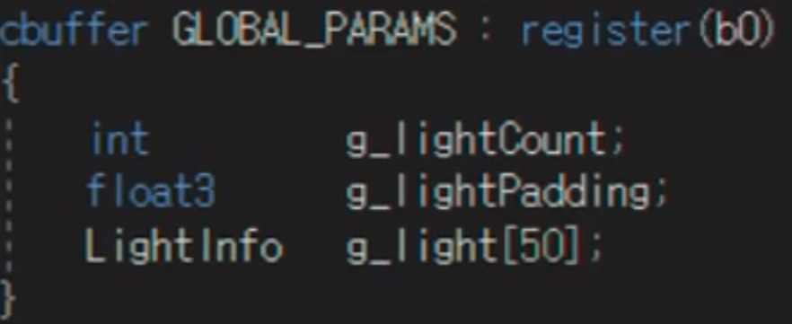
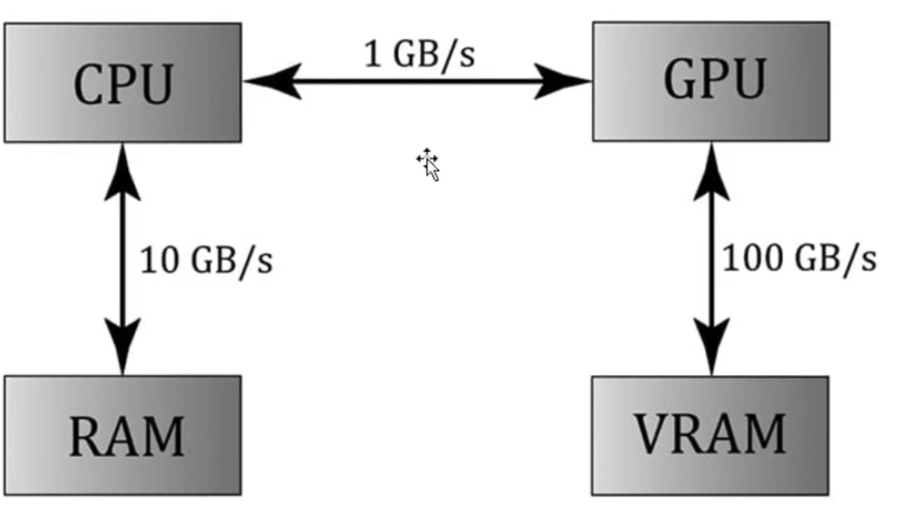
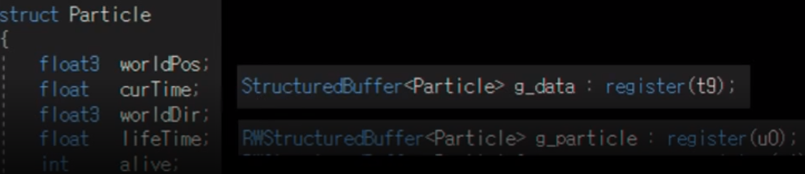

# Particle System

`파티클`이란 이런 이펙트를 말한다.

만약 파티클을 기존에 했던 렌더링 파이프라인 방식대로 렌더링을 한다면, 그 개수만큼 많은 부하를 잡아먹게 된다.

파티클 자체가 어떤 특수 효과를 내기 위해서 사용하는 거지만, 사실 인게임적인 관점에서 볼 때 중요한 요소라고 볼 수 있다. 그런데 그런 요소가 리소스를 많이 잡아먹게 된다면 최적화 측면에서 좋지않다. 그리고 그건 과투자가 된다.

## 어떻게 해야 해결이 되는걸까

결론적으로 파티클은 `인스턴싱`이란 기술이 들어간다. `draw call`을 줄여주는것.

렌더링 함수를 살펴보면, 함수의 인자에 InstanceCount 라는 인자를 볼 수 있다.

지금까지는 항상 물체를 하나씩 그려주기 위해서 1을 넣었지만, 만약 인스턴싱을 활용하고 싶으며 파티클 시스템에서 약 1000마리 객체를 그려야한다면 1이 아닌 1000을 넣게 될 것이다.

1000을 넣어 실행하면, 렌더링 파이프라인의 I(Input Assembler) 단계에서 버텍스, 인덱스 버퍼 등의 데이터를 1번만 넣어주게 되지만, 실질적으로 렌더링 파이프라인이 내가 정한 횟수만큼 1000이면 1000번씩 호출하게 되는 차이가 있다.

1000번 호출이 된다는 것은 애당초 메쉬에다가 정점 정보를 넘기는 횟수 자체가 1번으로 줄어든다는 것이다.

다만 사각형처럼 매우 작은 단위의 데이터라면 큰 차이는 없을 수 있지만, 매우 복잡한 메쉬라면 넘기는 부하를 무시하지 못하게 된다.

또 데이터를 파싱함으로써 세팅해야되는 값들이 있을텐데, 그것도 한 번만 실행되는 것이고, 내부적으로 반복해서 실행되는 것이니 빠르게 동작하게 된다. 그래서 이런 작업이 `draw call`을 줄이는 것이다.

1000개씩 그리는 건 좋지만, 똑같은 물체에 대해선 각 물체끼리 구분되어야 하는 개념이 필요하게 된다. 예를 들면, 파티클의 객체가 동일한 위치에 렌더링되는게 아니라, 각각 랜덤하게 좌표가 달라져야 하는 것처럼 말이다.

실제로 넘긴 값이 다 동일하다면, 물체를 구분할 ID가 필요해진다.

위처럼 쉐이더 코드에서 `InstanceID`를 통해 각 물체를 구분할 것이다. 0번은 어디가고, 1번은 어디로 가고 이런식으로!

이제 각 물체를 구분했으니, 물체마다의 정보를 넘겨야한다.

생각해보면 이전에 빛에 대한 정보를 넘길 때, `GLOBAL_PARAMS`라고 전역으로 사용하는  `constant buffer`에 `light`에 대한 정보를 넣어 넘겼었다.

마찬가지로, 파티클도 위의 방식으로 해도 되지만, 좋은 방식은 아니다.

왜냐하면 constant buffer의 가장 큰 문제점이 애당초 setting이 되는 순간에 size가 고정이라는게 특징이기 때문이다.

빛의 경우는 모두 사용하지 않음에도 `LightInfo`의 크기를 50으로 최대값을 잡아놓고, 실제 빛의 개수는 count로 따로 관리하고 있는데, 그렇게 할 수 밖에 없었던 것은 buffer 자체 사이즈가 고정으로 정해져서 사용해야됐기 때문이다.

2번째로는 CPU에서 GPU사이로 왔다갔다하는 데이터 전송 비용이 굉장히 크다라는 문제가 있다.

기존에 constant buffer를 사용한다는 것은 CPU에서 원하는 값을 연산하고 그 값을 GPU에 넘겨서 GPU에서 사용하는 형식으로 활용했었다.

그리고 constant buffer의 const 이름 그대로 GPU에서는 메모리를 read만 가능하고, write는 못한다는 특징이 있기에 런타임에 모두 다 사용하지 않더라도 항상 최대크기를 미리 잡아놓고 setting해야 된다는 것이다.

요약하면 파티클 1개를 사용하든 1000개를 사용하든 최대 수치 1000에 맞춰 상수버퍼를 만들어야 하며 실질적으로 1000개를 일일이 setting해서 넘긴다해도 속도가 너무 느리다는 말이다.

## Structured Buffer (구조화 버퍼)

그래서 Structured Buffer를 사용해야한다.

Structured Buffer도 GPU에서 사용한다는 프로그래머 관점에서는 큰 차이가 없이 GPU에서 사용할 수 있는 메모리라는 점은 변함이 없다.

근데 자체적으로만 보면 constant buffer는 아주 큰 용량을 사용할 수 없다는 단점이 있고, Structured Buffer는 유동적으로 size가 조절이 된다. 그리고 미리 setting을 명시해주지 않앗기 때문에, register에다 묶어주는 순간에 결졍해줄 수 있다는 장점이 있다.

CPU에서 파티클에 대한 모든 정보를 계산해서 넘겨주는게 아닌, 파티클에 대한 모든 관리와 책임을 GPU가 맡을 것이다. 그게 가능한 이유는 파이클 개개인이 서로 연관성이 없고, 독립적이기 때문이다.

Structured Buffer는 거의 배열과 같은 존재다. 그렇게 파티클은 compute shader로 계산한다. CPU가 하는 게 일일이 연산하는게 아니라 compute shader가 파티클에 대한 정보를 갱신하도록 한다.

## 결과물

