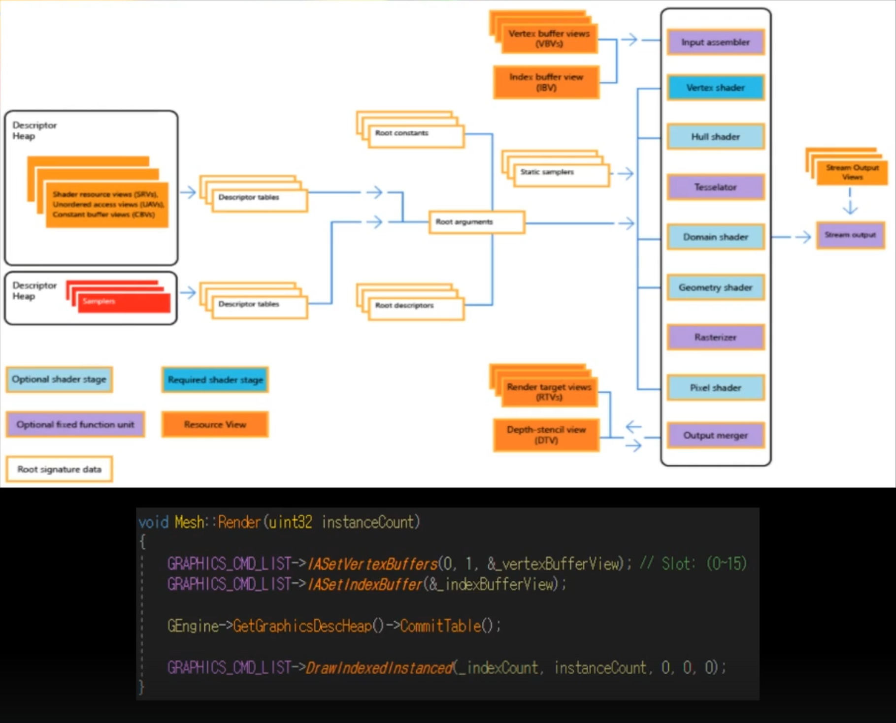
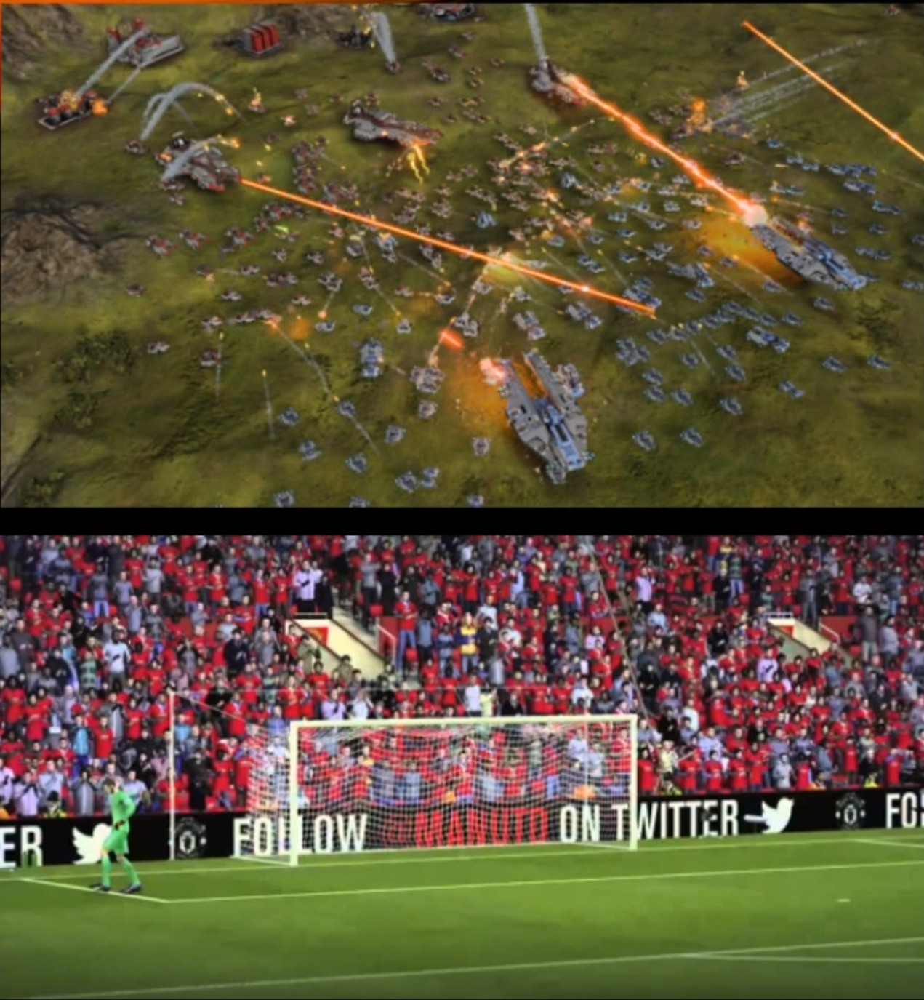
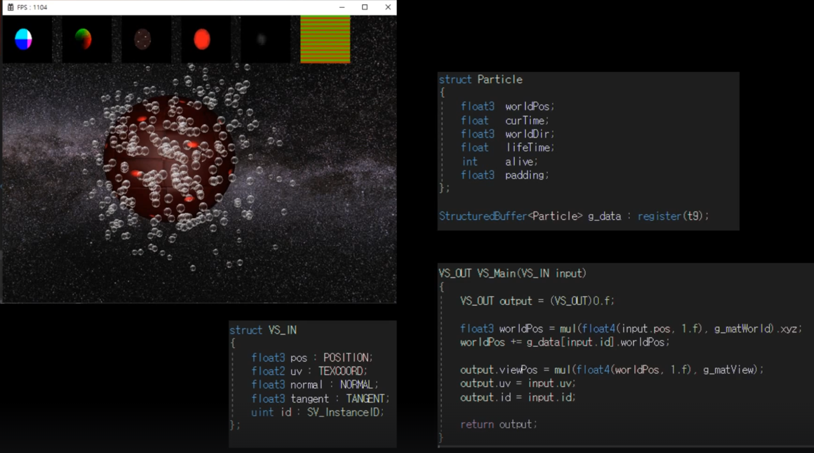
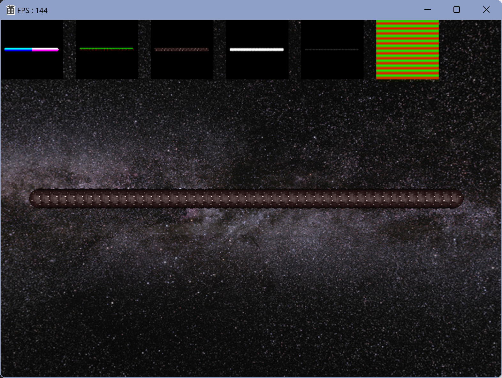

# Instancing

파티클 시스템을 다루면서 Draw Call 부하를 줄이기 위해 인스턴싱 기법을 사용했었다.

지금까지 렌더링 파이프라인이 동작하는 원리를 살펴보면, Input Assembler 단계에서 Vertex Buffer, Index Buffer 를 찔러주고, Descriptor Heap, Root Singature 등등 추가적인 정보를 세팅한 다음, 렌더링 파이프라인을 돌려줬다.

하지만 이렇게 그리는 과정 자체가 굉장히 무거운 과정이라고 볼 수 있다. 한번씩 그려줄때마다 Draw 계열의 함수를 사용해서 CPU가 GPU한테 그려달라고 요청을 하는데, 만약 물체가 단순히 한 두개가 아니라 정말 많을 경우에는 렌더링 파이프라인을 한바퀴씩 매번마다 도는건 매우 많은 부하를 잡아먹게 될 것이다. (실질적으로 물체를 하나만 그려야 할 경우도 있지만, 다수를 그려야할 경우도 있다.)

축구게임처럼 관중의 모습이 각기 다르지 않고 비슷해도 될때, 샘플로 한 10명 정도만 만들어주고, 그 10명을 반복해서 돌려사용하면서 사용할 수도 있다. 이런 상황에서 인스턴싱이란 기법은 필수적으로 들어간다. (Index Buffer와 Vertex Buffe, Shader 즉 완전히 똑같은 물체를 그려야 되는 경우, 인스턴싱 활용)

## Draw Call 왜 그렇게 성능을 잡아먹는거야

렌더링 파이프라인을 돌리기 위해 필요한 추가적인 정보를 세팅할 때, 굉장히 많은 부하를 잡아먹기 때문이다.

인스턴싱했을 때, 각기 물체들의 고유한 정보를 표현하기 위한 구분 용도로 SV_InstanceID를 사용했었다.

저번에 CPU가 아닌 GPU에 넘겨 Compute Shader로 연산해 파티클을 렌더링했지만 이번에는 CPU로 해볼셈이다.

기존에는 Vertex Buffer를 하나만 넣어줬는데, 다수를 넣을수도 있다는 것

하나를 더 늘려서 첫번째 버퍼는 물체 자체의 정점을 나타낼 것이고, 두번째 버퍼는 각 물체의 포지션 정보를 나타낼 것이다.

## 결과물

