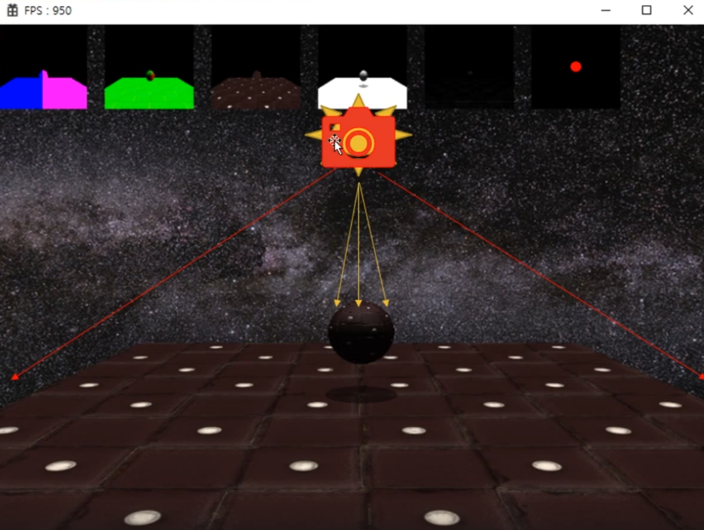
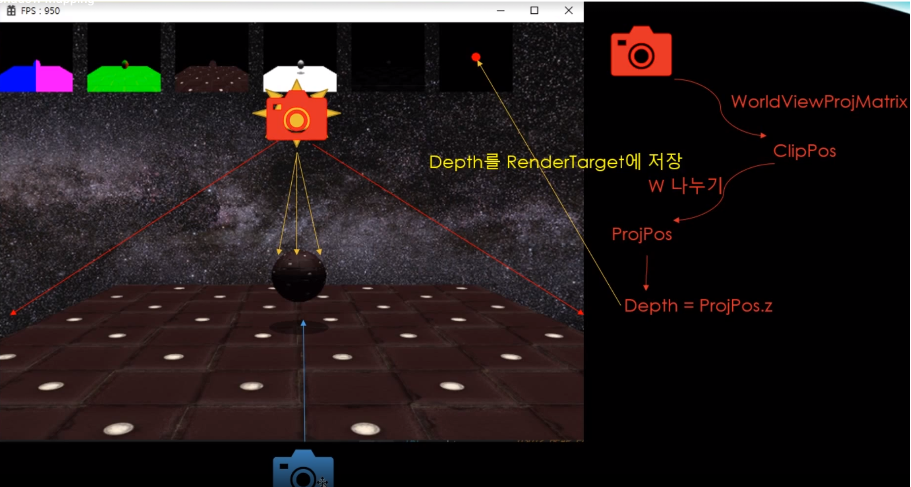
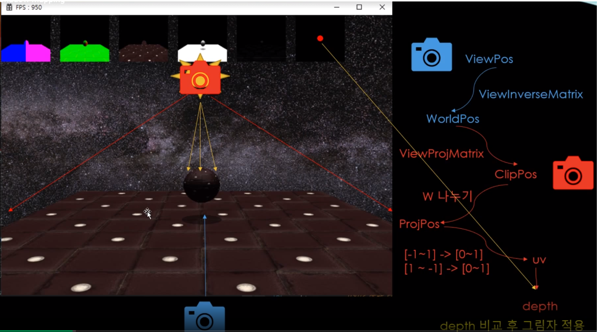
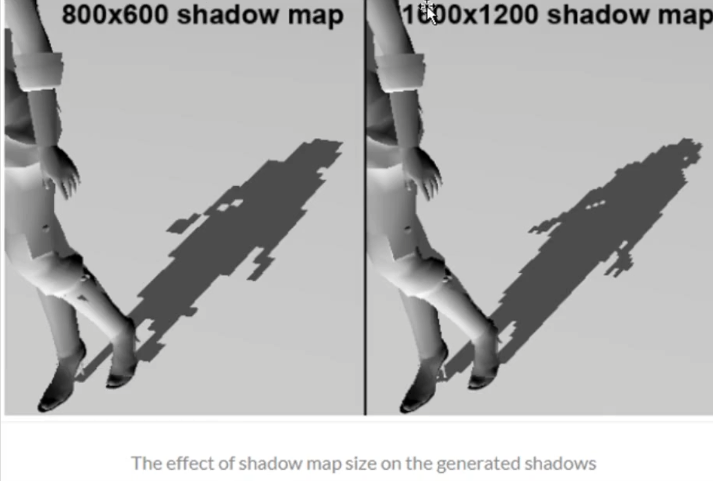
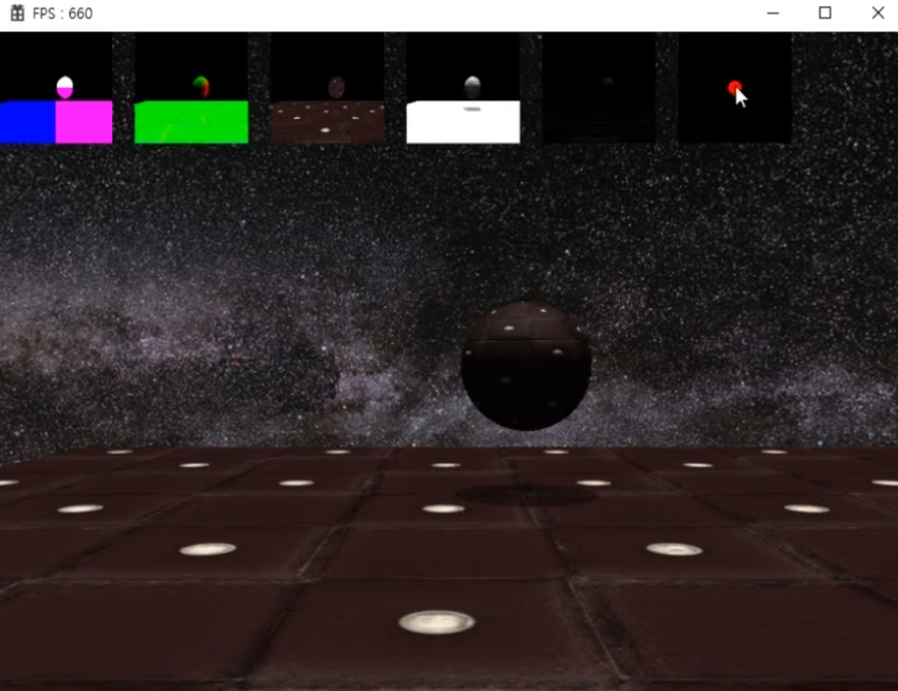

# Shadow Mapping

물체가 다른 물체의 위치에 의해서 그림자 영향을 받는 것을 의미한다.

여태까지 그리는 방식은 물체마다 개별적으로 그려지기 때문에 다른 물체가 내 앞에 있는지 판단할 길이 없었다.

빛을 기준으로 앞에 물체가 있느냐 없느냐 판단하는 것이 목표이다.

조명을 기준으로 물체 앞에 무엇이 있는지 생각해보면, 카메라가 화면을 찍을 때 깊이 버퍼를 활용해 어떤 물체를 그려야할지 말아야할지 판단했었다.

그렇다면 카메라가 빛의 위치와 룩방향을 기준으로 위치해있다고 생각해보면 카메라는 절두체 영역으로 화면을 바라보고 있을텐데, 원래 깊이 버퍼를 활용해서 그려야될지를 판단했었지만, 그것도 별도의 텍스쳐를 최종 결과물로 남겨두면 어떻게 될까? 

-----

디퍼드 렌더링을 할 때, G-Buffer와 라이팅 패스를 남기고 있었는데, 하나 더 추가해줘서 Shadow Map의 역할을 하게 된다.

Shadow Map은 조명을 기준으로 모든 물체의 깊이를 기록한다. (햇빛을 기준으로 가장 가까이 있는 물체의 깊이는 얼마입니까를 기록한다는 것)

한마디로 가상의 카메라를 빛의 위치에 두고, 빛의 방향으로 화면을 찍은 다음에, 그 깊이값만 텍스쳐에 저장해둔다.

## 근데 왜 깊이 단계를 기억하는 것일까?

최종적으로 화면을 그려야 될 때, 그 위치에 그림자가 있는지 없는지 판단하기 위해서는 결국 라이팅을 기준으로 한 텍스쳐를 참고하고 판별해서 픽셀에 그림자를 그려야하고 말아야할지를 결정하기 때문이다.

## 렌더타겟 텍스쳐에 찍어내는 과정 (깊이맵 그리기)

## 최종적으로 그림자를 만들기 위한 라이팅 연산을 할 때, 다른 카메라와의 비교를 통해 그림자를 적용시키는 과정

(빛 카메라에 앞에 물체가 있는 것들 깊이를 활용)

## 요약

최종 원리는 실질적으로 화면에 그려야하는 좌표의 깊이와, 텍스쳐에 기록된 가장 앞에 있는 물체의 깊이값을 그림자와 비교해서 그림자가 그려줘야되는지 판별한다. 이후에는 색상만 어둡게 바꿔주면 된다.

## 알고 있어야 하는 것

그림자와 관련된 렌더 타겟 텍스쳐 같은 경우에는 실제 그려줄 화면보다 훨씬 크게 해줘야지만 부드럽고 예쁘게 나온다.

## 결과물

