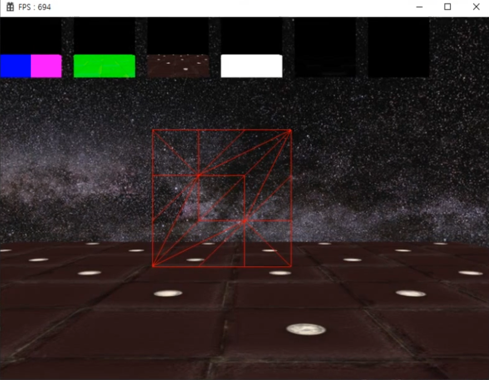

# Tessellation

## Tessellation 단계

[홀 쉐이더 스테이지, 테셀레이션 스테이지, 도메인 쉐이더 스테이지]

테셀레이션 자체도 지오메트리 쉐이더랑 비슷하게 정점을 추가하는 개념이다. 

## 왜 중복되는 기능을 만들어놨을까? 이상한데?

지오메트리 쉐이더가 더 먼저 등장은 했다.

지오메트리 쉐이더는 일반적으로 파티클에서 했던 것처럼 이렇게 어마무시하게 많은 정점을 동적으로 생성하는게 아니라 조금 더 작은 용도에 사용하는거고, 테셀레이션 자체는 조금 더 큰 규모에 적용한다.

그런 자체 기능들이 훨씬 더 많다고 보면 좋다. 

테셀레이션은 옵션단계로, 여태까지 버텍스 쉐이더 다음에 테셀레이션 단계를 옵션으로 사용하지 않아 뛰어넘고, 사실상 레스터라이즈 단계로 가서 픽셀 쉐이터를 했었다.

## LOD

테셀레이션을 적용할때 가장 크게 덕을 볼 수 있는 부분 중 하나가 바로 동적 LOD를 만드는 방법으로, LOD는 `Level Of Detail`의 약자로, 버텍스의 수를 조절해 퀄리티를 바꾸는 `최적화 기법`이다.

로봇 메쉬가 있다고 가정해보자. 

로봇 메쉬를 여러 개를 만들어 두고, 이 LOD에 따라 가지고 카메라에서 멀어지면 멀어질 수록 폴리곤의 개수를 일부로 줄여준다. 즉 이 폴리곤 개수가 늘어나면 늘어날수록 우리가 물체를 선명하고 더 정확하게 표현할 수 있지만 역설적으로 그만큼 렌더링 부하가 늘어나게 된다.

반대로 폴리곤을 간략화하면 할수록 렌더링을 더 빨리할 수 있겠지만, 물체 자체가 좀 정밀하게 표현할 수 없고 좀 밋밋하게 그리고 로우폴리 특성상 예쁘지않게 등장할 확률이 있다.

그런데 애당초 카메라가 저 멀리 있는 물체를 선명하게 그릴 필요가 없다. 괜히 폴리곤 개수, 삼각형 개수를 늘려봤자 사실 보이지도 않는 이 점에 대한 연산만 하고있다는 것이다.

이렇게 바꿔치기를 해주는 걸 레벨업 디테일 이라고 보면 되겠다. (LOD 기법)

동적 LOD -> 렌더링 단계에서 동적으로 버텍스를 변화시키는 것. (카메라와의 거리에 따라 변화시키며, 메쉬같은 경우에는 바꿔치기를 해주는데 버텍스의 수가 적은걸로 바꿔치기하는 방법도 있다.)

Terrain과 Mesh의 동적 LOD 단계에서 Tessellation을 이용할 수 있다.

이렇게 어떤 큰 풍경이 있다고 가정해보자.

오픈월드 게임이어가지고 굉장히 예쁜 환경인데, 유심히보면 가까이 있는 나무도 있지만, 저 멀리 떨어져 있는 나무들도 여기 존재하고 있다는걸 볼 수 있다.

만약에 저 멀리 있는 나무들도 앞 나무처럼 똑같은 메쉬를 사용한다고 하면, 사실 보이지도 않는 점을 그리기 위해 어마어마한 렌더링 부하가 들게 된다. (굉장히 비효율적)

마찬가지로 지형 같은 경우에도 이것저것 심어져있는데, 결국엔 일련의 삼각형들로 이루어져있다.

삼각형에 텍스쳐를 입혀가지고 땅에 표현할 것인데, 땅에 해당하는 부분도 가까이 있는 경우라면 울퉁불퉁한게 자세히 보여야 되겠지만 저 멀리 산 어딘가에 있는 땅은 세밀하게 표현해봤자 눈으로 구분할 수 없다.

그러다보니까 터레인 같은 지형 경우도 LOD를 적용시켜서 조금 더 카메라가 가까이가면 삼각형 개수를 늘렸다가 점점 멀어지면 줄여주는 기법을 사용해주면 좋다. (이게 바로 동적 LOD에 해당한다)

Hull Shader와 Domain Shader를 작업하는거고, 중간에 있는 Tessellator는 건드리지 않는다.

Hull Shader와 Domain Shader를 설정해놓게 되면, 하드웨어 자체에서 자동적으로 실행된다.

기본적으로 테셀레이션이 들어가게 되면 달라지는 점이 Topology를 Triangle Type이나 완성된 물체를 넘겨줬지만, 테셀레이션이 개입을 하는 순간, 사진에서와 같이 1번에서 32번까지 Control Point PatchList에서 하나를 선택해줘야한다.

Control Point와 Patch란 용어가 반복해서 등장할텐데, Control Point는 제어점을 의미한다. 삼각형을 넘겨준다고 가정할 때, 각 정점에 해당하는 점을 말한다. (내부를 제어하는 점)

그 세개가 모여서 Set 자체가 patch를 의미한다. Patch는 Control Point의 그룹이다.

## 근데 왜 Vertex란 용어를 안쓰고  Control Point라고 하는걸까?

비슷한 의미이긴 하지만, Control Point 같은 경우에는 제어를 한다는 뉘앙스가 굉장히 강하다.

예를 들면 어떤 그래프를 그려놨는데, 위 사진은 유명한 알고리즘 베지어의 곡선이다.

베지어 곡선을 그릴 때, 샘플이 되는 기준점을 찍게 된다. (p1, p2, p3, p4) 점을 어떻게 위치시키느냐에 따라 굴곡이 변한다.

말 그대로 제어를 하는 점인 의미에서 Control Point이다. 테셀레이션 단계에서 제어점이라고 부르는 이유도 그러한 이유가 된다.

자체가 그려질수도 있겠지만, 제어점을 이용해서 중간에 있는 다른 정점을 생성하기 위한 기준점이 된다고 볼 수 있다.

테셀레이션은 옵션단계라고 했다. 여태까지 버텍스 쉐이더 다음에 테셀레이션 단계를 옵션으로 사용하지 않고 뛰어넘었고, 사실상 레스터라이즈 단계로 가서 픽셀 쉐이더를 했었다.

테셀레이션을 사용하면 달라져야 하는 부분이 있다. 버텍스 쉐이더에서 원래 WVP 행렬을 곱해줘서 사실상 투영좌표계로 넘겨주기 위한 사전 작업을 다 해놨었다.

그런데 테셀레이션을 적용시키게 되면 테셀레이션 단계에서 정점을 추가해 그곳에서 조작할 것이기 때문에 버텍스 쉐이더에선 별다른 작업을 하지 않고, 자기가 받은 로컬 좌표를 그대로 토스를 해주게 될 것이다.

## Hull Shader

큰 특징은 Edge에 숫자를 정해줘서 각 변에 대해 몇 번을 쪼갤 것인지 정해주는 것이다. 코드에서 보는 바와 같이 0번은 1번, 1번은 2번, 2번은 3번을 정해줘서 오른쪽 사진처럼 쪼개져서 삼각형이 늘어난 걸 볼 수 있다.

InsideTess도 1이 아닌 큰 수로 잡게되면 세분화되서 안에서도 삼각형이 늘어날 수 있다.

이걸 응용하게 되면 LOD에서 만약에 카메라가 어느정도 가까워졌다하면, EdgeTess를 늘려서 삼각형을 작게 쪼개서 표현할 수 있고, 멀리 떨어져있으면 0에 가깝게 만들어 삼각형 한개 짜리로 표현할 수 있는 효과로 볼 수 있게 된다.

## Domain Shader

Domain Shader 에서는 기준점이 되는 제어점뿐만 아니라, Hull Shader에서 만들어줬던 새로운 정점들 대상으로도 다 같이 들어오게 된다.

테셀레이터 1단계인 Hull Shader에서 정점을 추가했으면, 모든 정점들을 대상으로 Domain Shader를 호출하게 된다. 사실상 Vertex Shader 에서 WVP 행렬을 곱해줬던 부분이 Domain Shader에서 해준다.

또 Patch 정보와 Location 정보를 넘겨주는데, Patch 정보는 당연히 제어점 삼총사의 Patch를 말하는 것이고, 삼총사를 기준으로 한 각각의 비율을 Location 일나 걸로 전달해주게 된다.

비율이란 것은 제어점을 기준으로 어느정도의 비율을 차지하고 있는지를 말한다. (0번이 1, 1번과 2번이 0이라 한다면 그 점 자체가 0번점이고 만약에 중간쯤에 위치한 점이라 한다면, 0번 1번 2번 중간에 위치하고 있으니 비율이 3분의 1씩 해서 0.33이라 볼 수 있다.)

Domain Shader 단계에서 어떤 정점의 좌표를 알고싶다하면 3개 제어점의 비율을 섞어서 알수 있게 된다는 것이다.

Domain Shader 는 Local Position 이랑 UV를 추출할 때, 기준점이 되는 Control Point 정점 세개를 기준으로 한 비율로 넘겨받는다란 방식이 나머지 쉐이더 단계랑 다른 부분이다. (그 외에는 다른 부분은 딱히 없다)

## 요약

여기까지 테셀레이션을 사용하는 기본적인 방법이다. 개념적으로는 그렇지만, 사용방법이 기존과 조금 다르다는 점을 유의하자.

EdgeTess를 이용해서 결국에는 Terrain을 만들때도 Level Of Detail (LOD)에 따라서 EdgeTess에 넣어주는 숫자로 더 상세하게 표현될지 아니면 투박하게 표현이 될지 조절할 수가 있다. (Terrain의 원리이자, 동적 LOD를 늘려주는 방법)

실습해보니 알고보면 Tessellation이 그렇게 복잡한 방법은 아니란걸 알 수 있다. 1단계, 2단계, 3단계가 있어 굉장히 많은 역할을 하는것 같지만, 의외로 어려운 부분은 다 하드웨어 쪽에서 해주고, 개발자는 세부적으로 정보 몇 개만 설정해주면 된다.

## 결과물

