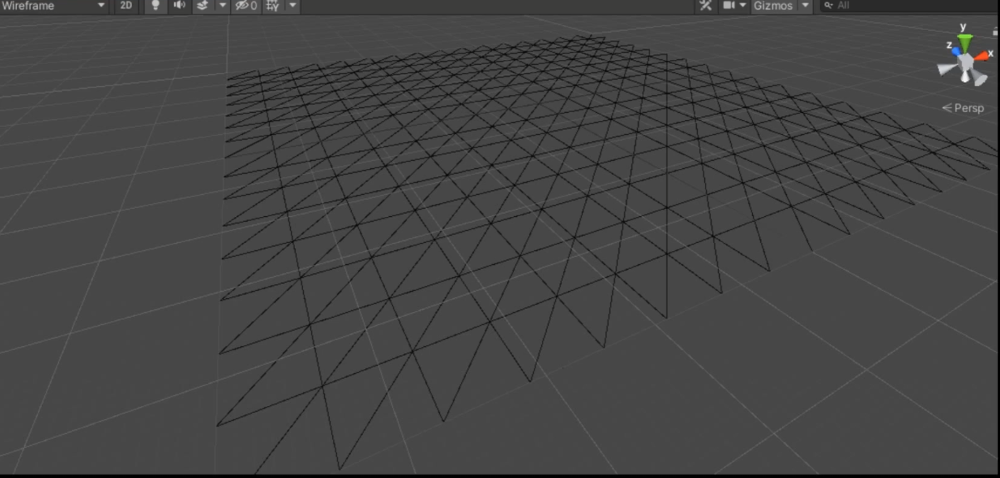

# Terrain

테셀레이션을 대표적으로 활용할 수 있는 전형적인 예제가 Terrain.

먼 곳에 있는건 삼각형 하나, 가까이 있으면 무수한 삼각형의 개념이 Terrain과 적합하다.

경우에 따라서 와우처럼 Terrain을 사용하지 않고, 메쉬로 만들어져 있는 경우도 있다. (배그는 Terrain으로 이루어져 있다)

유니티엣 Terrain을 생성해보면 무수한 삼각형으로 구성되어 있다.

왜 큰 하나의 삼각형이 아닌 무수한 삼각형으로 구성되어있을까?

당연한 얘기지만, Terrain 자체가 평면이 아니라 울퉁불퉁한 모습을 표현해야 하니까 높이의 차이를 표현하기 위해 무수한 삼각형으로 구성이 되는것.

X, Z로 까는 건 동일하지만, 각각의 높이가 달라지는게 핵심이다.

## 각각의 높이를 가진 지형, 어떻게 파일에 저장할까?

1. 첫번째 방법

Terrain 도 각각의 정점으로 이루어져 있으니, 정점 하나하나 버텍스 정보 (위치, UV 등)를 파일에 저장하는 것이 될텐데, 그러면 낭비가 있단 생각이 든다. 왜냐하면 X축과 Z축의 규격이 일정한데 굳이 X와 Z축 사이를 어떤 좌표인지 저장하기 보다는 높이값만 딱 저장하면 원하는 모습으로 보간할 수 있기 때문이다.

2. 두번째 방법

그래서 일방적으로 Terrain과 관련된 정보를 저장할 때는 "높이맵" 이라는 걸 사용한다. 높이맵은 말 그대로 텍스쳐에 불과하다.

각 정점마다 위치해야할 높이 자체를 어떤 텍스쳐에 저장한다고 보면 된다. (Diffuse, Normal 텍스쳐처럼 그것의 연장선)

높이 텍스쳐를 참고해서, 각 부분에 해당 픽셀에 있는 높이값을 적용시켜주면 된다.

관련 파일은 위와 같이 검색해서 얻어주면 된다.

## 결과물

