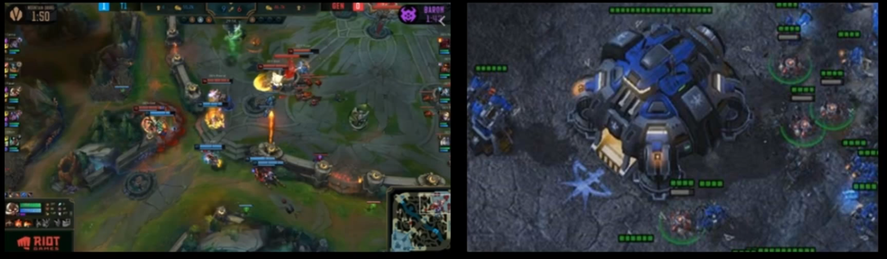
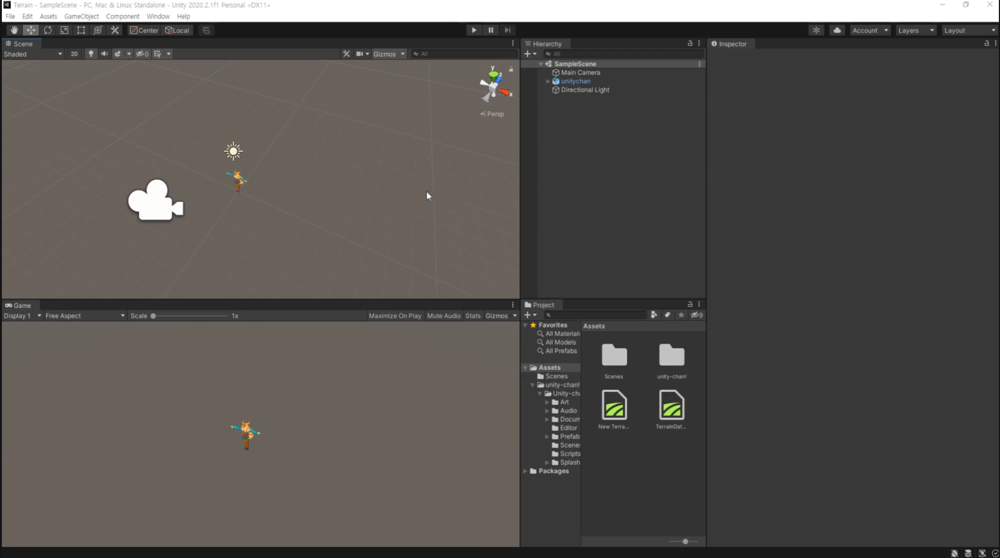
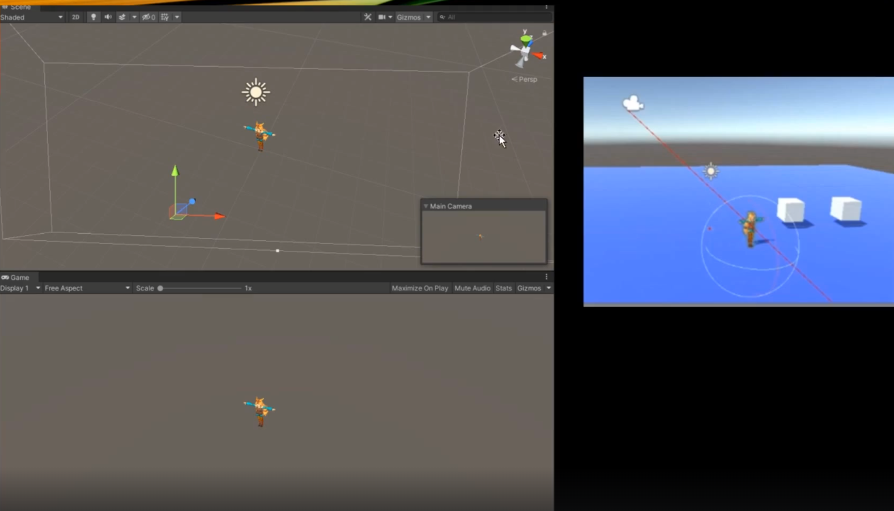
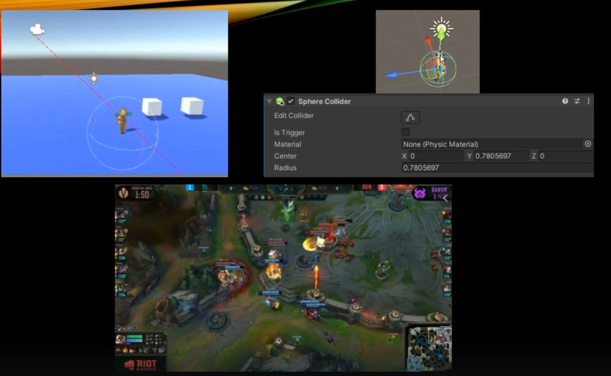
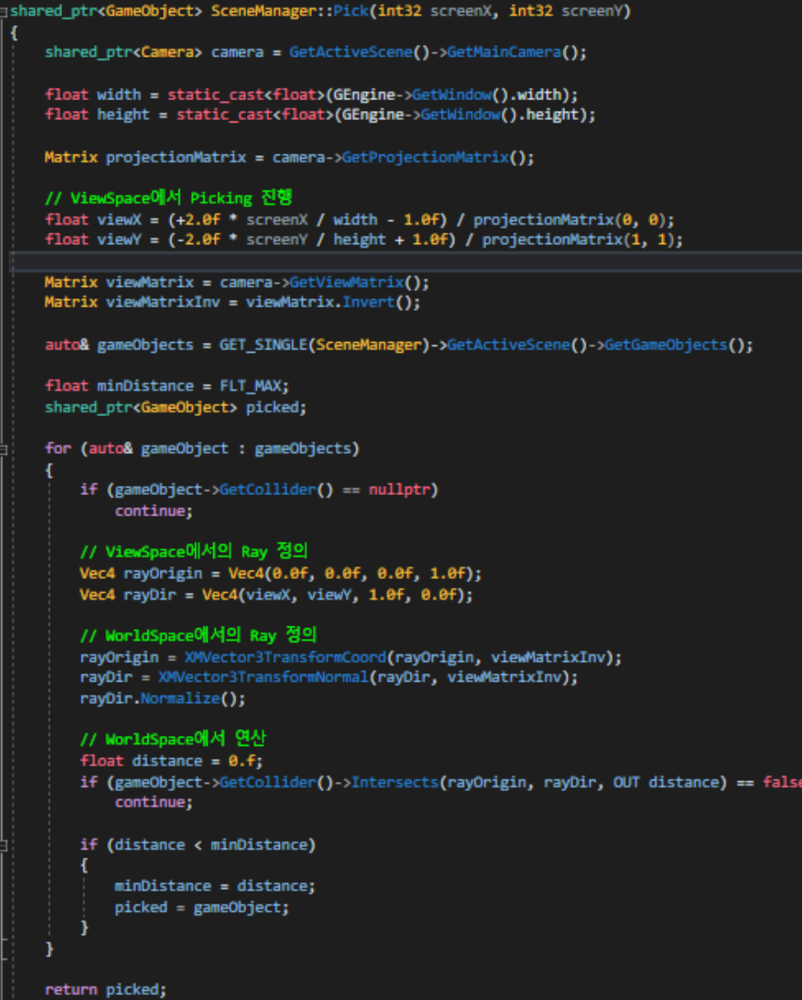
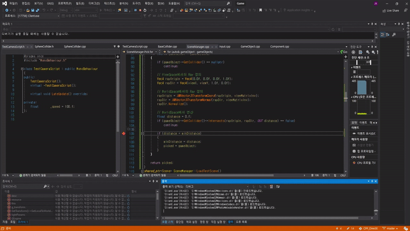

# Picking (+ Ray Casting)



보는 바와 같이 인게임에서 존재하는 물체들은 3D 세상에서 존재하는 것들이다. 근데 최종적으로 렌더링 파이프라인 과정을 거쳐서 보여주는 화면 자체는 사실 2D 화면에 불과하다.

그저 렌더 타겟이란 텍스쳐에다가 입혀서 그리는 거에 불과하기 때문에 사실상 입체감이 있어 보이는 2D 화면에 불과한 것이다. 그런 2D 모니터 화면에서 3D 세상에 있는 물체를 Picking 할 수 있는게 신기한 일이다.

결국에는 스크린 스페이스 기준으로 어떤 좌표를 눌렀을 때, 역으로 어떤 물체가 있는지 없는지 판별해야한다.

근데 판별하기 쉽지 않은게 카메라는 항상 움직이면서 다른 물체들의 위치도 바뀌니 2D 세상에서는 "범위" 라는 것 자체를 굉장히 알기 힘들다.





그래서 이때 필요한게 기술이 바로 Ray Casting (광선 투사)이다. 한 마디로 레이저를 쏘는 기술이라 보면 된다.

동작 원리는 만약에 스크린 스페이스 기준으로 중앙 좌표를 클릭헀다 가정하자.

실질적으로 일어나는 일은 화면에 있는 점을 찾아서 카메라 위치에서 클릭 좌표까지 가상의 레이저를 쏘게 된다. 그래서 레이저가 물체랑 충돌했는지 안했는지를 판별해서 충돌했으면 물체가 있다라고 판단한다.



근데 레이저를 쏜다는 것 자체도 어떤 기준으로 레이저를 쏘는지 생각해봐야한다. 그것이 로컬스페이스 인지, 월드스페이스 인지, 뷰스페이스 인지 등 여러 좌표계중에서 클릭 좌표대상과 동일한 스페이스 에서 계산을 해야 정확히 충돌 계산을 할 수 있을 것이다. 

충돌 판별은 구 충돌, 사각형 충돌 등을 사용할 수 있다.

## 레이저를 물체랑 연산하기 위한 과정


위의 과정은 렌더링 파이프라인 과정으로, 다시 한 번 복기해보자.

1. 로컬 스페이스에서 월드 좌표계로 변환을 시켜 월드 스페이스 상에 놓여진다. (로컬 -> 월드)
2. 카메라 기준으로 화면을 찍어야하기 때문에, 카메라 역행렬을 통해 뷰 스페이스 좌표계로 변환한다. (월드 -> 뷰)
3. 클립 스페이스 혹은 NDC 혹은 투영 스페이스라고 불리는 곳에 납작하게 투영이 되어 -1 에서 1 사이의 범위로 변환된다. (뷰 -> 투영)
4. 최종적으로 화면 비율에 맞춰 스크린 스페이스로 가게 된다.

결국 Ray Casting 은 위 과정을 거꾸로 올라가면 된다.

800x600 화면에서 임의 좌표를 찍었을 때, [400, 300] 같은 픽셀 좌표를 나타낼텐데, 그 좌표는 언제까지나 스크린 스페이스 기준이며 물체와의 충돌연산을 위해 뷰 스페이스이건, 월드 스페이스이건, 로컬 스페이스이건 통일해야 하는 것이다.

## 코드로 순서대로 정리



- RayPicking 함수

```c++
// 우선 메인 카메라를 가져온다.
shared_ptr<Camera> camera = GetActiveScence()->GetMainCamera();

// 현재 나의 스크린에 너비와 높이를 가져온다.
float width = static_cast<float>(GEngine->GetWindow().width);
float height = static_cast<float>(GEngine->Getwindow().height);

Matrix projectionMatrix = camera->GetProjectionMatrix();

// ViewSpace에서 Picking 진행
// 공식을 이용해 뷰 스페이스 기준으로 내가 클릭한 화면 좌표를 가져온다.
float viewX = (+2.0f * screenX / width - 1.0f)  / projectionMatrix(0, 0);
float viewY = (-2.0f * screenY / height + 1.0f) / projectionMatrix(1, 1);

```

Picking을 할 때 내가 쏘는 광선이랑 물체랑 동일한 세상에 맞춰줘야 비교가 가능하다 했는데, `뷰, 월드, 물체의 로컬`에서 해도 된다고 했다.

코드에서는 BoundingSphere를 이용해서 충돌 처리를 하기 때문에, 어떤 스페이스에서 해도 상관 없어 월드 스페이스에서 하고 있지만, 만약 간단하지않게 메쉬의 각 삼각형 단위로 충돌 테스트를 하고 싶다면 왠만해선 로컬 스페이스로 돌아가는게 좋다.

그래야 모든 물체의 삼각형을 다시 월드 스페이스로 이동했다가 비교하는 부분을 생략할 수 있기 때문에 효율적이다.

```c++
// 뷰 스페이스의 클릭 좌표 x,y 를 다시 월드 스페이스로 돌아가기 위해 뷰 행렬의 역행렬을 구해준다.
Matrix viewMatrix = camera->GetViewMatrix();
Matrix viewMatrixInv = viewMatrix.Invert();

auto& gameObjects = GET_SINGLE(SceneManager)->GetActiveScene()->GetGameObjects();

float minDistance = FLT_MAX;
shared_ptr<GameObject> picked;

for (auto& gameObject : gameObjects)
{
     if(gameObject->GetCollider() == nullptr)
         continue;
    
    // ViewSpace에서의 Ray 정의
    // 광선을 쏘는 주체는 시작점인 카메라
    Vec4 rayOrigin = Vec4(0.0f, 0.0f, 0.0f, 1.0f); // [0, 0, 0] 좌표가 카메라. 그래서 광선의 orgin
    Vec4 rayDir = Vec4(viewX, viewY, 1.0f, 0.0f); // 어느 방향으로 쏠건지? 아까 구한 화면의 x, y로 광선을 쏘자.
    
    // WorldSpace에서의 Ray 정의
    rayOrigin = XMVector3TransformCoord(rayOrigin, viewMatrixInv); // 실제 좌표가 잇기에 Coord를 곱함.
    rayDir = XMVector3TransformNormal(rayDir, viewMatrixinv); // 방향만 있기에 Normal을 곱함.
    rayDir.Normalize();
    
    // WorldSpace에서 연산
    float distance  = 0.f;
    if (gameObject->GetCollider()->Intersects(rayOrigin, rayDir, OUT distance) == false) // Intersects는 충돌처리 함수
        continue;
    
    // 충돌처리가 되었다 하더라도,
    // 기존에 Picking된 다른 물체가 자신보다 가까이 있었는지에 따라 최종 충돌 물체로 결정하기 위해
    // minDistance를 통해 한 번 더 걸러준다.
    if (distance < minDistance)
    {
        minDistance = distance;
        picked = gameObject;
    }
}

return picked;
```

## 결과물

