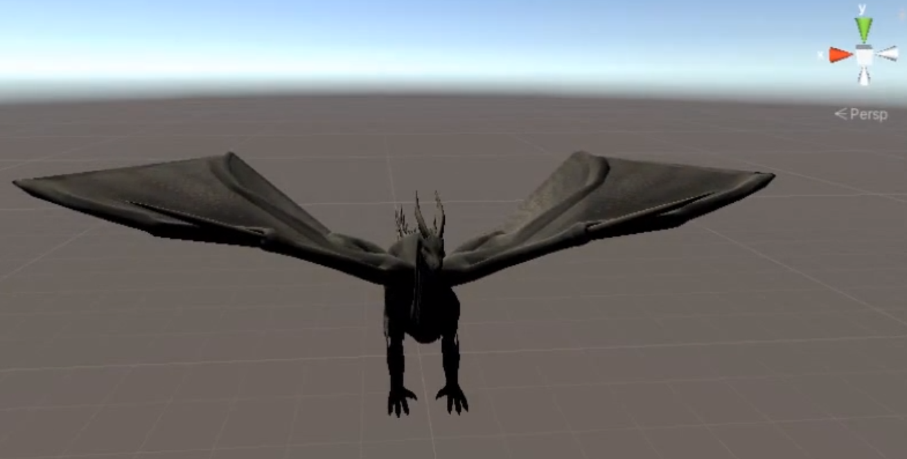
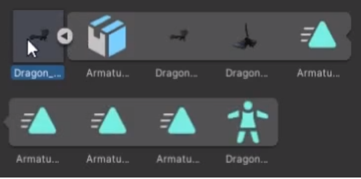
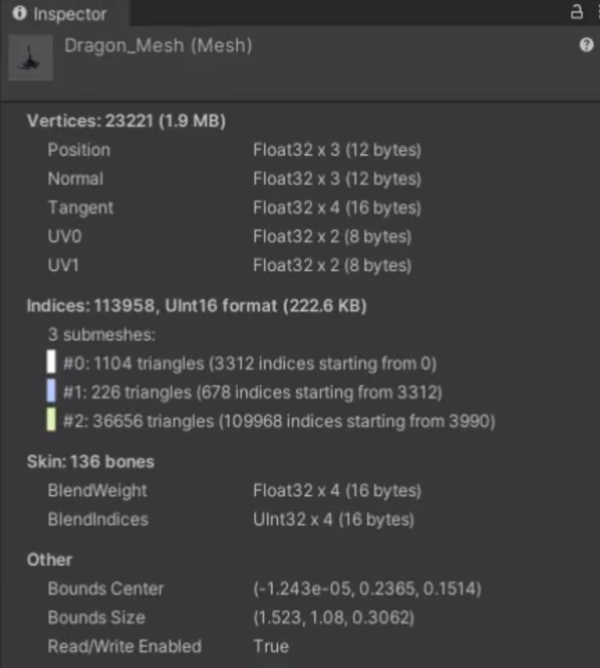
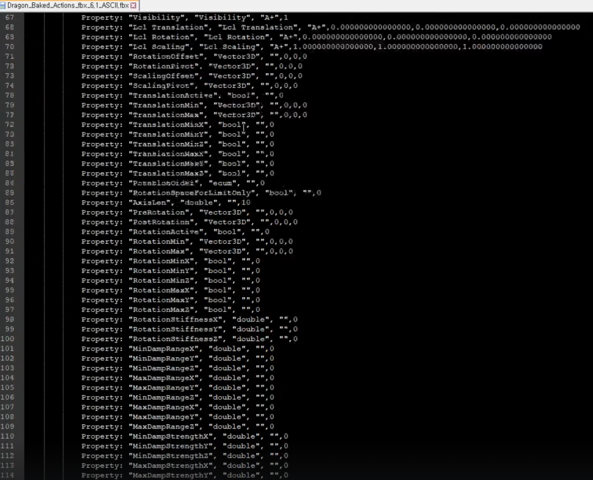
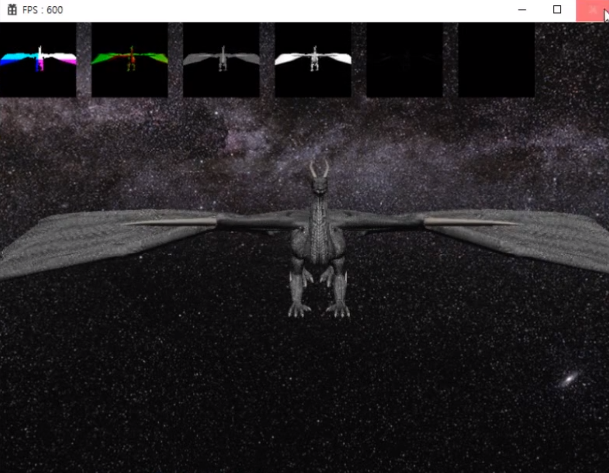

# Mesh

여턔까지는 `Resources Manager` 안에서 하드코딩된 버텍스의 좌표를 이용해서 직접적으로 물체 (삼각형, 구) 만들었는데 실제 게임을 만들 땐 당연히 코드상에서 만드는 게 아니라, 디자이너가 제작한 Mesh 파일을 읽어서 처리하게 된다.

그러려면, 준비물이 몇가지 필요한데, `FBX`라는 포맷의 파일을 로드해서 라이브러리를 이용해 띄워볼 것이다.

## 유니티로 먼저 띄워보기

유니티를 통해 FBX 파일을 까보면 파일 내에 굉장히 다양한 요소로 이루어져 있다. Animation이 4개 들어가 있고

실제로 Mesh 정보 (Vertex, Normal, Index 정보 등등)가 있다. Animation을 실행할 때, Skin이라고 해서 일종의 뼈대 정보도 들어가 있다.

그래서 실제 코드에서는 단순히 생각해서 Material 정보를 로드하고, Mesh 정보를 로드하면서 Mesh에서 Vertex, 다중 Index, Normal, Tangent, UV 등등을 파싱해서 마지막엔 FbxMeshInfo란 Mesh 데이터를 들고 있는 것이다.

## ASCII 모드랑 Binary 모드

유니티로 키지 않았을 때 읽는 방식으로는 두가지가 존재한다.

1. ASCII 모드

ASCII 코드로 되어 있어서 이해하기 쉽게 메모장으로 열어보면 살펴볼 수 있다.

온갖 정보가 다 있다는 것은 유니티에서 열었던것과 같이 동일하게 들어가 있다.

ASCII 버전이 사람 눈에 보기 편하다는 장점이 있다.

2. Binary 모드

좀 더 압축된 형태로 컴퓨터가 더 편하게 받아줄 수 있는 형태

## 결과물

