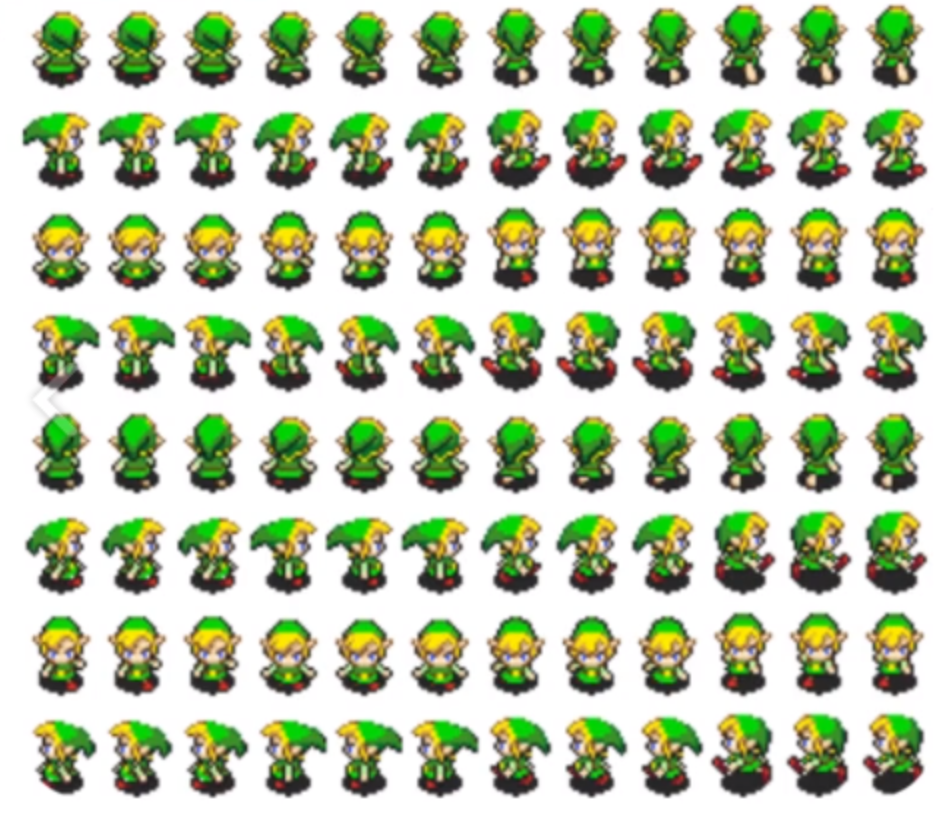
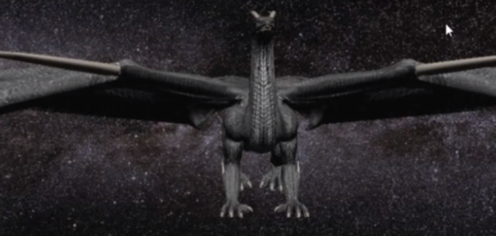
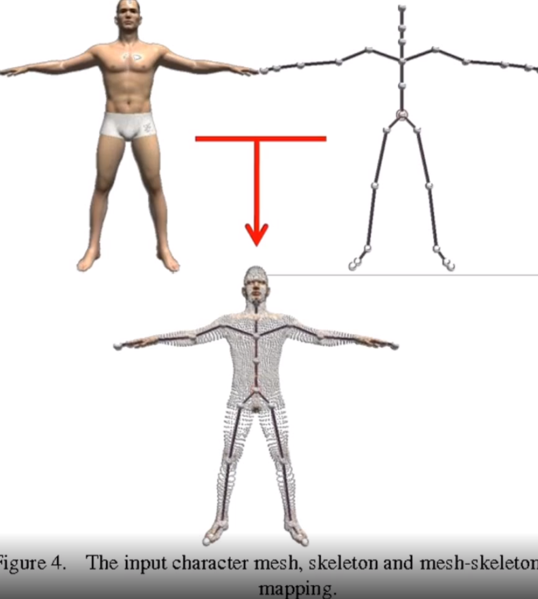
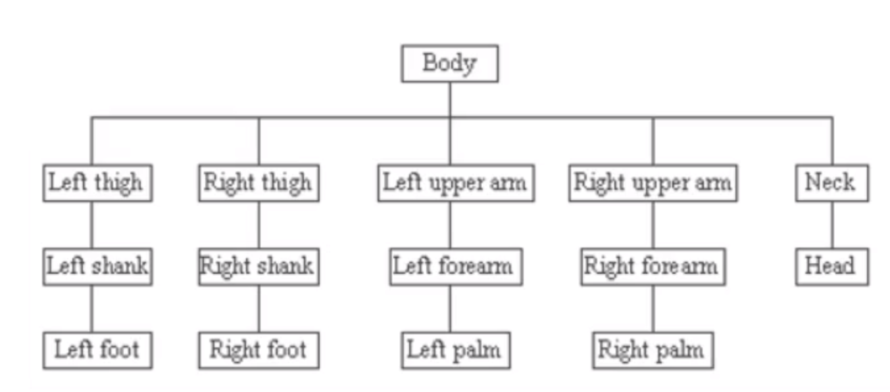
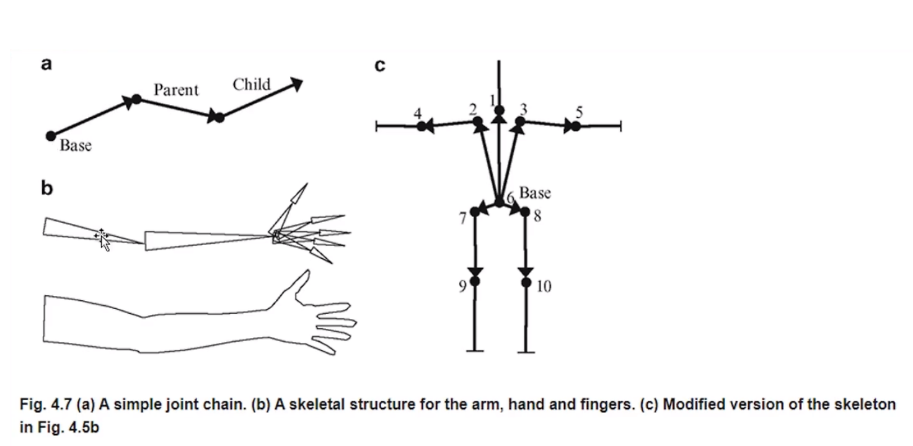
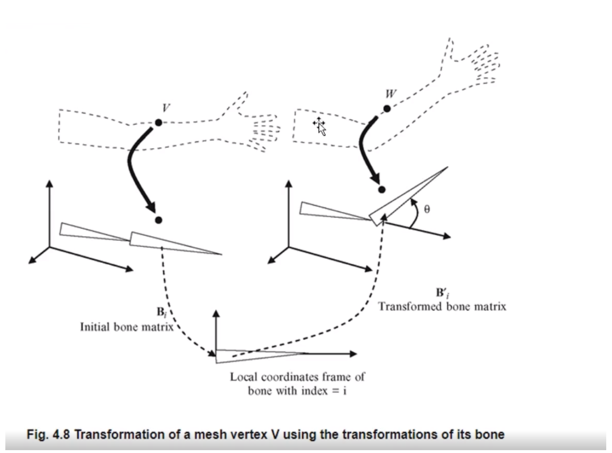
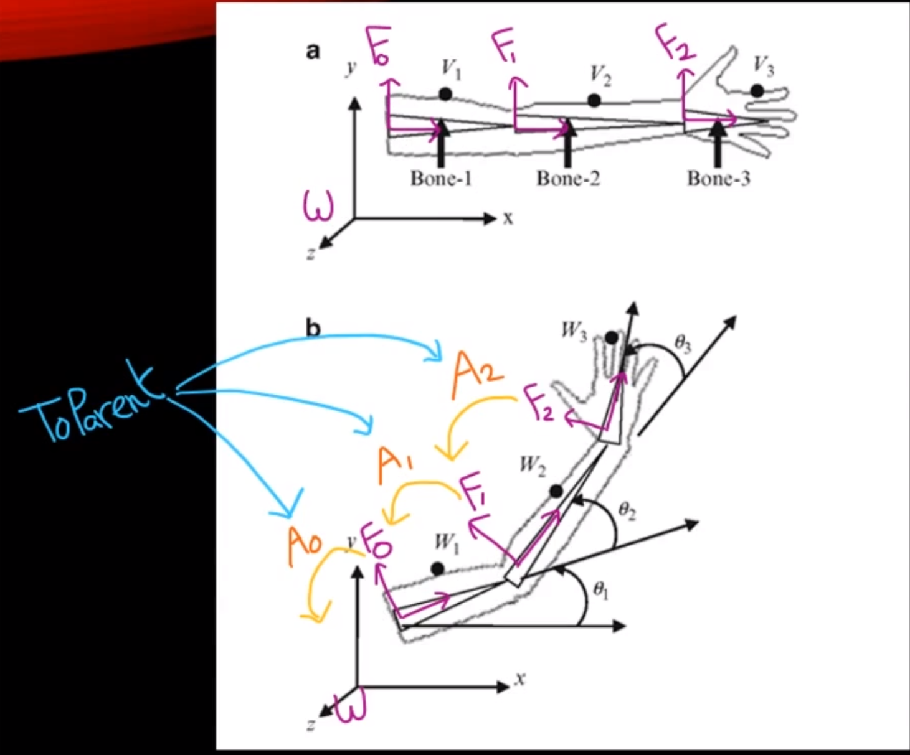
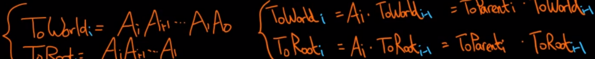
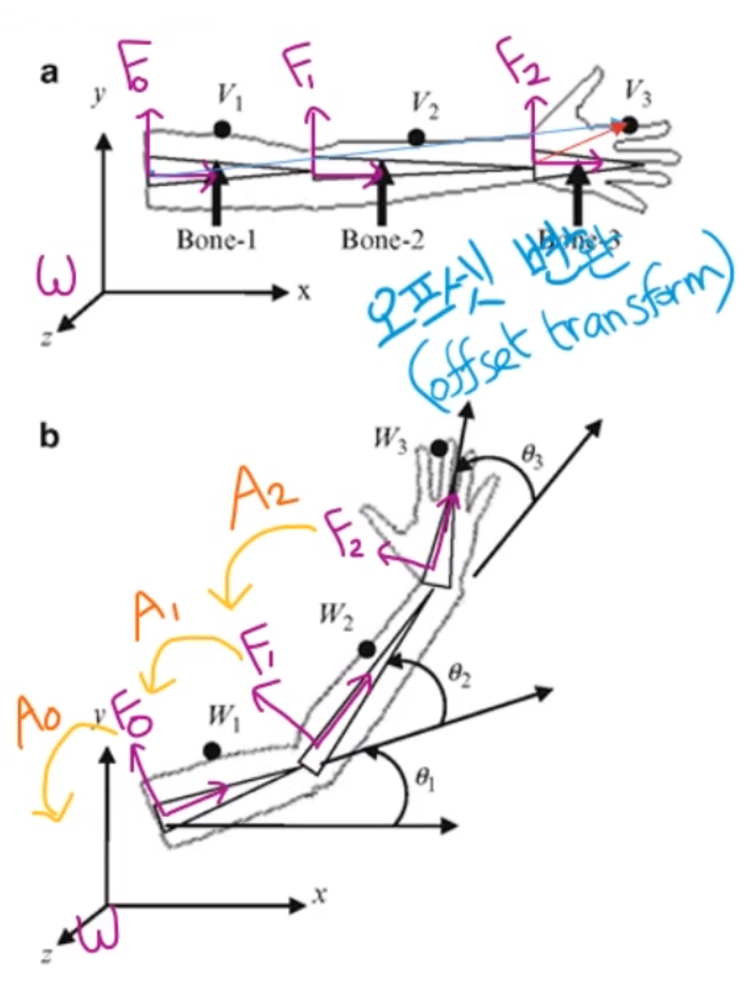
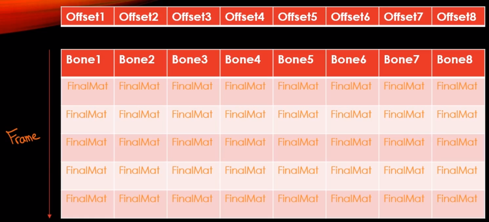

# Animation

애니메이션은 그림을 프레임 단위로 여러 개를 준비해뒀다가 빠르게 재생해서 마치 생동감있게 움직이는 것처럼 보이게 하는 것이 기본적인 애니메이션의 원리이다. 

2D 게임에서 고전적으로 사용하는 애니메이션 기법도 여러가지가 있을 수 있겠지만, 가장 고전적인 형태는 이렇게 프레임 단위로 만들어서 재생시키는 것이다.

## 3D 물체를 대상으로 애니메이션을 구현해야 한다고 하면, 어떻게 해야할까?

2D 방식처럼 프레임 단위로 한다고 치면 3D 물체는 정점의 수가 너무 많아서 불가능하다. 애니메이션 프레임 만큼 정점을 매번 다르게 해서 파일을 저장하면 기하급수적으로 데이터가 늘어나게 된다.

그래서 정점 단위로 하나씩 좌표를 이동하는 방법은 불가능하고, 3D에서 실질적으로 사용하는 방법은 뼈대를 두는 개념이다.

이것을 `Skinning(스키닝)`이라고 표현한다. "사람" 메쉬를 세부적으로 모델링해서 까보면 삼각형 단위로 이루어져 있는데, 삼각형 단위를 신경쓰는것이 아니라 내부에다 뼈대를 배치해준다. (동그라미가 관절, 선이 뼈대)

왜 Skinning 이란 이름이 붙었냐 하면 Skin이 피부를 뜻하는데, 피부 자체가 뼈대에 들러붙어 있다고 보는 것이다.

예를 들면 손에 있는 정점들 같은 경우는, 맨 마지막에 있는 손뼈에 달라 붙어서 이 뼈가 움직이는 걸 그대로 따라간다고 볼 수 있다. 어떻게 보면, 해당 부위를 대표하는 관절이란 개념을 두어서 "관절을 움직인다" 라고 보면 된다.

이렇게 관절 형태로 만들면 또 다른 장점은 예를 들면 플레이어가 팔을 휘두른다고 가정해보자.

팔을 휘두르는 것 자체가 굉장히 다양한 뼈의 영향을 받고 있다. 어깨만 움직였음에도 불구하고, `팔, 팔꿈치, 손목, 손` 이라는 뼈들이 다 같이 붙어있기 때문에, 어깨를 움직이면 팔 전체도 움직이는 효과를 보게 된다.

결국은 뼈로 표현을 하고, 뼈끼리 계층 구조를 만들어 어떤 특정 뼈를 움직였을 때 하위 뼈들도 영향을 받게 끔 만들어주면 자연스러운 애니메이션을 구현할 수 있게 된다.

물체를 보면 T자 형태로 가만히 있는데, 이것을 `바인드 포지션` 혹은 `T Pos` 라고 한다. 그래서 보통 모델링을 할 때 T자 형태로 모델링을 하는 것이 일반적이다.

## 계층구조로 이루어진 뼈의 가장 최상위 부모는 누구일까?

머리로 생각할 수 있겠지만, 대부분 골반이나 허리쪽을 최상위 `Root Node`로 잡는다.

어느정도 일리가 있는 게 머리가 움직이면 머리만 움직이는 거지, 몸이 따라서 움직이진 않는다. 하지만 허리가 움직인다 하면 하체와 상체에 어느정도 영향을 주기 때문에 변화에 가장 큰 영향을 주는 부분으로 잡는 것이다.

### 그래서.

3D 애니메이션은 메쉬의 뼈대, 관절들을 움직이는 것이고, 나머지 정점들은 특정 뼈에 붙어서 따라서 움직인다가 결론이 되겠다.

## 뼈대를 움직이는 이론

우선 계층 관계로 이루어져 있다. 위 사진을 토대로 팔을 기준으로 뼈가 3개 (Base, Parent, Child)가 있다고 가정해보자.

참고로 지금 뼈라고 표현하고 있지만, 관절(동그라미 점)이라고 생각하면 된다.

회전을 만들어 주기 위해선 뼈대의 중심 자체를 관절 단위로 잡는 것이 일반적이다. 뼈대도 각각의 좌표계가 있을텐데, 좌표계 중심이 관절이 되는 것이다.

그래야 손목을 움직였을 때, 손목 관절을 기준으로 물체를 돌려야 지금까지 사용하던 좌표계 변환이 수월하게 일어나게 된다.

만약에 손목을 움직였다고 하면, 내 손목이라는 뼈대 좌표계를 기준으로 정점들이 딱히 변하진 않겠지만 부모를 기준으로는 좌표계가 변한다.

그래서 여태했었던 로컬에서 월드로 변환하고, 월드에서 뷰로 좌표계를 이리저리 변환했던 것처럼 사실 뼈들도 자기 뼈마다의 좌표계가 있다고 보면 된다.

물체가 움직일 때, 뼈들끼리 서로 체인이 되어 움직이게 서로 영향을 주고 주어서 좌표가 계속 변환이 된다.

각 뼈마다 뼈를 기준으로 좌표계를 가지고 있다 했는데, 그것을 뼈의 로컬 좌표계라 볼 수 있고, 소위 `Bone Space`라고 한다. 이전에 공부했던 W = SRT의 공식처럼 뼈도 Scale, Rotation, Translation을 곱해서 행렬을 만들어 자신의 상위 부모로 이동하는 행렬을 만들어 줄 수 있다.

사진을 보면 하위 Bone들은 당연히 상위 부모의 Bone들을 기점으로 SRT를 표현해주고있다. 그래서 부모를 기준으로 좌표를 쉽게 구할 수 있겠지만, 실질적으로 물체를 그릴 때 중요한 것은 모두가 공평하게 사용하는 World Space를 기준으로 좌표계를 구해야한다.

그래서 하위 Bone부터 Root Bone까지 위로 올려보내서 최종적인 월드 좌표계 기준으로 표현을 해야지만 최종 화면에 원하는 물체를 그릴 수 있게 되는 것이다.

F2에서 F1을 기준으로 올라가고 싶으면 A2행렬을 곱해주면 되고, F1에서 A1을 곱해주면 F0로 갈 수 있다.

최종적으로 F0에서 A0을 곱해주면 Local Bone Space에서 있던 좌표를 World Space 기준으로 이동해서 좌표계를 변환할 수 있다.

결국에는 이런 식으로 체이닝이 되어 연이어서 있는 부모를 타고 타고 올라가는 변환을 해줘야 하는 것이다.

## 살짝 더 디테일하게

가만히 있는 상태를 바인드 포지션 혹은 T POS. (말 그대로 물체가 바인딩 될 때의 포지션)

이 경우에 각각 좌표는 즉 실질적으로 로드하는 FBX 파일의 좌표는. 지금까지 얘기한 부모를 기준으로 이루어진 좌표가 아니라, 말 그대로 바인드 포짓녀의 좌표를 의미한다.

이게 무슨말인가 하면, 이전 시간동안까지 메쉬 로딩을 할 때, 딱히 애니메이션이나 Bone과 관련된 내용들을 로드한 적이 없음에도 물체가 제대로 뜨고 있었단 것은 결국은 기준점이 있고 그 원점을 기준으로 모든 좌표들이 이루어져 있어서 물체가 실질적으로 화면에 그려줄 수 있었단 얘기가 된다.

근데 애니메이션 작업을 진행할 때는, 시작부터 바인드 포지션을 기준으로 하는 좌표계가 필요한 것이 아니라, 각각의 부모님을 기준으로 자신의 좌표계를 하나하나씩 알아야 한다.

그 말은 바인드 포지션의 기준을 어디로 잡을것인지는 모델러가 정해주었지만, 최상위 루트를 기준으로 좌표를 설정한다고 하면 예를 들어 V3 라는 점이 실질적을 메쉬에 들어가 있는 좌표를 보면 F0을 기준으로 좌표가 들어가 있겠지만, 우리가 필요한 것은 그것을 기준으로 하는 게 아니라 애니메이션 연산을 하기 위해선 Local Space 기준으로 즉 F2를 기준으로 변환해줘야하는 것이다.

그래서 모든 좌표들을 변환해서 준비상태로 만들어 놓고, 각각 프레임에 대한 애니메이션 (움직이기, 공격 등)과 관련된 좌표 연산을 하나씩 다시 변환해 월드로 보내는 개념이라고 보면 된다.

한 마디로 바인드 포지션에서 시작해서 Local Bone Position으로 보내준 다음에 그것을 다시 월드로 보내준다는 것.

바인드 포지션이 되어있던 좌표들 나의 Local Bone Position으로 바꿔주는 변환을 `오프셋 변환`이라고 한다.

------

또 다른 디테일 사항으로는 Skin 이란 정점 정보가 뼈 하나에 들러붙어 있다고 했지만, 사실 실제 애니메이션에선 일대일 관계가 아닌 경우가 있다.

가슴쪽에 있는 정점을 예로 들면, 허리나 어깨를 움직이면 가슴 근육도 영향을 받아서 움직여야 한다.

그래서 똑같은 한 점 자체가 여러 Bone들의 영향을 동시에 받을 수 있다는 점이다.

실질적으로 일대일 대응이 아니기 때문에 가중치를 두게 된다.

이전에 코드에서 Index 랑 Weight 개념이 들어갔었는데, 무엇을 의미하냐면 어떤 특정 정점이 영향을 받는 뼈는 누구인가를 역으로 추적을 하고 있는 것을 의미한다.

## 애니메이션에 대한 클립

위 사진은 단일 애니메이션에 대한 클립이다.

어떤 물체의 뼈가 8개로 이루어져 있다고 가정해보자.

매 프레임마다 움직인다고 하면, 각 프레임마다 최종적으로 변환되는 Final 행렬을 만들어주거나 SRT로 분해해서 들고있는다.

결국에는 변환과 관련된 정보들을 프레임마다 하나씩 뼈대가 어떻게 변하는지 정보를 갖고 있는 것이다.

다만 프레임마다 진행될 때, 최종적으로 변환된 정보들을 조금씩 섞어줘야 한다.

애니메이션이 1프레임 단위로 바꿔주면 뚝뚝 끊기는 현상처럼 부자연스럽게 느껴지기 때문에 시간에 따라 끊기는 게 아니라 시간 비율에 맞춰 중간 단계를 적절히 섞어줘서 보간을 통한 변환 행렬을 만들어주면 스르르륵 자연스러운 애니메이션이 가능하다.

### 결론

Bone의 개수에다가 프레임의 개수만큼을 곱해줘서 2차원 배열의 자료를 만든 다음에 그 곳에 변환된 데이터들을 각각 넣어둬서 물체의 좌표 변환에 이용한다.

### 결과물

