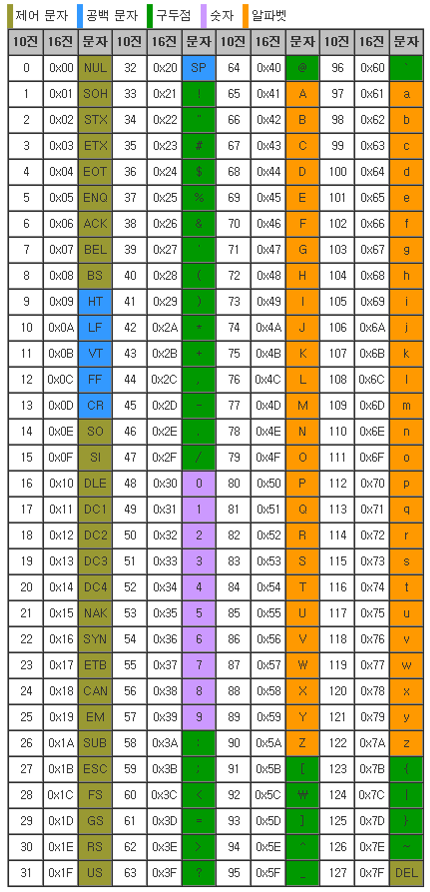

# 문자와 엔디안

같은 데이터를 어떤식으로 분석하느냐, 해석하느냐에 따라 굉장히 많은 차이가 있을 것.

저장된 데이터는 변하지않는데, 이를 어떻게 분석하느냐의 차이가 있다를 얘기해주는 것.

데이터는 여러개를 한번에 선언할 수 있음.

```nasm
a db 0x11, 0x11, 0x11, 0x11 ; [0x11]
```

꼭 변수를 사용할 때 첫번째 위치에만 데이터를 넣는게아니라, 쉼표를 구분으로 일련의 데이터를 넣을 수 있다는 것을 알 수 있음.

```nasm
msg db ‘Hello world’, 0x00
```

msg 의 메모리를 살펴보면 Hex 단위로 (16진수 기준) -> (0x48, 0x65, 0x6c, 0x6c … )

이상하게 들어가있는데, 어떤 숫자를 어떻게 분석하느냐가 여기서 나옴.

규약이 여러개가 있는데, 가장 기본이 되는 아스키 코드를 살펴보겠다.



따라서 HELLO WORLD 로 이뤄진거임.

0x0 이 문자가 끝난다는 의미임. (NUL)

문자의 연속적인 것을 문자열이라고 하는것.

```nasm
msg db 0x48, 0x65, 0x6c, 0x6c, 0x6f, 0x20, 0x57, 0x6f, 0x72, 0x6c, 0x64, 0x0

; Hello World 가 나옴
```

윈도우즈에서 api 를 제공해주는데 그 중 하나가 PRINT_STRING 이였던 것. ( 크게 안중요함 )

문자열 데이터를 바로 화면에 출력하는 윈도우 api다 정도만 기억하자.

문자 데이터도 숫자로 표현이 되는구나~ ( 아스키 코드 )

데이터를 하나 만들어보겠음

```nasm
b dd 0x12345678
```

메모리를 보면 b가 거꾸로 0x78, 0x56, 0x43 … 이렇게 저장이 되어있는데, 이는 리틀 엔디안 과 빅 엔디안으로 인한 영향임

빅 엔디안은 0x12, 0x34, 0x56 …

리틀 엔디안은 0x78, 0x56, 0x34

인텔과 AMD에서는 리틀 엔디안을 사용함.

이거 은근히 중요한게, 온라인게임을 만들어서 데이터를 서버에 전송해야한다고 할때 이 엔디안이 이슈가 클 수 있음.. 리틀 엔디안이 리틀 엔디안과 매칭이 되어야하는데, 그러지 못할때가 있기에 꼭 엔디안을 고정시킨 상태에서 데이터를 보내게 될텐데 나중에 배우게 된다.

근데 리틀 엔디안 같이 뒤집어서 쓰는 아이가 있는걸까?

장단점이 교차한다. ( 알 필요는 없음 방식만 있다는 것만 알아도 충분하다. )

- 리틀 엔디안 : 캐스팅에 유리하다. ( 데이터에 근접하고 쓰는것에 빠르다. )
- 빅 엔디안 : 숫자 비교에 유리. ( 대소관계를 비교한다고 했을떄 쉽다. )