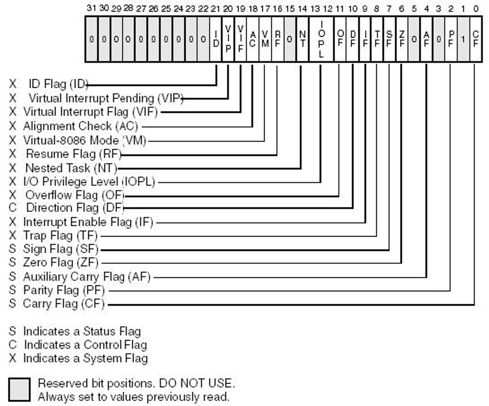
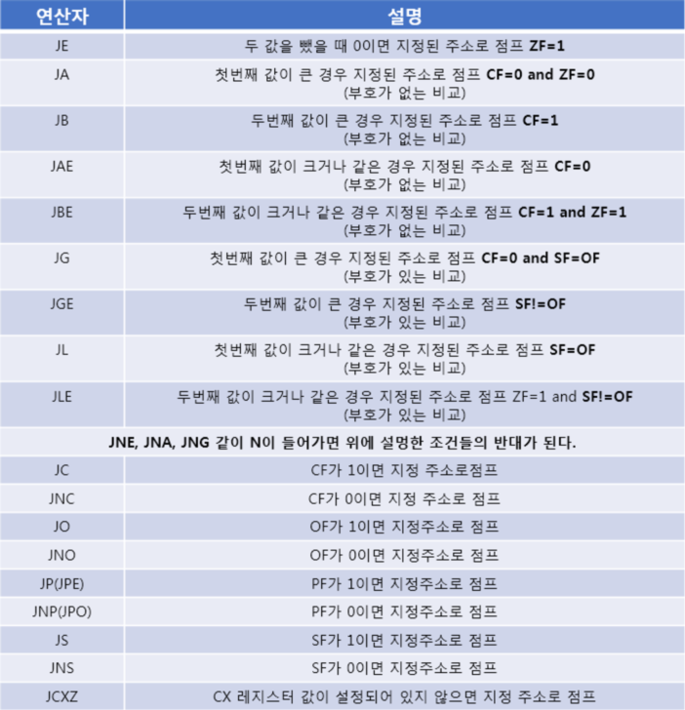

# 분기문

분기문 ( if )

특정 조건에 따라서 코드 흐름을 제어하는 것을 의미한다.

ex ) 스킬 버튼을 눌렀는가 ?  YES -> 스킬 사용 ex ) 제한 시간 내에 던전 입장 수락 버튼을 눌렀는가? -> YES -> 던전 입장, NO -> 던전 취소

조건을 체크하고 흐름을 보내는게 중요하다는 것을 알자. ( 조건 -> 흐름 )

```nasm
; CMP dst, src ( dst가 기준 )
; 비교를 한 결과물은 Flag Register 저장이 되어 있음. ( 상태 저장, 결과 저장으로도 레지스터가 쓰이기도 한다는 것을 알자. )

; JMP [label] 시리즈
; JMP : 무조건 jump
; JE : JumpEquals 같으면 jump
; JNE : JumpNotEquals 다르면 jump
: JG : JumpGreater 크면 jump
; JGE : JumpGreaterEquals 크거나 같으면 jumpdd
; JL
; JLE

; 두 숫자가 같으면 1, 아니면 0을 출력 하는 프로그램.

mov rax, 10 ; rax에 10
mov rbx, 20 ; rbx에 20

cmp rax, rbx ; compare 를 때려준것~

je LABEL_EQUAL

; je에 의해 점프를 안했다면, 같지 않다는 의미
mov rax, 0
jmp LABEL_EQUAL_END

LABEL_EQUAL :
	mov rax, 1
LABEL_EQUAL_END :

PRINT_HEX  1, rcx
NEWLINE

; 10 , 20 = 0
; 10, 10 = 1

; 연습 문제 : 어떤 숫자 ( 1~100)가 짝수면 1, 홀수면 0을 출력하는 프로그램
mov ax, 100

; 나누기 연산
; div reg
; - div b1 => ax / bl (al 몫 ah 나머지 )

mov bl, 2
div bl
cmp ah, 0 ; 0과  비교
je L1
mov rcx, 0
jmp L2

L1 :
	mov rcx, 1
L2 :
	PRINT_HEX 1, rcx
	NEWLINE
; ax 100 이면 1
; ax 99 면 0
```

eflag register



cmp eflag

