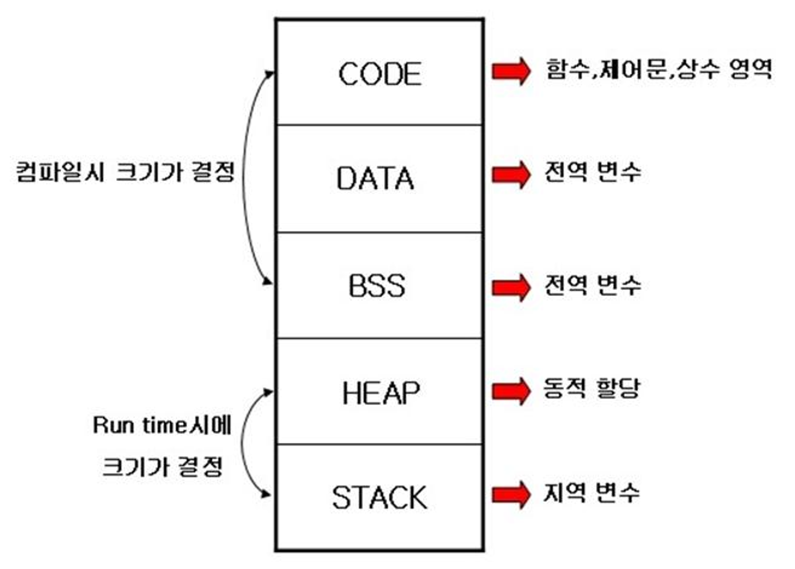
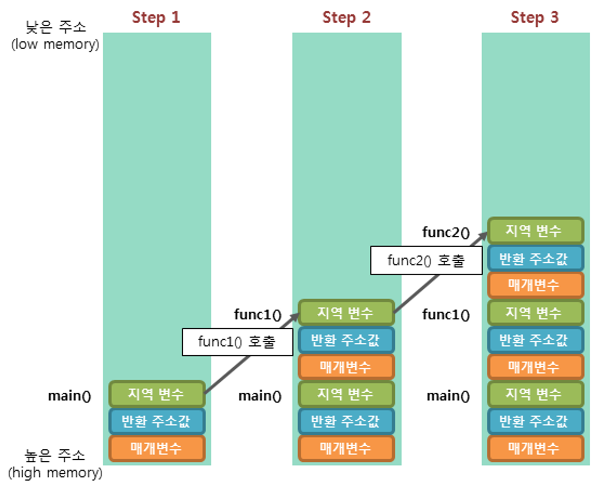

# 스택 메모리

스택 메모리, 스택 프레임 버그가 일어났을떄, 도움을 많이주는 부분이다.





레지스터는 다양한 용도로 사용

- a b c d 범용 레지스터
- 포인터 레지스터 ( 포인터 = 위치를 가리키는 ~ )
- ip (Instrunction Pointer) : 다음 수행 명령어의 위치
- sp (Stack Pointer) : 현재 스택 top 위치 (일종의 cursor)
- hp (Base Pointer) : 스택 상대주소 계산용

```nasm
mov rbp, rsp

    push 1
    push 2
    push 3

    pop rax
    pop rbx
    pop rcx
    push rax
    push rbx
    push 5
    push 2
    call MAX
    PRINT_DEC 8, rax ; 5가 출력됨.
    NEWLINE
    add rsp, 16
    pop rbx
    pop rax

    xor rax, rax
    ret

MAX :
    ; 이 패턴은 항상 보일거임.
    push rbp
    mov rbp, rsp

    mov rax, [rbp+16]
    mov rbx, [rbp+24]
    cmp rax, rbx ; 비교
    jg L1
    mov rax, rbx
L1:
    pop rbp
    ret
```