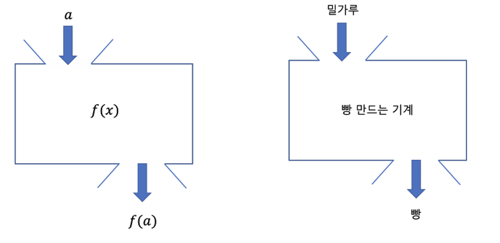
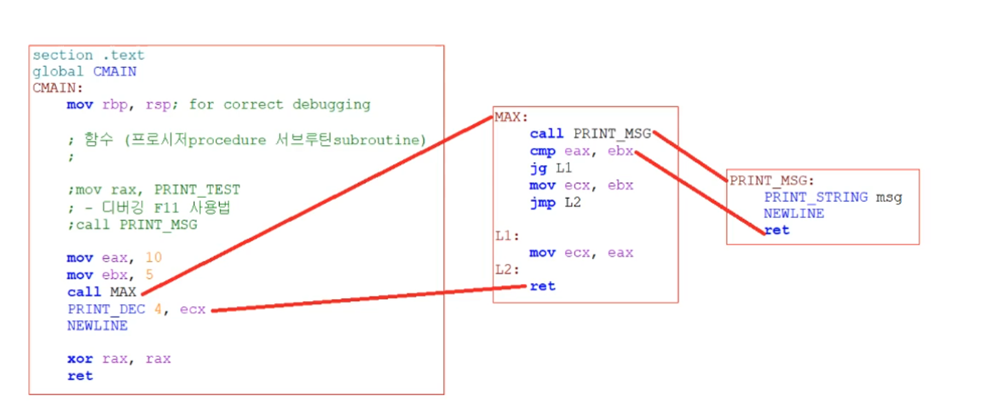

# 함수

함수 (프로시저 procedure 서브루틴 subroutine)

```nasm
mov rbp, rsp

call PRINT_MSG ; Hello World

xor rax, rax
ret

PRINT_MSG :
    PRINT_STRING msg
    NEWLINE
    ret

section .data
    msg db ‘Hello World’, 0x00
```



```nasm
mov eax, 10
mov ebx, 5
call MAX
PRINT_DEC 4, ecx ; 10
NEWLINE

; 두 값중 더 큰 값을 반환하는 max
; 근데 2값을 어떻게 넘겨받지? 반환 어떻게?
; 레지스터를 이용하면 어떨까 -> eax와 ebx 입력값을 ecx에 반환

MAX :
    cmp eax, ebx
    jg L1
    mov ecx, ebx
     jmp L2
L1 :
    mov ecx, eax
L2 :
    ret
```



```nasm
 그런데 인자가 10개라면 어떻게 할까? a b c d
  eax, ebx 같은 레지스터에 넘긴다고 할때, 여기에 이미 중요한 값이 있으면 어떻게 할까? -> 이건 위험하다.
 [!] . data .bss 사용하면? -> 이렇게 간단하게 될 문제가 아님.
 인자를 도대체 몇개를 할당해야 하지?

다른 메모리 구조가 필요하다. 꿈으로 비유해보자.
- 꿈이 유효한 동안에는 그 꿈을 유지시켜야 함 (유효 범위의 개념이 있다)
- 꿈이 끝나면 그 꿈을 부셔버려도 됨 (정리의 개념이 있다)
- 꿈에서도 또 꿈을 꿀 수 있다는 것을 고려해야 함 (유동적으로 유효 범위가 확장 가능)

 [!] 스택(stack)이라는 메모리 영역을 사용
 함수가 사용하는 일종의 메모장
 - 매개 변수전달
- 돌아갈 주소 관리
```