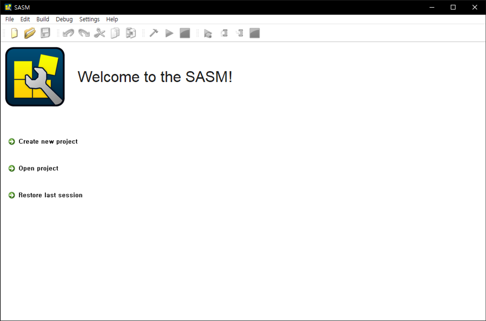
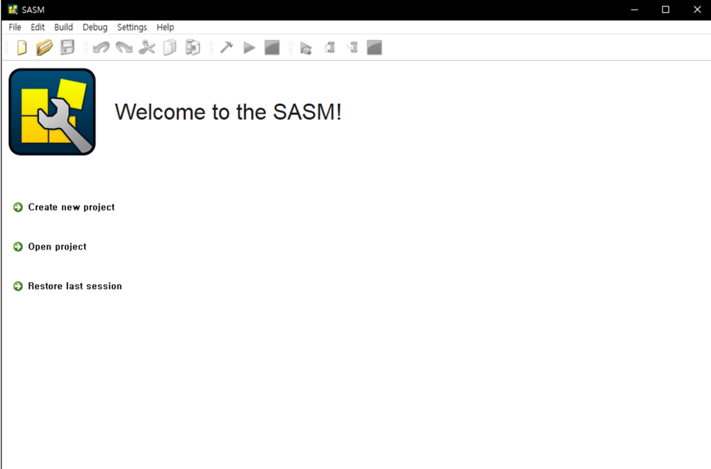
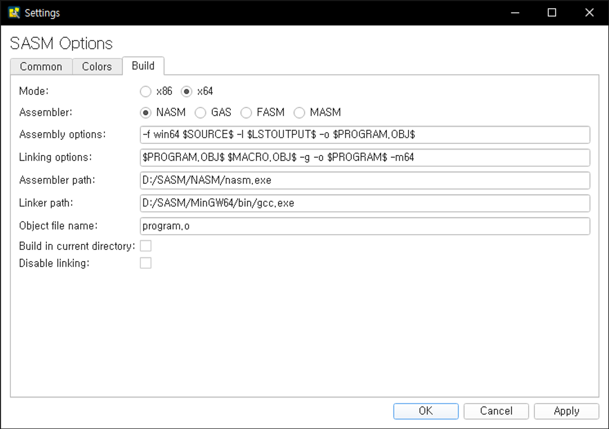
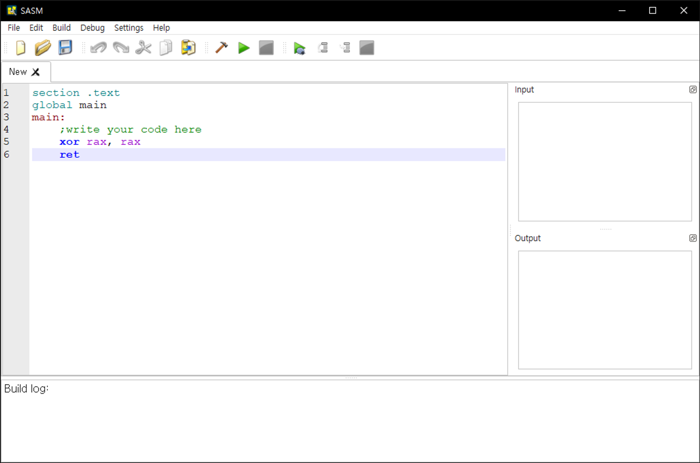
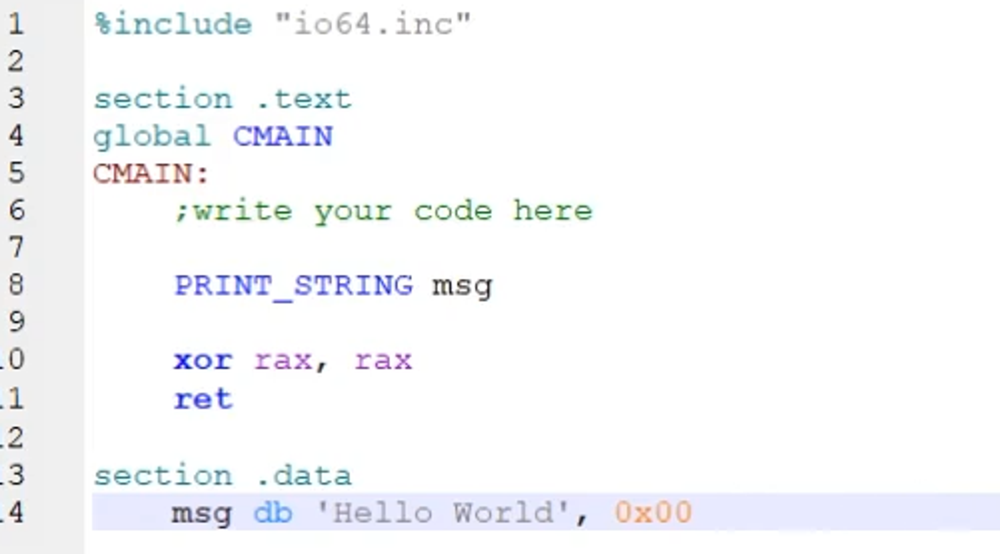
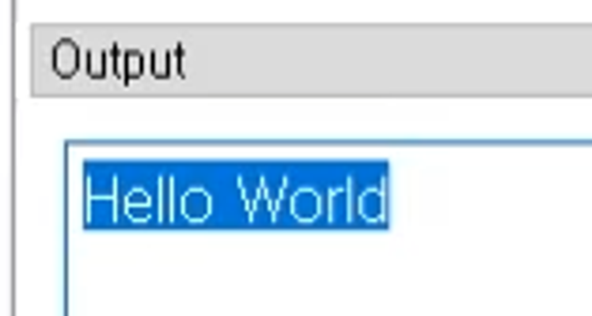
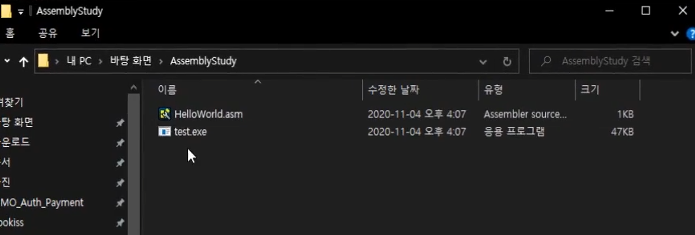
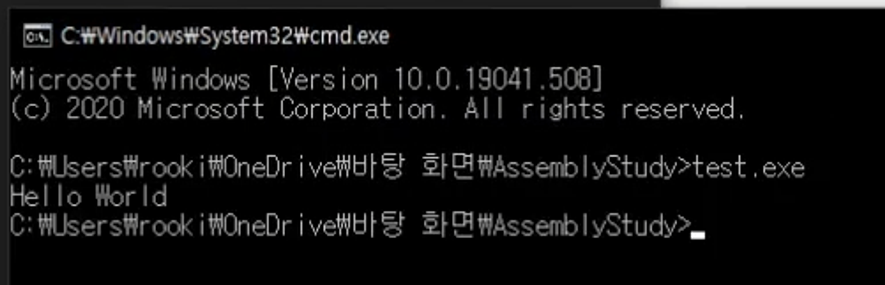
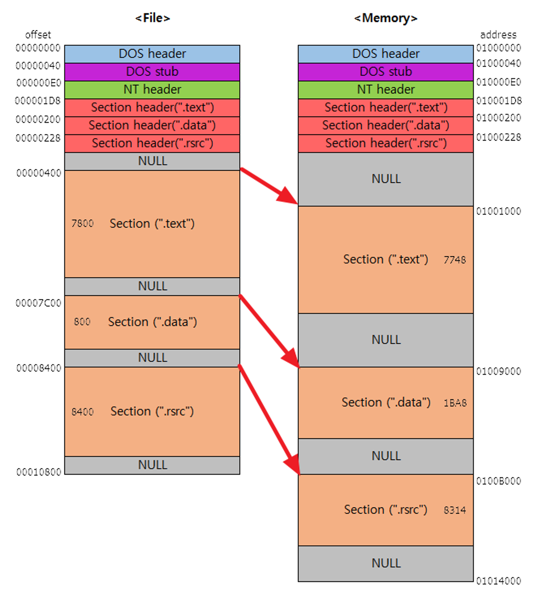
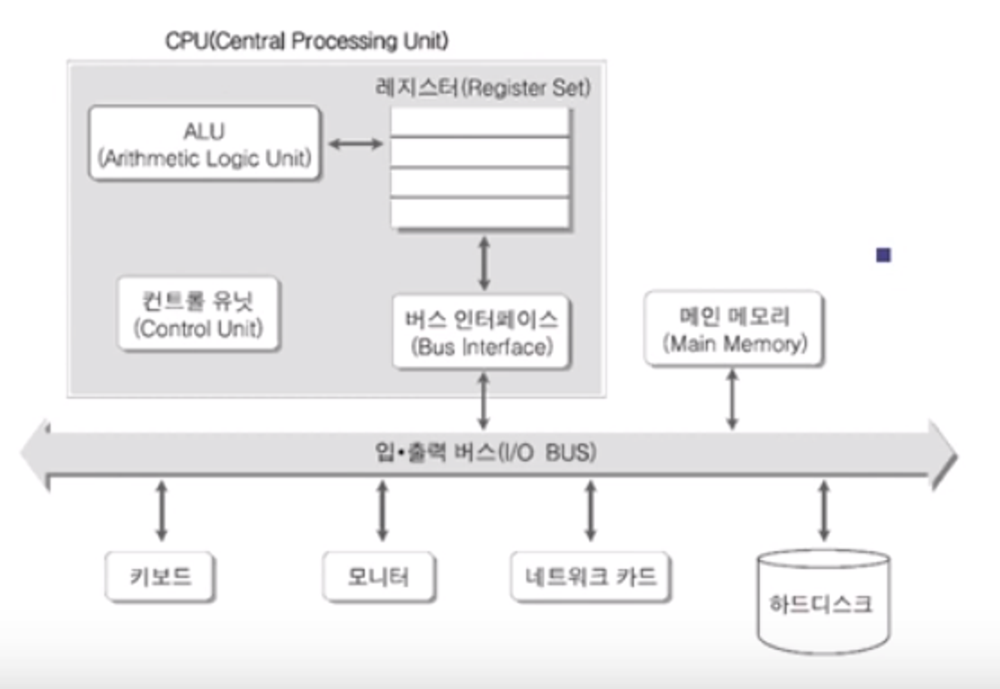

# 환경설정

어셈블리 언어를 공부하기 위한 SASM의 환경설정

settings → Build 로 이동

64 비트 환경으로 하기에 x64로 설정하고 가장 통상적으로 많이 사용하는 NASM 버전으로 설정.

프로그래밍할때 가장 종교적인 의식인 Hello world를 만들어보자!

PRINT_STRING 의 경우 어셈블리 언어는 아니고 이 Tool 자체의 환경에서 제공하는 유틸리티 함수이다.

이를 실행 프로그램으로도 저장해서 실행시킬수 도 있다.

하지만 눌러봤을때 아무 반응이 없을 것이다. 왜냐하면 우리가 적은 코드에는 Hello World 만 출력하기만 하지 멈춰있어주는 코드는 없기에 그렇다.

그래서 얘는 터미널로 지정해서 실행시켜줘봤다.

아주 잘 뜨는 모습!

# 그래서 SASM을 요약하면?

SASM은 통합 환경이라고 보면 된다. (vscode 랑 같은 역할)

NASM을 빌드설정에서 해줬던것이 얘가 바로 어셈블리 역할을 해주는것.

# 컴파일이란?

어떤 언어를 공부하던 우리가 사람으로서 이해하기 쉬운 그런 언어들로 작성하게 해줄텐데 컴퓨터는 이런 영어를 분석해서 실행하지않음.

컴퓨터도 자기가 원하는 0과 1로 이뤄진 기계어라고 하는 포맷이 있어야지만 분석하고 실행할 수 있는데, 내가 만든 코드들을 변환해주는게 컴파일러 ( = 어셈블러 ) 라고 한다.

그래서 이걸 기계어로 변환해서 번역기 처럼 컴퓨터한테 통역 시켜주는거다.

# 실행파일구조

exe 파일을 까보면 이런식으로 되어있다.  ( 온갖 정보를 담고 있다는걸 알고 가자. )

Section (”.text”)에는 만들어준 코드가 들어갈거고, Section (”.data”)에는 고정된 Data를 배치해준다.

# 컴퓨터구조

쉽게 생각해서 CPU ↔ 메인 메모리 ↔ 하드디스크 이 삼총사가 왔다갔다하면서 프로그램이 실행이 된다고 보면 된다.

이제 이를 테면 ‘롤’이라는 프로그램을 설치했다고 가정하면 하드디스크에 설치가 될건데,

우리가 전기가 나갔을때도 하드디스크에 있는 내용은 보존이 되지만 메모리에 있는 내용은 보존이 되지 않는다.

그리고 이 CPU에 가까울수록 접근하는 속도도 월등하게 빨라지는데, CPU는 메모리랑 가장 빠르게 반응하고, CPU와 하드디스크는 그것보다는 접근이 느리다.

다만 하드디스크는 영구적인 데이터를 저장할 수 있다는 장점이 있고, 메모리는 데이터가 휘발성이다라는게 특징이다.

롤이라는 프로그램을 키면 → 하드디스크 → 메모리에 올라가게 된다. ↔ CPU 왔다갔다 하면서 작업하게 되는 부분이 된다.