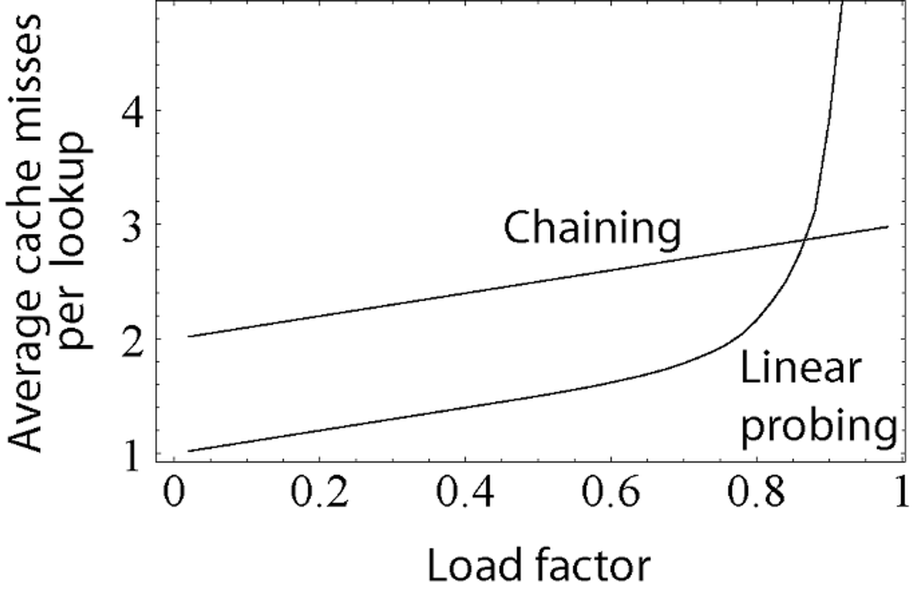
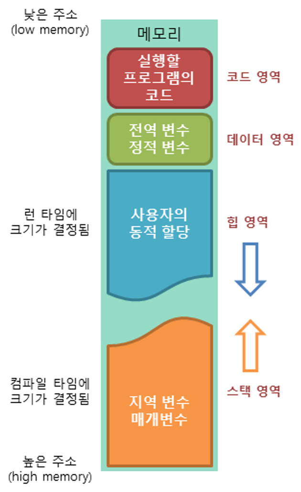

# C++

C++에 대한 기술 면접 준비를 위한 문서이다.

## 객체 지향과 C++

면접관이 시험으로도 질문으로도 제시하기 만만한 분야이다. (자주 나온다는 것)

정의를 암기해 가는 것이 좋아보인다.

`메서드 == 함수` 이다.

C++는 객체지향언어는 아니고 멀티 패러다임 (객체지향과 절차지향 두가지를 지원하기 때문이다.)

## 절차적 프로그래밍과 객체지향의 차이점

### `절차적 프로그래밍 (Procedural Programming)`

프로그램 설계 시 기능 구현을 위해 프로시저(함수)를 중점으로 사용하여 구조 / 로직을 설계하는 방법

### `객체지향 (Object-Oriented Programming (OOP))`

프로그램 설계 시 프로그램을 수많은 객체로 나누고 이 객체들의 상호작용으로 서술하는 방법

## 객체지향의 장점

코드 재사용이 용이하다.

클래스를 기능별로 분할하였기에 모듈화도 용이하고 상속을 통해 높은 확장성을 가질 수 있다. 또한 객체를 만들어두면 재사용할 수 있어 유지보수성이 뛰어나다. (겡미은 늘 갈아엎고 뒤집히는 경우가 많기 때문에 유지보수성에 특히 민감하다)

## 객체지향의 특징

### `캡슐화 (encapsulation)`

클래스를 통해 변수와 함수를 하나의 단위로 묶는다.

하나의 기능을 하는 요소들을 모두 한 캡슐에 모아둔 것 같다고 하여 캡슐화이다.

같은 역할을 하는 변수, 함수들으 모아두었기 때문에 의존성, 커플링이 줄어든다. 그로 인해 관리가 용이해진다.

### `정보은닉 (Information Hiding)`

프로그램의 세부 구현을 감추는 것이다.

private 접근자를 통해 변수와 객체를 감추고, public 접근자로 선언된 메소드 (함수) 로만 접근을 허용하여 접근을 제한하는 것.

**왜?** -> 의도하지 않은 접근을 제한하기 위하여 ( = 설계한 클래스를 다른 사람이, 혹은 본인이 잘못 쓰는 것을 방지한다.)

ex) 다른 사람이 설계한 클래스의 변수에 직접 접근하여 값을 바꾸는 것을 막는다.

이러면 코드 사용자는 프로그램의 내부 구현에 신경 쓸 필요 없이 메소드를 통해 원하는 기능을 호출하기만 하면 된다.

**제대로 쓰기엔 쉽게 설계하고, 잘못 쓰기엔 어렵게 설계하라.**

또한, 객체들 끼리 서로의 구현과 상태를 상관하지 않고 단지 사용하게만 함으로써 의존성을 낮추는 역할을 한다.

### `상속 (Inheritance)`

자식 클래스가 부모 클래스의 변수, 함수를 물려받는 것이다.

자식 클래스는 자신만의 특성을 오버라이딩을 통해 디테일하게 구현한다.

**왜?** -> 다형성과도 연관되는 질문으로, 부모와 자식을 다형성으로 엮어놓으면 부모에서 추상적인 형태를 주고, 자식에서 세밀화하여 유연하게 코드를 작성할 수 있으며 생산성, 유지보수성 또한 올라간다. (유지보수성의 경우 무분별한 복사-붙여넣기를 막을 수 있는 효과가 있다.)

**복붙으로도 간단하게 상속으로 할 수 있는 일을 할 수 있잖아?** -> 또한 나중에 개선 시 '교체'가 가능하단 장점이 있다. 

ex) A사의 타이어 객체를 사용하고 있다가, B사의 타이어 객체로 개선하고 싶으면 B사는 '타이어'를 부모로 상속받아 자신에 맞게 구현하기만 하면 된다.

복사-붙여넣기로 만들어진 코드들은 각각이 다른 코드이므로 개선이 필요할 때 구현을 따로따로 해줘야 하며, 유지보수가 어려워진다.

### `추상화 (Abstraction)`

공통의 속성이나 기능을 묶어 이름을 붙이는 것.

------

## 클래스

**클래스란?** -> C++에서 객체를 구현하기 위해 사용하는 방법이다.

객체의 상태 / 특성을 정의하는 일종의 **설계도 (청사진, Blueprint)**이며, 객체화 했을 때 객체가 된다. (**인스턴스화** 라고 한다.)

즉 `클래스 != 인스턴스`이며, 클래스가 인스턴스화 해야 인스턴스(객체)가 될 수 있다.

변수와 메서드를 가진다.

----

## 인스턴스

클래스를 기반으로 만들어져 실제로 메모리에 할당된 것.

-----

## 구조체 / 클래스 패딩

패딩이란 구조체나 클래스를 실제로 메모리에 올릴 때, 성능 향상을 위해 추가적인 메모리를 할당하여 끼워 넣는 것을 의미한다.

### 패딩을 하는 이유

메모리에서 CPU 레지스터로 한번에 읽어오는 (fetch) 데이터의 크기 때문에 패딩이 일어난다. 

32비트 머신에서는 4바이트 씩이고, 64비트 머신에서느 8바이트씩.

이렇게 선언을 하면 메모리 맵상의 어딘가에 영역이 잡히게 된다.

그런데 패딩이 없다고 가정하면
```assembly
|a|bb|cccc|a|bb|cccc|a|bb|cccc|a|bb|cccc|...
```

이런식으로 잡히게 된다.

fetch는 4바이트 단위로 이루어지니까 만약 첫번째 c를 접근하기 위해서는 2번의 fetch가 이루어져야 한다.

0번째 바이트부터 3번째 바이트까지 4바이트를 읽어서 그 중에 3번째 바이트를 먼저 취하고, 4번째 바이트부터 7번째 바이트까지 4바이트 읽어서 그 중에 4~6번째 바이트를 취해서 둘을 합해 최종 c의 값을 만드는 결과가 생긴다.

때문에 컴파일러가 패딩을 넣는 것이다.

### 요약

구조체 / 클래스 패딩은 구조체 안의 가장 큰 자료형의 크기로 정해진다.

만약 구조체 안에 구조체가 들어가 있다면, 그 구조체 안에서 가장 큰 자료형의 크기로 정해진다. 

만약 설정이 8byte 패딩으로 되어 있는데 구조체가

```c++
class c
{
    short a;
    int b;
    int c;
};
```


이와 같이 구성되어 있다면, short-int를 하나로 묶어서 6바이트 + 2바이트 패딩(총 8바이트) int + 패딩 4바이트 (총 8바이트)식으로 묶는다. (단, short는 2bytes, int는 4bytes일때의 풀이이다.)

만약 설정이 4bytes 패딩이라면,

```c++
class C
{
    short a; // 4byte
    int b; // 4byte
    int c; // 4byte
    
    // 4 + 4 + 4 = 12 byte 가 된다. = sizeof(C)가 12
};
```

```c++
struct Name // 2byte
{
    char name[2];
};
```

-> 답은 2이다. 왜냐하면 패딩은 레지스터 단위 접근을 쉽게 하기 위해 만드는 것인데, char[2] 는 2바이트이며, 다음에 접근할만한 요소가 없기 때문에 2만 차지해도 되기 때문이다. (만약에 int형 변수가 뒤에 하나 더 선언되어 있다면 총 용량은 2 + 2(패딩) + 4 였을 것이다.)

```c++
struct Point // 8byte
{
    short point_x; 
   	int point_y; 
};

struct Player // 20byte
{
 	char rank;
 	short hp;
    short mp;
    Point point;
    Name name;
};
```

Point의 제일 큰타입의 int이므로, 4byte 기준으로 패딩이 잡힌다.

`char + short + 1byte 패딩 / short + 2byte 패딩 / 8byte(point) / 4byte(name)`

mp와 point는 따로 용량을 잡는다.

```c++
struct long_Point // 16byte
{
    double point_x;
    int point_y;
}
```

`double = 8byte` 이므로 총 메모리 용량은 8 + 8 = 16byte

소켓 프로그래밍 중 패킷 구조체를 구현할 때 `#pragma pack(push, 1)`을 쓰는 이유도 패딩에 있다.

패킷을 받은 쪽은 패킷을 읽어서 값을 복구해야 하는데 (캐스팅을 통해), 패딩이 들어가 있으면 잘못된 크기를 가지고 캐스팅을 하게 되므로 잘못된 값이 복구되기 때문이다.

---------

## 다형성

객체지향에서 다형성은 여러가지 형태를 가질 수 있는 능력을 의미한다.

C++에서의 다형성은 상속에 의한 다형성, 오버로딩, 오버라이딩, 탬플릿에 의한 다형성 등으로 구현된다.

### `오버로딩`

같은 이름의 함수라도 인자(Parameter) 타입이 다르거나, 개수가 다르면 다른 함수로 정의하여 사용할 수 있다. (주의 : 리턴 타입은 오버로딩과 아무 상관이 없다. 리턴 타입으로 함수를 구분할 수 없기 때문)

### `오버라이딩`

상속 관계에서 부모의 메서드를 자식이 자기에 맞게 재정의해서 사용한다.

### `탬플릿`

클래스, 함수를 타입에 독립적이게 만드는 도구이다.

템플릿을 사용하면 여러타입에 대응하는 단 하나의 객체나 함수를 만들 수 있다.

템플릿의 타입은 컴파일 타임에 결정되어 인스턴스화 하기 때문에 컴파일 타임에 컴파일러가 실제 코드 구현부를 모두 볼 수 있어야 한다.

인스턴스화는 컴파일러가 컴파일 시에 요구되는 탕비으로 클래스 정의 코드를 생성해내는 것이다. 즉 타입을 지정하여 그 타입을 사용하는 클래스를 만들어낸다.

ex) 만약 float 타입으로 템플릿 클래스를 사용했다면 컴파일 타임에 컴파일러가 float 타입의 클래스를 만들어낸다, 이를 인스턴스화라고 한다.

그렇기 때문에 템플릿 클래스이 함수 구현은 헤더 파일에 들어가야 한다.

혹은 헤더 파일에서, 템플릿 정의부분 아래에 cpp 파일을 인클루드 하는 방법도 있다. 이 방법을 사용할 때 주의할 점은 cpp 파일을 빌드 리스트에 넣지 말아야 한다는 것이다.

-----

## 포인터 변수와 참조, Malloc과 New

### `참조자 (Reference)`

실체가 있어야 하며 선언 즉시 할당되어야한다. 즉 NULL, nullptr 로 할당 불가능하다.

레퍼런스는 초기화리스트를 사용하여 먼저 초기화 해야하는데 (modren c++의 초기화리스트와는 다르다. 생성의 초기화리스트를 의미한다.), 이는 생성자 내부에서의 초기화는 먼저 null로 생성한 뒤 값을 넣는 방식이기 때문이다.

또한 한번 할당하면 다른 곳에 재할당 불가능한게 특징이다.

### `포인터 (Pointer) 타입 변수`

주소값을 저장할 수 있는 타입의 변수.

실체가 없이 NULL이 가능하며, 언제든 할당할 수 있다. 또한 동적 메모리 할당에 사용한다.

참고로 초기화리스트는 상수, 참조자, has-a 관계의(포함한) 클래스 초기화에 사용해야 한다.

**Malloc과 New의 차이점(C 스타일 동적할당과 C++ 스타일 동적할당의 차이점)**

- Malloc : 단순한 메모리 할당. 할당시 메모리의 사이즈를 입력해서 할당받는다. C스타일이며, malloc은 void*를 리턴하기 때문에 원하는 타입으로 캐스팅해서 사용
- New : 할당과 동시에 초기화 가능(초기값을 줄 수 있다.) 생성자 호출됨 (즉 C++ 객체할당에 사용함), 오버로딩이 가능하다.(new도 연산자이다) 또한 할당 시 객체의 크기를 입력하여 할당받는다. C++ 스타일

```c++
int * c_style = (int*)malloc(sizeof(int) * 10);
int * cpp_style = new int[10];
```

### `댕글링 포인터`

포인터 변수를 delete나 free 할 시에 메모리가 할당 해제되었다 해도 변수가 가리키는 주소값이 사라지는 것이 아니기 때문에, 그 포인터 변수를 다시 참조하려고 하면 미정의 동작을 수행한다.

그래서 메모리를 해제하는 구문 이후, 해당 포인터 변수를 nullptr로 바꿔주고 사용할 때마다 nullptr인지 체크하는 테크닉이 필요하다.

비주얼 스튜디오의 경우, 메모리를 해제하면 0x0823 같은 메모리로 치환하여 강제 크래시를 유발하기도 한다. (의도적인 크래시가 미정의 동작보다 차라리 안전하기 때문)

```c++
int *g = nullptr;

int main()
{
    int *p = new int;
    *p = 7;
    g = p;
    
    // ...
    delete p;
    p = nullptr;
    // ...
    
    *g = 4; // 올바르지 않은 메모리!
};
```

단, 이런 문제가 발생할 수 있다. 아무리 p를 할당 해제 후 nullptr로 치환하였다고 해도, p를 참조하는 포인터 변수가 있었다면(g와 같은) 이는 추적하기 힘든 메모리 누수 / 버그를 발생시킬 수 있다. 스마트 포인터를 쓰면 이러한 문제를 어느정도 해소할 수 있다.

## 스마트 포인터

이전의 C++에서 동적 메모리를 할당하기 위해서는 new / delete를 이용해 포인터 변수를 정의하여 사용하여야 했다.

이러한 포인터를 원시 포인터 (날 포인터, raw pointer)라고 한다.

C++에서의 메모리는 프로그래머가 책임지고 delete를 통해 사용되지 않는 메모리를 반환해야 했고, 메모리를 반환하지 않아 **메모리 누수(Memory Leak)**가 발생하거나 적절하지 못한 타이밍에 메모리를 delete하여 `댕글링 포인터(Dangling Pointer)`를 발생시켜 프로그램의 안전을 심히 위협하는 경우가 생기기도 했다. 특히 메모리 버그는 찾기 겁나게 어려우므로 항상 문제가 됐다.

이때 **스마트 포인터**는 C++11에서 공식적으로 추가된 기능으로, 스마트 포인터를 사용하면 객체가 더는 필요하지 않을 때 객체에 할당된 메모리가 자동으로 해제된다. 즉 **메모리 누수의 가능성을 영구적으로 제거한다.**

C#이나 Java처럼 Garbage Collector를 사용하는 것은 아니고 레퍼런스 카운트를 통하여 제거 시점을 결정한다.

스마트 포인터는 `<memory>` 헤더 안에 정의되어 있다.

**스마트 포인터와 원시 포인터의 차이점은?**

1. 스마트 포인터는 자유 공간(new/delete로 할당된 공간, malloc/free로 할당한 공간은 힙 공간이라고 한다. 서로 크게 다른 개념은 아닌 것 같다.)에 할당한 메모리의 주소만 저장할 수 있다.
2. 원시 포인터에서 하던 증가, 감소 같은 산술 연산은 스마트 포인터에서 할 수 없다.

### `unique_ptr<T>`

타입 T에 대한 포인터처럼 사용되며, 언제나 유일해야 한다. 즉 둘 이상의 unique_ptr이 같은 주소를 가질 수 없으며, unique_ptr은 복사될 수 없다. (유일성을 손상시켯너 안된다.)

unique_ptr을 옮기려면 오직 소유권을 이동시키는 행위만이 허용된다.

utility 헤더에 정의된 std::move()를 사용하면 unique_ptr 객체에 저장된 주소를 다른 unique_ptr 객체로 이동시킬 수 있으며, 소유권을 이전하면 기존의 unique_ptr 객체는 **무효화(Invalidate)**된다.

그러므로, 객체에 대한 단일 소유권만 허용하고 싶을 때는 (반드시 하나만 가지고 사용하고 싶을 때는) unique_ptr<T>를 이용하는 것이 좋다.

```c++
// unique_ptr 사용방법
unique_ptr<type> name {name type()};

// ex)
unique_ptr<string> pname {new string {"Algernon"}};
auto pname = make_unique<string>("Algernon");
auto pstr = make_unique<:string>(6, "*");
// 스마트 포인터는 원시 포인터와 마찬가지로 역참조를 통해 객체에 접근할 수 있다.
cout < *pname << endl;
// 임의의 크기로 스마트 포인터 배열을 생성할 수도 있다.
int len = 10;
unique_ptr<int[]> pnumbers{new int[len]};
unique_ptr<int[]> pnumbers = make_unique<int[]>(len);
// unique_ptr 객체는 복제가 불가능 하므로, 함수에 값을 전달할 수 없다. 만약에 unique_ptr 객체를 함수의 인자로 쓰고 싶다면 인수를 참조 매개변수로 받아야한다.
// unique_ptr 객체는 복제될 수 없지만 암묵적 이동연산(Implcit Move Operation)에 의해 반환이 가능하므로 함수에서 반환될 수 있다.
reset() // 스마트 포인터가 가리키는 원본 객체를 소멸, unique_ptr은 해제된다.
ptr.reset(new string{"Fred"}) // reset의 인자에 새 객체를 넣으면 스마트 포인터와 새 객체를 연결해준다.
release() // 스마트 포인터가 가리키는 원본 객체의 소유권을 해제하고, 원본 객체를 리턴
// unique_ptr 객체끼리 비교하고 싶을 때는 두 객체의 get()을 호출하여 반환된 주소값을 비교한다.
```

### `shared_ptr<T>`

타입 T에 대한 포인터처럼 행동한다.

unique_ptr 과는 반대로 shared_ptr은 객체를 여러 shared_ptr과 공유할 수 있다. 레퍼런스 카운팅 방식을 사용하여 메모리를 관리하는데 새로운 shared_ptr 객체가 주소를 공유받을 때 마다 레퍼런스 카운트가 증가하며, 공유를 받았던 shared_ptr 객체가 소멸되거나, 다른 주소를 할당받거나, nullptr을 할당받으면 해당 객체의 레퍼런스 카운트가 감소한다. 

만약 레퍼런스 카운터가 0이 되면 (해당주소를 가리키는 shared_ptr 객체가 없으면) 해당 주소를 위한 힙 메모리가 자동으로 해제된다.

새로운 shared_ptr을 정의하면 두 가지 할당을 받게 된다.

1. shared_ptr이 가리키는 원본 객체를 위한 힙 메모리를 할당하게 된다.
2. 스마트 포인터의 레퍼런스 카운트를 위한 컨트롤 블록을 위해 스마트 포인터 객체와 관련된 힙 메모리를 할당받게 된다.

```c++
// shared_ptr 사용방법
shared_ptr<double> pdata {new double(999.0)}; // 일반적인 할당 방법
shared_ptr<double> pdata = make_shared<double>(999.0); // 일반적인 할당보다 효율적으로 동작한다. 추전하는 방법이다.
shared_ptr<double> pdata2{pdata}; // 다른 shared_ptr로 초기화하는 스마트 포인터. 레퍼런스 카운트가 증가한다.
double *pvalue = pdata.get(); // 스마트 포인터의 원시 포인터 객체를 반환한다. 반드시 사용해야 할 경우가 있을 때만 이렇게 사용해야 하며, get()을 통해 반환한 원시 포인터를 이용해서 shared_ptr<T>를 생성하는것은 올바르지 못한 행동이며 위험을 초래할 수 있다.)
pname.reset(new String{"Jane Austen"}); // reset()의 인수없이 호출하면 레퍼런스 카운트가 1 감소하며, 해당 shared_ptr 객체가 아무것도 가리키지 않게 된다. (unique_ptr의 동작과는 좀 다르다, 물론 레퍼런스 카운트가 1이었다면, 해당 shared_ptr 객체를 reset 하는 순간 스마트 포인터가 헤제된다.) 
// reset()의 인수로 원시 포인터를 전달하면 shared_ptr이 가리키는 주소를 바꿀 수 있다.
// shared_ptr 끼리의 비교는 == 연산자를 사용하여 비교할 수 있다. 단 두 객체가 모두 nullptr 일 수 있으므로, 같은 객체를 가리키는지만 체크하면 안된다.
if (( pA == pB && (pA != nullptr)) // 스마트 포인터는 암묵적으로 bool로 변형될 수 있으다. (객체가 있으면 true, nullptr이면 false) 
if ((pA == pB && pA)) // 이렇게도 비교 가능하다.
pname.use_count() // use_count()는 해당 shared_ptr이 가리키는 객체의 레퍼런스 카운트를 반환한다. nullptr을 가리킨다면 0을 반환한다.
// .unique() 함수를 통해 shared_ptr이 유일한지(true), 복제본이 있는지(false) 확인할 수 있다.
```

### `weak_ptr<T>`

shared_ptr의 **상호참조** 문제를 해결할 수 있다.

weak_ptr은 shared_ptr 객체에서 생상하여 연결하며, 같은 주소를 가리킨다.

단 weak_ptr은 연결된 shared_ptr 객체의 레퍼런스 카운트를 증가시키지 않으므로, 객체의 소멸에 관여하지 않는다.

shared_ptr의 메모리의 레퍼런스 카운트가 0이 되어 해제되더라도 연관된 weak_ptr 객체는 남아있게 된다.

----

## 가상함수

### `추상 클래스(abstract)`

보다 구체적인 클래스가 파생될 수 있는 일반 개념식 역할을 한다.

C++에선 순수 가상함수가 하나라도 포함된 클래스는 추상 클래스로 변환된다.

추상 클래스는 인스턴스화 할 수 없다.

순수 가상함수는 내용없이 형식만 정의된 함수로, '이 형식대로 만들어서 사용해라' 라는 의미로, 자식  클래스는 이를 반드시 오버라이드 해야 한다.

```c++
virtual void Func() = 0; // 순수 가상함수의 선언방식
```

### `virtual 키워드`

가상함수임을 나타내는 키워드이며, 상속 관계에서 자식이 해당 함수를 오버라이딩 하기 위해 사용한다. 즉 부모함수에 virtual이 없으면 자식이 오버라이드 할 수 없다.

또한 virtual 키워드를 사용했을 시 런타임에 가상함수 테이블이 생성되어 올바른 함수를 찾아갈 수 있게 만든다.

상속 관계에서 부모의 소멸자엔 반드시 virtual을 붙여야 하는데, 이것은 소멸시 virtual이 없으면 올바른 자식 객체까지 찾아가지 못 하여 부모의 부분만 소멸되고 자식의 부분은 남는 현상이 발생하기 때문이다. (이는 곧 메모리 누수, 오염으로 이어진다.)

객체 생성 및 소멸 과정에서는 **절대 생성자/소멸자에서 가상 함수를 호출하면 안되는데,** 그 이유는 자식 객체 생성 시에 가상ㅎ마수를 호출하게 되면 부모가 먼저 생성될 때, 자식 객체는 아직 초기화되지 않은 상태이므로 자식 객체는 자신이 부모 클래스인 것철머 동작한다. 즉 부모 클래스의 virtual이 호출된다. 그래서 의도하지 않은 동작을 하게 된다.

또한 미정의 동작을 수행할 수 있다. (Undefined Behavior)

### `가상 함수 테이블`

클래스마다 존재한다. (인스턴스마다가 아님)

각각의 인스턴스들은 해당 클래스의 가상함수 테이블을 가리키는 포인터 변수를 하나씩 가진다.

즉 가상함수가 있는 클래스의 인스턴스 메모리 크기를 구할 땐 이 포인터 변수의 크기를 더해주는 것을 잊지말아야 한다. (32bit 환경이면 4byte, 64bit 환경이면 8byte)

상속 관계의 클래스들은 가상 함수 테이블을 사용해 오버라이드 된 함수를 찾아간다.

가상 함수 테이블은 해당 클래스의 모든 가상함수의 주소값을 제공한다.

vtable에는 해당 가상함수들의 주소값이 들어있다. 상속 관계가 A->B면 클래스 A의 vtable에는 A의 가상함수들

```C++
aaa(void)
```

만약 클래스  B가 A의 aaa 함수를 오버라이딩 했다면 B의 vtable에는

```c++
aaa(void)
```

이런 식으로 테이블의 내용이 작성된다.

실제 코드를 보면 자식 클래스의 가상 함수 테이블에서는 자식 클래스에서 오버라이드 된 함수를 카리키는 것을 볼 수 있다.

----

## C++ 스타일 캐스팅

단순히 (int*) 와 같이 캐스팅하는 C 스타일과는 달리, C++은 4개의 캐스팅 방법으로 나뉘어진다.

### `const_cast`

해당 포인터 객체의 상수성을 제거한다.

상수성은 항상 유지되어야 하지만, 외부의 다른 라이브러리를 사용할 때 인자값으로 비상수성 객체를 요구한다던지 불가피한 상황에서 한시적으로 사용한다.

단, const_cast를 사용하는 것은 해당 객체를 인자로 받는 함수 내에서 해당 상수변수를 수정하지 않는다는 것을 알고 있을때만 사용해야 한다.

만약 함수 내에서 객체의 내용이 바뀐다면, 상수 제한을 잠깐 푸는 것에 그치지 않고 상수성 자체를 잃어버리는 것이기 때문에 문제가 생기게 된다. 이럴 땐 유도리 있게 사용할 것이 아니라 프로그램의 전체 구조를 다시 생각해 보아야한다.

### `static_cast`

일반적인 캐스팅 방식.

단점은 런타임 타입 검사를 하지 않는다는 것이다.

업캐스팅과 다운캐스팅을 둘 다 할 수 있는데, 계층 구조가 실제로 유효한지는 검사하지 않는다. 

즉 자식 클래스를 부모 클래스로 업캐스팅하여 사용하다가 (다형성을 위해), 다시 자식 클래스로 다운캐스팅하는 것은 유효하며 정상적인 사용법이지만, 순수한 부모 클래스인 객체를 자식으로 다운캐스팅하여 사용하는 것도 막지 않는다는 것이다.

이런 식으로 캐스팅하게 되면 메모리 침범 등 심각한 오류가 발생한다.

계층 구조 간 안전한 캐스팅을 하려면 dynamic_cast를 사용한다.

대신 dynamic_cast는 virtual 함수가 하나라도 있어야 한다. vtable에 RTTI가 저장되기 때문이다. (RTTI -> RunTime Type Information)

### `dynamic_cast`

런타임 타입 검사를 수행하는 안전한 다운캐스팅에 사용하는 캐스팅 방법이다.

타입이 유요한지 체크하기 위해 런타임에 타입 검사를 수행하기 때문에, **런타임 비용이 높아서 잘 사용되지 않는다.** 쓰는것도 못봤다.

### `reinterpret_cast`

타입을 강제 변환한다. double을 byte로 변환하는 등의 임의 변환이 가능하다.

타입을 비트 단위로 1:1 변환시킨다. 그렇기에 원본 데이터가 소실되거나 (짤리거나), 원하지 않는 결과가 나올 수 있으므로 주의해야 한다.

----

## STL 컨테이너

### `벡터(Vector)`

동적 배열(크기 조절 가능), 배열과 같이 연속된 자료구조이므로 **캐시 친화적**이다. **임의 접근 반복자(Random Access Iterator)**를 사용하므로 배열의 원소에 즉시 접근 가능하다. (반복자를 5가지 알아두면 도움이 된다)

emplace를 하면 복제 과정 없이 바로 원소를 삽입할 수 있어서 push_back 보다 비용이 절감된다. 단 반복자 무효화가 발생할 수 있다.

### `반복자 무효화`

컨테이너의 메모리가 재할당 될 때(vector resize, push_back 등)나 요소 삭제를 하는 등의 동작에서 발생할 수 있다.

만약 STL의 erase를 사용한다면 erase한 원소 포함해서 뒤의 원소를 가리키는 모든 반복자가 무효화된다. 이는 삭제 후 뒤에 있는 요소를 모두 땡겨줘야 하기 때문이다.

단, erase 함수는 다음 주소를 가리키는 iterator를 리턴 해주기 때문에, 이것을 사용하여 순회를 계속 할 수 있다. 그러므로, for문과 같이 iter를 계속해서 ++해주는 코드를 사용할 때 주의해야 한다.

### `벡터 요소의 삽입`

삽입한 위치 뒤를 가리키는 반복자들은 무효화된다. (나머지 원소들을 전부 밀어줘야하기때문에), 삽입 앞은 재할당에 따라 무효화 일수도 있고 아닐 수도 있으나 안전한 프로그래밍을 위해선 무효화라고 보는게 맞다. (삽입 앞은 원소의 위치 변동이 없으나, 메모리 재할당(크기 초과로 인한 재할당 등))이 일어날 수 있기 때문이다.

### `벡터 요소의 삭제`

삭제 뒤는 무효화 (뒤에 있는 원소들을 땡겨줘야하니까), 삭제 앞은 무효화 되지 않는다. (재할당이 일어날 일이 없다)

### `리스트(List)`

단/양방향 반복자를 사용한다. 이로 인해 임의 접근이 불가능하므로, 어떤 원소에 접근하기 위해선 해당 위치까지 순회해야 한다. (list의 advance 함수는 임의 접근철머 보이지만 실 구현은 순회로 구현되어 있다) 삽입과 삭제가 상수 시간을 가진다. 포인터를 사용하여 서로를 연결. 삽입과 삭제가 빈번한 구조에 사용하기 좋다.

### `맵(Map)`

균형이진트리의 일종인 레드-블랙 트리로 구현되어 있다. 키-값으로 저장하고 키로 검색하여 값을 찾는다. 이진탐색을 사용하므로 검색이 빠른 편이다. 삽입, 삭제 시 균형트리이기 때문에 균형을 유지하는데에 오버헤드가 생긴다.

맵에 삽입하는 경우 이미 있는 키라면 값을 삽입하지 않고 이미 키가 있는 해당 노드의 키/값을 리턴한다.

정확히는 map은 insert를 할 경우 무조건 **pair를 리턴하는데**

```c++
pair <pair(key,value) , bool>
```

bool은 해당 key가 이미 맵에 있느냐, 없느냐를 의미한다. 해당 키가 있으면 false, 없으면 true 리턴. 앞의 pair는 키,값이다.

unordered_map -> 해시맵. 검색이 빠르다 (해시 함수로 인한 상수 시간 탐색 가능). 여유 공간이 실제 공간보다 많이 필요하다. 공간을 적게 잡으면 충돌이 자주 일어난다.

해시맵을 구현하는 방법으로는 개방 주소법, 체이닝이 있다.

해시맵의 구현법 별 장점에 대해 알아보자.

먼저, **체이닝(Chaining)의 장점**

-> 연결 리스트만 사용하면 된다. 즉 복잡한 계산논리를 사용할 필요가 개방주소법에 비해 적다.

-> 해시테이블이 채워질수록, Lookup 성능저하가 선형적으로 발생한다. (그림 참조)

**개방 주소법(Open Addressing)의 장점**

-> 체이닝처럼 포인터가 필요없고, 지정한 메모리 외 추가적인 저장공간도 필요없다.

-> 삽입, 삭제시 오버헤드가 적다.

-> 저장할 데이터가 적을 때 더 유리하다.

**개방 주소법의 탐색 종류**

1. 선형 탐색(선형 조사)(Liner Probing) : 해시충돌 시 다음 버켓, 혹은 몇 개를 건너뛰어 데이터를 삽입한다.
2. 제곱 탐색(Quadratic Probing) : 해시충돌 시 제곱만큼 건너뛴 버켓에 데이터를 삽입 (1, 4, 9, 16..)
3. 이중 해시 (Double Hashing) : 해시충돌 시 다른 해시함수를 한 번 더 적용한 결과를 이용한다.

-----

## 가비지 컬렉터

C++의 스마트 포인터는 레퍼런스 카운팅 방식을 사용한다. (이는 가비지 컬렉션이 아님)

C#이나 언리얼은 나이브 마크 앤드 스윕 방식을 사용한다.

### `레퍼런스 카운팅` 

C++ 스마트 포인터에 사용된다. 객체마다 레퍼런스 카운트를 두어 객체의 참조 개수를 카운트한다. 카운트가 0이 되면 (해당 객체를 사용/참조하는 부분이 없으면) 해당 객체를 해제한다.

장점 -> 대개 메모리를 사용 직후 해제하므로 해당 객체가 캐시에 있을 확률이 높으며, 그로 인해 해제가 빠르게 이루어진다.

단점 -> 레퍼런스가 0이 될 때 참조한 객체가 많으면 시간이 오래 걸릴 수 있으며, 멀티스레드 환경에서 카운팅에 대한 데이터레이스가 일어날 수 있다. 순환참조가 생길 수 있다.

### 나이브 마크 앤 스윕

모든 객체의 리스트를 루트 셋에서 가지고 있다. 해제할 메모리는 루트 셋에서 제외한다. 해제하지 않아야 할 메모리는 가지고 있는다. 이게 Mark 단계.

Sweep 단게에선 연결되지 않은 메모리를 싹다 해제한다.

언리얼 GC 객체가 생성되는 모든 UObject들을 Object Array에 따로 기록을 해두고, Flag값을 조절하여 해당 메모리를 해제할지 여부를 알아낸다.

그러므로 언리얼에서 GC로 관리할 수 있는 객체는 UObject를 상속한 객체 뿐이다.

또한 UPROPERTY, UCLASS 등으로 리플렉션 데이터를 만들어야 GC를 쓸 수 있다.

단점 -> 메모리 단편화가 발생할 수 있으며, 작업 도중 메모리가 변경되면 안되기 때문에 시스템이 중단되어야 한다. (실시간성이 중요한 게임에서 심각한 문제가 될 수 있다.)

----

## 타입 간의 계산 결과

```c++
int b = 5;
int c = 4;
int d = 2;
float a = d + b/c;
// b/c는 int끼리의 계산이므로, 5/4 = 1이다.
// 즉 답은 3.0
```

변수의 리턴타입은 중요하지 않고, 어떤 타입끼리 계산을 하는지가 중요하다.

```c++
float = float / int // 이 경우, float/int에서 float으로 계산된다. 즉 더 넓은 표현 타입으로 계산되는 것.
int = float / int // 이 경우, float/int로 계산되지만 리턴타입인 int로 짤려서 들어간다.
```

정리하자면, 최종 결과가 계산되기 전 까지의 값은 계산한 타입끼리 임시변수로 만들어진다고 생각하면 편할 것 같다.

```c++
int = int / float + int / int + float / float;
```

같은 식을 풀이하면 `int = int / float` -> 임시변수 : float, `int / int` -> 임시변수 : int, `float / float` -> 임시변수 : float

최종 결과는 `int (float + int + float를 더한 값에 최종 변수가 int이므로 소수점 버림)`

---

## 생성자와 소멸자

```c++
// 사례1
class B 
{
public:
    B() { cout << "constructor" << endl; }
    ~B() { cout << "destructor" << endl; }
    B(const B& b) { cout << "copy constructor" << endl; }
    B(B&& b) { cout << "move constructor" << endl; }
    
};

B Func()
{
	B b;
    return b;
}

int main()
{
    B d = Func();
    return 0;
}

```

### 결과

1. Func 안의 B b; 생성으로 인해 기본 생성자
2. b를 리턴하는데, 값 복사가 아닌 이동으로 처리됨 (NRVO)
3. move를 통해 껍데기만 남은 b 소멸자 호출
4. main()함수의 return 0을 통한 소멸자 호출
5. 만약 Release 모드라면, 모든 과정에서 constructor만 호출된다. (최적화)

```c++
class T
{
public:
    T() { cout << "constructor" << endl; a = 4; }
    ~T() { cout << "destructor" << endl; a = 2; }
    t(const T& t) { cout << "copy constructor" << endl;}
    T& operator=(const T& t) { cout << "대입 연산자" << endl; }
    T(T&& t) noexcept { cout << "move constructor" << endl; a = t.a; }
    T& operator=(T&& t) { cout << "이동 대입 연산자" << endl; }]
    
    int a;
    
}
```

### 결과

1. Func1()내의 T t; 생성으로 인한 기본 생성자 호출
2. d를 리턴하는데, NRVO에 의해 이동 생성자가 호출
3. 껍데기만 남은 t가 소멸.
4. main()함수에서 이동생성자를 통해 이동된 T t가, 리턴할 곳이 없음으로 소멸
5. Func2()의 인자인 Func1의 T t; 가 생성되어 기본 생성자 호출
6. 마찬가지로 NRVO에 의해 리턴 시 이동생성자 호출
7. 리턴 후 껍데기만 남은 t가 소멸됨. 소멸자 호출
8. 이동생성자를 통해 Func1에서 리턴된 t가, Func2의 인자로 들어간다. Func1의 리턴값은 우측값이기 때문에, 복사 없이 들어가므로 아무 생성자도 호출되지 않는다.
9. Func3()의 인자로 t를 넣기 위해 복사생성자가 호출된다.
10. Func4는, Func3의 std::move를 통해 이동된 우측값이므로, 이동생성자가 호출된다.(move는 이동이 가능하다는 것을 명시하여 컴파일러가 이동생성자를 호출하게 하기 위한 도구이므로, 이동생성자가 호출되어야 한다.)
11. Func4의 T d = t;는 T d를 최초 생성하는 부분이므로, 대입연산자가 아니라 복사생성자가 호출되게 되므로, 복사생성자가 호출된다.
12. return d;(NRVO)를 통해 이동생성자가 호출된다.
13. Func4의 인자값인 T t가 소멸.
14. Func4에 이동하고 남은 껍데기가 소멸
15. Func4의 리턴값은 갈데가 없으므로 소멸자가 호출
16. Func3의 t 껍데기가 소멸
17. Func2의 Func1에서 이동된 t가 소멸

**RVO, NRVO(Return Value Optimization, Named Return Valule optimization)**

임시객체가 리턴되면, 요즘 컴파일러는 해당 리턴을 값복사로 처리하지 않고 이동으로 처리하게 된다. 이를 RVO라고 한다.

원래 T t; return t;와 같이, 이름이 있는**(주소와 메모리가 있는, 임시객체가 아닌)** 객체들은 RVO가 적용되지 않았으나, C++ 개정시에 같이 적용되게 되어 NRVO로 불리게 되었다.

---

## C++의 메모리 영역



### 코드 영역

실행될 코드가 저장(읽어야하는 명령어도 메모리에 존재해야 한다)

### 데이터 영역

정적(static), 전역변수가 저장되는 공간

전역 변수의 경우 프로그램의 시작과 함께 할당되며, 할당 순서가 미정이기 때문에, 선언 및 사용시 타이밍에 주의하여야 하며 해제 순서는 할당의 역순이다.

### 힙 영역

메모리 공간을 동적으로 할당/해제 할 수 있는 영역

스레드는 이 영역을 공유한다.

### 스택 메모리 영역

클래스의 멤버변수와 지역변수가 할당되며, 함수의 파라미터, 함수의 반환 주소값이 들어간다.

스택 자료구조처럼 쌓이기 때문에, 함수가 끝나면 하나씩 pop 해가면서 반환주소를 찾는다.

특징은 선언범위를 벗어나면(Scope를 벗어나면) 자동으로 해제되기 때문에 따로 메모리 해제를 신경쓸 필요가 없다. 

스레드는 이 영역을 공유하지 않는다. 독립적으로 가지고 있다.

---

## C++11/14/17/20 에 추가된 신기능

- 범위기반 for문 (range based for)
- 람다식(lambda)
- 자료형 추론(auto)
- enum class(scoped enum)
- override, final 키워드
- 진보된 난수생성기(랜덤숫자 생성기)
- mt19937 : mt19937은 메르센 소수의 주기를 이용한 의사난수 생성기로, 빠르고 난수 주기가 크지만 암호학적으로 비교적 안전하지 않다. 그렇기 때문에 mt19937의 시드 넘버를 생성하는데에 random_device를 이용한다.
- random_device : 하드웨어 리소스와 같은 예측하기 어려운 값을 통해 (CPU 클럭값 같은 것을 잉ㅇ함) 비결정적 난수를 생성한다.
- 스마트 포인터
- 해시맵

등등...

----

## Const

```c++
char greeting[] = "Hello";

char *p = greeting; //포인터가 가리키는 주소를 바꿀수도 있고, 가리키는 값의 내용 바꿀수도 있다. (비상수 포인터, 비상수 데이터)

const char *p = greeting; //포인터가 가리키는 주소를 바꿀 수 있지만 가리키는 값의 내용은 바꿀 수는 없다(비상수 포인터, 상수 데이터)

char * const p = greeting; //포인터가 가리키는 주소를 바꿀 수 없고, 가리키는 값의 내용을 바꿀 순 있다.(상수 포인터, 비상수 데이터)

const char * const p = greeting; //포인터가 가리키는 주소를 바꿀 수 없고, 가리키는 값의 내용 또한 바꿀 수 없다(상수 포인터, 상수 데이터)

```

const 키워드가 *의 왼쪽에 있으면 포인터가 가리키는 주소를 바꿀 수 없고, *의 오른쪽에 있으면 값의 내용을 바꿀 수 없다.

