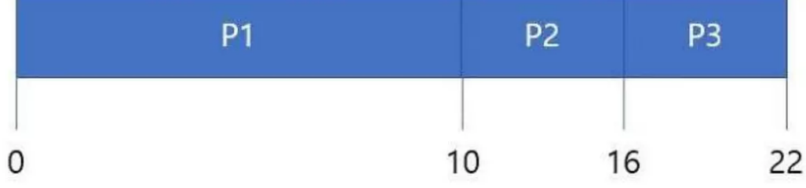
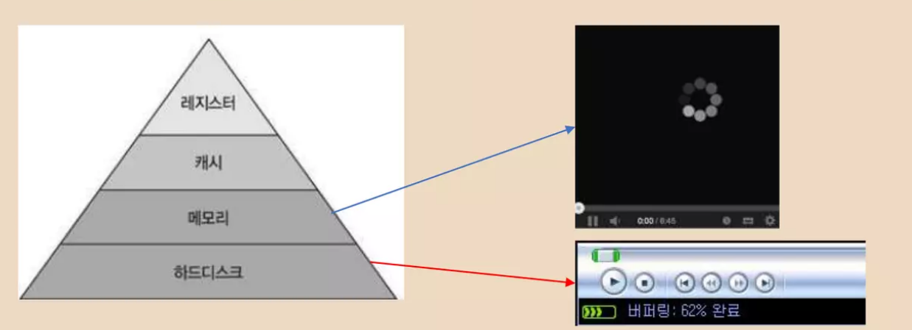

# 컴퓨터 공학

## 벡터 vs 리스트

각종 컨테이너들의 특징

- vector : 연속된 자료구조이므로 캐시 친화적, Capacity 변경 가능(Dynamic array), 임의 접근 반복자
- List : 삽입, 삭제에 유리함
- Hash : 탐색이 0(1)로 매우 빠름
- Map : 균형 트리로 구성되어 탐색에 유리함, 삽입/삭제에 불리

## 캐시

너무 멀고, 느리다.

CPU 칩 안에 있는 레지스터에서 데이터를 가져오는 시간 -> 1 ~ 2 Cycle

DRAM에서 데이터를 가져오는 시간 -> 100 ~ Cycle

캐시는 중간 병목을 완화해주는 완충장치라고 보면 된다.

### 기본적인 컨셉

메인 메모리는 느릴 뿐더러, CPU <-> 메모리엔 병목이 발생한다. 그래서 '다음에 사용할 것 같은' 요소들을 더 빠른 메모리에 미리 저장해둔다.

- 시간적 지역성 (Temporal Locality) : 한번 참조된 메모리 주소는 이후 다시 참조될 가능성이 높다.
- 공간적 지역성 (Spatial Locality) : 한번 참조된 메모리 주소의 주변은 이후 참조될 가능성이 높다. 특히 I/O 작업에서 혁신적인 속도 상승을 보여준다. 멜트다운 버그의 원인이 되기도 한다.

## 프로세스와 스레드

프로세스는 실행 중인 각각의 프로그램 '각각'의 프로그램이므로, 알집이 5개 켜져 있다면 각각의 알집들은 다른 프로세스로 취급된다.

- 가상 메모리를 사용하며, 그로 인해 독립적인 메모리 공간을 보장받는다.

- 스레드보다 무겁다 (생성/삭제 시 가상 메모리 확보 및 할당, 프로세스 세팅 등등..)

- 락 문제에서 자유롭다.

  

스레드는 CPU 이용의 기본 단위이다.

- 레지스터, 스택 메모리 영역을 제외한 메모리(데이터, 힙 등...)을 공유한다.
- 그렇기 때문에 경제적이고 빠르지만, 락 문제가 존재한다. (30배 이상)

`코드 영역` : 프로그램의 명령어들이 적재된다.

`스택 영역` : 지역 변수, 멤버 변수, 함수의 파라미터, 리턴 주소값 등이 저장된다.

`힙 영역` : 동적 할당한 메모리가 저장된다.

`데이터 영역` : 전역 변수, static 변수 등이 저장된다.

### 컨텍스트 스위칭

많은 프로세스, 스레드들이 한정된 CPU 자원을 사용할 때, 실제로 CPU 계산 자원이 많이 필요한 부분은 극히 일부이다. (대개 전체의 약 4%)

그렇기 때문에, CPU가 놀지 않으려면 계속해서 새로운 스레드가 CPU자원을 할당받아야 한다.

이를 위해 CPU를 이용한 계산을 끝낸 스레드와 계산이 필요한 스레드를 서로 교체하는 것이 문맥 교환(Context Switcing)이다.

Ex) CPU 자원을 다 사용했을 때, I/O를 요청했을 때 (I/O는 느리다).

### 문맥 (Context)

프로세스/스레드가 자원을 반납하고, 이후에 다시 사용할 때 기억해놓아야 할 정보들이다. PCB (Process Control Block), TCB (Thread Control Block)에 저장된다.

**문맥 교환이 일어나는 조건**

1. I/O 요청이 들어왔을 때
2. 스레드가 CPU 연산을 마치고 반납할 때
3. 기타 OS가 상황을 보고 필요할 때

사실은 예측할 수 없다. 스레드의 경우 락 문제를 염두에 두어야 한다. (프로세스는 데드락이 일어나지 않는다.)

## 스케줄링

### 프로세스/스레드 스케줄링

이렇게 스레드를 교체하면 다음 CPU 자원을 가져갈 스레드는 누구일지 정하기 위한 것이 스케줄링 정책(Policy)/알고리즘이다.

- FCFS (First Come First Serve) : 선착순
- RR(Round-Robin) : 시분할 방식, 모든 프로세스/스레드를 같은 단위로 나누어 수행
- SJF/SRJF(Shortest (Remain) Job First) : 가장 빨리 끝나는 프로세스/스레드에 우선순위를 주어 먼저 수행
- Lottery : 랜덤

이외에도 많은 정책이 있다.

### 우선순위 정책의 한계 - Starvation(기아 상태)

만약 낮은 우선순위 스레드가 대기중인데, 끊임없이 높은 우선 순위 스레드가 들어온다면? -> 영원히 대기 상태가 된다.

해결 방법의 예시로는 aging이 있다. 오래 대기할 수록 우선순위를 높여준다.

### 멀티스레드 환경에서 나타날 수 있는 문제

Deadlock, Data race

데드락 -> 각각의 스레드가 자원을 하나씩만 들고 서로의 자원을 반납하기를 기다리는 상태(서로의 자원이 필요하다)

OS가 관여하지 않으면 영원히 지속되므로, 프로그램이 멈추게 된다. (게임에서는 치명적인 문제)

### 데드락의 4가지 필요 조건

[Circular Wait의 예시]

1. Mutual Exclusion : 상호 배제가 있어야 데드락이 발생한다. (어떤 자원이 한순간 하나의 스레드만 사용할 수 있을 경우) 한 순간 하나의 자원을 내가 독점적으로 획득, 이용하고 내가 자발적으로 릴리즈하기 전까지는 같은 자원을 공유할 수 없다.
2. Hold & Wait : 자원 하나를 점유하였으면, 원하는 자원을 다 점유 때까지 무한정 대기한다.
3. No Preemption : Preempt(뺏을 수 있는 상태, 선점가능한) 하지 않아야 한다. 즉 스레드가 자발적으로 내려놓기 전까지는 스레드가 가진 자원을 빼앗을 수 없다.
4. Circular Wait : 나는 오른쪽이 가진 자원을 기다리고, 오른쪽은 오른쪽의 오른쪽이 가진 자원을 기다리고, 오른쪽의 오른쪽은... 결국 내가 가진 자원을 기다리는 것 같이 일종의 Cycle이 생긴다. 

`필요조건`이기 때문에 하나라도 회피할 수 있으면 데드락이 일어나지 않는다. 그리고 이 네가지가 모두 충족된다고 해서 반드시 데드락이 일어나는 것도 아니다.

### 필요조건과 충분조건

### OS가 수행하는 데드락의 해소 방법

1. Detection & Recovery : 데드락 판별 알고리즘을 사용하여 데드락이 발생했는지 여부를 판단한 뒤, 발생했다고 판단되면 회복시킨다.
2. Prevention / Avoidance : 데드락이 아예 발생하지 않는 방향으로 수행시킨다. (데드락이 발생할 수 있는 필요조건을 회피한다)
3. Ignore : 데드락 발생을 무시하거나, 응용 프로그래머에게 데드락 회피를 맡긴다.

프로세스는 일반적으로 데드락이 발생하지 않는다. 애초에 자원을 공유하지 않기 때문(단, IPC 등을 하면서 자원을 공유하면 문제가 생길 수 있다)

### Ignore

애초에 응용프로그래머가 잘 설계해야한다.

Lock, Mutex, Critical Section 등을 잘 이용하여 자원 하나에 여러 스레드가 동시에 점유를 시도하지 않도록 설계한 자원은 한 스레드만 이용할 수 있게 애초에 논리를 분리를 해야한다는 소리다.

### 데이터 레이스(Data Race)

멀티스레드 환경에서, 해당 코드의 문제점이 있다.

가장 간단해보이는 덧셈마저도 하나의 명령어로 이루어져있지 않다. 그렇기 때문에 멀티스레드에서 해당 코드를 실행하면 100000이 아닌 값이 나오게 된다.

해결 방법은

1. Lock을 적절히 사용하여 계산 중에는 다른 스레드가 사용할 수 없게 만들기
2. Atomic 변수로 만들어서 연산하기

다만 주의할 점은 Lock이나 Atomic 둘다 성능 비용이 높다라는 것.

## 메모리

### 메모리 단편화

단편화 (Fragmentation)는 기억 장치의 빈 공간 또는 자료가 여러 개의 조각으로 나뉘는 현상을 말한다.

외부 단편화는 메모리는 충분한데 연속적인 메모리를 넣을 수가 없다. 

Ex) 배열, 벡터

내부 단편화는 4만큼씩 할당받아서 썻더니 중간에 공간이 남는다.

### 프로그래머의 해결법

여기서 프로그래머의 해결법으로는 메모리 풀로 해결한다.

메모리 풀(Memory Pool)은 고정된 크기의 블록을 할당하여 malloc이나 C++의 new연산자와 유사한 메모리 동적 할당을 가능하게 해준다. malloc이나 new 연산자 같은 기능들은 다양한 블록사이즈 때문에 단편화를 유발시키고, 파편화된 메모리들은 퍼포먼스 때문에 실시간 시스템에서 사용할 수 없게 된다. 좀더 효율적인 방법인 메모리 풀로 동일한 사이즈의 메모리 블록들을 미리 할당해 놓는 것이다.

장점 -> 단편화를 완화할 수 있다. 빈번한 할당, 해제에서 new를 통해 생성할 필요가 없으므로 비용상 이점이 있다.

단점 -> 메모리를 직접 관리해야 하므로, 모든 관리에 필요한 노동과 책임은 프로그래머에게 가게 된다. 사용하지 않을 때도 풀을 유지해야 하므로, 메모리 낭비가 생긴다.

### OS, GC의 해결법

- 통합(Coalescing) : 인접해 있는 단편화가 된 공간을 하나의 공간으로 통합한다.
- 압축(Compaction) : 분산되어 있는 단편화가 된 빈 공간을 결합하여 하나의 큰 가용 공간을 만든다.

**OS의 해결법**

페이징(Paging), 세그멘테이션(Segmentation) 기법을 사용해 해결한다.

페이징이란 가상 메모리를 일정 크기로 나누어 저장한다.

가상 주소 <-> 물리 주소를 수행하는 테이블을 만들고, 실제 메모리 정보가 필요할 때 페이지 테이블을 참조하여 물리 주소를 찾는다.

가상 메모리의 '페이지'와 물리 메모리의 '프레임'은 1:1로 매핑된다.

### 가상 메모리

1.내 컴퓨터에 램 용량이 2기가밖에 없다면 해당 코드는 오류가 나는지?

-> 오류가 난다. 

- 32bit exe 프로세스의 '유저 영역' 용량은 2GB가 최대 한도이다.
- 2GB를 넘기면 new의 경우 bad_alloc을 리턴한다.

2. 내 컴퓨터의 램 용량이 1.5기가인데, 다른 프로세스에서 1기가를 쓰고 있다면 해당 코드는 오류가 나는지?

-> 안 난다. 적어도 64bit에서는. 

- 하지만 엄청나게 느려진다.

각자의 프로세스들은 자신이 PC가 가진 '모든' 메모리를 다 자유롭게 사용할 수 있다고 생각하며, 실제로 프로그래머들 또한 구글 크롬이 먹을 메모리를 염두에 두면서 코딩하진 않는다.

그 이유는 `가상 메모리` 때문이다.

OS가 메모리를 할당할 때 실제 메모리 주소로 직접 할당하지 않고 프로세스별로 가상 메모리 주소공간을 각각 따로 만들어서 제공한다. 가상 주소는 실제 메모리 주소와 1:1로 매핑된다.

- 가상 주소이므로, 서로 다른 프로세스가 같은 주소값을 참조해도 다른 물리 주소값을 참조하게 된다. 즉 가상 메모리의 주소값은 프로세스별로 독립적이다. (데이터 안정성 때문에 멋대로 다른 프로세스에서 데이터를 가져올 수 없다.)
- 데이터가 실제 메모리에 들어있지 않아도 사용할 수 있다. (물리 메모리에 없으면 필요 시에 디스크에서 읽어온다.)
- 실제 메모리보다 큰 데이터를 가져오거나, 다른 프로게스에서 메모리를 모두 점유하고 있어도 자신이 필요한 데이터를 사용할 수 있다.

### 가상메모리의 좋은점은?

1. 물리적으로 비연속적인 메모리라 해도, 가상메모리에서 연속적으로 만들면 된다.
2. 메모리를 각각의 페이지로 나누어 따로 저장하기 때문에, 외부 단편화 문제가 해결된다.

페이지의 크기는 OS별로 상이하다(512byte ~ 1GB). 단 페이지의 크기가 클 경우 내부 단편화 문제가 생길 수 있으며 (큰 페이지를 쓰면 빈 공간이 커질 수 있기 때문) 반대로 페이지의 크기가 너무 작으면 가상->물리 주소를 변환하는 페이지 테이블이 너무 커져서 탐색에 시간이 오래 걸린다.

페이지 테이블은 수백만개의 페이지가 있으므로  캐시나 레지스터에 보관할 수 없다. 필연적으로 메인 메모리에 위치하므로, 페이지 테이블이 작으면 메모리 참조하겠다고 가상->물리 주소를 변환하기 위해 물리 메모리에 여러 번 들어가야 하는 아이러니가 발생.

현대의 Windows나 Linux 같은 OS는 페이지의 크기를 4KB로 잡는다고 한다.

### 페이지 폴트와 스레싱

만약 메인 메모리에 원하는 페이지가 없다면, 이건 결국 가상 메모리 -> 물리 메모리로 변환할 수 있는 경로가 없다는 뜻이고, 메인 메모리에 원하는 데이터가 올라와 있지 않다는 뜻이다.

이렇게 되면 결국 하드디스크에서 없는 정보를 읽어와야 한다.

이를 페이지 폴트(Page Fault)라고 하며, 하드 디스크는 굉장히 느린 저장장치이므로 심각한 성능 저하를 일으킨다.

만약에 너무 많은 프로세스를 동시에 돌리거나, 메모리를 너무 많이 할당받으면 어덯게 될까?

1. 메인 메모리에 올라올 수 있는 데이터는 한계가 있으므로, 새로운 요청을 하는 프로세스에서 페이지 폴트가 일어난다.
2. 페이지 데이터를 디스크에서 가져와야 한다. 이때 메모리에 공간이 없다면 이 페이지는 기존의 페이지를 내쫓고 들어가게 된다.
3. 다음 프로세스는 쫓겨난 이 페이지를 참조하려다 또 페이지 폴트가 발생한다.
4. 그 다음 프로세스는 쫓겨난 또 다른 페이지를 참조하려다 페이지 폴트가 발생한다.
5. 이러면서 페이지를 바꾸는데만(페이지 교체는 공짜가 아니다.) 자원을 소모하게 되고, 정작 연산에 필요한 귀중한 CPU 이용률은 떨어진다.
6. OS는 CPU를 최대한 놀게 놔두지 않으려 하므로 새로운 프로세스를 추가해서 병렬성을 높이려 한다.
7. 혼도과 파괴의 1 ~ 6을 반복한다.

이러한 현상을 `스레싱`이라고 한다.

### 페이지 폴트 관측

메모리가 꽉 차자 페이지 폴트가 증가하는 것을 볼 수 있다.

### 왜 알아야 할까?

면접에서 물어본다. 대략적 구조를 알고 있어야 메모리에 대한 이슈를 해결하거나, 효율적인 개발을 할 수 있다.

