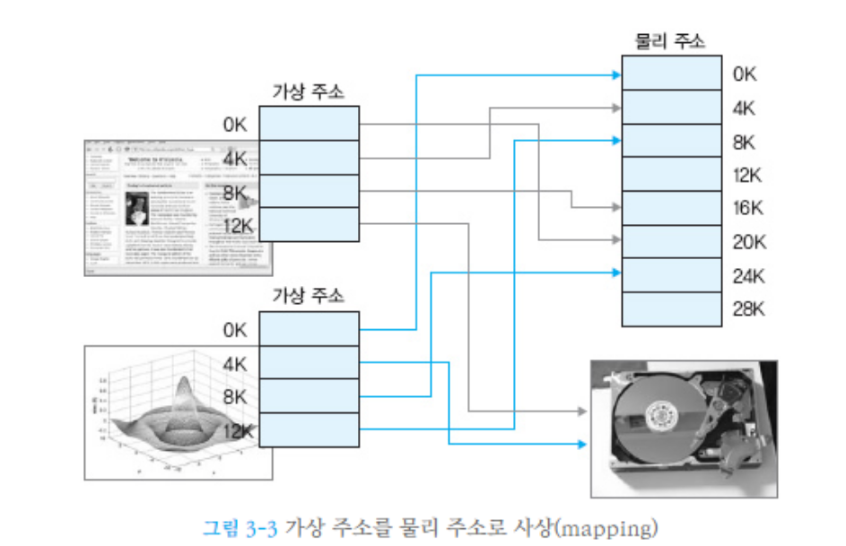
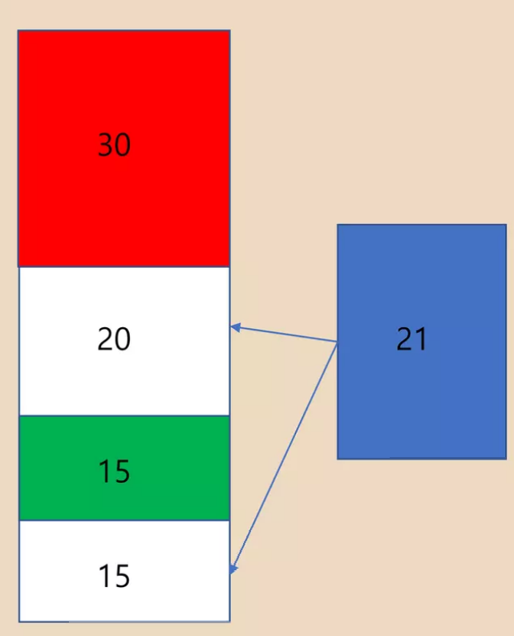
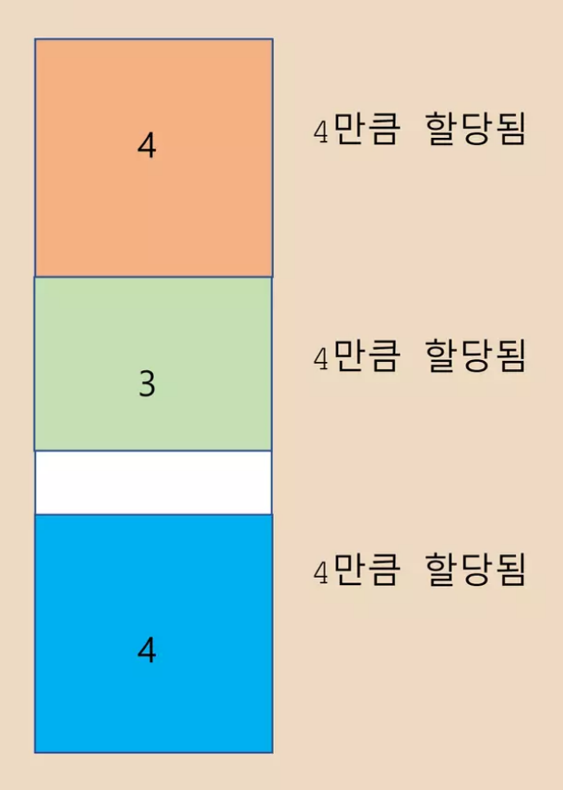
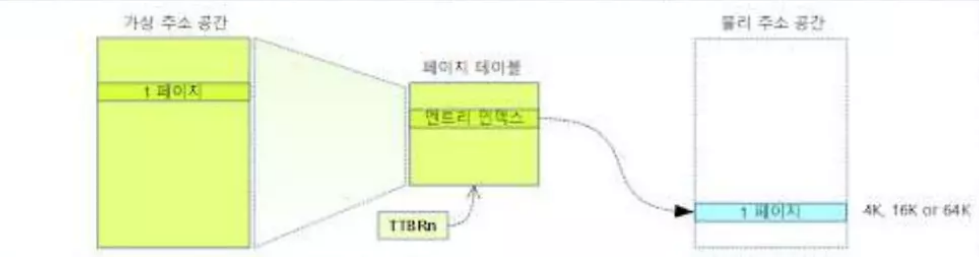

# 컴퓨터 공학2

이전 CS.md 파일에 대한 보충 설명을 작성해보려 한다.

## 프로세스

프로세스는 '실행중인 프로그램'으로 정의한다. 

즉 실행되고 있는 각각의 프로그램이 (심지어 같은 프로그램을 여러개 실행 시켰더라도) 모두 프로세스이다.

프로세스들은 각자 고유한 가상 메모리를 가지고 있기 때문에, 실제 물리 메모리 사용량과는 상관없이 프로세스 자신이 전체 메모리를 전부 가진것 처럼 작동하며, 이러한 착각을 지원하기 위해 가상 메모리 할당과 페이징 같은 기능들을 제공한다.

그렇기에 다른 프로세스와 통신하려면 (IPC : Interprocess Communication) 메시지 패싱이나 공유 메모리(Shared Memory) 같은 방식을 사용해야 하며, 스레드보다 비교적 무겁다. 프로세스를 생성 -> 제거 하는 일련의 사이클에서 OS는 가상 메모리 범위를 잡고, 프로세스를 세팅하고, 제거 시엔 가상 메모리를 다시 풀어주고 하는 과정에서 스레드보다 더 연산 부담을 가지게 된다.

컨텍스트 스위칭이 스레드보다 무겁다는 특징이 있다. (스위칭에 필요한 정보들이 스레드보다 많기 때문, 단 대개 유의미할 정도로 문제가 되진 않는다.)

## 스레드

스레드는 각각의 프로세스의 '실행 흐름'이다. 

하나의 프로세스에서 여러개 스레드를 만들 수 있다. 레지스터와 스택 메모리를 제외한 힙, 데이터 공간을 공유한다. 이로 인해 빠른 스레드 간 통신을 할 수 있으며 컨텍스트 스위칭이 가볍고 빠르다. 

스레드의 컨텍스트 스위칭 기법은 FCFS(First Come First Served), RR(Round-Robin : 시분할), SJF(Shortest Job First) 등의 기법이 있다.

메모리를 공유하기 때문에 그에 따른 Data Race, Deadlock 문제를 피할 수 없어서 Lock이나 Atomic을 사용하여 잘 회피하여야 한다. 스레드는 시간이 일정 이상 경과하거나(Timeout), IO 인터럽트가 들어오거나, Sleep 등의 코드가 실행되거나, 스레드 자신이 CPU 점유를 양보하거나(Yield) 등의 이유로 스위칭 될 수 있다.

## 락 (Lock)

락이란 락을 걸어놓고 들어간 해당 스레드를 제외한 어떤 스레드도 락이 걸린 구역으로 들어가지 못하는 것을 의미한다. 

락을 걸어놓은 해당 스레드가 락을 릴리즈(해제)하고 해당 구역에서 나가면, 다른 스레드가 접근할 수 있게 된다.

앞으로 데드락 설명에서는 `자원 == 코드 구역`이라고 봐도 된다. 

크리티컬 섹션 안의 명령어들도 스레드가 독점해야 할 자원으로 취급하기 때문이다.

즉 그 해당 스레드에서 다른 스레드로 컨텍스트 스위칭이 될 수는 있지만, 락이 된 구역은 해당 스레드 외엔 누구도 진입하지 못하게 됨을 의미한다.

메모리를 공유하여 읽기/쓰기를 수행할 스레드들은 공유 메모리에 접근하기 전에 메모리에 대해 락을 시도해야한다. 읽는 중에 데이터가 바뀌거나 하는 사태를 방지하기 위함이다. 다른 스레드가 이미 점유중일 경우, 새로 락을 시도하려던 스레드는 점유중인 스레드가 락을 해제하거나, 타임아웃이 될 때까지 대기하게 된다.

## 데드락 (DeadLcok)

만약 A,B 자원을 둘 다 사용해야 하는 스레드 C,D가 있다 가정하고 스레드 C가 A를, 스레드 D가 B를 가지고 서로의 객체를 반납하기만을 기다리고 있다면 이러한 상태를 데드락이라고 한다.

즉 데드락이란, 특정한 자원(메모리, 레지스터, CPU 연산장치 등을 의미)을 사용하는 스레드들이 서로의 자원을 반납하기만을 무한하게 기다리는 것을 말한다.

유명한 예시로는 식사하는 철학자 문제가 있다.

데드락은 멀티스레드 환경에서는 매우 간단하게 발생할 수 있으며, 발생하면 해결하기 어려운 문제이다.

## 락을 구현하기 위한 방법들

### 세마포어 (Semaphore)

두개의 Atomic Operation인 wait(P)와 signal(V)로만 접근이 가능한 방법이다.

P = 세마포어 카운트를 1깎고 연산에 진입한다. (이미 자원을 사용하는 task가 있다면 재움 큐에서 자고 있게 된다.)

V = 세마포어 카운트를 1추가하고 연산에서 빠져나온다. (대기하고 있는 task가 있다면 재움 큐에서 자고 있는 연산을 깨워준다. - Busy Wating 방지)

세마포어는 0이하로 떨어질 수 없다.

P와 V가 Atomic(원자적)하기 때문에, P->P, V->P 등의 동작을 하게 될 경우 데드락이 발생하거나, 상호배제(각 스레드가 자원에 대해 서로를 배타적으로 배제함)를 보장할 수 없게 되는 약점이 있다. 

또한

1. P(s) -> P(q) | Critical Section | V(s) -> V(q)
2. P(q) -> P(s) | Critical Section | V(q) -> V(S)

위와 같이 설계된 세마포어 코드가 있을 때, A의 P(s)와 B의 P(q)가 같이 일어난다면 서로가 s와 q를 한 손에 든 상태에서 상대의 자원이 V 되기를 기다리게 되므로 데드락이 발생한다.

(A는 P(q)를 위해 B가 q를 반납하기를 기다리고, B는 P(s)를 위해 A가 s를 반납하기를 기다리기 때문)

해결법으로는 세마포어가 모든 자원을 다 얻은 채로 프로세스를 진행하게 하거나 (다 얻지 못하면 그 즉시 모든 자원을 반납하고 재시도한다), 타임아웃을 넣거나 하는 방법이 있다.

## Mutual Exclusion(Mutex)

0,1만을 사용하는 Binary Semaphore를 Mutual Exclusion(mutex)라고 한다.

상호 배제를 구현할 수 있다. (세마포어 카운트가 최대 1이면 자원에 한 번에 하나의 스레드만 접근할 수 있기 때문이다)

C++에서 스레드/락의 구현 방법으로는 _beginthreadex와 waitforsingleobject등을 쓰는 윈도우 스레드와 STL에서 추가된 std::thread를 쓰는 방법이 있다. 스레드 같은 경우는 **‘실제로 구현해 보았는지?’**를 물어보는 질문이 가끔 등장하므로 **실제로 스레드를 이용한 프로그램을 구현해 보는 경험을 해 보는 것**이 필요할 것 같다.

## 메모리

우리가 말하는 ‘메모리’는 대개 주 메모리(Main memory)인 RAM 공간을 의미하는데, 이는 ‘물리 메모리’라고 한다. 프로그램은 자기가 사용할 데이터를 이 물리 메모리에 미리 가져와서 필요할 때 사용한다.(하드디스크는 굉장히 느린 매체이므로, 필요할 때 하드디스크에서 데이터를 로드한다면 컴퓨터를 쓸 수 없을 수준이 된다)

또한 데이터가 더 이상 필요하지 않다면, 메모리에서 **추방하여** 다른 데이터가 들어올 수 있게 만든다.

여기서 부터는 `메인 메모리 = 물리 메모리 = 주 메모리 = RAM` 이다.

### 가상 메모리

가상 메모리는 가상의 메모리 공간이다. 가상의 메모리 체계를 만들어서, 실제로 사용되는 물리 메모리 공간에 1:1 대응시킨다.

RAM(물리 메모리)가 있는데 굳이 가상으로 메모리 공간을 만드는 이유는 여러 가지가 있다,

**첫 번째는 각각의 프로세스가 독립적인 가상 메모리 공간을 가지게 하기 위함이다.**

각 프로세스마다 연속적이고 충분히 큰 가상메모리를 만듦으로써, 실제 물리 메모리가 어떻든 상관없이 더 큰 메모리를 사용할 수 있게 하며, 프로세스가 자신이 메모리 자원을 전부 점유하고있다고 착각할 수 있게 만든다.

즉, 내가 만약 16GB의 물리 메모리 공간을 가지고 있다고 하고, 5개의 프로세스가 이를 나눠 쓴다고 하자.

만약 가상 메모리 공간을 16GB로 잡아 놓으면, 물리 메모리가 얼마나 남아있던 간에 각각의 프로세스는 16GB의 공간을 모두 자유롭게 사용할 수 있다. (물론 상식적으로 말이 안 되기 때문에, 물리 메모리의 용량이 꽉 차면 운영체제는 안 쓰는 다른 프로세스의 데이터를 물리 메모리에서 몰래 내쫒는 등의 공간 확보 작업을 한다)

정확히는 모두 자유롭게 사용할 수 있다고 **착각하게 만든다.**

이는 프로그래머가 **물리 메모리의 사용량이나 점유현황을 신경쓰지 않고도** 구현이 가능하게 만드는 이점도 있다.

또한, 가상 메모리는 프로세스마다 독립적이므로 프로세스가 각자의 데이터를 함부로 접근하거나 조작할 수 없어서 운영체제의 메모리 안정성을 높인다.

90년대에는 이러한 가상 메모리가 완벽하지 않아서, 프로그래머가 메모리 공간을 직접 잡아서 부여하는 작업을 해야 하기도 하고, ppt 작업 중 mp3 플레이어를 실행시켰더니 ppt가 터지는 일도 발생하였다고 한다.

**두 번째는 외부 단편화를 완화화는 효과가 있기 때문이다.**

## 단편화

좌측이 전체 메모리, 우측이 새로 할당해야 할 메모리이다. 흰색 부분이 빈 메모리이다.

그림과 같이, 빈 물리 메모리의 전체 공간이 **충분(35)**함에도, **메모리가 연속적이지 않아서** 메모리를 **새로 할당(21)** 할 수 없다. 이를 ‘외부 단편화’ 라고 한다.

그림과 같이 메모리를 할당할 때, 4만큼 블록 단위로 할당하였다. 만약 메모리가 7만큼 할당이 필요하다면, 크기 4의 블록 2개를 할당해주어야 하고, 1만큼의 메모리가 낭비되게 된다. 이를 ‘내부 단편화’라고 한다.

## 단편화의 해결법

### 메모리 풀

**메모리 풀**(memory pool)은 고정된 크기의 블록을 할당하여 malloc이나 C++의 new 연산자와 유사한 메모리 동적 할당을 가능하게 해준다. malloc이나 new 연산자 같은 기능들은 다양한 블록사이즈 때문에 단편화를 유발시키고, 파편화된 메모리들은 퍼포먼스 때문에 실시간 시스템에서 사용할 수 없게 된다. 좀더 효율적인 방법은 **memory pool**이라고 불리는 동일한 사이즈의 메모리 블록들을 미리 할당해 놓는 것이다. 그러면 응용 프로그램들은 실행 시간에 핸들에 의해서 표현되는 블록들을 할당하고, 접근하고, 해제할 수 있다.

프로그래머가 할 수 있는 외부, 내부 단편화의 해결법이다. 프로그래머가 직접 메모리를 관리할 수 있는 특정 크기의 풀(pool)을 만들어서 그 풀에서 메모리를 가져오고, 사용이 끝나면 돌려주는 것이다. 미리 만든 풀에서 메모리를 가져오므로 할당이 새로 일어나지 않는다.

**장점**

단편화를 완화할 수 있다. 할당/해제가 빈번할 때 new/delete를 통해 새로 할당/해제할 필요가 없이 풀에서 가져오고, 반납하면 되므로 비용이 크게 감소한다.

**단점**

메모리 풀은 프로그래머가 직접 메모리를 0부터 100까지 관리하겠다고 선언하는 것과 다름이 없다. 즉 모든 메모리 문제의 책임은 프로그래머가 가지게 된다.

또한 사용하지 않을 때도 풀을 유지해야 하므로 메모리 낭비가 생긴다.

### 페이징

**페이징이란** 가상 메모리를 페이지로 나누어 다루는 기법이다.

**페이지**(가상 메모리 나눔의 단위)와 **프레임**(물리 메모리 나눔의 단위)은 1:1대응되며 (가상 메모리의 주소값과 물리 메모리의 주소값은 다르므로, 가상 메모리 주소를 기반으로 물리 메모리 주소를 찾아가서 데이터를 가져온다) , 이로 인해 물리적으로 연속적이지 않아도 가상 메모리에서 연속된 메모리를 할당할 수 있기 때문에 외부단편화를 완화한다.

그림과 같이 물리적으로 연속적이지 않아도 가상 주소는 연속적으로 만들 수 있다.

1:1 사상관계(주소값 정보)를 ‘페이지 테이블’에 기록하여, 페이지를 통해 프레임을 찾아서 원하는 데이터를 얻을 수 있게 만든다. 페이지 테이블은 메인 메모리에 저장된다.

즉 가상 메모리 주소를 근거로 페이지 테이블에서 물리 메모리 주소를 찾아서, 물리 메모리 데이터에 접근하는 것이다. (실제 데이터는 물리 메모리에 들어 있으므로)

### 페이지 폴트

물리 메모리 안에서 페이지에 대응되는 프레임이 실제로 존재하지 않을 때 발생한다. 

왜냐하면 가상메모리를 통해 각각의 프로세서들은 전체 메모리를 혼자 점유한다고 착각하고 사용하고, 실제 메모리는 이러한 착각을 지원하기 위해 물리 메모리가 가득 차면 사용하지 않을 것 같은 데이터를 메모리에서 내쫒고 새로운 데이터를 들여오기 때문에, 내가 필요한 페이지가 정작 필요할 때 없을 수 있기 때문이다.

페이지 폴트는 디스크를 이용한 데이터 로드가 필요하기 때문에 매우 성능적 비용이 크게 발생하는 문제이므로 최대한 피할 수 있도록 해야 한다.

쉽게 말해, 메모리가 부족하면 생기는 현상이다.

## 디맨드 페이징

페이지 폴트가 발생하면, 결국 디스크에서 데이터를 가져와야 한다.

이를 **요구 페이징(demand paging)**이라고 하며, 매우 느린 저장장치인 2차 저장장치(하드디스크)에서 가져오는 것이니만큼 많은 시간 손실이 발생한다. 이래서 프로그래머는 메모리를 다룰 때 페이지 폴트를 최대한 줄이는 방향으로 구현해야 한다.