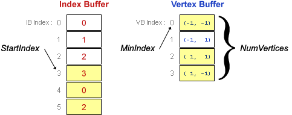
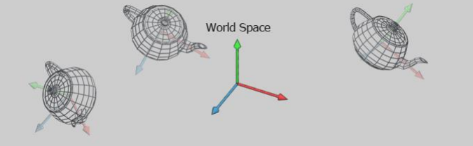
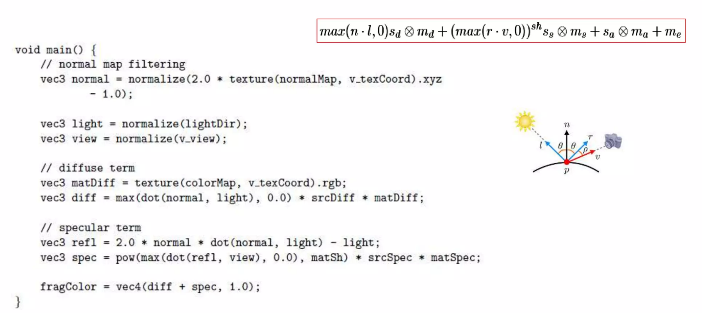
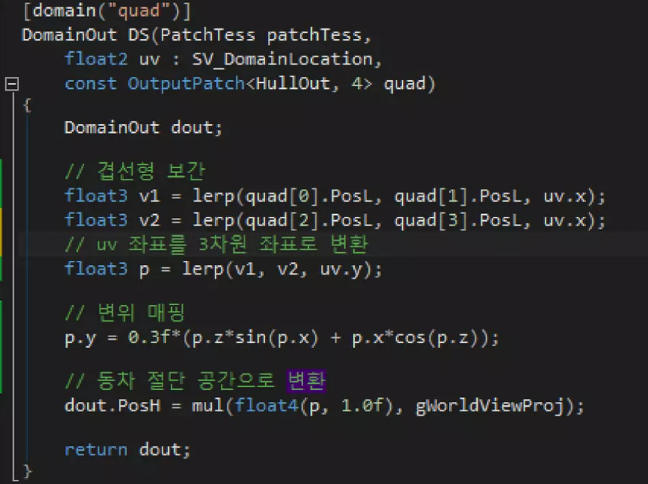
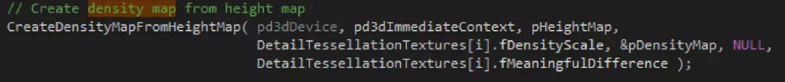

# 그래픽스

대개 포트폴리오에 DirectX나 그래픽스 관련 내용이 있으면 물어본다고 한다.

내 포폴에 맞춰 준비하되 (포폴에서 Picking을 구현하였다면 피킹에 대한 공부해 간다던지), 렌더링 파이프라인의 개략적인 구조와 정의 같은건 범용적으로 외워가자.

## 렌더링 파이프라인

여러 명령어가 중첩되어서 프로그램이나 하나의 작업을 실행하게 도와주는 과정(연산들의 집합)이다. 한 사이클 안에 들어가야 해서 과정들이 많기 때문에 한사이클이 복잡해지거나 사용자 입장에서 어려워질수 있는 단점이 존재한다.

### [Input Assembler]

3차원 모델 하나를 3차원 세상에 나타내기 위해서는 가장 먼저 해줘야 할것은 무엇일까?

여기서 모델은 점(vertex)로 이루어져 있다. 이것을 우리는 폴리곤(점들의 집합)이라고 한다.

주로 게임에서는 삼각형을 가지고 3D 폴리곤을 정의하는데, 이때 이 정점 데이터들을 운반하는 자료구조를 우리는 Vertex Buffer라고 한다.

정점 버퍼와 같이 등장하는 용어로 Index Buffer라는 것이 있다.

인덱스 버퍼는 쉽게 생각하면 정점들의 인덱스를 저장하고 있는 버퍼라고 할 수 있는데 사각형을 예를 들면 사각형을 (삼각형 기반으로) 그리기 위해서는 2*3 = 6개의 정점이 필요하다.

사각형을 구성하는 정점을 4개만 두고 4개를 한 붓그리기 처럼 중복해서 그려주는 방식을 사용하는 걸 인덱스 버퍼의 기능이라고 생각할 수 있다. (하지만 없어도 상관은 없다.)

추가적으로 인덱스 버퍼를 사용하는데, 그것도 결국 메모리를 사용하니까 똑같다고 할 수도 있다.

정점은 위치데이터 말고도, 색깔, 법선, 텍스처좌표(UV), 애니메이션에 필요한 정보 등등 여러가지 프로그래머가 원하는 데이터를 추가하여 사용하기 떄문에 단순히 정수만 저장하는 인덱스버퍼가 훨씬 메모리적으로 효율적이다.

다시 정점버퍼로 돌아와서

정점버퍼는 그냥 정점들의 연속적인 메모리 구조에 불과하기 때문에 실제로 GPU에서는 이러한 정점들을 이용하여 어떤 도형을 만들어야 하는지 정보가 필요하다.

해당 도형 정보를 Primitve Topology 라고 한다.

결론적으로 Input Assembler 는 이러한 정점들의 데이터를 읽고, 삼각형과 같은 도형으로 조립하는 단계의 일을 한다고 생각하면 된다.

### [Vertex Shader]

Input Assembler 에서 받은 정점정보들의 정보로 도형은 생성이 되었지만 로컬 좌표계에 있기 때문에 해당 데이터들을 화면에 그대로 출력해버리면 화면에 중심부에 전부 그대로 출력되어버려서 공간좌표계(World)로 변환할 필요가 있다. Local Space에서 World Space 로 변환이 필요하고, 실제 플레이어가 바라보는 카메라가 중심이 되는 공간 View Space 변환을 해준다. 그리고 마지막으로 Projection 변환을 거쳐 최종적으로 정의된 ClipSpace라는 공간으로 변환을 해준다.

### [월드공간 변환]

Local Space 라고도 불리는 오브젝트 공간은 3차원 세상에서 표현될 각각의 개인의 공간에 정의된 영역이다.

### [카메라 공간 변환]

월드 변환이 완료되어 모든 물체가 한 공간(World Space)에 모아지면 이제 우리가 원하는, 시점에서 물체를 관찰 할 수 있게 해줘야한다. 이 때 관찰자로서 가상의 카메라가 필요하고, 이 카메라가 볼 수 있는 영역의 공간을 뷰 공간이라고 한다.

월드 공간의 모든 물체를 카메라 공간으로 변화하게 된다면 효율적으로 여러가지 효과나 렌더링등을 진행할 수 있다.

여기서 잠깐 카메라가 바라보는 세상에 대해 생각해보자.

가상의 카메라는 컴퓨터의 성능의 한계 때문에 실제 세상과는 다르게 시야가 제한 될 수 있다. FOV (시야각), ASPECT (종횡비)에 의해 결정되는데 이러한 가시영역을 뷰 볼륨이라고 한다. 이렇게 생성된 뷰볼륨에 Near, Far 정보가 전달되어 절두체의 영역을 다시 정의한다.

### [View Frustrum]

절두체 공간 밖에 잇는 물체는 그리지 않는데, 우리가 살고 있는 3차원 세상은 모든걸 보여준다. 이렇게 밖에 없는 이유는 계산상의 효율성을 위해 어쩔수 없이 도입된 개념이다.

만약 물체가 절두체의 경계를 걸치게 되면 바깥 쪽 부분은 잘려서 버리게 된다. 이를 클리핑(Clipping)이라고 한다. 이 클리핑은 카메라 변환에서 이뤄지지 않고 나중에 클립공간에서 -> 레스터라이저로 넘겨질때 수행된다. 이에 관련해선 레스터라이저 스테이지에서 자세히 알아보자.

### [투영 변환]

카메라 변환에서 월드의 모든 물체를 카메라 공간으로 재배치하고, 이제 카메라 시점에서 세상을 바라볼 수 있게 되었다.

우리가 카메라를 통해서 바라보는 가상의 공간 현실세계처럼 3차원이지만 최적으로 바라봐야할 공간은 모니터 세상인 (2차원) 공간의 세계가 되어야 한다. 3차원 공간을 어떻게 2차원으로 표현 할 수 있을까?

3차원 세상은 2차원 평면에 표현하는 방법은 다행히도 이미 화가들이 개발했기 때문에 이러한 방법을 쓰면 된다. (원근법)

투영 변환은 이러한 원근법을 구현하기 위해 카메라 공간에서 정의된 절두체를 3차원 클립공간으로 변환하는 것을 의미한다.

여기서 투영변환이라는 이름과는 다르게 3차원 공간의 물체를 2차원 평면으로 바꾸는것이 아니라 3차원 물체로 변형됨에 주목해야한다.

이러한 투영 변환을 거친 물체들을 관찰해보면 절두체 뒤쪽에 있던 영역의 폴리곤은 상대적으로 작아지는 것을 볼 수 있는데, 우리가 원했던 원근법을 적용 한 것이라고 볼 수 있다.

추가적으로 한개 더 생각해보면 원근법을 3차원 공간에서 실현하기 위해 직육면체 볼륨으로 물체들을 변환시켰는데 여기서 얻는 이점이 있다. 좀 더 간단한 공식으로 쉽게 Clipping(클리핑)작업을 할 수 있다.

### [Tesselator 단계]

테셀레이터는 3단계로 구성되어 있다.

HullShader -> Tesselation -> DomainShader 단계를 거친다.

HullShader는 테셀레이터 작업의 첫단계이다.

VertexShader에서 공간변환을 진행하지 않고 HullShader 정점정보들을 전달해준다.

HullShader는 폴리곤을 어떻게 분할 할 것인가? 폴리곤을 얼마나 분할 할 것인가?를 결정하는 단계이다.

아래 그림은 테셀레이션 적용 전과 후의 그림이다.

`적용전`

`적용후`

테셀레이터는 다시 말해 다각형을 겹치지 않고 작게 만들어 빈틈을 없애 게임등에서 사물이나 인물등을 실제에 보다 가깝게 표현할 수 있게 도와주는 기술이다.

DomainShader는 테셀레이터가 출력한 정점마다 한 번씩 함수 (셰이딩 언어) 호출을 해주게 된다.

테셀레이션이 활성화되면 기존의 정점쉐이더에서 수행한 것들을 DomainShader에서 수행하게 된다.

예를 들어 공간변환(월드 -> 뷰 -> 투영)이 될 수 있다.

하지만 자주 사용되는 기술은 아니다.

실제 게임을 제작 할때는 정적이 적은 로우폴리곤과 정점이 많은 하이폴리곤 모델 두개를 따로 지원하는 경우가 많다.

### [Geometry Shader]

기본 폴리곤에서 정점을 추가하거나 또는 삭제하거나 하는 연산을 할 수 있다.

정점 정보를 추가하여 표현할 수 있는 모델이라면 그만큼의 정점정보를 빼고 저장할 수 있으니 메모리적으로 용량을 적게 차지 할수도 있고 GPU 도움을 받아서 정점을 추가해주기 때문에 연산속도가 빨라 질 수 있다.

### [Rasterization]

정점처리 단계를 지난 정점은 다음 단계인 레스터라이저 단계로 넘어간다.

우선 정점들은 삼각형으로 묶여있는데 이 시점부터는 하나의 독자적 도형으로 처리가 된다.

우선 화면에 그려질 2차원 삼각형의 세 정점이 결정되면 다음과 같은 일이 일어난다.

1. 이 삼각형이 포함되는 모든 픽셀마다 PixelShader(Fragment Shader)가 실행된다.
2. 삼각형의 세 정점에 할당 되었던 여러 데이터(pos, uv, normal, color)가 보간되어 삼각형 내부에 각 픽셀셰이더로 넘어온다.

DirectX에서는 이러한 과정을 통틀어서 레스터라이제이션 이라고 부르고 고정 파이프라인 단계로 프로그래머가 이러한 로직들을 임의로 바꿀 수 없는 파이프라인 단계이다. 자체 알고리즘으로 알아서 동작을 한다.

대표적 레스터라이제이션의 역할을 나열해 보자면

1. 클리핑 
2. 원근 나눗셈 (perspective division)
3. 뒷면제거 (backface culling)
4. 스캔변환(ndc scan transform)
5. 뷰포트 변환

#### 클리핑

클리핑은 투영 변환 이후의 클립공간 볼륨 바깥에 놓인 폴리곤들을 잘라내는 작업을 말한다. 이전 부터 언급되었던 이 작업이 바로 이 레스터라이저 단계에서 일어난다.

#### 원근 나눗셈

현재 단계에서 투영 변환을 통해 원근법이 적용된 3차원 물체들을 직육면체 클리핑 공간에서 정의되어 있다.

최종적으로 필요한건 2차원 공간인데 그렇다면 어떻게 3차원 공간을 2차원 공간으로 변환시킬 수 있을까? (수학적)

단순히 생각하면 3차원에서 2차원으로 차원을 줄이면 된다. 바로 Z좌표로 모든 성분을 나눠버리는 것이다. 투영변환을 마친 정점데이터는 (x, y, z, w)에서 w 성분에 z값이 저장된다. 

원근 나눗셈이 적용된 이후에는 x, y, z, w -> x, y, z의 좌표계로 변환되는데 이를 NDC (normalized device coordinate) 공간이라고 부른다. 여기서 정규화라는 이름이 붙는 이 좌표의 xy 범위는 [-1 ~ 1] z의 범위는 [0 ~ 1] 이기 때문이다.

#### 뒷면제거

다음으로 레스터라이저에서 하는 기능으로 뒷면 제거가 있다. 카메라가 바라보고 있는 방향에 물체에 가려진 면적은 굳이 연산을 할 필요가 없다. 외적(Cross product) 삼각형의 바라보고있는 면의 방향을 구하여 뒷면일 경우에 연산에서 제외시킨다.

#### 스캔변환

이전의 변환들은 자세한 사항을 몰라도 프로그래밍하는데 문제가 없었지만 이 스캔 변환은 렌더링 프로그램에서 직접적인 영향을 미치기 때문에 꽤 중요하다. 삼각형 하나가 내부에 차지하는 모든픽셀(fragment)들을 생성하는 작업이다. 이때 정점데이터에 들어온 데이터들은 보간(선형 보간)되어서 픽셀세이더로 넘어간다.

#### 뷰포트 변환

컴퓨터 화면상의 윈도우 스크린 공간을 갖는데 이 스크린 공간 내에 2차원 이미지가 그려질 뷰포트가 정의되는데 NDC공간의 물체들을 스크린 공간으로 이전시키는 변환을 뷰포트 변환이라고 한다.

### [Pixel Shader]

레스터화된 도형에 원하는 색을 입혀서 출력하게끔 도와주는 쉐이더이다.

텍스처매핑, 노말매핑, 등등 기법으로 색을 입혀서 표현도 가능하다.

조명 처리나 이미지 처리를 할 때 유용하게 사용된다.

정점 데이터가 보간된 값이 넘어온다.

### [Output merger]

깊이 - 스텐실 테스트와 블렌딩이 일어나서 최종적인 화면(텍스처)에 물체를 그려준다.

### [Compute Shader]

컴퓨트 쉐이더는 일반 렌더링 파이프라인과 별도로 그래픽카드를 사용할때 실행할 수 있도록 도와주는 쉐이더이다.

대량 병렬 GPGPU 알고리즘 또는 게임 렌더링의 일부를 가속시키기 위해서 사용할 수 있다. 

효율적으로 사용하려면 GPU 아키텍처와 병렬 알고리즘에 대한 지식뿐만 아니라 DirectxComput, Opengl Compute, CUDA, 또는 OpenCL에 대한 지식도 필요하다.

## 조명

조명은 크게 두가지로 나눌 수 있다. 모든 빛의 반사를 계산하는 전역 조명(GI, Global Illumination)이 있고, 조명 알고리즘을 사용하는 방법이 있다.

GI(전역 조명이란 말보다 글로벌 일루미네이션, GI라는 말을 훤씬 많이 쓴다)는 두 가지로 나뉜다.

실시간으로 빛의 반사를 계산하는 레이트레이싱, 미리 조명을 모두 계산한 '라이트맵'을 만드는 라이트맵 방식이 있다.

레이트레이싱은 실시간으로 수행해야 하므로 최근에야 실용화가 될랑말랑하는 기술이다. 

라이트맵은 많이 쓰이나, 미리 조명을 계산하여 저장해 놓은 값을 쓰는 방식이므로 맵의 오브젝트의 위치를 바꾼다거나, 빛의 영향을 바꾼다거나 할 수 없다.

조명 알고리즘은 `앰비언트 라이트(주변광, 환경광)`, `디퓨즈 라이트`, `스페큘러 라이트` 셋으로 나뉜다. 중요하진 않지만 이는 퐁-쉐이딩 방법이라고 하며, 정확히는 빛을 만드는 것이 아니라, 빛이 만드는 색을 계산하는 방법이다.

### Ambient Light(환경광)

글로벌 일루미네이션에서 환경광이란, 빛이 직접 닿지는 않지만, 빛의 반사를 통해 빛이 어느정도 간접적으로 닿는 것을 의미하지만 조명 알고리즘을 사용할 때는 이걸 구현할 수 없기 때문에 그냥 빛이 어느정도 '있을 것이다' 라고 가정하고 구현한 것을 의미하며, 그렇기 떄문에 상수값을 더하여 구현한다.

### Diffuse Light(난반사광)

빛이 직접 닿는 곳의 휘도를 구하는 작업이다.

빛은 수직으로 내리꽂을 때 가장 밝고, 사선으로 비스듬히 비출 때 가장 어둡기 때문에, 0도에 가까워질 수록 작아지고 90도에 가까워 질수록 커지는 cosine을 사용하여 값을 구한다.

### Specular Light(정반사광)

반사된 빛이 눈에 직격에 가깝게 닿을 때 그 부분이 하이라이트 되어 밝게 빛나는 것을 말한다.

그렇기 떄문에 반사벡터를 구하는 작업이 필요하다. 면접시 구하는 방법을 많이들 물어본다.

## 범프 매핑 

### LOD의 딜레마

저해상도 모델을 사용할 경우 처리 속도는 빠르지만 퀄리티는 떨어진다.

그렇다고 폴리곤 수를 늘리면 퀄리티는 좋아지지만 처리 속도는 느리다.

폴리곤 수의 늘리자니 속도가 느려지고 줄이자니 퀄리티가 떨어진다.

### 범프 매핑의 모티브

LOD의 딜레마를 어떻게 해결할까 고민하다 저해상도 모델을 사용하되, 기하학적인 디테일을 텍스쳐에 미리 저장한 뒤, 이 텍스처를 실시간으로 처리하면 된다는 생각에 나왔다.

### 범프 매핑으로 들어가보자.

저해상도 폴리곤과 범프맵(텍스처)을 이용하여 울퉁불퉁한 굴곡을 표현하는 컴퓨터 그래픽 기술이다.

### 범프맵

물체의 울퉁불퉁함을 저장한 맵(텍스처)을 의미한다.

범프맵 종류는 2가지로, 높이맵 (Height Map), 노말맵 (Normal map)이다.

### 높이맵

2차원 그리드에 모델의 높이값을 저장한 텍스쳐이다.

높이맵을 범프맵으로 사용하면 노말맵으로 변환 후 사용한다.

### 높이맵의 색

높이맵은 단순히 높이값만 저장하므로 1채널만 사용한다. 보통 알파채널에 저장한다.

따라서 높이맵은 회색조(GRAY-SCALE)를 띤다.

### 높이맵 -> 노말맵

높이맵을 노말맵으로 변환하는 방법은 아래와 같다.

D3DXComputeNormalMap() 함수를 사용하면 자동으로 계산해준다.

### 노말맵

모델 표면에 수직인 노말 벡터를 저장해 놓은 텍스처이다.

벡터이므로 X, Y, Z를 이용하여 3채널에 저장한다.

노말맵의 노말벡터는 탄젠트 공간의 벡터이다.

### 노말맵의 색

노말맵은 RGB 형태로 저장되는 데 벡터를 색으로 변환하므로 범위가 [-1, 1]에서 [0, 255]로 바뀌게 된다. 변환식은 아래와 같다.

이렇게 변환한 노말맵은 파란색을 띠는 데 그 이유는 뒤에서 설명한다.

### 노말맵 제작

노말맵과 높이맵은 모델링 과정에서 생성한다.

저해상도 모델과 고해상도 모델을 만든 후, 저해상도 모델에 고해상도 모델을 덧씌운다.

저해상도 모델 표면의 노말 벡터 방향으로 반직선을 쏘아 해당 고해상도 모델과의 교차점에서의 노말벡터를 노말맵에 저장한다.

### 범프 매핑의 종류

- 노말 매핑
- 패럴랙스 매핑
- 변위 매핑

## 노말 매핑

### 조명 원리

광원, 표면 특성, 카메라의 위치의 상호작용으로 조명이 표현된다는 것을 떠올려보자.

벽돌은 왜 빛나고 어두운 부분이 있을까?

### 노말 벡터와 조명의 관계

조명에서 명암을 표현하는 것은 전반사와 난반사항이었다.

전반사, 난바사항은 노말 벡터의 영향을 받는다.

### 노말 매핑의 모티브

즉, 노말 벡터를 조작하면 저해상도 모델을 사용해도 명암으로 인해 굴곡이 진것처럼 보이게 된다.

### 노말 매핑의 기본원리

저해상도 모델을 사용한다.

고해상도 표면의 노말 벡터를 노말맵에 저장한다.

노말맵을 조명에 실시간으로 사용한다.

### 기존 텍스처 매핑 vs 노말 매핑

조명의 각도를 바꿔가면서 일반 텍스처 매핑과 범프 매핑을 비교하였다.

범프 매핑을 하였을 때 요철이 잘 표현되어 디테일이 살아 있음을 알 수 있다.

### 객체공간 노말맵

객체 공간 노말맵은 간단한 계산으로 조명을 적용할 수 있다.

### 객체공간 노말매핑

### 객체공간 노말맵의 문제점

기하 구조에 종속적이라 재사용하기 힘들다.

### 탄젠트공간 노말맵

탄젠트 공간 노말맵은 기하구조에 독립적이므로 효율적으로 재사용할 수 있다.

### 탄젠트 공간

탄젠트 공간은 3차원 메쉬를 2차원 평면에 펼친 가상의 공간이다.

텍스처도 마찬가지로 모델을 2차원 평면에 펼쳐 uv좌표를 생성해 칼라값을 저장한다.

탄젠트 공간 노말맵은 칼라 대신 노말 벡터를 저장하는 것이다.

### 탄젠트 공간 계산

모델링 단게에서 버텍스 단위로 노말 벡터가 계산되는데 탄젠트 공간도 같이 계산된다.

### 탄젠트 공간 노말맵의 색

기울기의 차이는 있지만 노말 벡터는 N방향을 향한다.

이 노말 벡터를 RGB 채널로 변경하면 w축은 B채널에 속한다.

이런 이유로 탄젠트 공간 노말맵은 파란색을 띠는 것이다.

### 탄젠트 공간과 노말 매핑

조명 계산에서 벡터 연산할 때 반드시 같은 공간에서 해야 한다.

노말 벡터를 탄젠트 공간에서 월드 공간으로 변환

빛벡터, 시야 벡터를 월드 공간에서 탄젠트 공간으로 변환

## 패럴랙스 매핑

### 노말매핑의 한계

표면 노멀을 조금씩 변화시켜 착시 현상을 주지만 실제 표면의 높이를 바꾼건 아니다.

실제로는 오돌토돌한 앞면이 뒷면을 가려야 하지만 가리지 않고 시차(parallax)가 발생하지 않는다.

### 시차(PARALLAX)의 의미

시차는 관측 위치에 따라 물체들의 위치와 방향이 달라지는 현상을 말한다.

아래 예와 같이, 시점을 달리해서 어떤 물체들이 보이는 지 알아보자.

시점 1에서는 물체 B가 물체 A에 가려 물체 A만 볼 수 있다.

시점 2에서는 B의 크기가 물체 A를 가릴 만큼 크지않아 두상자 모두 볼 수 있다.

### 노말 매핑의 시차 오류

노말 매핑의 경우 2차원 텍스처를 그저 매핑한 것이기 때문에, 시점 1에서도 물체 A, B가 모두 보인다.

### 패럴랙스 매핑의 정의

패럴랙스 매핑은 광선 추적법을 사용하여 시차 현상을 생성하는 방법을 말한다.

### 시차 현상 생성

기존의 노말 매핑은 빨간 직선을 향해 바라볼 때 위치 b에 대한 텍스처 좌표를 이용하여 노말맵에서 노말벡터와 텍스처에서 색상을 읽어왔다.

패럴랙스 매핑은 위치 a에 대한 텍스처 좌표를 가져와 노말벡터와 텍스처 색상을 구한다. (해당 텍스처에 대한 가상의 높이값은 높이맵에 저장된다.)

가장 높은 위치는 텍스처가 매핑되는 객체 표면이다.

시선 벡터 V는 탄젠트 공간으로 변환한 벡터이다.

### 공식 유도

삼각형 닮음비를 이용하여 텍스처 좌표 T2에 대한 식이 다음과 같이 유도된다.

그러나 T2의 높이값 H(T2)는 T2를 몰라 구할 수 없다. 따라서 이 값을 대체할 수 있는 근사값을 구하는 것이 패럴랙스 매핑 알고리즘의 핵심이다.

근사값을 구하는 방식에 따라 다음과 같이 불린다.

- Parallax mapping with offset limiting
- Steep parallax mapping
- Parallax occlusion mapping

### Parallax mapping with offset limiting

### P.M WITH O.L의 장단점

비교적 적은 비용으로 그럭저럭 괜찮은 결과를 보여준다.

하지만 급경사가 있는 경우에는 오차가 심하므로 사용해선 안된다.

### STEEP PARALLAX MAPPING

P.M with O.L에서 오프셋을 높이를 기준으로 분할하여 해당 범위에 들어왔을 때 적용하는 방법이다.

급경사에도 적용가능한 방법이다.

조건(현재 높이값 > 현재 레이어)을 만족하는 좌표가 나올 때까지 반복하여 오프셋한다.

### S.P.M 쉐이더 코드

- GLSL 픽셀 쉐이더

- 오프셋 하기 전 레이어 나누기

- 다음 조건을 만족하지 않으면 루틴 종료
- DX : 현재 레이어 > 현재 높이값, GL : 현재 레이어 < 현재 높이값

### S.P.M 장단점

급경사진 구조도 적용이 가능하다.

다만 레이어 분할에 따른 부작용으로 앨리어싱 문제(계단 현상)가 발생한다.

### PARALLAX OCCLUSION MAPPING

Steep Parallax Mapping 에서 정확성을 더 높이기 위해 근접한 두 개의 텍스처 좌표를 선형보간하는 방법이다.

삼각형 닮음비를 이용하여 선형보간한다.

### P.O.M 쉐이더 코드

- 기존의 S.P.M 코드에서 추가로 두 좌표에 대하여 선형보간한다.

### P.O.M 장점

P.O.M을 통하여 폴리곤 수를 올리지 않고 시차 오류를 보정하는 게 가능하게 되었다.

### P.O.M 단점

그러나 여전히 앨리어싱 문제가 존재한다.

또한 계산량이 늘어나다 보니 오히려 변위 매핑보다 프레임이 낮아진다.

폴리곤 수를 최소화한 의미가 없어져 허무한 느낌이다.

## 변위 매핑

노말 매핑과 패럴랙스 매핑은 실제 폴리곤 구조 자체를 바꾸진 않는다.

변위 매핑은 높이맵을 이용해 모델의 위치를 변경하는 기법이다.

### 쉐이더 모델5

쉐이더 모델 3 : 정점을 새로 만들지 못해 변위 매핑 자체가 불가능했다.

쉐이더 모델 4 : GS가 추가되어 변위 매핑이 가능하게 되었지만 느리다.

쉐이더 모델 5 : 마침내 테셀레이션 단계가 추가되어 변위 매핑을 구현할 수 있다.

### 테셀레이션의 등장

테셀레이션은 그래픽 카드에 테셀레이터라는 장치가 포함되면서 부터 가능해졌다.

테셀레이션이란 주어진 기하구조를 더 작은 삼각형들로 분할하고, 새로 생긴 버텍스들의 위치를 적절한 방법으로 조정하는 것을 말한다.

### 테셀레이션의 등장

그래픽 파이프라인에는 헐쉐이더, 테셀레이터, 도메인 쉐이더 추가되었다. 이 단계에서 테셀레잇녀이 진행된다.

헐쉐이더와 도메인 쉐이더는 개발자가 각각 입력과 출력에 대한 걸 제어할 수 있도록 프로그래밍이 가능하다.

### HULL SHADER

Hull Shader는 테셀레이터에서 패치를 어떻게 쪼갤 지 설정하는 쉐이더이다.

Constant Hull Shader와 Control Point Hull Shader 두 개의 쉐이더로 구성된다.

### Constant HULL SHADER

버텍스 쉐이더에서 제어점(Control Point)을 입력받아 테셀레이션 계수(tessellation factor)를 출력하여 테셀레이터에 보낸다.

이 Shader는 패치 단위로 호출된다.

### 제어점(CONTROL POINT)

테셀레이션을 하는 경우, 버텍스 쉐이더의 출력은 버텍스가 아니라 제어점이다.

제어점은 패치의 버텍스들의 위치를 결정하는 역할을 한다.

제어점이 패치의 정점인 경우도 있으나 꼭 그런것은 아니다.

### 패치(PATCH)

버텍스 쉐이더에서 나온 제어점들은 패치 단위로 묶이게 된다.

여기서 패치는 테셀레이션 작업이 진행되는 최소 단위의 기하 구조를 의미한다.

패치 타입은 삼각형(tri), 사각형(quad), 선(isoline) 중에 선택할 수 있다.

### TESSELLATION FACTOR

테셀레이션 계수는 패치를 얼마나 세분화하여 쪼갤 것인지 결정하는 요소이다.

패치에 대한 테셀레이션 계수는 다음 두 종류이다.

1. 변 테셀레이션 계수(edge tessellation factor) : 변에 따른 세분 정도를 제어한다.
2. 내부 테셀레이션 개수(interior tessellation factor) : 패치 내부의 세분 정도를 제어한다.

### CONTROL POINT HULL SHADER

제어점을 수정하거나 추가하는 역할을 한다.

출력된 제어점들은 도메인 쉐이더로 보내진다.

또한 테셀레이터 세분모드 (integer, fractional_even, fractional_odd)를 지정한다.

### TESSELLATION PARITIONING

integer 모드는 테셀레이션 계수의 분수부를 무시하기 때문에 테셀레이션 수준이 변할 때 파핑 현상이 발생한다.

fractional_even, fractional_odd을 선택하면 파핑 현상 없이 매끄럽게 전이된다.

### PN TRIANGLES

제어점 헐 쉐이더에서 제어점을 추가하여 더 세분화된 테셀레이션을 하는 방식을 PN패치 방안 (PN-patches scheme) 또는 PN 삼각형 방안(PN triangles scheme)라고 부른다.

### 테셀레이터

테셀레티어는 헐 쉐이더에서 설정한 것을 토대로 하드웨어가 테셀레이션한다.

도메인 쉐이더에 패치에 대한 매개변수 좌표를 보내고 Primitive Assembly에 기하구조를 보낸다.

### DOMAIN SHADER

테셀레이터는 새로 생성된 삼각형 버텍스를 모두 출력한다.

도메인 쉐이더는 테셀레이터 단게가 출력한 각 버텍스마다 호출되고, 테셀레이션된 패치에 대한 버텍스 쉐이더 역할을 한다.

즉, 테셀레이션된 패치의 버텍스들을 동차 절단 공간(hogeneous clip space)으로 변환한다.

한가지 유의할 것은 버텍스 위치의 매개변수화된 좌표(u, v)를 입력받는다.

따라서 도메인 쉐이더에서 프로그래머가 이 uv좌표를 실제 3차원 버텍스 위치로 유도하고 동차 절단 공간으로 변환한다.

도메인 쉐이더가 출력한 버텍스는 기하쉐이더 혹은 레스터라이저에 보내진다.

### 사각형 패치와 삼각형 패치의 차이

사각형 패치의 경우, 도메인 쉐이더는 정점의 매개변수 좌표(u, v)를 입력받는다.

반면 삼각형 패치는 무게중심 좌표(u, v, w)가 입력된다.

### 테셀레이션 파이프라인

### 사각형 하나의 테셀레이션 버텍스 버퍼 생성

- 제어점 4개를 담는 버텍스 버퍼 생성코드

### 사각형 하나의 테셀레이션 기하구조를 사각형 패치로 설정

- 사각형 패치를 입력 조립기 단계에 제출

### 사각형 하나의 테셀레이션 그리기

- 제어점 버퍼로 설정하고 DRAW

### 사각형 하나의 테셀레이션 버텍스 쉐이더

### 사각형 하나의 테셀레이션 계수 선언

- 사각형 패치는 외각 계수 4개, 내부 계수 2개가 필요하다.

### 사각형 하나의 테셀레이션 CONTANT HULL SHADER

- 거리에 따라 테셀레이션 계수를 조절한다.

### 사각형 하나의 테셀레이션 CONTROL POINT HULL SHADER

- 제어점을 추가하거나 변경하지 않고 그대로 넘겨준다.

### 사각형 하나의 테셀레이션 도메인 쉐이더

- uv 좌표를 3차원 좌표로 변환한 후 변위매핑을 적용한다.
- 변위 매핑을 적용한 후에는 기존 버텍스 쉐이더 수행하던 공간 변환을 수행한다.

### 사각형 하나의 테셀레이션 픽셀 쉐이더

- 모든 픽셀에 대한 칼라값은 간단히 흰색으롵 통일한다.

  

  

### 사각형 하나의 테셀레이션

- 렌더링 결과

### 변위 매핑 장점

테셀레이션은 고해상도 폴리곤 사용 시에 발생하는 느린 데이터 로드 문제를 피할 수 있다.

고해상도 폴리곤을 사용하는 경우와 비교하였을 때, VS에서 저해상도 폴리곤에 대한 월드변환만 하면 되므로 잘만 활용하면 필요한 연산이 줄어들 수 있다.

고수준 폴리곤 대신 변위 매핑을 이용한 좋은 예시

카메라 위치에 따라 LOD를 조절할 수 있다.

멀리 떨어져 있는 객체는 단순한 형상으로, 가까이 있는 객체는 디테일이 살아있게 조정이 가능하다.

P.O.M보다 더 빠르고 P.O.M에서 발생하는 앨리어싱 문제가 발생하지 않는다.

### 변위 매핑 단점

테셀레이션을 통해 추가된 폴리곤 영역은 충돌 감지가 힘들다.

P.O.M을 제외한 다른 매핑들과 비교하면 메모리와 속도에서 불리하다.

핸드폰은 아직까지 테셀레이터 장치가 없어 적용이 불가능하다.

## 테셀레이션 최적화

### 헐 쉐이더 프러스텀 컬링

뷰 프러스텀 컬링을 통해 시야 밖에 있는 패치들은 테셀레이션에서 제외한다.

-> 테셀레이션 팩터를 0으로 설정한다.

-> 0~30% 정도의 속도 향상을 기대할 수 있다.

### 프러스텀 평면 구하기

컬링을 하기 위해선 먼저 평면 방정식을 알아야 한다. 투영 공간으로 변환한 버텍스 v`가 있다고 가정해보자.

투영 공간에서 버텍스의 범위는 다음과 같다. 이것으로 프러스텀 면이 있는 위치를 알 수 있다.

### 프러스텀 평면 방정식 유도

x`의 마이너스 범위는 프러스텀의 왼쪽 평면의 위치를 암시한다.

이를 토대로 아래와 같이 왼쪽 평면방정식을 유도할 수 있다.

나머지 평면도 유사하게 유도가 가능하다.

- CPU 단에서 평면방정식을 유도하여 GPU에 넘겨준다.

### 평면 방정식의 특징

평면 방정식을 통해 점의 위치를 알 수 있다. 점이 프러스텀 안에 있는 지 아닌 지 알 수 있다.

### 프리스텀 컬링

평면 방정식의 a, b, c 성분은 노말 벡터의 x, y, z 값을 의미하는데 노말 벡터의 방향은 모두 프러스텀 안쪽을 향한다.

따라서 모든 평면 방정식이 0보다 큰 경우에 버텍스는 프러스텀 내에 존재한다는 것을 알 수 있다. 이 특성을 이용하여 컬링을 진행한다.

- 프러스텀 컬링 테스트는 HS에서 패치의 점들을 가지고 진행한다.

### ADAPTIVE TESSELLATION TECHNIQUES

테셀레이션을 최적화 시키기 위해 HS에서 할 수 있는 Adaptive tessellation 기법들이 있다.

- Distance Adaptive Tessellation
- Density Adaptive Tessellation
- Screen Space Adaptive Tessellation

### DISTANCE ADAPTIVE TESSELLATION

시점에서 버텍스까지의 거리를 기반으로 테셀레이션 계수를 계산한다.

카메라에 가까울수록 조밀하게, 멀어질수록 듬성듬성하게 설정한다.

- VS에서 시점에서 정점까지 거리를 계산하고 이를 기반으로 [0, 1] 범위의 계수를 만든다.

- HS에서는 버텍스에서 계산한 거리 계수를 평균하여 테셀레이션 계수를 할당한다.

### DENSITY ADPATIVE TESSELLATION

높이맵을 이용하여 테셀레이션 계수를 미리 계산하는 방법이다.

테셀레이션 계수를 저장한 맵을 밀도맵(Density map)이라고 한다.

고주파수 영역은 촘촘하게 저주파수 영역은 듬성듬성하게 테셀레이션이 된다.

### DENSITY MAP 생성

현재 픽셀과 현재 픽셀을 둘러싸고 있는 픽셀들의 높이값을 가지고 밀도값을 계산한다.

- CPU 영역에서 밀도맵을 한다.

매개변수 fDensityScale에 밀도의 스케일 값, fMeaningfulDifference는 임계값을 의미한다.

- CreateDensityMapFromHeightMap 함수의 주요코드

- 최종적으로 HS에서 Density map을 패치별로 로드하여 테셀레이션 계수를 설정한다.

### DENSITY ADAPTIVE TESSELLATION ON / OFF

### SCREEN SPACE ADAPTIVE TESSELLATION

스크린 공간에서 삼각형이 차지하는 정도를 가지고 테셀레이션 계수를 계산한다.

8픽셀 이하의 작은 영역을 차지하는 삼각형을 테셀레이션하는 것은 비효율적인 것을 유의한다.

- 여기서는 간단히 화면공간에서 삼각형의 변의 길이를 더하여 테셀레이션의 계수를 정하였다.

