# 벡터

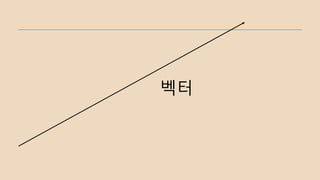

## 벡터란?

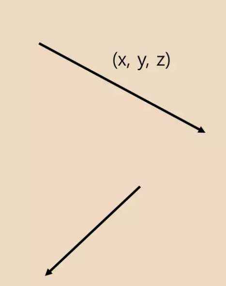

벡터 : 크기와 방향만을 가진 값

벡터 공간 : 벡터에 대해 정의된 연산 법칙 (덧셈, 스칼라 배수)이 적용되는 공간

벡터의 한계점 : 크기와 방향만을 가졌기 때문에, 위치를 표현할 수 없다. 즉 게임의 오브젝트를 벡터만으로는 표현할 수 없다.

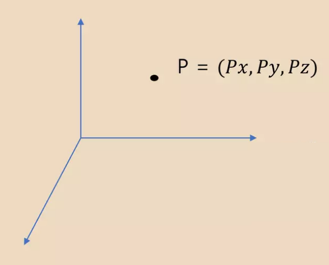

그래서 `점(point)`을 더했다.

즉 벡터 공간에 점의 개념을 추가한 공간이 아핀 공간.

우리가 흔히 사용하는 좌표계 (데카르트 좌표계)와 똑같이 사용한다.

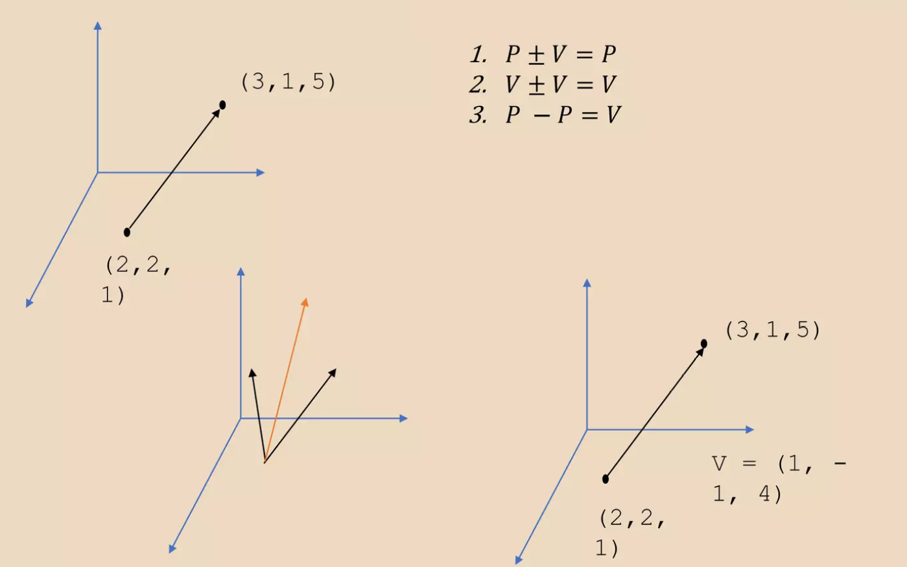

아핀 공간에서의 점과 벡터의 연산은 1,2,3과 같다.

점 + 점은 아핀 공간에서 사용할 수 없다.

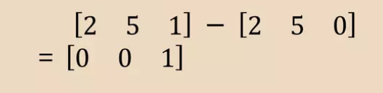

점 - 벡터 = 점 이다.

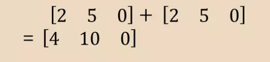

벡터 + 벡터 = 벡터 이다.

이제 아핀 공간에서 점과 벡터를 구분할 수 있다. W = 1이면 점, W = 0이면 벡터.

## 벡터의 내적

내적 (Dot Product, 스칼라곱)

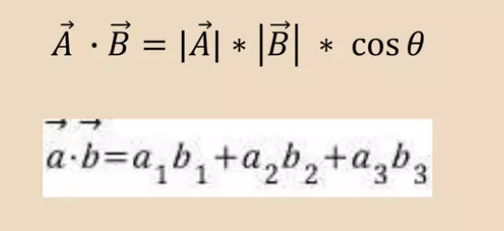

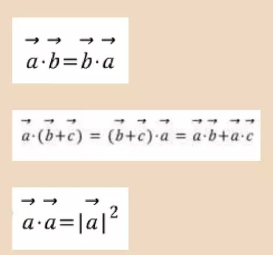

방향을 가지지 않는 스칼라(Scalar) 값이며, 여러가지 용도로 쓰인다.

### 내적을 이용한 벡터의 투영(사영)

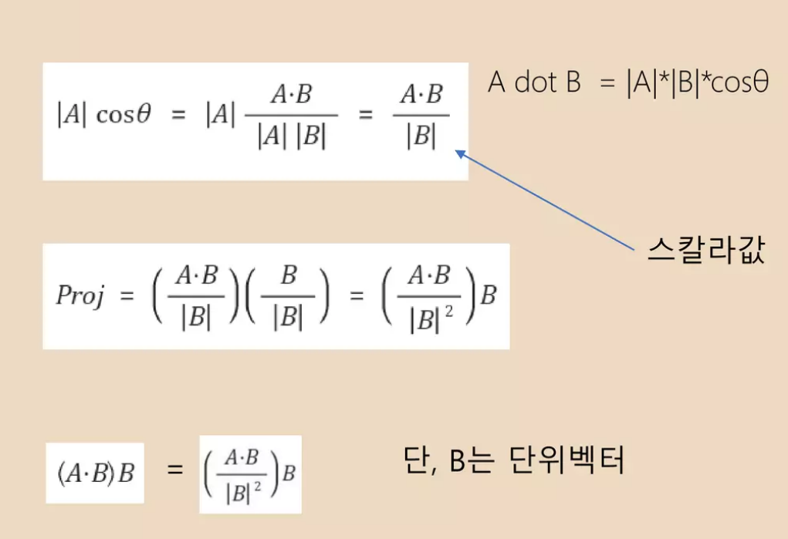

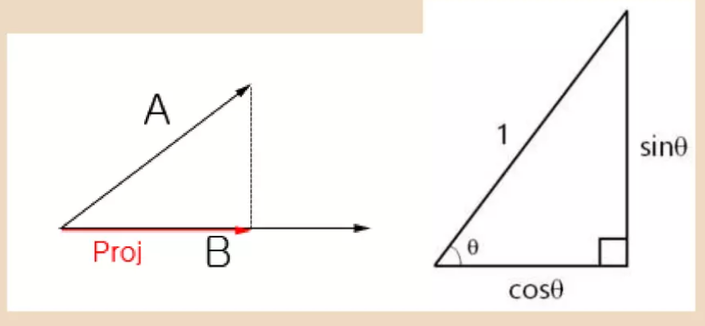

## 내적의 사용예시

1. 상대가 내 앞에 있을까?

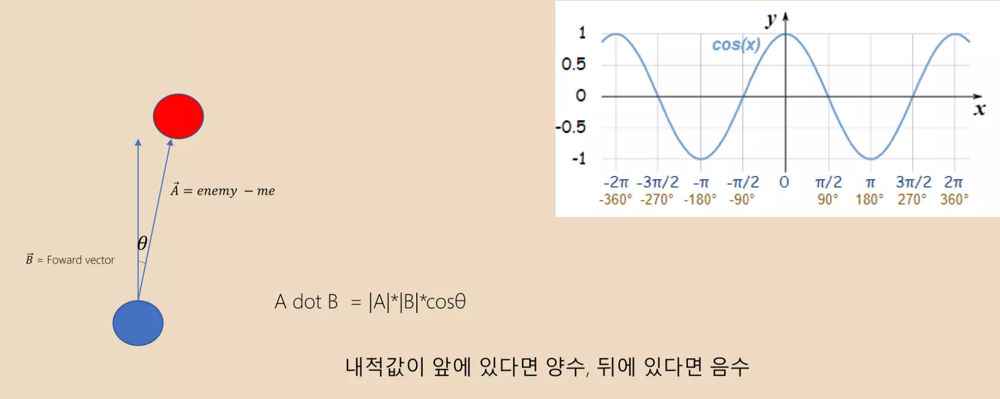

2. 사이각 θ 와 시야벡터 2개가 주어질 때 상대가 시야 내에 있는지 확인하는 법은?

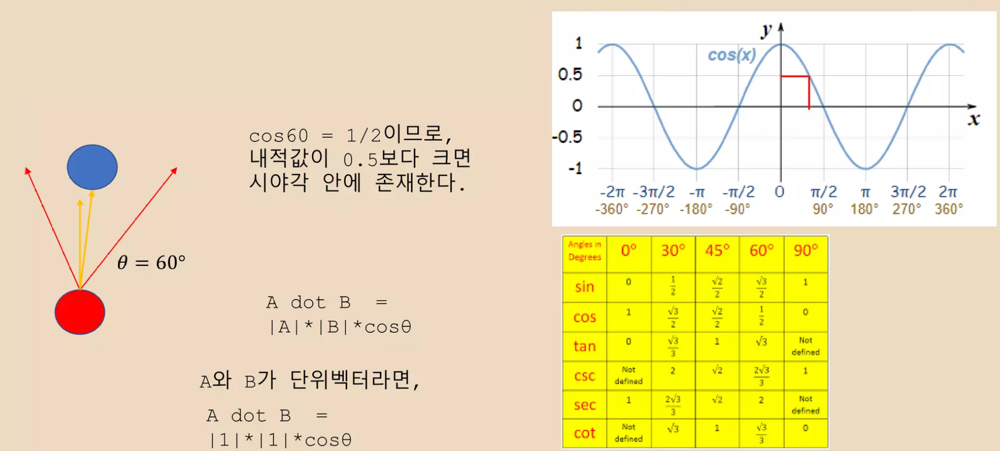

3. 시야각의 각도를 모를 때, 사이각을 구하는 법은?

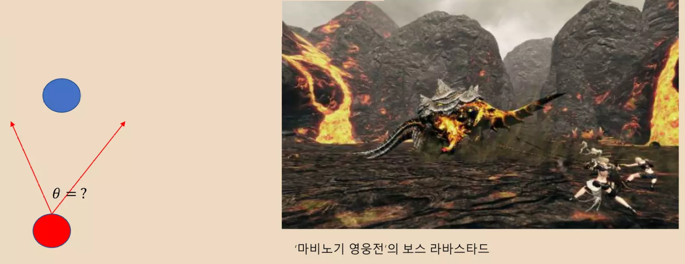

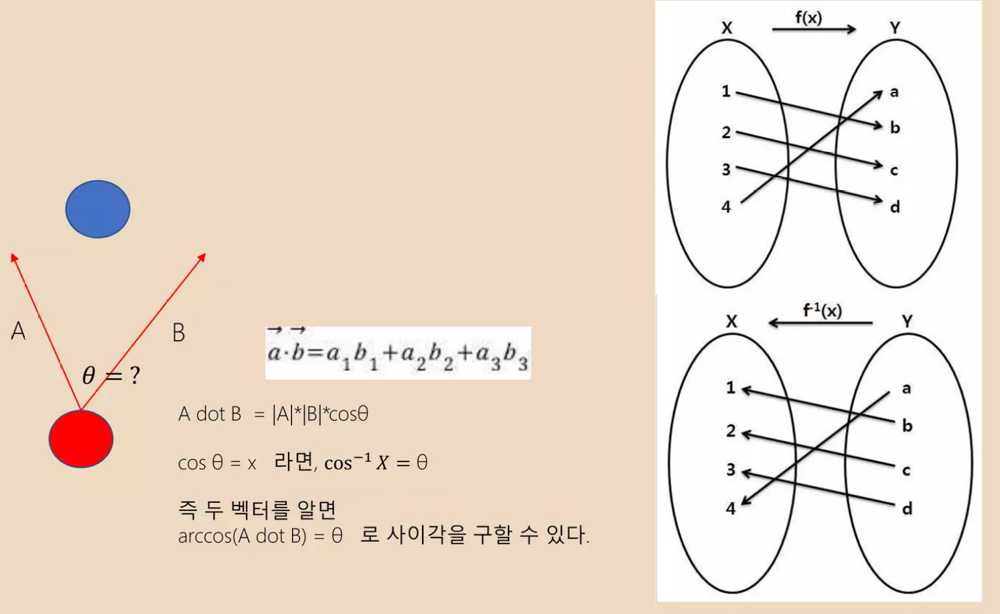

4. 난반사광(Diffuse Light) 계산

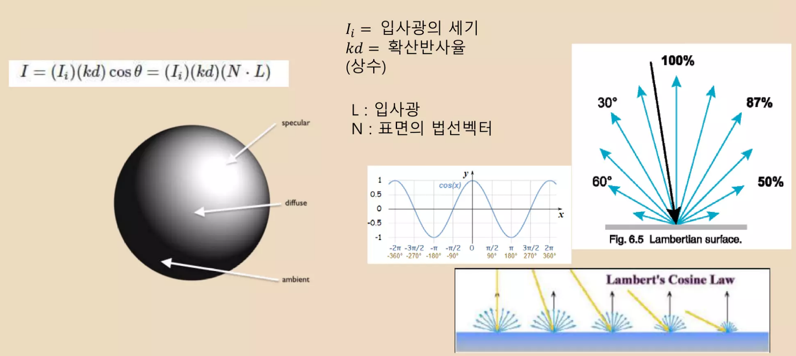

5. 문제 : 입사벡터 P와 표면의 법선벡터 N이 있을 때 반사벡터 R을 구하시오.
6. 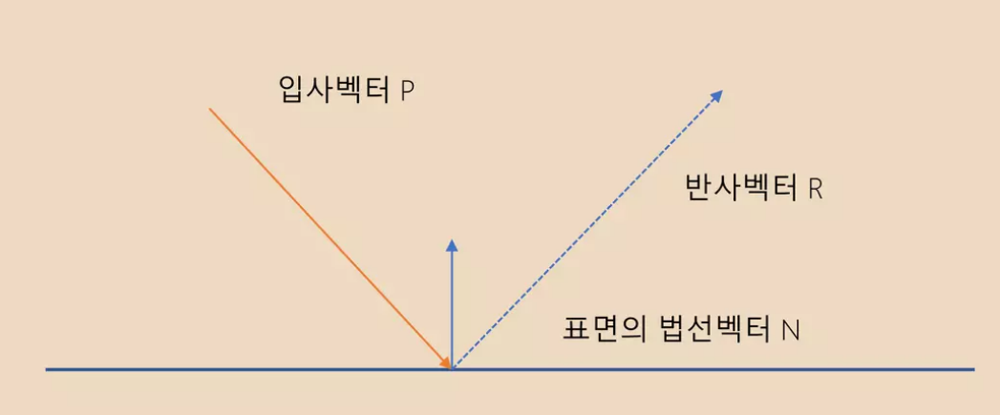

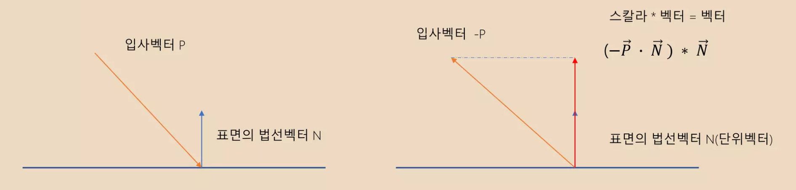

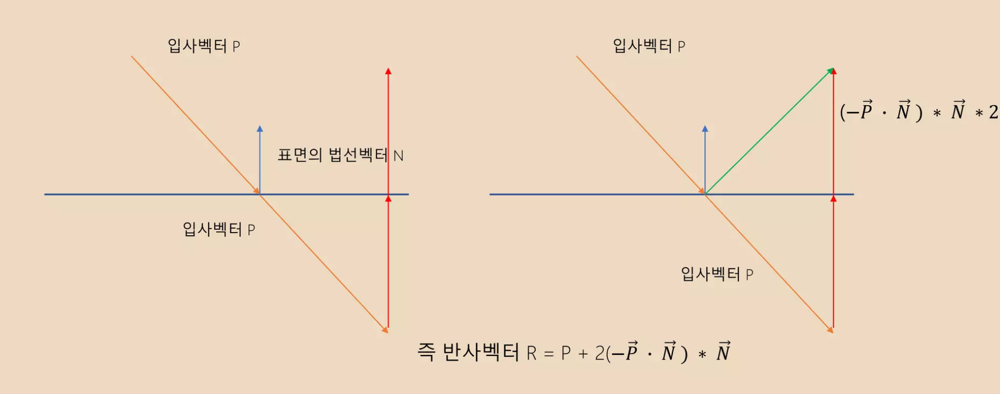

## 벡터의 외적

외적(Cross Product, 벡터곱)

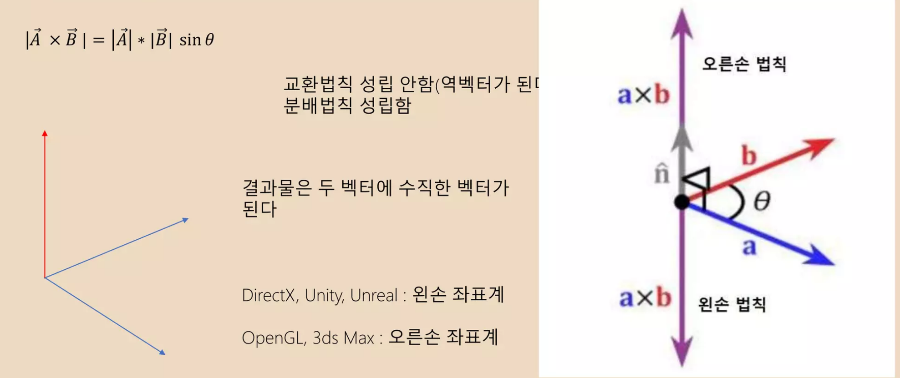

1. 두 벡터의 외적은 수직임을 이용하여 카메라의 기저벡터를 구하는 법을 서술해보자.

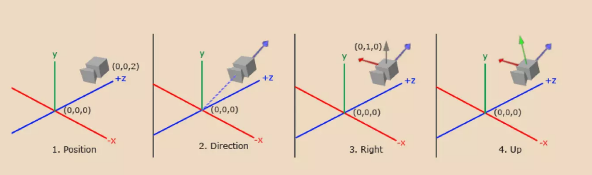

2. 상대가 나의 왼쪽에 있는지 오른쪽에 있는지 판별

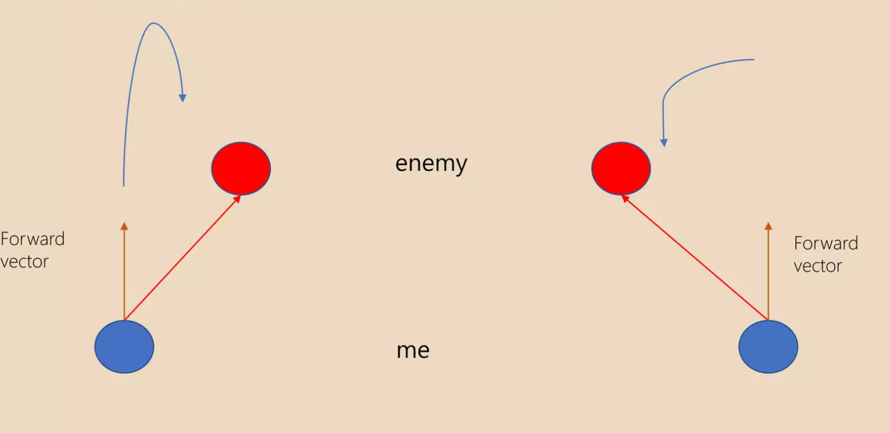